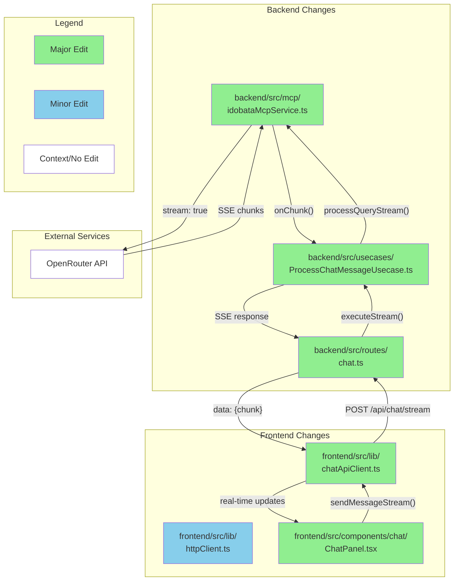

# GitHub レポート: digitaldemocracy2030/idobata

期間: 2025-07-02T12:33:30.470768+09:00 から 2025-07-09T12:33:30.470768+09:00 まで

## Pull Requests

### 過去7日間にマージされたPR (0件)

### 過去7日間に作成されたPR (1件)

### [Implement Server-Sent Events (SSE) for real-time chat streaming](https://github.com/digitaldemocracy2030/idobata/pull/414)

**作成者:** Shutaro+Devin  
**作成日:** 2025-07-07T05:14:05Z  
**変更:** +501 -47 (6ファイル)  
**内容:**

# Implement Server-Sent Events (SSE) for real-time chat streaming

## Summary

This PR implements Server-Sent Events (SSE) to enable real-time streaming of AI responses from OpenRouter, significantly improving the user experience by showing text as it's generated rather than waiting for complete responses.

**Key Changes:**
- **Backend**: Added streaming support to `IdobataMcpService` with `processQueryStream` method using OpenAI's streaming API
- **New SSE endpoint**: Created `/api/chat/stream` route with proper connection management and cleanup
- **Frontend**: Implemented `sendMessageStream` method in `ChatApiClient` with manual SSE parsing
- **UI Updates**: Modified `ChatPanel` to handle streaming state with real-time message accumulation and display
- **Backward compatibility**: Maintains existing chat functionality while adding streaming capabilities

**Benefits:**
- Eliminates timeout issues for long responses
- Provides immediate feedback to users
- Improves perceived performance and engagement
- Handles tool calls during streaming

## Review & Testing Checklist for Human

**🔴 Critical (5 items):**
- [ ] **End-to-end testing with proper API keys**: Test actual streaming with OPENROUTER_API_KEY configured to verify the complete flow works
- [ ] **SSE connection stability**: Verify connections are properly cleaned up on errors, navigation away, and completion (check for memory leaks)
- [ ] **Tool call functionality**: Test MCP tool calls during streaming to ensure they work correctly and don't break the stream
- [ ] **Error handling robustness**: Test various error scenarios (API failures, network issues, malformed responses) to ensure graceful degradation
- [ ] **State management correctness**: Verify streaming UI states transition properly and don't interfere with existing chat functionality

**Recommended Test Plan:**
1. Start backend with proper environment variables
2. Test basic streaming: send a message and verify real-time text appears
3. Test tool calls: trigger MCP tool usage during streaming
4. Test error scenarios: disconnect network, invalid API key, etc.
5. Test multiple concurrent streams and cleanup
6. Verify existing non-streaming chat still works

---

### Diagram

### Notes

- **Testing limitation**: Could not fully test the streaming functionality locally due to missing OPENROUTER_API_KEY environment variable
- **Manual SSE parsing**: Used fetch + ReadableStream instead of EventSource API for more control over error handling
- **Tool call complexity**: Streaming implementation handles MCP tool calls by buffering them and streaming the final assistant response
- **Connection cleanup**: Implemented proper cleanup handlers for SSE connections to prevent memory leaks

**Session Info:**
- Link to Devin run: https://app.devin.ai/sessions/b47be82cd43144dd9a1e296caf8fe283
- Requested by: @blu3mo

**コメント:** なし

---

### 過去7日間に更新されたPR（作成・マージを除く）(0件)

