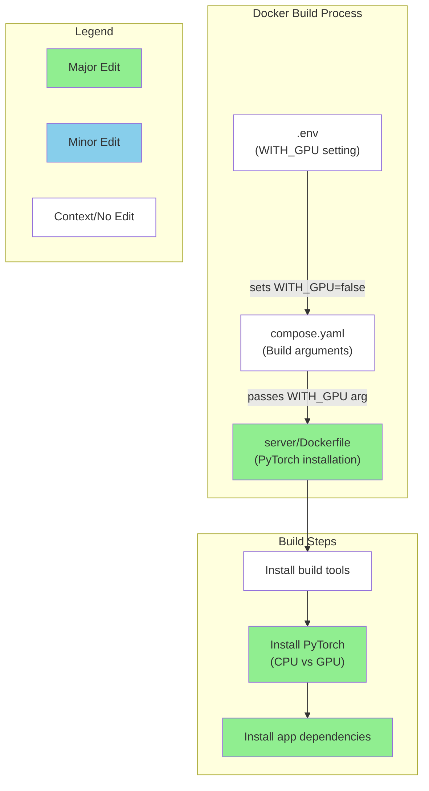
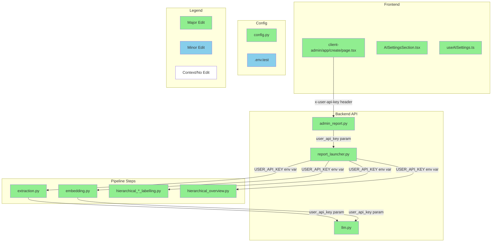

# GitHub レポート: digitaldemocracy2030/kouchou-ai

期間: 2025-07-09T12:35:48.818714+09:00 から 2025-07-16T12:35:48.818714+09:00 まで

## Issues

### 過去7日間に完了されたissue (8件)

### [[FEATURE] 管理画面のレポート削除の確認ダイアログ実装](https://github.com/digitaldemocracy2030/kouchou-ai/issues/647)

**作成者:** shgtkshruch  
**作成日:** 2025-07-11T10:28:08Z  
**内容:**

# 背景
<!-- なぜその機能が必要なのか、何が改善されるのか具体的に記入してください -->


- 管理画面のレポート一覧で、レポートを削除する際の確認ダイアログを実装したい
  - https://github.com/digitaldemocracy2030/kouchou-ai/issues/460 の実装タスクの分割 issue
- Figma: https://www.figma.com/design/ZImSumdtUme9loVY5CejWX/%E5%BA%83%E8%81%B4AI%EF%BC%88dd2030%EF%BC%89?node-id=1312-4514&t=9GXkHgwtzxTS5F6m-4
  


# 提案内容
<!-- 実装案やデザイン案があれば記入してください -->

**コメント:** なし

---

### [[FEATURE] 管理画面のレポート一覧の Empty State のデザイン変更](https://github.com/digitaldemocracy2030/kouchou-ai/issues/646)

**作成者:** shgtkshruch  
**作成日:** 2025-07-11T10:26:37Z  
**内容:**

# 背景
<!-- なぜその機能が必要なのか、何が改善されるのか具体的に記入してください -->

- 管理画面のレポート一覧の Empty State のデザインを適用したい
  - https://github.com/digitaldemocracy2030/kouchou-ai/issues/460 の実装タスクの分割 issue
- Figma: https://www.figma.com/design/ZImSumdtUme9loVY5CejWX/%E5%BA%83%E8%81%B4AI%EF%BC%88dd2030%EF%BC%89?node-id=1328-8508&t=9GXkHgwtzxTS5F6m-4


# 提案内容
<!-- 実装案やデザイン案があれば記入してください -->

**コメント:** なし

---

### [[FEATURE] 管理画面のレポート一覧の数値を1Mの略称にする](https://github.com/digitaldemocracy2030/kouchou-ai/issues/645)

**作成者:** shgtkshruch  
**作成日:** 2025-07-11T10:25:25Z  
**内容:**

# 背景
<!-- なぜその機能が必要なのか、何が改善されるのか具体的に記入してください -->

- 管理画面で、コメント・意見・意見グループの数値が100万を超えたら 1M 単位で表示する
  - https://github.com/digitaldemocracy2030/kouchou-ai/issues/460 の実装タスクの分割 issue
- Figma: https://www.figma.com/design/ZImSumdtUme9loVY5CejWX/%E5%BA%83%E8%81%B4AI%EF%BC%88dd2030%EF%BC%89?node-id=1108-5802&t=9GXkHgwtzxTS5F6m-4
 


# 提案内容
<!-- 実装案やデザイン案があれば記入してください -->


**コメント:** なし

---

### [[FEATURE] 管理画面のレポート一覧のテーブルヘッダーのデザイン](https://github.com/digitaldemocracy2030/kouchou-ai/issues/644)

**作成者:** shgtkshruch  
**作成日:** 2025-07-11T10:20:55Z  
**内容:**

# 背景
<!-- なぜその機能が必要なのか、何が改善されるのか具体的に記入してください -->

- 管理画面のレポート一覧で、テーブルの上部のデザインを反映したい
  - https://github.com/digitaldemocracy2030/kouchou-ai/issues/460 の実装タスクの分割 issue
- Figma: https://www.figma.com/design/ZImSumdtUme9loVY5CejWX/%E5%BA%83%E8%81%B4AI%EF%BC%88dd2030%EF%BC%89?node-id=1108-5802&t=mDaEUSQ1r7Aw9MVZ-4
  


# 提案内容
<!-- 実装案やデザイン案があれば記入してください -->

- 「レポート管理」の Typography 適用
- 公開/限定公開/非公開の総数を表示する UI の追加
- 「新規作成」ボタンをページ下部から移動する
  - 現状はページ下部にレポート一括出力のボタンがあるので、それも合わせて移動した方が良さそう

**コメント:** なし

---

### [[FEATURE] 管理画面のレポート一覧でコメント数などを取得できるようにする](https://github.com/digitaldemocracy2030/kouchou-ai/issues/635)

**作成者:** shgtkshruch  
**作成日:** 2025-07-05T07:49:04Z  
**内容:**

# 背景
<!-- なぜその機能が必要なのか、何が改善されるのか具体的に記入してください -->

- https://github.com/digitaldemocracy2030/kouchou-ai/issues/460 の管理画面のリデザインで、各レポートごとに以下の情報を表示したい
  - コメント数
  - 意見数
  - 意見グループ数


# 提案内容
<!-- 実装案やデザイン案があれば記入してください -->

- 管理画面のレポート一覧を取得するエンドポイント内の処理で、上記のデータを合わせて取得してフロントエンドに返す
https://github.com/digitaldemocracy2030/kouchou-ai/blob/14b71d79b243315ecd299cb980865522e24e2076/server/src/routers/admin_report.py#L41-L43


**コメント:** なし

---

### [管理画面アクション関数のエラーハンドリング改善](https://github.com/digitaldemocracy2030/kouchou-ai/issues/621)

**作成者:** coderabbitai[bot]  
**作成日:** 2025-06-28T09:56:21Z  
**内容:**

## 概要

管理画面のアクション関数（visibilityUpdate、csvDownload、reportDelete等）において、エラーハンドリングがconsole.errorによるログ出力のみとなっており、ユーザーへの適切なフィードバックが提供されていません。

## 現在の問題

- エラーが発生してもユーザーに通知されない
- 操作が失敗したかどうかをユーザーが判断できない
- エラーの詳細がコンソールにのみ出力される

## 改善提案

以下のようなユーザーフィードバック機能の実装を検討：
- UIアラート・トースト通知の表示
- エラーレスポンスの返却（フロントエンドでの表示用）
- 操作結果の明確な表示

## 対象ファイル

- client-admin/app/_actions/visibilityUpdate.ts
- client-admin/app/_actions/csvDownload.ts
- client-admin/app/_actions/csvDownloadForWindows.ts
- client-admin/app/_actions/reportDelete.ts

## 関連PR・コメント

- PR: https://github.com/digitaldemocracy2030/kouchou-ai/pull/618
- コメント: https://github.com/digitaldemocracy2030/kouchou-ai/pull/618#discussion_r2173188154
- 起票者: @shgtkshruch

**コメント:** なし

---

### [CSVダウンロード機能のエラーハンドリング改善](https://github.com/digitaldemocracy2030/kouchou-ai/issues/620)

**作成者:** coderabbitai[bot]  
**作成日:** 2025-06-28T09:52:54Z  
**内容:**

## 問題

現在のCSVダウンロード機能（`client-admin/app/_actions/csvDownload.ts`）では、エラー発生時にコンソールへのログ出力のみが行われており、ユーザーへのフィードバックが不足しています。

## 改善提案

UI上でエラー状態を表示する仕組みを実装し、ユーザーがCSVダウンロードの失敗を認識できるようにする必要があります。

## 対象ファイル

- `client-admin/app/_actions/csvDownload.ts`
- `client-admin/app/_actions/csvDownloadForWindows.ts`（同様の問題を抱えている可能性）

## 関連

- PR: https://github.com/digitaldemocracy2030/kouchou-ai/pull/618
- コメント: https://github.com/digitaldemocracy2030/kouchou-ai/pull/618#discussion_r2173188152

## 備考

エラーハンドリングは将来的に共通化/標準化予定のため、そのタイミングでの対応を検討。

**コメント:** なし

---

### [[FEATURE][design] レポート管理画面：直感的に使いやすくしたい](https://github.com/digitaldemocracy2030/kouchou-ai/issues/460)

**作成者:** UtkNggc  
**作成日:** 2025-05-07T16:09:28Z  
**内容:**

# 背景
<!-- なぜその機能が必要なのか、何が改善されるのか具体的に記入してください -->
現状の管理画面は直感的に使いにくいかもしれない。
あるていど機能がそろった現時点で管理画面を改善したい。

▼現状


# 提案内容
<!-- 実装案やデザイン案があれば記入してください -->
・機能の見出しを上部バーにまとめる
・各機能ボタンはアイコンやトグルなど直感的にわかるものにする
・新規作成ボタンを右上に移動
・作成日時の秒数トルツメ（もしかすると時間も？）
・レポートのURL表示トルツメ


# デザイン時に検討するもの
・全レポートをエクスポート機能の位置
・エラー、作成中、のstatesの表現どうするか
・エラー、作成中、のステップの要 / 不要 -> 要るならステップ数やプログレスバーも検討
・もしレポートのURLが必要なら「シェア」みたいな表現でもいいかも。

# 関連Issue
https://github.com/digitaldemocracy2030/kouchou-ai/issues/437：見出し文言&位置変更

**コメント:** なし

---

### 過去7日間に作成されたissue (4件)

### [[BUG] Windows 環境で api の build error が出る](https://github.com/digitaldemocracy2030/kouchou-ai/issues/666)

**作成者:** shingo-ohki  
**作成日:** 2025-07-15T22:23:03Z  
**内容:**

### 概要

<!-- バグの簡潔な説明をお願いします -->
Windows 環境で api の build 時に build error になる
 
### 再現手順

1. Windows 環境で docker compose up を実行

```
--------------------
  19 |     # WITH_GPU=false の場合は、不要なパッケージがインストールされないように CPU版の PyTorch を先にインストール
  20 | >>> RUN if [ "$WITH_GPU" = "false" ]; then \
  21 | >>>     echo "Installing PyTorch (CPU version)" && \
  22 | >>>     uv pip install --no-cache --system -r requirements-torch.txt --index-url https://download.pytorch.org/whl/cpu; \
  23 | >>>     fi
  24 |
--------------------
target api: failed to solve: process "/bin/sh -c if [ \"$WITH_GPU\" = \"false\" ]; then     echo \"Installing PyTorch (CPU version)\" &&     uv pip install --no-cache --system -r requirements-torch.txt --index-url https://download.pytorch.org/whl/cpu;     fi" did not complete successfully: exit code: 1
View build details: docker-desktop://dashboard/build/default/default/6az53xylwvpj196tnuhralrob
```

### 期待する動作

<!-- 本来どう動作すべきかを記入してください -->

### スクリーンショット・ログ

<!-- 必要に応じてスクリーンショットやエラーログなどを添付してください -->

### その他

<!-- 追加で伝えておきたいことがあれば記入してください -->

dockerfileを以下のように書き換えたところ動きました。
```
# ---- 1. ベースイメージ --------------------------------------------------
    FROM python:3.12-slim
    WORKDIR /app
    # ---- 2. ビルド引数 -------------------------------------------------------
    ARG ENVIRONMENT=production   # development / production
    ARG WITH_GPU=false           # true / false
    # ---- 3. 共通ビルドツール ------------------------------------------------
    RUN apt-get update \
     && apt-get install -y --no-install-recommends curl build-essential \
     && rm -rf /var/lib/apt/lists/*
    RUN pip install --no-cache-dir uv
    # ---- 4. Poetry / pip の依存関係 -----------------------------------------
    COPY pyproject.toml requirements.lock requirements-dev.lock requirements-torch.txt README.md ./
    #
    # 4-A. PyTorch 系 (GPU か CPU かで分岐)
    #
    RUN if [ "${WITH_GPU}" = "false" ]; then \
            echo ">> Installing PyTorch (CPU version)" && \
            uv pip install --no-cache-dir --system -r requirements-torch.txt \
                --index-url https://download.pytorch.org/whl/cpu ; \
        else \
            echo ">> Installing PyTorch (GPU version)" && \
            uv pip install --no-cache-dir --system -r requirements-torch.txt ; \
        fi
    #
    # 4-B. アプリ依存 (dev / prod で分岐)
    #
    RUN if [ "${ENVIRONMENT}" = "development" ]; then \
            echo ">> Installing development dependencies" && \
            uv pip install --no-cache-dir --system -r requirements-dev.lock ; \
        else \
            echo ">> Installing production dependencies" && \
            uv pip install --no-cache-dir --system -r requirements.lock ; \
        fi
    # ---- 5. アプリケーション本体 --------------------------------------------
    COPY . .
    EXPOSE 8000
    CMD ["uvicorn", "src.main:app", "--host", "0.0.0.0", "--port", "8000", "--reload"]
```

**コメント:** なし

---

### [[FEATURE] レポート単体での static export 機能](https://github.com/digitaldemocracy2030/kouchou-ai/issues/664)

**作成者:** shgtkshruch  
**作成日:** 2025-07-14T09:59:13Z  
**内容:**

# 背景
<!-- なぜその機能が必要なのか、何が改善されるのか具体的に記入してください -->

- https://github.com/digitaldemocracy2030/kouchou-ai/issues/460 の残タスク
- レポート一覧画面で、レポート単位で static export できるようにしたい
  - 今は全レポート一括での export のみ対応


# 提案内容
<!-- 実装案やデザイン案があれば記入してください -->

1. 管理画面でレポートごとの Action Menu で「HTML書き出し」をクリックしたら、そのレポートの slug を client-static-build に送る
1. cient-static-build で slug 単位で export できるようにする

**コメント:** なし

---

### [[FEATURE] 管理画面のレポートの一括編集機能の実装](https://github.com/digitaldemocracy2030/kouchou-ai/issues/648)

**作成者:** shgtkshruch  
**作成日:** 2025-07-11T10:31:20Z  
**内容:**

# 背景
<!-- なぜその機能が必要なのか、何が改善されるのか具体的に記入してください -->

- 管理画面のレポート一覧で、複数のレポート単位で、以下の操作ができるようにしたい
  - 公開状態の変更
  - CSV ダウンロード
  - HTML 書き出し
  - 削除
- Figma: https://www.figma.com/design/ZImSumdtUme9loVY5CejWX/%E5%BA%83%E8%81%B4AI%EF%BC%88dd2030%EF%BC%89?node-id=1089-5785&t=9GXkHgwtzxTS5F6m-4
  
- https://github.com/digitaldemocracy2030/kouchou-ai/issues/460 の実装タスクの分割 issue

# 提案内容
<!-- 実装案やデザイン案があれば記入してください -->

- レポートが一覧表示されているテーブルで、チェックボックスでレポート単位で選択できるようにする
- 上記を実装後に、選択したレポートを対象に以下の操作をできるようにする
  - 公開状態の変更
  - CSV ダウンロード
  - HTML 書き出し
  - 削除

**コメント:** なし

---

### [Docker build時のシークレット渡し方法の改善](https://github.com/digitaldemocracy2030/kouchou-ai/issues/643)

**作成者:** coderabbitai[bot]  
**作成日:** 2025-07-09T02:10:10Z  
**内容:**

## 概要

現在、GitHub Actions の Azure デプロイワークフローにて、`docker build --build-arg` を使用してシークレット値（API キー、パスワード等）を渡しています。

## 現状の実装
- `.github/workflows/azure-deploy.yml` にて `PUBLIC_API_KEY`, `ADMIN_API_KEY`, `BASIC_AUTH_PASSWORD` 等を `--build-arg` で渡している
- 現在はプライベートレジストリ（ACR）への push のみで外部配布は行っていない
- Dockerfile 内でシークレット値の出力処理は行っていない

## 改善提案
将来的なセキュリティ強化として、以下の方法への移行を検討：
- Docker BuildKit の `--secret` 機能の活用
- `az acr build --secret-arg` の利用
- シークレット情報のビルドログへの露出防止

## 関連情報
- PR: https://github.com/digitaldemocracy2030/kouchou-ai/pull/642
- コメント: https://github.com/digitaldemocracy2030/kouchou-ai/pull/642#discussion_r2193711408
- 提起者: @shingo-ohki

## 優先度
現在の運用リスクは限定的であるため、将来的な改善項目として位置づけ

**コメント:** なし

---

### 過去7日間に更新されたissue（作成・クローズを除く）(4件)

### [[FEATURE]濃い意見ビュー改善案](https://github.com/digitaldemocracy2030/kouchou-ai/issues/638)

**作成者:** nishio  
**作成日:** 2025-07-08T08:59:34Z  
**内容:**

# 背景
<!-- なぜその機能が必要なのか、何が改善されるのか具体的に記入してください -->
データ点群の重心位置にラベルがあると点群もラベルが上に乗って見づらいし、ラベル同士もしばしば重なってみづらい

# 提案内容
<!-- 実装案やデザイン案があれば記入してください -->


**コメント:** なし

---

### [form から受け付けた API KEY を使ってレポートを生成できるようにする](https://github.com/digitaldemocracy2030/kouchou-ai/issues/633)

**作成者:** shingo-ohki  
**作成日:** 2025-07-04T12:23:38Z  
**内容:**

# 背景
#622 でユーザーが環境構築の必要がなく気軽に広聴AIを試せる環境を Azure に準備中だが、現状はセットアップ時に指定した API KEY  を使うようになっているため、ユーザーが自身の費用負担でレポート生成ができない

# 提案内容
レポート作成者がフォームから API KEY を入力し、その KEY を使ってレポート生成をできるようにする

# for Devin
現状、Next.js（app router）＋Chakra UIで実装されたレポート生成ページ（client-admin/app/create/page.tsx）があります。
このページには既にAIプロバイダ選択欄（OpenAI, OpenRouter, Azure OpenAIなど）があり、ユーザーはAIプロバイダやモデルを選択できます。

このページに「API KEY」入力欄を追加してください。
- ユーザーがAPI KEYを入力した場合は、そのAPI KEYを使ってレポート生成を行ってください。
- ユーザーがAPI KEYを入力しなかった場合は、サーバー側で.envファイルに設定された各AIプロバイダ用のAPI KEY（例: OPENAI_API_KEY, OPENROUTER_API_KEY, AZURE_CHATCOMPLETION_API_KEY, AZURE_EMBEDDING_API_KEYなど）を使ってレポート生成を行ってください。
- サーバー側では、リクエストヘッダー（例: x-user-api-key）やボディにAPI KEYが含まれていればそれを優先し、なければ.envの該当プロバイダ用API KEYを使うようにしてください。
- API KEYはサーバーでのみ利用し、保存しないでください。
- クライアント側はAPI KEY入力欄をフォームに追加し、レポート生成リクエスト時にAPI KEYをヘッダー（例: x-user-api-key）で送信してください。
- 既存のAIプロバイダ選択やモデル選択、その他のバリデーション・UI構成は維持してください。
- サーバー側では、AIプロバイダ選択値に応じて適切なAPI KEY・エンドポイント・デプロイメント名・バージョンなどを選択し、APIリクエストを行ってください。
- .env.exampleの各AIプロバイダ用API KEYやエンドポイントの記載例も参考にしてください。
- サーバー側・クライアント側の両方のコードを実装してください。

**コメント:** なし

---

### [[FEATURE] Azure に動作確認環境・デモ環境を作る](https://github.com/digitaldemocracy2030/kouchou-ai/issues/622)

**作成者:** shingo-ohki  
**作成日:** 2025-06-29T08:25:09Z  
**内容:**

# 背景
- 現状、新しい機能の開発やソフトウェア改善を行った場合の動作確認は、エンジニアの手元の開発環境で行っているが、UI/UX の改善を行う際などはデザイナーなどエンジニア以外の方にも確認してもらいたいがその環境がない
- ユーザーが広聴AIを試すには環境構築をする必要があるが、これは多少のエンジニアリングスキルを必要とするため、簡単に試すことができない

<!-- なぜその機能が必要なのか、何が改善されるのか具体的に記入してください -->


# 提案内容
上記を解決するために、dd2030 が管理する Azure 環境に常に広聴AIがデプロイされているような環境を用意する

<!-- 実装案やデザイン案があれば記入してください -->

- 動作確認環境
  - [x] Azure 環境にセットアップする
  - [ ]  #642 
- デモ環境
  - [ ] #633
  - [ ] client-admin のパスワードなしでアクセスできるようにする
  - [ ] dd2030.org ドメインでアクセスできるようにする

**コメント:** なし

---

### [[FEATURE] adminにおいて、APIルートを介してfastapiにリクエストを送る](https://github.com/digitaldemocracy2030/kouchou-ai/issues/547)

**作成者:** nasuka  
**作成日:** 2025-05-20T08:25:30Z  
**内容:**

# 背景
* adminにおいて、 `process.env.NEXT_PUBLIC_ADMIN_API_KEY` でAPIキーを読んでリクエストをfastapiに送っているが、APIキーが漏洩するリスクがある
* APIキーの露出をさせられる（攻撃できる）のは、以下の状況に限定されるためリスクが高い訳ではないが、ゼロではない
  * 広聴AIをリモートでホスティングしている
  * 攻撃者が管理画面のURLを知っている
  * 攻撃者が管理画面にログインしている（id/passwordを知っている）

参考
https://github.com/digitaldemocracy2030/kouchou-ai/pull/545#discussion_r2097241946


# 提案内容
Next.jsのAPIルートをadminに用意したうえで、fastapiと疎通する
（一旦CodeRabbitの指摘内容をそのまま書いていますがこの方針が妥当か自信がないので、next.jsに詳しい方いたらコメントいただけると助かります）

**コメント:** なし

---

## Pull Requests

### 過去7日間にマージされたPR (15件)

### [[client-admin] コメント数が100万を超えたら1M単位で表示する](https://github.com/digitaldemocracy2030/kouchou-ai/pull/663)

**作成者:** shgtkshruch  
**作成日:** 2025-07-14T09:54:54Z  
**変更:** +29 -6 (2ファイル)  
**マージ日:** 2025-07-14T10:20:04Z  
**内容:**


# 変更の概要
- 管理画面のレポート一覧で、コメント・意見・意見グループで、数が100万を超えたら1M単位で表示する

# スクリーンショット


# 変更の背景
- 管理画面を使いやすくしたい

# 関連Issue
- fix: https://github.com/digitaldemocracy2030/kouchou-ai/issues/645

# 動作確認の結果
<!-- 実装者は動作確認の結果を記載してください（例: レポート作成を実行し、正常にレポートが作成されることを確認した） 複数の動作確認を行った場合は、それぞれの結果を記載してください -->

- 管理画面のレポート一覧で、コメント数などが100万を超えたら1Mという表記になっていること

# CLAへの同意
- 本リポジトリへのコントリビュートには、[コントリビューターライセンス契約（CLA）](https://github.com/digitaldemocracy2030/kouchou-ai/blob/main/CLA.md)に同意することが必須です。
内容をお読みいただき、下記のチェックボックスにチェックをつける（"- [ ]" を "- [x]" に書き換える）ことで同意したものとみなします。

- [x] CLAの内容を読み、同意しました

# マージ前のチェックリスト（レビュアーがマージ前に確認してください）
- [ ] CIが全て通過している
- [ ] 単体テストが実装されているか
- [ ] 今回実装した機能および影響を受けると思われる機能について、適切な動作確認が行われているかを確認する。


動作確認の項目については、実装者による動作確認のケースが適切かを確認してください。
必要に応じてレビュアー自身による動作確認も歓迎します（必須ではありません）。

<!-- This is an auto-generated comment: release notes by coderabbit.ai -->

## Summary by CodeRabbit

* **新機能**
  * 数値を見やすく表示する「NumberDisplay」コンポーネントを追加しました。100万以上の値は「M」表記で簡略表示されます。

* **リファクタ**
  * レポートカードの数値表示を「NumberDisplay」コンポーネントに統一し、表示スタイルと整形を改善しました。

<!-- end of auto-generated comment: release notes by coderabbit.ai -->

**コメント:** なし

---

### [[client-admin] レポートのタイトル・説明文のを編集する fetch を Server Functions で実行する](https://github.com/digitaldemocracy2030/kouchou-ai/pull/662)

**作成者:** shgtkshruch  
**作成日:** 2025-07-14T09:33:03Z  
**変更:** +82 -101 (3ファイル)  
**マージ日:** 2025-07-15T06:18:30Z  
**内容:**

# 変更の概要
- レポートのタイトルと説明文を編集する fetch を Server Functions で実行するように変更しました
  - API キーがブラウザに露出していた為
- form の入力値を formData を利用する形に変更しました
  - Next.js の公式で紹介されている方式なのと、今回は useState で管理する必要がない為
  - https://nextjs.org/docs/pages/guides/forms
- 他の Dialog と合わせて、ui 層で定義されている Dialog コンポーネントを利用するように変更

# スクリーンショット


画面中央に配置して、背景の overlay も他の Dialog と色味を揃えました

# 変更の背景
- API キーをブラウザに露出しないようにしたい
- Dialog の実装を他の箇所と揃えたい

# 関連Issue
- https://github.com/digitaldemocracy2030/kouchou-ai/issues/547

# 動作確認の結果
<!-- 実装者は動作確認の結果を記載してください（例: レポート作成を実行し、正常にレポートが作成されることを確認した） 複数の動作確認を行った場合は、それぞれの結果を記載してください -->

- 管理画面で、レポートのタイトルと説明文が編集できること

# CLAへの同意
- 本リポジトリへのコントリビュートには、[コントリビューターライセンス契約（CLA）](https://github.com/digitaldemocracy2030/kouchou-ai/blob/main/CLA.md)に同意することが必須です。
内容をお読みいただき、下記のチェックボックスにチェックをつける（"- [ ]" を "- [x]" に書き換える）ことで同意したものとみなします。

- [x] CLAの内容を読み、同意しました

# マージ前のチェックリスト（レビュアーがマージ前に確認してください）
- [ ] CIが全て通過している
- [ ] 単体テストが実装されているか
- [ ] 今回実装した機能および影響を受けると思われる機能について、適切な動作確認が行われているかを確認する。


動作確認の項目については、実装者による動作確認のケースが適切かを確認してください。
必要に応じてレビュアー自身による動作確認も歓迎します（必須ではありません）。

<!-- This is an auto-generated comment: release notes by coderabbit.ai -->

## Summary by CodeRabbit

* **新機能**
  * レポート設定の更新処理がサーバーアクションとして追加されました。

* **リファクタリング**
  * レポート編集ダイアログのフォーム管理方法を簡素化し、独自ダイアログUIに変更しました。
  * フォーム送信時のAPI呼び出しを直接fetchからサーバーアクション経由に変更しました。

* **テスト**
  * テストがサーバーアクションのモックを利用する形に修正されました。

<!-- end of auto-generated comment: release notes by coderabbit.ai -->

**コメント:** なし

---

### [[client-admin] ディレクトリ構成の整理・不要な props の削除](https://github.com/digitaldemocracy2030/kouchou-ai/pull/661)

**作成者:** shgtkshruch  
**作成日:** 2025-07-14T09:24:56Z  
**変更:** +15 -11 (7ファイル)  
**マージ日:** 2025-07-14T10:17:08Z  
**内容:**

# 変更の概要
- レポート削除の Dialog コンポーネントと削除を実行する action をコロケーションさせました
- 未使用の props を削除しました

# スクリーンショット
- コードのリファクタリングなので、UI の変更はありません

# 変更の背景
- コードの構成を整理したい

# 関連Issue
なし

# 動作確認の結果
<!-- 実装者は動作確認の結果を記載してください（例: レポート作成を実行し、正常にレポートが作成されることを確認した） 複数の動作確認を行った場合は、それぞれの結果を記載してください -->

- 管理画面でレポート一覧が表示できること

# CLAへの同意
- 本リポジトリへのコントリビュートには、[コントリビューターライセンス契約（CLA）](https://github.com/digitaldemocracy2030/kouchou-ai/blob/main/CLA.md)に同意することが必須です。
内容をお読みいただき、下記のチェックボックスにチェックをつける（"- [ ]" を "- [x]" に書き換える）ことで同意したものとみなします。

- [x] CLAの内容を読み、同意しました

# マージ前のチェックリスト（レビュアーがマージ前に確認してください）
- [ ] CIが全て通過している
- [ ] 単体テストが実装されているか
- [ ] 今回実装した機能および影響を受けると思われる機能について、適切な動作確認が行われているかを確認する。


動作確認の項目については、実装者による動作確認のケースが適切かを確認してください。
必要に応じてレビュアー自身による動作確認も歓迎します（必須ではありません）。

<!-- This is an auto-generated comment: release notes by coderabbit.ai -->

## Summary by CodeRabbit

* **新機能**
  * なし

* **リファクタリング**
  * ReportCard関連コンポーネントから`reports`プロパティを削除し、不要なpropsの受け渡しを整理しました。
  * 外部リンクのレンダリングにNext.jsの`Link`コンポーネントを使用するよう変更しました。
  * 一部インポートパスを修正しました。

<!-- end of auto-generated comment: release notes by coderabbit.ai -->

**コメント:** なし

---

### [[client-admin] レポート生成後のデータ fetch を Server Component で処理する](https://github.com/digitaldemocracy2030/kouchou-ai/pull/659)

**作成者:** shgtkshruch  
**作成日:** 2025-07-13T09:03:25Z  
**変更:** +66 -120 (10ファイル)  
**マージ日:** 2025-07-13T12:48:15Z  
**内容:**

# 変更の概要
- レポート生成後のデータ fetch を Server Component で処理するようにしました
  - 今までは Client Component で実施しており、API キーが露出していた
  - 取得したデータの更新を useState で管理していましたが、[router.refresh](https://nextjs.org/docs/app/api-reference/functions/use-router) に変更しました
  - useState で更新することの課題点
    - フロントエンドでのデータ更新とAPI サーバー側でデータの更新が二重に行うことになるので、実装が冗長になる
    - フロントエンドでのデータ更新でデータ取得が必要な場合に、 API キーがクライアント側に露出する設計になってしまう
  -  router.refresh の利点 
     - データの更新や管理は APIサ ーバー側で行われているので、フロントエンドはデータを元に UI を構築する実装にして責務が分離できる
     - データの取得を Server Component に寄せられるので、自然と API キーがクライアントに露出しない設計になる

# スクリーンショット


https://github.com/user-attachments/assets/3a84b6db-3dcd-4c99-8b0e-f4ec02faf935


# 変更の背景
- API サーバーの API キーがクライアント側に露出している

# 関連Issue
- https://github.com/digitaldemocracy2030/kouchou-ai/issues/547

# 動作確認の結果
<!-- 実装者は動作確認の結果を記載してください（例: レポート作成を実行し、正常にレポートが作成されることを確認した） 複数の動作確認を行った場合は、それぞれの結果を記載してください -->

- 管理画面で、レポート作成後に UI が適切に更新されること

# CLAへの同意
- 本リポジトリへのコントリビュートには、[コントリビューターライセンス契約（CLA）](https://github.com/digitaldemocracy2030/kouchou-ai/blob/main/CLA.md)に同意することが必須です。
内容をお読みいただき、下記のチェックボックスにチェックをつける（"- [ ]" を "- [x]" に書き換える）ことで同意したものとみなします。

- [x] CLAの内容を読み、同意しました

# マージ前のチェックリスト（レビュアーがマージ前に確認してください）
- [ ] CIが全て通過している
- [ ] 単体テストが実装されているか
- [ ] 今回実装した機能および影響を受けると思われる機能について、適切な動作確認が行われているかを確認する。


動作確認の項目については、実装者による動作確認のケースが適切かを確認してください。
必要に応じてレビュアー自身による動作確認も歓迎します（必須ではありません）。

<!-- This is an auto-generated comment: release notes by coderabbit.ai -->

## Summary by CodeRabbit

* **リファクタリング**
  * レポート一覧や編集、削除、進捗管理などの各画面で、内部状態の手動更新を廃止し、操作後はページ全体のリフレッシュでデータを最新化するように変更しました。  
  * これにより、画面操作後のデータ反映がより確実になり、インターフェースがシンプルになりました。

<!-- end of auto-generated comment: release notes by coderabbit.ai -->

**コメント:** なし

---

### [[client-admin] レポートのタイトルが短い場合の削除ダイアログのデザイン崩れを修正](https://github.com/digitaldemocracy2030/kouchou-ai/pull/658)

**作成者:** shgtkshruch  
**作成日:** 2025-07-13T08:52:27Z  
**変更:** +1 -1 (1ファイル)  
**マージ日:** 2025-07-13T09:18:21Z  
**内容:**

# 変更の概要
- レポートを削除するダイアログで、レポートのタイトルが短い場合にデザインが崩れる課題を修正しました

# スクリーンショット
## before


## after


# 変更の背景
- レポートのタイトルが短い場合にデザインが崩れるため

# 関連Issue
- https://github.com/digitaldemocracy2030/kouchou-ai/issues/647

# 動作確認の結果
<!-- 実装者は動作確認の結果を記載してください（例: レポート作成を実行し、正常にレポートが作成されることを確認した） 複数の動作確認を行った場合は、それぞれの結果を記載してください -->

- レポートのタイトルが短い場合でも、削除ダイアログのデザインがくずれないこと

# CLAへの同意
- 本リポジトリへのコントリビュートには、[コントリビューターライセンス契約（CLA）](https://github.com/digitaldemocracy2030/kouchou-ai/blob/main/CLA.md)に同意することが必須です。
内容をお読みいただき、下記のチェックボックスにチェックをつける（"- [ ]" を "- [x]" に書き換える）ことで同意したものとみなします。

- [x] CLAの内容を読み、同意しました

# マージ前のチェックリスト（レビュアーがマージ前に確認してください）
- [ ] CIが全て通過している
- [ ] 単体テストが実装されているか
- [ ] 今回実装した機能および影響を受けると思われる機能について、適切な動作確認が行われているかを確認する。


動作確認の項目については、実装者による動作確認のケースが適切かを確認してください。
必要に応じてレビュアー自身による動作確認も歓迎します（必須ではありません）。

<!-- This is an auto-generated comment: release notes by coderabbit.ai -->

## Summary by CodeRabbit

* **スタイル**
  * 削除ダイアログ内の要素が横方向に均等に広がるようにレイアウトを調整しました。

<!-- end of auto-generated comment: release notes by coderabbit.ai -->

**コメント:** なし

---

### [[client-admin] レポート作成画面のボタンの文言変更](https://github.com/digitaldemocracy2030/kouchou-ai/pull/657)

**作成者:** shgtkshruch  
**作成日:** 2025-07-13T04:19:05Z  
**変更:** +2 -3 (1ファイル)  
**マージ日:** 2025-07-13T05:31:08Z  
**内容:**

# 変更の概要
- レポート作成画面の AI 関連の設定を表示するボタンのテキストを Figma に合わせて変更しました
  
- ref: https://www.figma.com/design/ZImSumdtUme9loVY5CejWX/%E5%BA%83%E8%81%B4AI%EF%BC%88dd2030%EF%BC%89?node-id=1223-5511&t=bHu1PLLPzNUIC108-4


# スクリーンショット


# 変更の背景
- 管理画面のレポート一覧とレポート生成画面で、AI のオプションを設定する UI の文言を統一したい

# 関連Issue
- https://github.com/digitaldemocracy2030/kouchou-ai/issues/460 の残タスク

# 動作確認の結果
<!-- 実装者は動作確認の結果を記載してください（例: レポート作成を実行し、正常にレポートが作成されることを確認した） 複数の動作確認を行った場合は、それぞれの結果を記載してください -->

- レポート作成画面でボタンのテキストが変わっていること

# CLAへの同意
- 本リポジトリへのコントリビュートには、[コントリビューターライセンス契約（CLA）](https://github.com/digitaldemocracy2030/kouchou-ai/blob/main/CLA.md)に同意することが必須です。
内容をお読みいただき、下記のチェックボックスにチェックをつける（"- [ ]" を "- [x]" に書き換える）ことで同意したものとみなします。

- [x] CLAの内容を読み、同意しました

# マージ前のチェックリスト（レビュアーがマージ前に確認してください）
- [ ] CIが全て通過している
- [ ] 単体テストが実装されているか
- [ ] 今回実装した機能および影響を受けると思われる機能について、適切な動作確認が行われているかを確認する。


動作確認の項目については、実装者による動作確認のケースが適切かを確認してください。
必要に応じてレビュアー自身による動作確認も歓迎します（必須ではありません）。

**コメント:** なし

---

### [[client-admin] 管理画面でレポート削除を Server Function で実行・エラーハンドリングの改善](https://github.com/digitaldemocracy2030/kouchou-ai/pull/656)

**作成者:** shgtkshruch  
**作成日:** 2025-07-13T03:54:24Z  
**変更:** +60 -33 (6ファイル)  
**マージ日:** 2025-07-13T05:24:06Z  
**内容:**

# 変更の概要
- 管理画面の削除の処理を client -> Server Function で実行するようにしました
  - API キーがブラウザに露出するのを防ぐ為
 - エラー時に Toast でエラー内容を表示するようにしました
 - 削除の成功時にページのリロードなして UI が更新されるように変更しました

# スクリーンショット
- 削除時の流れ（ページリロードなしで UI が更新されるようにしました）
  https://github.com/user-attachments/assets/890adfdc-03e1-48bd-b8d8-abe82980593e

- エラー時の Toast 表示
  

# 変更の背景
- API キーがブラウザに露出しているのを防ぎたい
- エラーの内容をユーザーに伝えたい

# 関連Issue
- fix: https://github.com/digitaldemocracy2030/kouchou-ai/issues/621
- https://github.com/digitaldemocracy2030/kouchou-ai/issues/547

# 動作確認の結果
<!-- 実装者は動作確認の結果を記載してください（例: レポート作成を実行し、正常にレポートが作成されることを確認した） 複数の動作確認を行った場合は、それぞれの結果を記載してください -->

- レポート生成が成功したレポートが削除できること
- レポート生成が失敗したレポートが削除できること

# CLAへの同意
- 本リポジトリへのコントリビュートには、[コントリビューターライセンス契約（CLA）](https://github.com/digitaldemocracy2030/kouchou-ai/blob/main/CLA.md)に同意することが必須です。
内容をお読みいただき、下記のチェックボックスにチェックをつける（"- [ ]" を "- [x]" に書き換える）ことで同意したものとみなします。

- [x] CLAの内容を読み、同意しました

# マージ前のチェックリスト（レビュアーがマージ前に確認してください）
- [ ] CIが全て通過している
- [ ] 単体テストが実装されているか
- [ ] 今回実装した機能および影響を受けると思われる機能について、適切な動作確認が行われているかを確認する。


動作確認の項目については、実装者による動作確認のケースが適切かを確認してください。
必要に応じてレビュアー自身による動作確認も歓迎します（必須ではありません）。

<!-- This is an auto-generated comment: release notes by coderabbit.ai -->
## Summary by CodeRabbit

* **新機能**
  * レポート削除後に一覧が自動で更新されるようになりました。
  * 削除失敗時にエラーメッセージが表示されるようになりました。

* **バグ修正**
  * レポート削除時にページ全体がリロードされなくなりました。

* **テスト**
  * レポート削除のテストが、ページリロードの検証から削除結果の検証に変更されました。
<!-- end of auto-generated comment: release notes by coderabbit.ai -->

**コメント:** なし

---

### [[client-admin] 管理画面のレポート一覧の Empty State のデザイン変更](https://github.com/digitaldemocracy2030/kouchou-ai/pull/655)

**作成者:** shgtkshruch  
**作成日:** 2025-07-13T03:24:41Z  
**変更:** +65 -63 (4ファイル)  
**マージ日:** 2025-07-13T05:09:53Z  
**内容:**

# 変更の概要
- 管理画面のレポート一覧画面で、レポートの件数が0件の場合の UI を Figma に合わせて修正しました

# スクリーンショット


# 変更の背景
- 管理画面を使いやすくしたい

# 関連Issue
- fix: https://github.com/digitaldemocracy2030/kouchou-ai/issues/646

# 動作確認の結果
<!-- 実装者は動作確認の結果を記載してください（例: レポート作成を実行し、正常にレポートが作成されることを確認した） 複数の動作確認を行った場合は、それぞれの結果を記載してください -->

- 管理画面でレポート件数が0件の場合に、適切に Empty State が表示されること

# CLAへの同意
- 本リポジトリへのコントリビュートには、[コントリビューターライセンス契約（CLA）](https://github.com/digitaldemocracy2030/kouchou-ai/blob/main/CLA.md)に同意することが必須です。
内容をお読みいただき、下記のチェックボックスにチェックをつける（"- [ ]" を "- [x]" に書き換える）ことで同意したものとみなします。

- [x] CLAの内容を読み、同意しました

# マージ前のチェックリスト（レビュアーがマージ前に確認してください）
- [ ] CIが全て通過している
- [ ] 単体テストが実装されているか
- [ ] 今回実装した機能および影響を受けると思われる機能について、適切な動作確認が行われているかを確認する。


動作確認の項目については、実装者による動作確認のケースが適切かを確認してください。
必要に応じてレビュアー自身による動作確認も歓迎します（必須ではありません）。

<!-- This is an auto-generated comment: release notes by coderabbit.ai -->

## Summary by CodeRabbit

* **新機能**
  * レポートが存在しない場合に空状態（Empty）コンポーネントを表示するようになりました。

* **改善**
  * レポートリストのグリッドレイアウトが調整され、見た目と柔軟性が向上しました。
  * ボタンにアイコンが追加され、ラベルが短縮されました。
  * 空状態の説明文が簡素化されました。

* **スタイル**
  * ボタンやテキストのスタイルが統一され、全体的なデザインが洗練されました。
  * `.container` クラスのデフォルトテキストカラー指定を削除しました。

<!-- end of auto-generated comment: release notes by coderabbit.ai -->

**コメント:** なし

---

### [[client-admin] format, type エラーを修正する](https://github.com/digitaldemocracy2030/kouchou-ai/pull/654)

**作成者:** shgtkshruch  
**作成日:** 2025-07-13T03:17:16Z  
**変更:** +53 -63 (13ファイル)  
**マージ日:** 2025-07-13T04:37:15Z  
**内容:**

# 変更の概要
- client-admin で biome の format error, TypeScript の type error があったので修正しました

# スクリーンショット
- なし

# 変更の背景
- format, type エラーがあった為

# 関連Issue
なし

# 動作確認の結果
<!-- 実装者は動作確認の結果を記載してください（例: レポート作成を実行し、正常にレポートが作成されることを確認した） 複数の動作確認を行った場合は、それぞれの結果を記載してください -->

- 管理画面でレポート一覧の表示・レポートの作成ができる

# CLAへの同意
- 本リポジトリへのコントリビュートには、[コントリビューターライセンス契約（CLA）](https://github.com/digitaldemocracy2030/kouchou-ai/blob/main/CLA.md)に同意することが必須です。
内容をお読みいただき、下記のチェックボックスにチェックをつける（"- [ ]" を "- [x]" に書き換える）ことで同意したものとみなします。

- [x] CLAの内容を読み、同意しました

# マージ前のチェックリスト（レビュアーがマージ前に確認してください）
- [ ] CIが全て通過している
- [ ] 単体テストが実装されているか
- [ ] 今回実装した機能および影響を受けると思われる機能について、適切な動作確認が行われているかを確認する。


動作確認の項目については、実装者による動作確認のケースが適切かを確認してください。
必要に応じてレビュアー自身による動作確認も歓迎します（必須ではありません）。

<!-- This is an auto-generated comment: release notes by coderabbit.ai -->

## Summary by CodeRabbit

* **スタイル**
  * テストやコンポーネントのインデント、改行、属性の整形など、コードのフォーマットを統一しました。
  * シングルクォートとダブルクォートの統一、セミコロンやカンマの追加など、記述スタイルを修正しました。
  * テストデータの一部プロパティ値（例: status）を変更しましたが、動作やテスト内容に影響はありません。

* **ドキュメント**
  * tsconfig.jsonのインデントを調整しました。

<!-- end of auto-generated comment: release notes by coderabbit.ai -->

**コメント:** なし

---

### [[client-admin] 管理画面の CSV ダウンロードを Server Functions での実行・エラーハンドリングの改善](https://github.com/digitaldemocracy2030/kouchou-ai/pull/652)

**作成者:** shgtkshruch  
**作成日:** 2025-07-12T08:36:28Z  
**変更:** +193 -167 (7ファイル)  
**マージ日:** 2025-07-13T04:28:14Z  
**内容:**

# 変更の概要
- 管理画面のレポート一覧で、CSV ダウンロードをする処理を Client Component から Server Functions に変更しました
  - api サーバーの API キーをクライアントに露出させないため
- エラーが起こった際の UI がなかったので、Toast でユーザーにエラーを通知するようにしました

# スクリーンショット
エラー時は Toast を表示

https://github.com/user-attachments/assets/eee3e00b-814c-4c82-ba5d-2e887b95f4ee


# 変更の背景
- API キーをクライアントに露出しないようにしたい
- エラーがあった場合に、ユーザーがわかるようにしたい

# 関連Issue
- https://github.com/digitaldemocracy2030/kouchou-ai/issues/547
- fix: https://github.com/digitaldemocracy2030/kouchou-ai/issues/620

# 動作確認の結果
<!-- 実装者は動作確認の結果を記載してください（例: レポート作成を実行し、正常にレポートが作成されることを確認した） 複数の動作確認を行った場合は、それぞれの結果を記載してください -->

# CLAへの同意
- 本リポジトリへのコントリビュートには、[コントリビューターライセンス契約（CLA）](https://github.com/digitaldemocracy2030/kouchou-ai/blob/main/CLA.md)に同意することが必須です。
内容をお読みいただき、下記のチェックボックスにチェックをつける（"- [ ]" を "- [x]" に書き換える）ことで同意したものとみなします。

- [x] CLAの内容を読み、同意しました

# マージ前のチェックリスト（レビュアーがマージ前に確認してください）
- [ ] CIが全て通過している
- [ ] 単体テストが実装されているか
- [ ] 今回実装した機能および影響を受けると思われる機能について、適切な動作確認が行われているかを確認する。


動作確認の項目については、実装者による動作確認のケースが適切かを確認してください。
必要に応じてレビュアー自身による動作確認も歓迎します（必須ではありません）。

<!-- This is an auto-generated comment: release notes by coderabbit.ai -->
## Summary by CodeRabbit

* **新機能**
  * CSVダウンロード時に、ダウンロード成功時のみファイルが保存されるようになりました。
  * ダウンロード失敗時にはエラーメッセージが通知されるようになりました。
  * Base64エンコードされたデータからファイルをダウンロードする新しいユーティリティ機能を追加しました。

* **バグ修正**
  * CSVダウンロード処理が共通化され、安定性と保守性が向上しました。

* **テスト**
  * CSVダウンロード機能のテストが副作用の検証から返却値の検証に改善されました。
<!-- end of auto-generated comment: release notes by coderabbit.ai -->

**コメント:** なし

---

### [[client-admin] 管理画面のレポート削除の確認ダイアログを追加](https://github.com/digitaldemocracy2030/kouchou-ai/pull/651)

**作成者:** shgtkshruch  
**作成日:** 2025-07-12T07:37:29Z  
**変更:** +272 -181 (7ファイル)  
**マージ日:** 2025-07-13T02:02:34Z  
**内容:**


# 変更の概要
- 管理画面でレポートを削除する際の確認ダイアログを実装しました

# スクリーンショット


# 変更の背景
- 管理画面を使いやすくしたい

# 関連Issue
- fix: https://github.com/digitaldemocracy2030/kouchou-ai/issues/647

# 動作確認の結果
<!-- 実装者は動作確認の結果を記載してください（例: レポート作成を実行し、正常にレポートが作成されることを確認した） 複数の動作確認を行った場合は、それぞれの結果を記載してください -->

# CLAへの同意
- 本リポジトリへのコントリビュートには、[コントリビューターライセンス契約（CLA）](https://github.com/digitaldemocracy2030/kouchou-ai/blob/main/CLA.md)に同意することが必須です。
内容をお読みいただき、下記のチェックボックスにチェックをつける（"- [ ]" を "- [x]" に書き換える）ことで同意したものとみなします。

- [x] CLAの内容を読み、同意しました

# マージ前のチェックリスト（レビュアーがマージ前に確認してください）
- [ ] CIが全て通過している
- [ ] 単体テストが実装されているか
- [ ] 今回実装した機能および影響を受けると思われる機能について、適切な動作確認が行われているかを確認する。


動作確認の項目については、実装者による動作確認のケースが適切かを確認してください。
必要に応じてレビュアー自身による動作確認も歓迎します（必須ではありません）。

<!-- This is an auto-generated comment: release notes by coderabbit.ai -->

## Summary by CodeRabbit

* **新機能**
  * レポート削除時に確認ダイアログが表示されるようになりました。

* **改善**
  * 削除ボタンやメニューの操作性・表示内容を調整しました。
  * ダイアログの背景が半透明になり、視認性が向上しました。

* **バグ修正**
  * メニュー内のアイコンとラベルの不一致を修正しました。

* **テスト**
  * レポート削除機能のテストコードを整理・強化しました。

<!-- end of auto-generated comment: release notes by coderabbit.ai -->

**コメント:** なし

---

### [[client-admin] レポートの公開状態の総数を表示する UI を追加](https://github.com/digitaldemocracy2030/kouchou-ai/pull/650)

**作成者:** shgtkshruch  
**作成日:** 2025-07-11T13:58:34Z  
**変更:** +87 -27 (3ファイル)  
**マージ日:** 2025-07-13T01:49:29Z  
**内容:**

# 変更の概要
- 管理画面のレポート一覧に公開状態の総数を表示する UI を追加しました
- レポート新規作成画面へのボタンを、テーブルの上部に移動しました

# スクリーンショット


https://github.com/user-attachments/assets/0782ecac-aca1-4f0c-a3de-3d700a4c34aa

# 変更の背景
- 管理画面の UI を使いやすくしたい

# 関連Issue
- fix: https://github.com/digitaldemocracy2030/kouchou-ai/issues/644

# 動作確認の結果
<!-- 実装者は動作確認の結果を記載してください（例: レポート作成を実行し、正常にレポートが作成されることを確認した） 複数の動作確認を行った場合は、それぞれの結果を記載してください -->

- 管理画面のレポートの公開状態を変更すると、その総数も更新されること

# CLAへの同意
- 本リポジトリへのコントリビュートには、[コントリビューターライセンス契約（CLA）](https://github.com/digitaldemocracy2030/kouchou-ai/blob/main/CLA.md)に同意することが必須です。
内容をお読みいただき、下記のチェックボックスにチェックをつける（"- [ ]" を "- [x]" に書き換える）ことで同意したものとみなします。

- [x] CLAの内容を読み、同意しました

# マージ前のチェックリスト（レビュアーがマージ前に確認してください）
- [ ] CIが全て通過している
- [ ] 単体テストが実装されているか
- [ ] 今回実装した機能および影響を受けると思われる機能について、適切な動作確認が行われているかを確認する。


動作確認の項目については、実装者による動作確認のケースが適切かを確認してください。
必要に応じてレビュアー自身による動作確認も歓迎します（必須ではありません）。

<!-- This is an auto-generated comment: release notes by coderabbit.ai -->
## Summary by CodeRabbit

* **新機能**
  * レポート一覧を管理・表示する新しい「PageContent」コンポーネントを追加しました。
  * レポートの公開範囲ごとの件数をアイコン付きで表示します。
  * 「新規作成」ボタンやダウンロードボタンを配置しました。

* **リファクタリング**
  * レポート一覧の表示・管理ロジックを「PageContent」コンポーネントへ集約しました。
  * レポートリストの状態管理を親コンポーネントに移譲しました。
<!-- end of auto-generated comment: release notes by coderabbit.ai -->

**コメント:** なし

---

### [[client-admin] 公開状態の更新を Server Functions で実行し、エラーハンドリングを改善する](https://github.com/digitaldemocracy2030/kouchou-ai/pull/649)

**作成者:** shgtkshruch  
**作成日:** 2025-07-11T10:50:13Z  
**変更:** +157 -232 (6ファイル)  
**マージ日:** 2025-07-13T01:28:28Z  
**内容:**

# 変更の概要
- 管理画面のレポートの公開状態の変更を実行する関数を client -> [Server Functions](https://ja.react.dev/reference/rsc/server-functions) で実行するようにする
  -  API キーが client に露出しないようにするため
- エラー時に Toast でエラー内容をユーザーに表示する

# スクリーンショット

https://github.com/user-attachments/assets/ec3b0752-0da9-4728-a941-af3b71de57e1

# 変更の背景
- API サーバーにリクエストする際の API キー が client（ブラウザ）に露出している
- エラー内容がユーザーにわかるようになっていない

# 関連Issue
- https://github.com/digitaldemocracy2030/kouchou-ai/issues/547
- https://github.com/digitaldemocracy2030/kouchou-ai/issues/621

# 動作確認の結果
<!-- 実装者は動作確認の結果を記載してください（例: レポート作成を実行し、正常にレポートが作成されることを確認した） 複数の動作確認を行った場合は、それぞれの結果を記載してください -->

- 管理画面で、公開状態を変更した際に Server Functions 経由でリクエストが実行されること
- 公開状態の変更でエラーがあった場合に、エラー内容を伝える Toast が表示されること

# CLAへの同意
- 本リポジトリへのコントリビュートには、[コントリビューターライセンス契約（CLA）](https://github.com/digitaldemocracy2030/kouchou-ai/blob/main/CLA.md)に同意することが必須です。
内容をお読みいただき、下記のチェックボックスにチェックをつける（"- [ ]" を "- [x]" に書き換える）ことで同意したものとみなします。

- [x] CLAの内容を読み、同意しました

# マージ前のチェックリスト（レビュアーがマージ前に確認してください）
- [ ] CIが全て通過している
- [ ] 単体テストが実装されているか
- [ ] 今回実装した機能および影響を受けると思われる機能について、適切な動作確認が行われているかを確認する。


動作確認の項目については、実装者による動作確認のケースが適切かを確認してください。
必要に応じてレビュアー自身による動作確認も歓迎します（必須ではありません）。

<!-- This is an auto-generated comment: release notes by coderabbit.ai -->

## Summary by CodeRabbit

* **新機能**
  * レポートの公開設定変更時に、成功・失敗の結果に応じてユーザーにトースト通知が表示されるようになりました。

* **リファクタ**
  * レポートの公開設定変更の処理が整理され、より明確なエラーハンドリングと状態更新が行われるようになりました。

* **テスト**
  * 新しい公開設定更新機能のテストが追加されました。
  * 旧公開設定更新機能のテストが削除されました。

<!-- end of auto-generated comment: release notes by coderabbit.ai -->

**コメント:** なし

---

### [[client-admin] レポート一覧のテーブルのデザインを変更する](https://github.com/digitaldemocracy2030/kouchou-ai/pull/637)

**作成者:** shgtkshruch  
**作成日:** 2025-07-07T07:56:34Z  
**変更:** +746 -430 (29ファイル)  
**マージ日:** 2025-07-11T10:15:10Z  
**内容:**

# 変更の概要
- 管理画面のレポート一覧のテーブル部分のデザインを Figma に合わせて変更しました
  - Figma: https://www.figma.com/design/ZImSumdtUme9loVY5CejWX/%E5%BA%83%E8%81%B4AI%EF%BC%88%E3%83%87%E3%82%B8%E6%B0%912030%EF%BC%89?node-id=1117-6195&t=kLDcfUdHfbZrAyk1-4
- デザイン変更を一度に適用すると diff が大きくなりすぎるので、下記の「やっていないこと」に記載の点については、別 issue を切って対応します 

# やっていないこと
- ページ上部の見出しの変更や新規作成ボタンの追加、公開設定の合計値の表示
- レポート一覧のテーブルでレポートの複数選択に伴う操作
  - チェックボックスによる選択
  - 公開設定・CSVダウンロード・HTML書き出し・削除の一括操作
-  コメント数などの数値で 1M の略称にする処理
- レポート削除時のダイアログの実装
- Empty State のデザイン変更

# スクリーンショット

## レポート一覧


## レポート生成時（成功）

https://github.com/user-attachments/assets/2029628a-3661-46b6-9479-6fd68e39aa9c

## レポート生成（エラー）

概要生成のステップで意図的にエラーを発生させた場合

https://github.com/user-attachments/assets/748bc73f-367b-4288-82b9-f6d3e2dab45f


## インタラクション

https://github.com/user-attachments/assets/dbdbfd8e-90f4-4bf1-81d7-376685719c68

# デザイナーさんへの確認事項
- レポートの作成日時が未登録のレポートが存在し得るのですが、その場合はどのような表示にすると良いでしょうか？
  - 現状は仮で `-` を表示しています


# 変更の背景
- 管理画面の UI を使いやすくしたい

# 関連Issue
- fix: https://github.com/digitaldemocracy2030/kouchou-ai/issues/460

# 動作確認の結果
<!-- 実装者は動作確認の結果を記載してください（例: レポート作成を実行し、正常にレポートが作成されることを確認した） 複数の動作確認を行った場合は、それぞれの結果を記載してください -->

- 管理画面のレポート一覧で、レポートの表示・生成・エラーの場合に適切に表示されること

# CLAへの同意
- 本リポジトリへのコントリビュートには、[コントリビューターライセンス契約（CLA）](https://github.com/digitaldemocracy2030/kouchou-ai/blob/main/CLA.md)に同意することが必須です。
内容をお読みいただき、下記のチェックボックスにチェックをつける（"- [ ]" を "- [x]" に書き換える）ことで同意したものとみなします。

- [x] CLAの内容を読み、同意しました

# マージ前のチェックリスト（レビュアーがマージ前に確認してください）
- [x] CIが全て通過している
- [x] 単体テストが実装されているか
- [x] 今回実装した機能および影響を受けると思われる機能について、適切な動作確認が行われているかを確認する。


動作確認の項目については、実装者による動作確認のケースが適切かを確認してください。
必要に応じてレビュアー自身による動作確認も歓迎します（必須ではありません）。

<!-- This is an auto-generated comment: release notes by coderabbit.ai -->
## Summary by CodeRabbit

* **新機能**
  * レポートカードの各種アクション（編集、CSVダウンロード、削除など）をまとめたアクションメニューを追加
  * レポートの削除ボタン、作成日時表示、タイトル表示、トークン使用量表示、可視性切り替えコンポーネントを新規追加
  * レポート進捗をアニメーション付きで分かりやすく表示する「ProgressSteps」コンポーネントを追加

* **改善・リファクタ**
  * レポートカードとリストのレイアウト・デザインをグリッド化し、全体のUIを刷新
  * 進捗表示やエラー状態の視認性を向上
  * カラーパレットとテーマカラーを拡充

* **バグ修正**
  * トークン使用量の推定コストにドル表記を追加
  * 進捗ポーリングのエラー判定ロジックを明確化

* **ドキュメント・テスト**
  * 新しいUIやロジックに合わせてテストとドキュメントを更新

* **その他**
  * Google Fontsのプリコネクトと新フォント追加
  * 新しい依存パッケージ（motion）を追加
<!-- end of auto-generated comment: release notes by coderabbit.ai -->

**コメント:** なし

---

### [[api] 管理画面のレポート一覧のレスポンスにコメント数などを含める](https://github.com/digitaldemocracy2030/kouchou-ai/pull/636)

**作成者:** shgtkshruch  
**作成日:** 2025-07-06T03:20:37Z  
**変更:** +119 -4 (5ファイル)  
**マージ日:** 2025-07-09T02:58:12Z  
**内容:**

# 変更の概要
- 管理画面のレポート一覧のレスポンスに、コメント数・意見数・意見グループ数を含めるようにしました
- フロントエンドでは、以下のようなデータ構造で取得できます。

```js
{
    "slug": "9d282108-75f7-4575-8125-df714c7e9c28",
    "title": "誰もが等しく行政サービスを使えるよう、デジタル化と人への配慮の両立をめざした行政手続きの整備を求めます。",
    "description": "デジタル化の名のもとに、紙の申請や窓口対応が急激に減り、高齢者や障がいを持つ方にとって行政手続きが「わからない」「できない」ものになりつつあります。手続きがデジタルで簡素になることは歓迎ですが、それに置き去りになる人が増えてはいけません。マイナポータルやLINEでの申請支援のような工夫を全国の自治体で共通化し、誰もが等しく使える行政サービスに整備すべきだと考えます。",
    "status": "ready",
    "visibility": "public",
    "isPubcom": false,
    "createdAt": null,
    "tokenUsage": 0,
    "tokenUsageInput": 0,
    "tokenUsageOutput": 0,
    "estimatedCost": null,
    "provider": null,
    "model": "gpt-4o-mini",
    "analysis": {
        "commentNum": 50,
        "argumentsNum": 50,
        "clusterNum": 50
    }
}
```

# スクリーンショット
- なし

# 変更の背景
- 管理画面のリデザインで、各レポートごとに以下の情報を表示したいため

# 関連Issue
- close: https://github.com/digitaldemocracy2030/kouchou-ai/issues/635

# 動作確認の結果
<!-- 実装者は動作確認の結果を記載してください（例: レポート作成を実行し、正常にレポートが作成されることを確認した） 複数の動作確認を行った場合は、それぞれの結果を記載してください -->

- 管理画面のレポート一覧で、フロントエンドからコメント数・意見数・意見グループ数が取得できること

# CLAへの同意
- 本リポジトリへのコントリビュートには、[コントリビューターライセンス契約（CLA）](https://github.com/digitaldemocracy2030/kouchou-ai/blob/main/CLA.md)に同意することが必須です。
内容をお読みいただき、下記のチェックボックスにチェックをつける（"- [ ]" を "- [x]" に書き換える）ことで同意したものとみなします。

- [x] CLAの内容を読み、同意しました

# マージ前のチェックリスト（レビュアーがマージ前に確認してください）
- [ ] CIが全て通過している
- [ ] 単体テストが実装されているか
- [ ] 今回実装した機能および影響を受けると思われる機能について、適切な動作確認が行われているかを確認する。


動作確認の項目については、実装者による動作確認のケースが適切かを確認してください。
必要に応じてレビュアー自身による動作確認も歓迎します（必須ではありません）。

<!-- This is an auto-generated comment: release notes by coderabbit.ai -->

## Summary by CodeRabbit

* **新機能**
  * レポート一覧に「分析」データ（コメント数、議論数、クラスタ数）が表示されるようになりました。

* **バグ修正**
  * レポートの分析データ取得時のエラーが適切に処理されるようになりました。

* **テスト**
  * レポート分析データ追加機能に関するテストが追加されました。

<!-- end of auto-generated comment: release notes by coderabbit.ai -->

**コメント:** なし

---

### 過去7日間に作成されたPR (5件)

### [Fix Windows Docker build failure for PyTorch installation](https://github.com/digitaldemocracy2030/kouchou-ai/pull/667)

**作成者:** NISHIO+Devin  
**作成日:** 2025-07-16T03:33:29Z  
**変更:** +29 -28 (1ファイル)  
**内容:**


# Fix Windows Docker build failure for PyTorch installation

## Summary

Fixes a Docker build failure on Windows environments where PyTorch installation fails when `WITH_GPU=false`. The issue was caused by the use of the deprecated `--no-cache` flag with `uv pip install`, which is incompatible with Windows Docker environments.

**Key changes:**
- Replace `--no-cache` with `--no-cache-dir` in all `uv pip install` commands
- Improve conditional syntax with proper variable quoting (`"${WITH_GPU}"`)
- Add better structure and comments to the Dockerfile for maintainability
- Maintain all existing functionality and build arguments

This fix is based on a tested solution provided by a user who encountered this issue in production and confirmed the fix resolves the Windows build failure.

## Review & Testing Checklist for Human

**High Priority (3 items):**
- [ ] **Test Docker build on Windows** - Verify `docker compose build api` succeeds on Windows with `WITH_GPU=false`
- [ ] **Test Docker build on Linux** - Ensure no regressions on existing Linux environments 
- [ ] **End-to-end functionality test** - After successful build, verify the API server starts correctly and core functionality works (port 8000, health check, basic API calls)

---

### Diagram



### Notes

- **Root cause**: Windows Docker environments don't handle the older `--no-cache` flag properly with `uv pip install`
- **Solution confidence**: High - based on user-tested fix that resolved the exact same issue in production
- **Risk level**: Medium - Docker build changes affect critical infrastructure but changes are focused and tested
- **Session details**: Devin session at https://app.devin.ai/sessions/910a68aa253e41bc966bfb994b1345f9, requested by @nishio
- **Original error**: `process "/bin/sh -c if [ "$WITH_GPU" = "false" ]; then ... uv pip install --no-cache ... did not complete successfully: exit code: 1`


**コメント:** なし

---

### [[client-admin] レポート単体のHTML書き出し機能を追加](https://github.com/digitaldemocracy2030/kouchou-ai/pull/665)

**作成者:** shgtkshruch  
**作成日:** 2025-07-15T08:10:07Z  
**変更:** +67 -22 (7ファイル)  
**内容:**

# 変更の概要
- 管理画面から、レポート単体で HTML 書き出しできるようにしました
  - ActionMenu に HTML 書き出し用のメニューを追加
  - client-admin -> client-static-build に slug を配列で渡せるように修正
  - client で slug が環境変数に指定されていてば、slug を対象にビルドするように修正
  - ビルド中も loading の Toast を表示する

# スクリーンショット

https://github.com/user-attachments/assets/41eead98-cc9b-47e8-b337-536189ed08a7

# 変更の背景
- レポート一覧画面で、レポート単位で static export できるようにしたい

# 関連Issue
- fix: https://github.com/digitaldemocracy2030/kouchou-ai/issues/664

# 動作確認の結果
<!-- 実装者は動作確認の結果を記載してください（例: レポート作成を実行し、正常にレポートが作成されることを確認した） 複数の動作確認を行った場合は、それぞれの結果を記載してください -->

- `make up` 実行後に、管理画面でレポート単体での HTML 書き出し・全レポートの HTML 書き出しができること

# CLAへの同意
- 本リポジトリへのコントリビュートには、[コントリビューターライセンス契約（CLA）](https://github.com/digitaldemocracy2030/kouchou-ai/blob/main/CLA.md)に同意することが必須です。
内容をお読みいただき、下記のチェックボックスにチェックをつける（"- [ ]" を "- [x]" に書き換える）ことで同意したものとみなします。

- [x] CLAの内容を読み、同意しました

# マージ前のチェックリスト（レビュアーがマージ前に確認してください）
- [ ] CIが全て通過している
- [ ] 単体テストが実装されているか
- [ ] 今回実装した機能および影響を受けると思われる機能について、適切な動作確認が行われているかを確認する。


動作確認の項目については、実装者による動作確認のケースが適切かを確認してください。
必要に応じてレビュアー自身による動作確認も歓迎します（必須ではありません）。

<!-- This is an auto-generated comment: release notes by coderabbit.ai -->
## Summary by CodeRabbit

* **新機能**
  * レポートのアクションメニューに「HTML書き出し」機能を追加しました。選択したレポートのみをHTMLとしてエクスポートできます。

* **改善**
  * ビルドダウンロードの操作性を向上し、エクスポート時のユーザー通知がより分かりやすくなりました。
  * HTMLエクスポート時に、対象レポートを選択してダウンロードできるようになりました。
  * ビルド対象のレポートが環境変数に基づき絞り込まれるようになりました。

* **その他**
  * 内部処理の最適化と安定性向上を行いました。
<!-- end of auto-generated comment: release notes by coderabbit.ai -->

**コメント:** なし

---

### [OpenAI, OpenRouter の API KEY をフォームから入力してレポートを作成できるようにする](https://github.com/digitaldemocracy2030/kouchou-ai/pull/660)

**作成者:** Shingo Ohki+Devin  
**作成日:** 2025-07-13T13:21:05Z  
**変更:** +175 -51 (14ファイル)  
**内容:**


# Security Fix: Prevent User API Keys from Being Saved to Config Files

## Summary

This PR implements the API key input functionality for the report creation form and **fixes a critical security vulnerability** where user-provided API keys were being persisted to JSON config files on disk.

**Key Changes:**
- ✅ Added API key input field to the admin interface with proper state management
- ✅ Modified backend to accept user API keys via request headers
- ✅ Updated LLM service functions to prioritize user-provided API keys over server environment variables
- 🔒 **SECURITY FIX**: Removed user API key persistence from config files - keys now only exist in memory during request processing
- 🔒 **SECURITY FIX**: Updated all pipeline steps to read API keys from environment variables instead of config files
- 🔒 **SECURITY FIX**: Removed OPENAI_API_KEY from server settings to enforce user-provided keys

The security fix ensures that user-provided API keys are never written to disk and only exist in memory during request processing, addressing the vulnerability where sensitive API keys were being persisted to JSON config files in `/outputs/` directory.

## Review & Testing Checklist for Human

**🔴 HIGH PRIORITY - Security & Core Functionality (5 items)**

- [ ] **Verify no API keys are written to disk**: Create a report with a user-provided API key and check that NO API keys appear in any saved config files (especially in `/outputs/` directory)
- [ ] **Test environment variable approach**: Verify that API keys are properly passed to all pipeline steps via environment variables and that report generation works end-to-end
- [ ] **Test all AI providers**: Verify API key functionality works for OpenAI, Azure OpenAI, OpenRouter, and Local LLM providers
- [ ] **Test error handling**: Verify proper error handling when no API key is provided for providers that require one
- [ ] **End-to-end workflow test**: Complete the full user workflow: input API key in UI → create report → verify report generates successfully without any API key leakage

## Diagram



## Notes

- **Security Context**: The original implementation was saving user API keys to JSON config files in the `/outputs/` directory, which is a serious security vulnerability. This PR fixes that by using environment variables to pass keys to subprocess without file persistence.
- **Testing**: All unit tests pass (24/24) and CI checks are green, but end-to-end testing with real API keys is recommended.
- **Backward Compatibility**: If no user API key is provided, the system will attempt to use server-side environment variables (if available) as fallback.

**Session Info**: 
- Devin session: https://app.devin.ai/sessions/26612fbfad6e40d0a0bcd2f01ad2cf84
- Requested by: @shingo-ohki


<!-- This is an auto-generated comment: release notes by coderabbit.ai -->

## Summary by CodeRabbit

* **新機能**
  * レポート作成時にユーザー独自のAPIキーを入力・保存・利用できるようになりました。これにより、AIプロバイダーへのリクエスト時にサーバーのデフォルトAPIキーではなく、ユーザー指定のAPIキーを使用できます。

* **バグ修正**
  * なし

* **テスト**
  * OpenAIクライアントのモック方法を変更し、テストの信頼性を向上しました。

* **その他**
  * サーバー設定や環境変数の整理を行いました（不要なAPIキー設定の削除など）。

<!-- end of auto-generated comment: release notes by coderabbit.ai -->

**コメント:** なし

---

### [chore(deps): jest を v29 → v30 へアップデート](https://github.com/digitaldemocracy2030/kouchou-ai/pull/653)

**作成者:** noritaka1166  
**作成日:** 2025-07-12T14:21:27Z  
**変更:** +7991 -4658 (4ファイル)  
**内容:**

# 変更の概要
jest を v29 → v30 へアップデート
- <https://jestjs.io/docs/upgrading-to-jest30>

jest-environment-jsdom も v30 に合わせてあげたかったのですが、  
<https://github.com/jestjs/jest/issues/15674> こちらのIssueと思われる事象に見舞われてテストが通らなかったため、
jest と @types/jest のみ v30 へアップデートしています 

# スクリーンショット
- なし

# 変更の背景
- jest v29 を使用しているようだったのでバージョンをあげました

# 関連Issue
なし

# 動作確認の結果
npm run test でテストがPASSすることを確認済み

# CLAへの同意
- 本リポジトリへのコントリビュートには、[コントリビューターライセンス契約（CLA）](https://github.com/digitaldemocracy2030/kouchou-ai/blob/main/CLA.md)に同意することが必須です。
内容をお読みいただき、下記のチェックボックスにチェックをつける（"- [ ]" を "- [x]" に書き換える）ことで同意したものとみなします。

- [x] CLAの内容を読み、同意しました

# マージ前のチェックリスト（レビュアーがマージ前に確認してください）
- [ ] CIが全て通過している
- [ ] 単体テストが実装されているか
- [ ] 今回実装した機能および影響を受けると思われる機能について、適切な動作確認が行われているかを確認する。


動作確認の項目については、実装者による動作確認のケースが適切かを確認してください。
必要に応じてレビュアー自身による動作確認も歓迎します（必須ではありません）。

<!-- This is an auto-generated comment: release notes by coderabbit.ai -->

## Summary by CodeRabbit

* **Chores**
  * Jestおよび@types/jestの開発用依存パッケージのバージョンを更新しました。

<!-- end of auto-generated comment: release notes by coderabbit.ai -->

**コメント:** なし

---

### [[GitHub Actions] main ブランチにマージされたコードを Azure に deploy する](https://github.com/digitaldemocracy2030/kouchou-ai/pull/642)

**作成者:** shingo-ohki  
**作成日:** 2025-07-09T01:19:42Z  
**変更:** +206 -0 (1ファイル)  
**内容:**

# 変更の概要
- digitaldemocracy2030/kouchou-ai の main ブランチにマージされると、自動的に別途用意した DD2030 が持つ azure 環境に最新のコードが deploy されるようにする

# 変更の背景
以下のような状況から DD2030 で Azure に[広聴AIの環境](https://client.wittyisland-cc57c95f.japaneast.azurecontainerapps.io/)を構築中だが、この環境の更新は現状は手動でやる必要がある
- 動作確認する環境が、開発者の手元の環境のみのため開発者以外が動作確認するすべがない
- ユーザーが広聴AIを利用するには環境構築をする必要があり、利用までに技術的なハードルがあるためデモ環境を用意したい

# 関連Issue
#622 

# 動作確認の結果
<!-- 実装者は動作確認の結果を記載してください（例: レポート作成を実行し、正常にレポートが作成されることを確認した） 複数の動作確認を行った場合は、それぞれの結果を記載してください -->

deploy 処理部分は、フォークしたリポジトリから deploy できることを確認しました。
https://github.com/shingo-ohki/kouchou-ai/actions/runs/16157340778

# CLAへの同意
- 本リポジトリへのコントリビュートには、[コントリビューターライセンス契約（CLA）](https://github.com/digitaldemocracy2030/kouchou-ai/blob/main/CLA.md)に同意することが必須です。
内容をお読みいただき、下記のチェックボックスにチェックをつける（"- [ ]" を "- [x]" に書き換える）ことで同意したものとみなします。

- [x] CLAの内容を読み、同意しました

# マージ前のチェックリスト（レビュアーがマージ前に確認してください）
- [ ] CIが全て通過している
- [ ] 単体テストが実装されているか
- [ ] 今回実装した機能および影響を受けると思われる機能について、適切な動作確認が行われているかを確認する。


動作確認の項目については、実装者による動作確認のケースが適切かを確認してください。
必要に応じてレビュアー自身による動作確認も歓迎します（必須ではありません）。

<!-- This is an auto-generated comment: release notes by coderabbit.ai -->
## Summary by CodeRabbit

## Summary by CodeRabbit

* **新機能**
  * Azure Container Appsへの自動デプロイメント用GitHub Actionsワークフローを追加しました。  
  * 環境変数設定、APIやクライアントのDockerイメージのビルド・プッシュ、リソース割当更新、ヘルスチェックが自動化され、安定したデプロイが可能になりました。
<!-- end of auto-generated comment: release notes by coderabbit.ai -->

**コメント:** なし

---

### 過去7日間に更新されたPR（作成・マージを除く）(3件)

### [[client-admin] レポート一覧の fetch を Server Component で実行する](https://github.com/digitaldemocracy2030/kouchou-ai/pull/626)

**作成者:** shgtkshruch  
**作成日:** 2025-07-01T07:34:14Z  
**変更:** +87 -53 (7ファイル)  
**内容:**

# 変更の概要
- 管理画面のレポート一覧画面で、API キーを指定した fetch を Server Comopnent で実施することで、API キーが client に露出しないようにしました
  - Server で deta fetch が終わることが期待できるので、型定義で不要な optional を削除しました

# スクリーンショット
- UI の変更はありません

# 変更の背景
- adminにおいて、`process.env.NEXT_PUBLIC_ADMIN_API_KEY` でAPIキーを読んでリクエストをfastapiに送っているが、APIキーが漏洩するリスクがある

# 関連Issue
- https://github.com/digitaldemocracy2030/kouchou-ai/issues/547

# 動作確認の結果
<!-- 実装者は動作確認の結果を記載してください（例: レポート作成を実行し、正常にレポートが作成されることを確認した） 複数の動作確認を行った場合は、それぞれの結果を記載してください -->

- 管理画面のレポート一覧画面が表示できること

# CLAへの同意
- 本リポジトリへのコントリビュートには、[コントリビューターライセンス契約（CLA）](https://github.com/digitaldemocracy2030/kouchou-ai/blob/main/CLA.md)に同意することが必須です。
内容をお読みいただき、下記のチェックボックスにチェックをつける（"- [ ]" を "- [x]" に書き換える）ことで同意したものとみなします。

- [x] CLAの内容を読み、同意しました

# マージ前のチェックリスト（レビュアーがマージ前に確認してください）
- [x] CIが全て通過している
- [ ] 単体テストが実装されているか
- [x] 今回実装した機能および影響を受けると思われる機能について、適切な動作確認が行われているかを確認する。


動作確認の項目については、実装者による動作確認のケースが適切かを確認してください。
必要に応じてレビュアー自身による動作確認も歓迎します（必須ではありません）。

<!-- This is an auto-generated comment: release notes by coderabbit.ai -->
## Summary by CodeRabbit

* **新機能**
  * 複数のレポートを一覧表示する新しいコンポーネントを追加しました。

* **改善**
  * レポート一覧ページがサーバーサイドレンダリングに対応し、データ取得やエラーハンドリングが改善されました。
  * レポート関連コンポーネントで、配列の受け渡しが常に必須となり、より堅牢な挙動となりました。
<!-- end of auto-generated comment: release notes by coderabbit.ai -->

**コメント:** なし

---

### [[client-admin] 管理画面の Footer の UI を変更する](https://github.com/digitaldemocracy2030/kouchou-ai/pull/624)

**作成者:** shgtkshruch  
**作成日:** 2025-06-29T10:12:18Z  
**変更:** +164 -10 (10ファイル)  
**内容:**

# 変更の概要
- 管理画面の Footer を [Figma の新しいデザイン](https://www.figma.com/design/ZImSumdtUme9loVY5CejWX/%E5%BA%83%E8%81%B4AI%EF%BC%88%E3%83%87%E3%82%B8%E6%B0%912030%EF%BC%89?node-id=1089-5476&t=YIniV852d6LnbHCG-4)に合わせて変更しました
  - UI 実装で必要だったので、Dialog と CloseButton コンポーネントを client から持ってきました

# スクリーンショット
## Footer


## レポート一覧画面


## 免責の Diaog を開く


# 変更の背景
- 管理画面の UI を使いやすくしたい

# 関連Issue
- https://github.com/digitaldemocracy2030/kouchou-ai/issues/460

# 動作確認の結果
<!-- 実装者は動作確認の結果を記載してください（例: レポート作成を実行し、正常にレポートが作成されることを確認した） 複数の動作確認を行った場合は、それぞれの結果を記載してください -->

- 管理画面の Footer が Figma の通りに実装されていること
  - デザイナー確認は Footer だけだとわかりにくいと思うので、管理画面ページを一通り実装してから見ていただこうと思います

# CLAへの同意
- 本リポジトリへのコントリビュートには、[コントリビューターライセンス契約（CLA）](https://github.com/digitaldemocracy2030/kouchou-ai/blob/main/CLA.md)に同意することが必須です。
内容をお読みいただき、下記のチェックボックスにチェックをつける（"- [ ]" を "- [x]" に書き換える）ことで同意したものとみなします。

- [x] CLAの内容を読み、同意しました

# マージ前のチェックリスト（レビュアーがマージ前に確認してください）
- [ ] CIが全て通過している
- [ ] 単体テストが実装されているか
- [ ] 今回実装した機能および影響を受けると思われる機能について、適切な動作確認が行われているかを確認する。


動作確認の項目については、実装者による動作確認のケースが適切かを確認してください。
必要に応じてレビュアー自身による動作確認も歓迎します（必須ではありません）。

<!-- This is an auto-generated comment: release notes by coderabbit.ai -->
## Summary by CodeRabbit

* **新機能**
  * フッターにAPIから取得したメタデータを表示し、利用規約リンクや「免責」ダイアログを追加しました。
  * 「免責」ボタンをクリックすると、AIの限界や注意事項を説明するダイアログが表示されます。
  * カスタムダイアログ、クローズボタンなどのUIコンポーネントを追加しました。

* **スタイル**
  * ページ下部の余白を追加し、全体のレイアウトを調整しました。
  * bodyのグラデーション背景とfooterのスタイルを削除しました。

* **その他**
  * 一部コンポーネントをクライアントサイドで動作するよう明示しました。
  * ビルド時に環境変数が設定されるようになりました。
<!-- end of auto-generated comment: release notes by coderabbit.ai -->

**コメント:** なし

---

### [[client-admin] 管理画面の更新ロジックを関数に切り出す](https://github.com/digitaldemocracy2030/kouchou-ai/pull/618)

**作成者:** shgtkshruch  
**作成日:** 2025-06-28T09:35:52Z  
**変更:** +718 -126 (11ファイル)  
**内容:**

# 変更の概要
- 管理画面で View に書かれていたデータの更新ロジックをぞれぞれ個別の関数に切り出しました
  - それぞれの関数のテストを追加しました

# スクリーンショット
- リファクタリングなので UI の変更はありませんが、動作確認用のキャプチャです

https://github.com/user-attachments/assets/8bff8de3-7ba3-4661-bea4-bb3550bfb7f1

# 変更の背景
- 管理画面のデザイン変更が予定されているが、コンポーネント分割がされていないのとロジックと UI が分離されていないので、このままデザインの変更を適用することが困難なため

# 関連Issue
- #604

# 動作確認の結果
<!-- 実装者は動作確認の結果を記載してください（例: レポート作成を実行し、正常にレポートが作成されることを確認した） 複数の動作確認を行った場合は、それぞれの結果を記載してください -->

- 管理画面で CSV ダウンロード、レポートの公開状態の変更、レポートの削除ができること

# CLAへの同意
- 本リポジトリへのコントリビュートには、[コントリビューターライセンス契約（CLA）](https://github.com/digitaldemocracy2030/kouchou-ai/blob/main/CLA.md)に同意することが必須です。
内容をお読みいただき、下記のチェックボックスにチェックをつける（"- [ ]" を "- [x]" に書き換える）ことで同意したものとみなします。

- [x] CLAの内容を読み、同意しました

# マージ前のチェックリスト（レビュアーがマージ前に確認してください）
- [x] CIが全て通過している
- [x] 単体テストが実装されているか
- [x] 今回実装した機能および影響を受けると思われる機能について、適切な動作確認が行われているかを確認する。


動作確認の項目については、実装者による動作確認のケースが適切かを確認してください。
必要に応じてレビュアー自身による動作確認も歓迎します（必須ではありません）。

<!-- This is an auto-generated comment: release notes by coderabbit.ai -->

## Summary by CodeRabbit

* **新機能**
  * CSVダウンロード（通常/Windows対応）、レポート削除、レポートの公開範囲更新の各アクション機能を追加しました。
  * 公開範囲の選択肢（公開、限定公開、非公開）を提供します。

* **リファクタ**
  * 管理画面のページで各種アクション処理を専用モジュールに分離し、コードを整理しました。
  * レポート情報の解析ユーティリティ関数の名称を変更し、利用方法を統一しました。

* **テスト**
  * CSVダウンロード、Windows向けCSVダウンロード、レポート削除、公開範囲更新、解析情報ユーティリティ関数に対する包括的なテストを追加しました。

<!-- end of auto-generated comment: release notes by coderabbit.ai -->

**コメント:** なし

---

