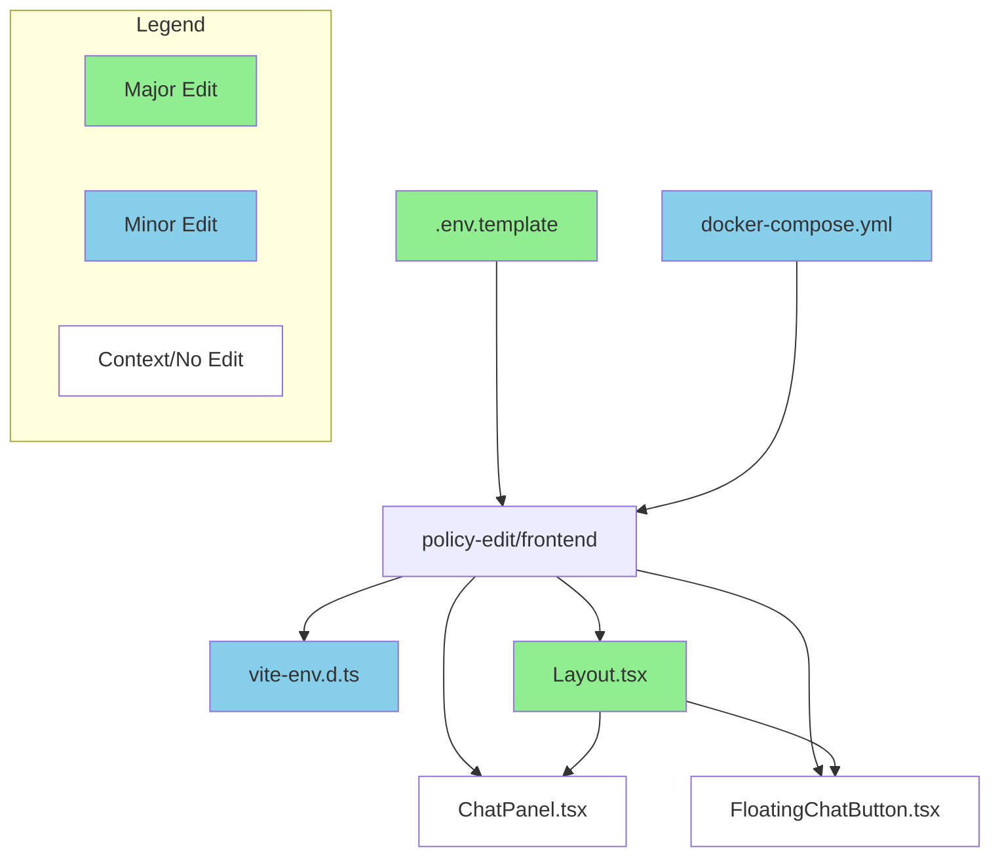
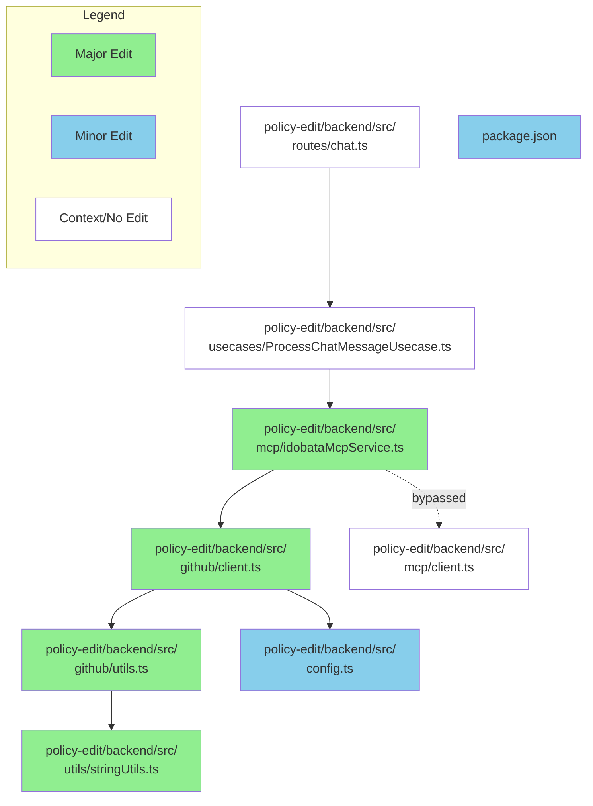
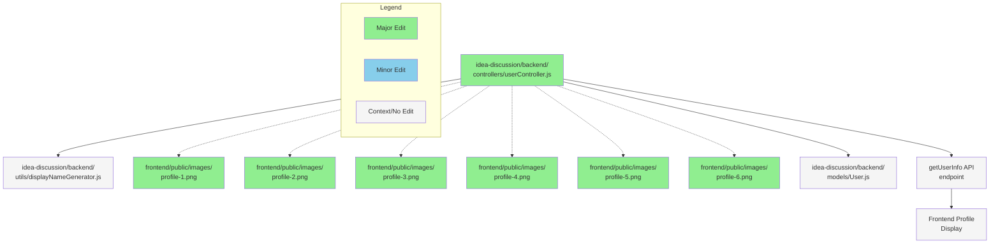
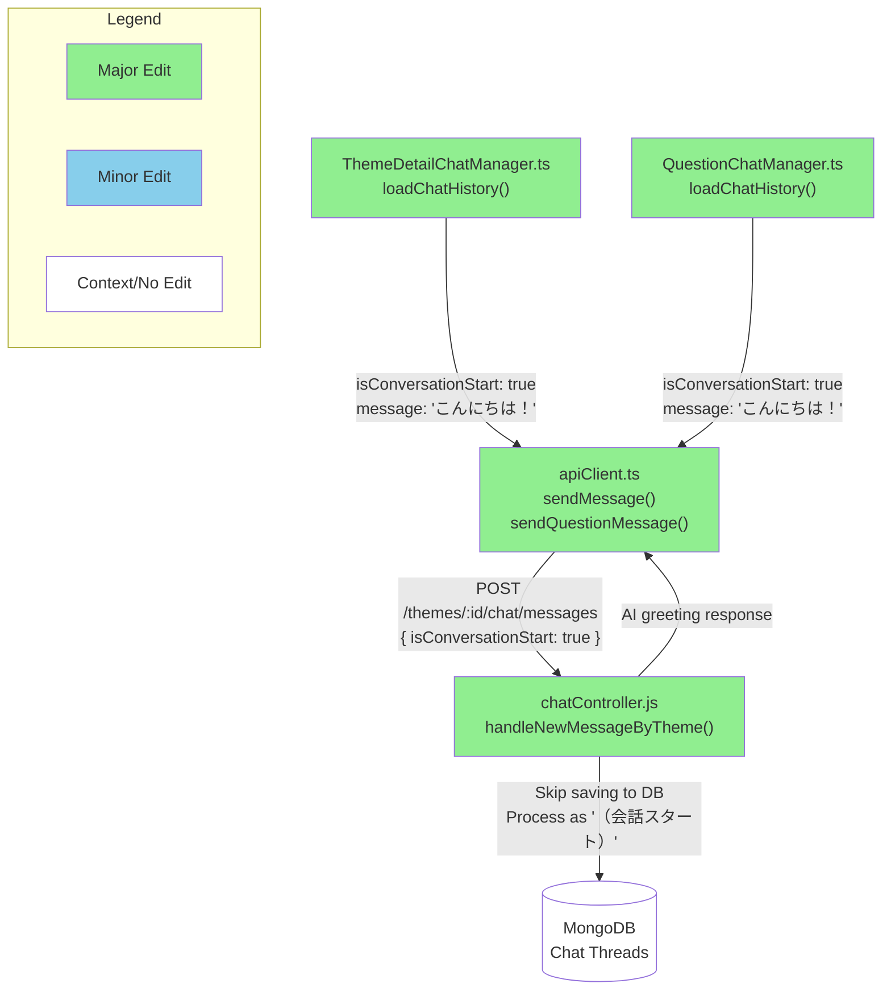
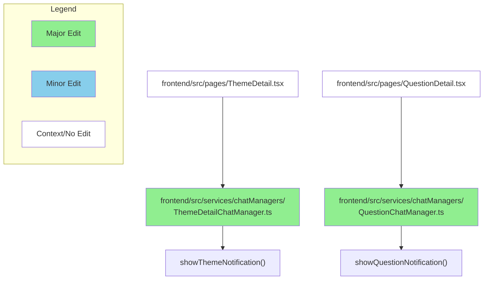
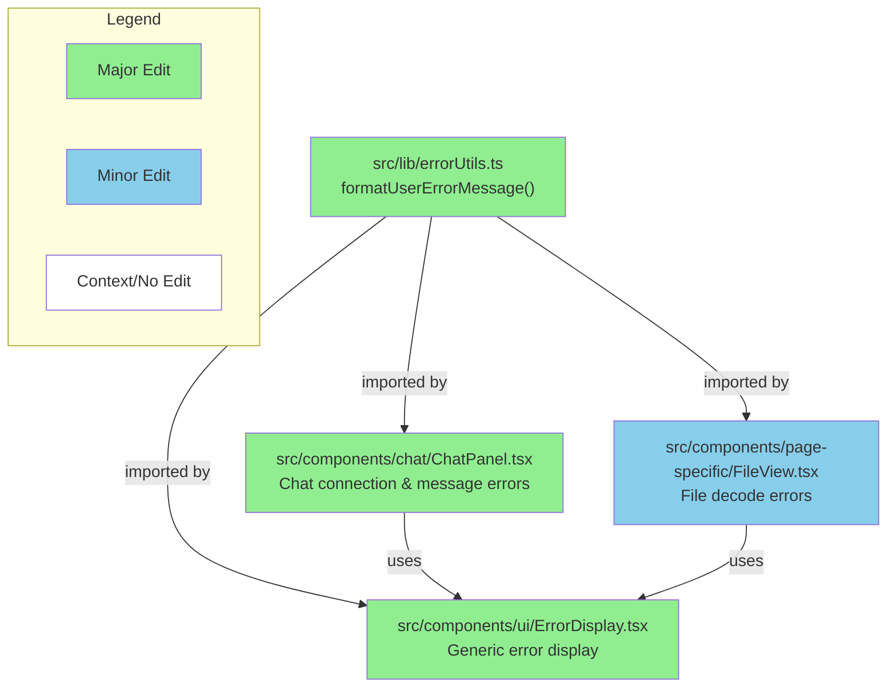

# GitHub レポート: digitaldemocracy2030/idobata

期間: 2025-07-16T12:36:55.711427+09:00 から 2025-07-23T12:36:55.711427+09:00 まで

## Issues

### 過去7日間に完了されたissue (0件)

### 過去7日間に作成されたissue (1件)

### [Mac Safariで、チャットの入力で日本語入力確定のためにEnterを押すと送信されてしまう](https://github.com/digitaldemocracy2030/idobata/issues/431)

**作成者:** kurokawamomo  
**作成日:** 2025-07-21T05:01:26Z  
**内容:**

## 問題

<!-- どこでどのような問題が起きているかを教えてください。問題の発生する画面の URL や、問題が発生しているときのスクリーンショットや録画を添付していただけると理解の助けになります。 -->
Mac Safariで、チャットの入力で日本語入力確定のためにEnterを押すと入力中のメッセージで送信されてしまいます。
macOS標準の日本語入力、mozcで再現しました。
Chromeでは再現しませんでした。
OSはmacOS Sequoiaです。

<!-- この問題が解決されないと、どのような人がどのように困るか、できれば利用者を主語にして記載してください。 -->

MacのSafariユーザーの入力が難しくなり、マニフェスト提案機能の利用が進まなくなってしまう懸念があります。

## 修正方法の概要（未記入でも構いません）

ブラウザごとに動作を分ける、あるいはcompositionstart 〜 compositionendを監視する

**コメント:** なし

---

### 過去7日間に更新されたissue（作成・クローズを除く）(0件)

## Pull Requests

### 過去7日間にマージされたPR (0件)

### 過去7日間に作成されたPR (3件)

### [Add environment variable to disable chat in policy-edit frontend](https://github.com/digitaldemocracy2030/idobata/pull/430)

**作成者:** Shutaro+Devin  
**作成日:** 2025-07-19T11:30:39Z  
**変更:** +39 -28 (4ファイル)  
**内容:**

# Add environment variable to disable chat in policy-edit frontend

## Summary
This PR adds a new environment variable `VITE_DISABLE_CHAT` that allows completely disabling the chat functionality in the policy-edit frontend. When set to `"true"`, both the ChatPanel (desktop) and FloatingChatButton (mobile) are hidden, and the content area expands to use the full available width.

**Key changes:**
- Added `VITE_DISABLE_CHAT=false` to `.env.template` with Japanese documentation
- Updated TypeScript environment variable definitions in `vite-env.d.ts`  
- Modified `Layout.tsx` to conditionally render chat components and adjust content area width
- Updated `docker-compose.yml` to pass the environment variable to the policy-frontend service
- Maintains backward compatibility (defaults to chat enabled when unset)

## Review & Testing Checklist for Human
- [ ] **Test both enabled/disabled states end-to-end** - Set `VITE_DISABLE_CHAT=false` and `VITE_DISABLE_CHAT=true`, verify chat visibility and content area expansion
- [ ] **Verify mobile responsiveness** - Test on mobile/narrow viewport that FloatingChatButton is properly hidden when disabled
- [ ] **Check Docker environment variable passing** - Ensure the environment variable works correctly in Docker Compose setup
- [ ] **Visual regression testing** - Verify no unintended layout issues or visual regressions in both enabled/disabled states

**Recommended test plan:** 
1. Start with `VITE_DISABLE_CHAT=false` (or unset), verify chat panel visible on left side
2. Change to `VITE_DISABLE_CHAT=true`, verify chat completely hidden and content uses full width
3. Test mobile view in both states to ensure FloatingChatButton behavior
4. Test in your Docker environment to ensure env var passing works

---

### Diagram

### Notes
- The implementation follows existing patterns in the codebase for environment variable usage and conditional rendering
- Layout changes use flexbox modifications to expand content area when chat is disabled
- Both desktop ChatPanel and mobile FloatingChatButton are handled consistently
- Environment variable defaults to `false` (chat enabled) for backward compatibility

**Testing completed:**
- ✅ Lint, typecheck, and build all passed
- ✅ Unit tests passed (13/13)
- ✅ Local testing confirmed chat visibility behavior in both states
- ✅ Mobile responsiveness verified

---

**Link to Devin run:** https://app.devin.ai/sessions/28f397625eaa410d9937978539172588
**Requested by:** Shutaro (@blu3mo)

 

**コメント:** なし

---

### [Implement direct octokit calls bypassing MCP server](https://github.com/digitaldemocracy2030/idobata/pull/429)

**作成者:** kuboon+Devin  
**作成日:** 2025-07-18T08:24:10Z  
**変更:** +889 -29 (8ファイル)  
**内容:**

# Bypass MCP server for direct GitHub API calls

## Summary

This PR implements a significant architectural change to bypass the MCP (Model Context Protocol) server and call GitHub APIs directly within `IdobataMcpService.processQuery()`. The change eliminates the overhead of MCP communication while maintaining the same AI-driven GitHub operations functionality.

**Key Changes:**
- **Direct GitHub Integration**: Added Octokit dependencies and GitHub App authentication to the backend
- **Logic Migration**: Moved GitHub operation logic from `policy-edit/mcp/src/` to `policy-edit/backend/src/`
- **Service Refactoring**: Modified `IdobataMcpService` to execute GitHub tools directly instead of via MCP
- **Workspace Cleanup**: Removed MCP from npm workspaces to resolve CI failures
- **Configuration**: Added new GitHub App environment variables for authentication

**Flow Change:**
- **Before**: `callTool` → `mcpClient` → `mcpServer` → `octokit`
- **After**: `callTool` → `octokit` (direct)

## Review & Testing Checklist for Human

**🔴 High Risk - Requires Careful Verification:**

- [ ] **Environment Configuration**: Verify all GitHub App environment variables are properly set in all environments (`GITHUB_APP_ID`, `GITHUB_INSTALLATION_ID`, `GITHUB_TARGET_OWNER`, `GITHUB_TARGET_REPO`, `GITHUB_BASE_BRANCH`, `GITHUB_API_BASE_URL`)
- [ ] **GitHub App Private Key**: Confirm the private key file exists at `/app/secrets/github-key.pem` in the container and has correct permissions
- [ ] **End-to-End Testing**: Test the complete chat flow with actual GitHub operations (file creation/updates, PR creation/updates) to ensure the ported logic works correctly
- [ ] **Error Handling**: Verify that GitHub API errors are properly handled and don't crash the chat service
- [ ] **Deployment Impact**: Confirm that removing MCP from workspaces doesn't break the Docker build or deployment process

**Recommended Test Plan:**
1. Test chat requests that trigger `upsert_file_and_commit` operations
2. Test chat requests that trigger `update_pr` operations  
3. Verify error scenarios (invalid file paths, GitHub API failures)
4. Check that branch creation and PR management still work as expected

---

### Diagram

### Notes

- **Session**: https://app.devin.ai/sessions/502f83bde7044f72bc8e7e62284d1aa1
- **Requested by**: kuboon (kuboon@trick-with.net)
- **MCP Directory**: The `policy-edit/mcp` directory still exists but is no longer functional or included in CI. This was intentional per user requirements.
- **Authentication**: Uses GitHub App authentication instead of personal access tokens for better security and rate limiting.
- **Performance**: Should improve response times by eliminating MCP server communication overhead.

**コメント:** なし

---

### [シャープな問いと問いを重要論点へ変更](https://github.com/digitaldemocracy2030/idobata/pull/428)

**作成者:** nishidashib  
**作成日:** 2025-07-17T14:03:36Z  
**変更:** +159 -156 (18ファイル)  
**内容:**

# 変更の概要
<!-- ここに変更の概要を記載してください -->
今は重要論点という表記だが、管理画面上ではシャープな問い(と、問い)という古い表記のままで紛らわしいので、**重要論点**に　統一した。
# スクリーンショット
<!-- UIの変更を伴う場合は、変更前後のスクリーンショットもしくはgif画像をこちらに記載してください -->

<table>
<tr>
<td>

**Before**

</td>
<td>

**After**

</td>
</tr>
</table>

# 関連Issue
<!-- 関連するIssueのリンクをこちらに記載してください -->

# CLAへの同意
本リポジトリへのコントリビュートには、[コントリビューターライセンス契約（CLA）](https://github.com/digitaldemocracy2030/idobata/blob/main/CLA.md)に同意することが必須です。

内容をお読みいただき、下記のチェックボックスにチェックをつける（"- [ ]" を "- [x]" に書き換える）ことで同意したものとみなします。

- [x] CLAの内容を読み、同意しました

**コメント:** なし

---

### 過去7日間に更新されたPR（作成・マージを除く）(4件)

### [Add random profile image assignment for new user accounts](https://github.com/digitaldemocracy2030/idobata/pull/425)

**作成者:** Shutaro+Devin  
**作成日:** 2025-07-13T09:04:49Z  
**変更:** +18 -2 (7ファイル)  
**内容:**

# Add random profile image assignment for new user accounts

## Summary

This PR implements random profile image assignment for new user accounts alongside the existing random display name generation. When a new user is created, they are now assigned both a random display name (existing functionality) and a random profile image from a set of 6 predefined avatar images.

**Key Changes:**
- Added 6 colorful avatar images to `frontend/public/images/` (profile-1.png through profile-6.png)
- Enhanced `userController.js` with `generateRandomProfileImage()` function
- Updated both MongoDB and in-memory user creation paths to assign random profile images
- Maintains backward compatibility with existing users

## Review & Testing Checklist for Human

**⚠️ Medium Risk - 4 items to verify:**

- [ ] **End-to-end user creation test**: Create new user accounts and verify they receive random profile images that load correctly in the frontend UI
- [ ] **Static file serving**: Confirm that the 6 new profile images in `frontend/public/images/` are accessible via HTTP requests (e.g., `http://localhost:3000/images/profile-1.png`)
- [ ] **Storage consistency**: Test user creation with both MongoDB available and MongoDB unavailable (in-memory fallback) to ensure both paths work correctly
- [ ] **Existing user compatibility**: Verify that existing users with `profileImagePath: null` continue to work without breaking the frontend

**Recommended Test Plan:**
1. Start the application locally
2. Create 3-5 new user accounts and observe their assigned profile images
3. Verify images display correctly in the chat interface and user profiles
4. Test with different browser sessions to ensure randomization is working
5. Check network tab to confirm image requests return 200 status codes

---

### Diagram

### Notes

- The profile image paths are hardcoded as `/images/profile-X.png` to match the frontend's static file serving convention
- Random selection uses `Math.floor(Math.random() * PROFILE_IMAGES.length)` for uniform distribution
- Both MongoDB and in-memory storage paths have been updated to maintain consistency
- Existing `generateRandomDisplayName()` functionality remains unchanged
- **Session Info**: Requested by @blu3mo, implemented in Devin session: https://app.devin.ai/sessions/cd76e2e3f7274fa2898e584fa83e0159

**⚠️ Important**: I was unable to fully test the end-to-end functionality locally due to environment configuration issues, so human verification of the complete user flow is especially important.

**コメント:** なし

---

### [Implement automatic AI greeting for new chat conversations](https://github.com/digitaldemocracy2030/idobata/pull/424)

**作成者:** Shutaro+Devin  
**作成日:** 2025-07-13T08:43:40Z  
**変更:** +45 -18 (4ファイル)  
**内容:**

# Replace empty message approach with dedicated isConversationStart parameter

## Summary

This PR replaces the empty message detection approach for automatic AI greetings with a dedicated `isConversationStart` parameter, improving API design and making the conversation start intent explicit.

**Key Changes:**
- Added `isConversationStart` optional parameter to `sendMessage` and `sendQuestionMessage` APIs
- Updated backend controller to handle the new parameter instead of detecting empty messages
- Modified both `ThemeDetailChatManager` and `QuestionChatManager` to send `isConversationStart: true` with "こんにちは！" message
- Maintained backward compatibility while improving code clarity and following REST API design principles

**User Experience Impact:**
- Users now see "こんにちは！" as the conversation starter instead of an empty message
- The conversation start trigger is no longer saved to the database
- Both theme detail and question detail pages now have automatic AI greetings

## Review & Testing Checklist for Human

**⚠️ CRITICAL - End-to-end testing required** (MongoDB connection issues prevented full testing):
- [ ] Test new conversation start on theme detail page - verify AI greeting appears automatically
- [ ] Test new conversation start on question detail page - verify AI greeting appears automatically  
- [ ] Verify conversation start triggers are NOT saved to database (check chat history)
- [ ] Test existing chat functionality still works (send regular messages)
- [ ] Verify no duplicate greetings on page refresh/reload

---

### Diagram

### Notes

**Environment Issues During Development:**
- MongoDB connection errors prevented complete end-to-end testing
- Backend and frontend servers were running but database operations were timing out
- All CI checks passed, but manual testing was limited

**Architecture Improvements:**
- Cleaner API design with explicit intent vs. implicit empty message detection
- Better separation of concerns between frontend trigger and backend processing
- Maintains DRY principle by reusing existing LLM response generation logic

**Session Info:**
- Devin session: https://app.devin.ai/sessions/33aeb91b958046329f892d266b87825e
- Requested by: @blu3mo

**コメント:** なし

---

### [Fix duplicate chat notification messages](https://github.com/digitaldemocracy2030/idobata/pull/416)

**作成者:** Shutaro+Devin  
**作成日:** 2025-07-13T07:02:59Z  
**変更:** +5 -4 (2ファイル)  
**内容:**

# Fix duplicate chat notification messages

## Summary
Fixed a bug where "〜〜がチャットたいしょうになりました" (chat target notification) messages were appearing twice on both theme pages and question pages. The issue was caused by duplicate calls to notification methods during chat manager initialization.

**Root cause**: Both `ThemeDetailChatManager` and `QuestionChatManager` were calling their notification methods multiple times:
- `ThemeDetailChatManager`: Called `showThemeNotification()` in constructor AND in `loadChatHistory()`
- `QuestionChatManager`: Called `showQuestionNotification()` twice within `loadChatHistory()`

**Solution**: 
- Added `hasShownNotification` flag to `ThemeDetailChatManager` to prevent duplicate notifications
- Removed duplicate `showThemeNotification()` call from constructor
- Removed duplicate `showQuestionNotification()` call from `loadChatHistory()`

## Review & Testing Checklist for Human

- [ ] **Test theme pages**: Navigate to theme detail page and verify notification appears exactly once
- [ ] **Test question pages**: Navigate to question detail page and verify notification appears exactly once  
- [ ] **Test with existing chat history**: Refresh pages with existing chat sessions to ensure notifications don't duplicate
- [ ] **Test page navigation**: Navigate between theme and question pages to verify notifications work correctly
- [ ] **Verify notification timing**: Ensure notifications appear at appropriate time during page load

**Recommended test plan**: Open both theme and question pages in multiple scenarios (new chat, existing chat, page refresh) and confirm the notification message appears exactly once per page load.

---

### Diagram

### Notes
- The duplicate notification issue affected both theme and question pages consistently
- The fix maintains existing functionality while preventing duplicates through flag-based deduplication
- No changes were made to the notification content or styling, only the display logic
- Session requested by: @blu3mo
- Link to Devin run: https://app.devin.ai/sessions/688141bfbc90484caee7e1911a6da3d1

**コメント:** なし

---

### [Standardize error messages in policy-edit frontend](https://github.com/digitaldemocracy2030/idobata/pull/415)

**作成者:** Shutaro+Devin  
**作成日:** 2025-07-10T12:46:14Z  
**変更:** +19 -23 (4ファイル)  
**内容:**

# Standardize error messages in policy-edit frontend

## Summary

This PR standardizes error message display across the policy-edit frontend to show a consistent, user-friendly format in Japanese. All error messages now display as: "申し訳ありません、内部でエラーが発生しました。ページをリロードして再度お試しください。（{original error}）"

**Key changes:**
- Created `errorUtils.ts` utility with `formatUserErrorMessage` function
- Updated `ChatPanel.tsx` to use standardized format for connection and message send errors
- Updated `ErrorDisplay.tsx` to use standardized format (removed specific error type handling)
- Updated `FileView.tsx` to use standardized format for file decode errors

**⚠️ Breaking Change**: The `ErrorDisplay` component previously had specific handling for 404, rate limit, and 403 errors. This has been replaced with the generic standardized format.

## Review & Testing Checklist for Human

- [ ] **Test multiple error scenarios** - Verify connection errors, message send failures, and file decode errors all display the standardized format correctly
- [ ] **Verify error details are preserved** - Check that original error messages in parentheses provide sufficient debugging information
- [ ] **Test user experience** - Ensure the Japanese error message is clear and appropriate for the target audience
- [ ] **Check for regression** - Verify that removing specific error handling from ErrorDisplay doesn't negatively impact troubleshooting capabilities

**Recommended test plan:**
1. Stop the backend server and test connection errors in the chat
2. Send invalid messages to trigger message send errors
3. Navigate to invalid file paths to trigger file decode errors
4. Verify all errors display the standardized format with original details in parentheses

---

### Diagram

### Notes

- **Session URL**: https://app.devin.ai/sessions/cbff7bb05c7847e4ac6148a279ff4369
- **Requested by**: @blu3mo
- **Testing performed**: Verified ErrorDisplay component shows standardized format during local testing
- **Risk**: Loss of specific error type handling may impact debugging experience - monitor user feedback

**コメント:** なし

---

