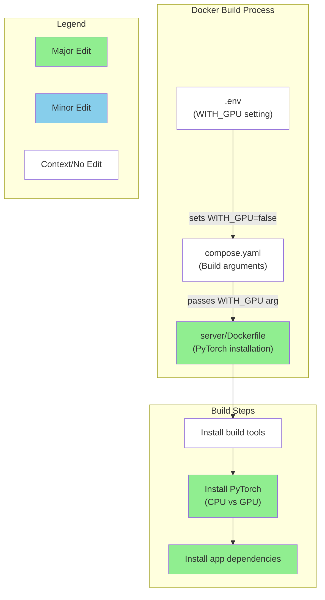
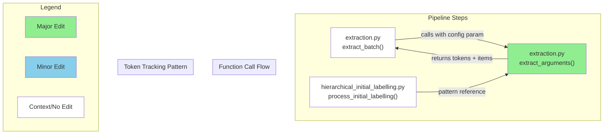

# GitHub レポート: digitaldemocracy2030/kouchou-ai

期間: 2025-07-16T12:36:47.518275+09:00 から 2025-07-23T12:36:47.518275+09:00 まで

## Issues

### 過去7日間に完了されたissue (1件)

### [[FEATURE] レポート単体での static export 機能](https://github.com/digitaldemocracy2030/kouchou-ai/issues/664)

**作成者:** shgtkshruch  
**作成日:** 2025-07-14T09:59:13Z  
**内容:**

# 背景
<!-- なぜその機能が必要なのか、何が改善されるのか具体的に記入してください -->

- https://github.com/digitaldemocracy2030/kouchou-ai/issues/460 の残タスク
- レポート一覧画面で、レポート単位で static export できるようにしたい
  - 今は全レポート一括での export のみ対応

# 提案内容
<!-- 実装案やデザイン案があれば記入してください -->

1. 管理画面でレポートごとの Action Menu で「HTML書き出し」をクリックしたら、そのレポートの slug を client-static-build に送る
1. cient-static-build で slug 単位で export できるようにする

**コメント:** なし

---

### 過去7日間に作成されたissue (1件)

### [[REFACTOR] [GitHub Actions] DD2030 の azure 環境への deploy 処理の最適化](https://github.com/digitaldemocracy2030/kouchou-ai/issues/669)

**作成者:** shingo-ohki  
**作成日:** 2025-07-20T05:38:44Z  
**内容:**

# 現在の問題点
https://github.com/digitaldemocracy2030/kouchou-ai/pull/642/files/972bbeb2a3d42b328dcadc9a2ebea6db77ff7437#r2212975293 の指摘の通り、現状の処理は最適化の余地がある

# 提案内容
<!-- どのようなリファクタリングを提案するのか、具体的に説明してください -->
- build と deploy 処理の責務の切り分け
- 複数コンテナの build の適切な分割

**コメント:** なし

---

### 過去7日間に更新されたissue（作成・クローズを除く）(2件)

### [[REFACTOR] envのUSE_AZUREを剥がす](https://github.com/digitaldemocracy2030/kouchou-ai/issues/475)

**作成者:** tokoroten  
**作成日:** 2025-05-10T15:35:37Z  
**内容:**

# 現在の問題点
LLMプロバイダが選択できるようになったので、Azureを使うかどうかの判断をenvを経由して行う必要はなくなった

# 提案内容
env から USE_AZURE を消す、関連するif文を剥がしていく

**コメント:** なし

---

### [[FEATURE]用語解説ページをつける](https://github.com/digitaldemocracy2030/kouchou-ai/issues/111)

**作成者:** nishio  
**作成日:** 2025-03-20T12:07:35Z  
**内容:**

# 背景
「プロンプト」「埋め込み」「濃い(クラスタ)」について、単語レベルで言い換えてもわかりやすくならない気がするので、やるとしたら用語解説ページをつけるとかかな

「縦軸・横軸はなんだろう」についても解説

# 提案内容
<!-- 実装案やデザイン案があれば記入してください -->

**コメント:** なし

---

## Pull Requests

### 過去7日間にマージされたPR (1件)

### [[client-admin] レポート単体のHTML書き出し機能を追加](https://github.com/digitaldemocracy2030/kouchou-ai/pull/665)

**作成者:** shgtkshruch  
**作成日:** 2025-07-15T08:10:07Z  
**変更:** +67 -22 (7ファイル)  
**マージ日:** 2025-07-21T07:49:21Z  
**内容:**

# 変更の概要
- 管理画面から、レポート単体で HTML 書き出しできるようにしました
  - ActionMenu に HTML 書き出し用のメニューを追加
  - client-admin -> client-static-build に slug を配列で渡せるように修正
  - client で slug が環境変数に指定されていてば、slug を対象にビルドするように修正
  - ビルド中も loading の Toast を表示する

# スクリーンショット

https://github.com/user-attachments/assets/41eead98-cc9b-47e8-b337-536189ed08a7

# 変更の背景
- レポート一覧画面で、レポート単位で static export できるようにしたい

# 関連Issue
- fix: https://github.com/digitaldemocracy2030/kouchou-ai/issues/664

# 動作確認の結果
<!-- 実装者は動作確認の結果を記載してください（例: レポート作成を実行し、正常にレポートが作成されることを確認した） 複数の動作確認を行った場合は、それぞれの結果を記載してください -->

- `make up` 実行後に、管理画面でレポート単体での HTML 書き出し・全レポートの HTML 書き出しができること

# CLAへの同意
- 本リポジトリへのコントリビュートには、[コントリビューターライセンス契約（CLA）](https://github.com/digitaldemocracy2030/kouchou-ai/blob/main/CLA.md)に同意することが必須です。
内容をお読みいただき、下記のチェックボックスにチェックをつける（"- [ ]" を "- [x]" に書き換える）ことで同意したものとみなします。

- [x] CLAの内容を読み、同意しました

# マージ前のチェックリスト（レビュアーがマージ前に確認してください）
- [x] CIが全て通過している
- [ ] 単体テストが実装されているか
- [x] 今回実装した機能および影響を受けると思われる機能について、適切な動作確認が行われているかを確認する。

動作確認の項目については、実装者による動作確認のケースが適切かを確認してください。
必要に応じてレビュアー自身による動作確認も歓迎します（必須ではありません）。

<!-- This is an auto-generated comment: release notes by coderabbit.ai -->
## Summary by CodeRabbit

* **新機能**
  * レポートのアクションメニューに「HTML書き出し」機能を追加しました。選択したレポートのみをHTMLとしてエクスポートできます。

* **改善**
  * ビルドダウンロードの操作性を向上し、エクスポート時のユーザー通知がより分かりやすくなりました。
  * HTMLエクスポート時に、対象レポートを選択してダウンロードできるようになりました。
  * ビルド対象のレポートが環境変数に基づき絞り込まれるようになりました。

* **その他**
  * 内部処理の最適化と安定性向上を行いました。
<!-- end of auto-generated comment: release notes by coderabbit.ai -->

**コメント:** なし

---

### 過去7日間に作成されたPR (4件)

### [[REFACTOR] envのUSE_AZUREを剥がす](https://github.com/digitaldemocracy2030/kouchou-ai/pull/671)

**作成者:** mochizuki-pg  
**作成日:** 2025-07-22T13:51:48Z  
**変更:** +0 -37 (6ファイル)  
**内容:**

# 変更の概要
https://github.com/digitaldemocracy2030/kouchou-ai/issues/475

# スクリーンショット
- UIの変更を伴う場合は、変更前後のスクリーンショットもしくはgif画像をこちらに記載してください

# 変更の背景
- ここに変更が必要となった背景を記載してください

# 関連Issue
関連するIssueのリンクをこちらに記載してください

# 動作確認の結果
<!-- 実装者は動作確認の結果を記載してください（例: レポート作成を実行し、正常にレポートが作成されることを確認した） 複数の動作確認を行った場合は、それぞれの結果を記載してください -->

# CLAへの同意
- 本リポジトリへのコントリビュートには、[コントリビューターライセンス契約（CLA）](https://github.com/digitaldemocracy2030/kouchou-ai/blob/main/CLA.md)に同意することが必須です。
内容をお読みいただき、下記のチェックボックスにチェックをつける（"- [ ]" を "- [x]" に書き換える）ことで同意したものとみなします。

- [x] CLAの内容を読み、同意しました

# マージ前のチェックリスト（レビュアーがマージ前に確認してください）
- [ ] CIが全て通過している
- [ ] 単体テストが実装されているか
- [ ] 今回実装した機能および影響を受けると思われる機能について、適切な動作確認が行われているかを確認する。

動作確認の項目については、実装者による動作確認のケースが適切かを確認してください。
必要に応じてレビュアー自身による動作確認も歓迎します（必須ではありません）。

<!-- This is an auto-generated comment: release notes by coderabbit.ai -->

## Summary by CodeRabbit

* **ドキュメント**
  * Azure OpenAI Serviceに関連する環境変数例（USE_AZUREなど）を削除しました。

* **バグ修正**
  * 環境チェックダイアログおよびAPIキー検証において、不要なAzure関連フラグ（use_azure）の表示・返却を削除しました。

* **リファクタ**
  * Azure設定に関する環境変数の事前バリデーション処理を削除しました。

<!-- end of auto-generated comment: release notes by coderabbit.ai -->

**コメント:** なし

---

### [Bump form-data from 4.0.2 to 4.0.4 in /client-admin](https://github.com/digitaldemocracy2030/kouchou-ai/pull/670)

**作成者:** dependabot[bot]  
**作成日:** 2025-07-22T05:56:44Z  
**変更:** +4 -3 (1ファイル)  
**内容:**

Bumps [form-data](https://github.com/form-data/form-data) from 4.0.2 to 4.0.4.

Changelog

<em>Sourced from <a href="https://github.com/form-data/form-data/blob/master/CHANGELOG.md">form-data's changelog</a>.</em>

<blockquote>
<h2><a href="https://github.com/form-data/form-data/compare/v4.0.3...v4.0.4">v4.0.4</a> - 2025-07-16</h2>
<h3>Commits</h3>
<ul>
<li>[meta] add <code>auto-changelog</code> <a href="https://github.com/form-data/form-data/commit/811f68282fab0315209d0e2d1c44b6c32ea0d479"><code>811f682</code></a></li>
<li>[Tests] handle predict-v8-randomness failures in node &lt; 17 and node &gt; 23 <a href="https://github.com/form-data/form-data/commit/1d11a76434d101f22fdb26b8aef8615f28b98402"><code>1d11a76</code></a></li>
<li>[Fix] Switch to using <code>crypto</code> random for boundary values <a href="https://github.com/form-data/form-data/commit/3d1723080e6577a66f17f163ecd345a21d8d0fd0"><code>3d17230</code></a></li>
<li>[Tests] fix linting errors <a href="https://github.com/form-data/form-data/commit/5e340800b5f8914213e4e0378c084aae71cfd73a"><code>5e34080</code></a></li>
<li>[meta] actually ensure the readme backup isn’t published <a href="https://github.com/form-data/form-data/commit/316c82ba93fd4985af757b771b9a1f26d3b709ef"><code>316c82b</code></a></li>
<li>[Dev Deps] update <code>@ljharb/eslint-config</code> <a href="https://github.com/form-data/form-data/commit/58c25d76406a5b0dfdf54045cf252563f2bbda8d"><code>58c25d7</code></a></li>
<li>[meta] fix readme capitalization <a href="https://github.com/form-data/form-data/commit/2300ca19595b0ee96431e868fe2a40db79e41c61"><code>2300ca1</code></a></li>
</ul>
<h2><a href="https://github.com/form-data/form-data/compare/v4.0.2...v4.0.3">v4.0.3</a> - 2025-06-05</h2>
<h3>Fixed</h3>
<ul>
<li>[Fix] <code>append</code>: avoid a crash on nullish values <a href="https://redirect.github.com/form-data/form-data/issues/577"><code>[#577](https://github.com/form-data/form-data/issues/577)</code></a></li>
</ul>
<h3>Commits</h3>
<ul>
<li>[eslint] use a shared config <a href="https://github.com/form-data/form-data/commit/426ba9ac440f95d1998dac9a5cd8d738043b048f"><code>426ba9a</code></a></li>
<li>[eslint] fix some spacing issues <a href="https://github.com/form-data/form-data/commit/20941917f0e9487e68c564ebc3157e23609e2939"><code>2094191</code></a></li>
<li>[Refactor] use <code>hasown</code> <a href="https://github.com/form-data/form-data/commit/81ab41b46fdf34f5d89d7ff30b513b0925febfaa"><code>81ab41b</code></a></li>
<li>[Fix] validate boundary type in <code>setBoundary()</code> method <a href="https://github.com/form-data/form-data/commit/8d8e4693093519f7f18e3c597d1e8df8c493de9e"><code>8d8e469</code></a></li>
<li>[Tests] add tests to check the behavior of <code>getBoundary</code> with non-strings <a href="https://github.com/form-data/form-data/commit/837b8a1f7562bfb8bda74f3fc538adb7a5858995"><code>837b8a1</code></a></li>
<li>[Dev Deps] remove unused deps <a href="https://github.com/form-data/form-data/commit/870e4e665935e701bf983a051244ab928e62d58e"><code>870e4e6</code></a></li>
<li>[meta] remove local commit hooks <a href="https://github.com/form-data/form-data/commit/e6e83ccb545a5619ed6cd04f31d5c2f655eb633e"><code>e6e83cc</code></a></li>
<li>[Dev Deps] update <code>eslint</code> <a href="https://github.com/form-data/form-data/commit/4066fd6f65992b62fa324a6474a9292a4f88c916"><code>4066fd6</code></a></li>
<li>[meta] fix scripts to use prepublishOnly <a href="https://github.com/form-data/form-data/commit/c4bbb13c0ef669916657bc129341301b1d331d75"><code>c4bbb13</code></a></li>
</ul>
</blockquote>

Commits

<ul>
<li><a href="https://github.com/form-data/form-data/commit/41996f5ac73a867046d48512cab62e64fc846dad"><code>41996f5</code></a> v4.0.4</li>
<li><a href="https://github.com/form-data/form-data/commit/316c82ba93fd4985af757b771b9a1f26d3b709ef"><code>316c82b</code></a> [meta] actually ensure the readme backup isn’t published</li>
<li><a href="https://github.com/form-data/form-data/commit/2300ca19595b0ee96431e868fe2a40db79e41c61"><code>2300ca1</code></a> [meta] fix readme capitalization</li>
<li><a href="https://github.com/form-data/form-data/commit/811f68282fab0315209d0e2d1c44b6c32ea0d479"><code>811f682</code></a> [meta] add <code>auto-changelog</code></li>
<li><a href="https://github.com/form-data/form-data/commit/5e340800b5f8914213e4e0378c084aae71cfd73a"><code>5e34080</code></a> [Tests] fix linting errors</li>
<li><a href="https://github.com/form-data/form-data/commit/1d11a76434d101f22fdb26b8aef8615f28b98402"><code>1d11a76</code></a> [Tests] handle predict-v8-randomness failures in node &lt; 17 and node &gt; 23</li>
<li><a href="https://github.com/form-data/form-data/commit/58c25d76406a5b0dfdf54045cf252563f2bbda8d"><code>58c25d7</code></a> [Dev Deps] update <code>@ljharb/eslint-config</code></li>
<li><a href="https://github.com/form-data/form-data/commit/3d1723080e6577a66f17f163ecd345a21d8d0fd0"><code>3d17230</code></a> [Fix] Switch to using <code>crypto</code> random for boundary values</li>
<li><a href="https://github.com/form-data/form-data/commit/d8d67dc8ac79285154edf7d3f57dbab593b9a146"><code>d8d67dc</code></a> v4.0.3</li>
<li><a href="https://github.com/form-data/form-data/commit/e6e83ccb545a5619ed6cd04f31d5c2f655eb633e"><code>e6e83cc</code></a> [meta] remove local commit hooks</li>
<li>Additional commits viewable in <a href="https://github.com/form-data/form-data/compare/v4.0.2...v4.0.4">compare view</a></li>
</ul>

 

Dependabot will resolve any conflicts with this PR as long as you don't alter it yourself. You can also trigger a rebase manually by commenting `@dependabot rebase`.

[//]: # (dependabot-automerge-start)
[//]: # (dependabot-automerge-end)

---

Dependabot commands and options

 

You can trigger Dependabot actions by commenting on this PR:
- `@dependabot rebase` will rebase this PR
- `@dependabot recreate` will recreate this PR, overwriting any edits that have been made to it
- `@dependabot merge` will merge this PR after your CI passes on it
- `@dependabot squash and merge` will squash and merge this PR after your CI passes on it
- `@dependabot cancel merge` will cancel a previously requested merge and block automerging
- `@dependabot reopen` will reopen this PR if it is closed
- `@dependabot close` will close this PR and stop Dependabot recreating it. You can achieve the same result by closing it manually
- `@dependabot show <dependency name> ignore conditions` will show all of the ignore conditions of the specified dependency
- `@dependabot ignore this major version` will close this PR and stop Dependabot creating any more for this major version (unless you reopen the PR or upgrade to it yourself)
- `@dependabot ignore this minor version` will close this PR and stop Dependabot creating any more for this minor version (unless you reopen the PR or upgrade to it yourself)
- `@dependabot ignore this dependency` will close this PR and stop Dependabot creating any more for this dependency (unless you reopen the PR or upgrade to it yourself)
You can disable automated security fix PRs for this repo from the [Security Alerts page](https://github.com/digitaldemocracy2030/kouchou-ai/network/alerts).

**コメント:** なし

---

### [[client-admin] 意見グループ編集の fetch を Server Functions で実行する](https://github.com/digitaldemocracy2030/kouchou-ai/pull/668)

**作成者:** shgtkshruch  
**作成日:** 2025-07-19T07:40:38Z  
**変更:** +280 -287 (5ファイル)  
**内容:**

# 変更の概要
- 管理画面で意見グループを編集する際のデータ取得と api サーバーへの POST を Server Fucntions で実行するように変更しました
  - api キーをクライアント（ブラウザ）に露出させないため
- Dialog の実装を他の箇所と合わせて ui 層に定義された Dialog コンポーネントを利用する形に変更しました
- useState で管理していた form の入力値を formData で渡すように変更しました

# スクリーンショット

https://github.com/user-attachments/assets/8818bb55-d127-4516-b0d6-1af247a172b2

# 変更の背景
- api キーがクライアントに露出している

# 関連Issue
- https://github.com/digitaldemocracy2030/kouchou-ai/issues/547

# 動作確認の結果
<!-- 実装者は動作確認の結果を記載してください（例: レポート作成を実行し、正常にレポートが作成されることを確認した） 複数の動作確認を行った場合は、それぞれの結果を記載してください -->

# CLAへの同意
- 本リポジトリへのコントリビュートには、[コントリビューターライセンス契約（CLA）](https://github.com/digitaldemocracy2030/kouchou-ai/blob/main/CLA.md)に同意することが必須です。
内容をお読みいただき、下記のチェックボックスにチェックをつける（"- [ ]" を "- [x]" に書き換える）ことで同意したものとみなします。

- [x] CLAの内容を読み、同意しました

# マージ前のチェックリスト（レビュアーがマージ前に確認してください）
- [ ] CIが全て通過している
- [ ] 単体テストが実装されているか
- [ ] 今回実装した機能および影響を受けると思われる機能について、適切な動作確認が行われているかを確認する。

動作確認の項目については、実装者による動作確認のケースが適切かを確認してください。
必要に応じてレビュアー自身による動作確認も歓迎します（必須ではありません）。

<!-- This is an auto-generated comment: release notes by coderabbit.ai -->
## Summary by CodeRabbit

* **新機能**
  * クラスターの取得と更新を行うサーバーアクションが追加され、レポート編集ダイアログで利用可能になりました。

* **リファクタ**
  * クラスター編集ダイアログのUIとロジックを分離し、よりモジュール化された構成に変更しました。
  * フォーム送信をネイティブなform要素と非制御入力に切り替えました。
  * Chakra UIのダイアログからカスタムダイアログコンポーネントに置き換えました。

* **テスト**
  * クラスター編集ダイアログのテストをサーバーアクションのモック利用に変更し、テスト内容を最新の実装に合わせて調整しました。

* **スタイル**
  * レポート編集ダイアログのインポート文を整理しました。
<!-- end of auto-generated comment: release notes by coderabbit.ai -->

**コメント:** なし

---

### [Fix Windows Docker build failure for PyTorch installation](https://github.com/digitaldemocracy2030/kouchou-ai/pull/667)

**作成者:** NISHIO+Devin  
**作成日:** 2025-07-16T03:33:29Z  
**変更:** +29 -28 (1ファイル)  
**内容:**

# Fix Windows Docker build failure for PyTorch installation

## Summary

Fixes a Docker build failure on Windows environments where PyTorch installation fails when `WITH_GPU=false`. The issue was caused by the use of the deprecated `--no-cache` flag with `uv pip install`, which is incompatible with Windows Docker environments.

**Key changes:**
- Replace `--no-cache` with `--no-cache-dir` in all `uv pip install` commands
- Improve conditional syntax with proper variable quoting (`"${WITH_GPU}"`)
- Add better structure and comments to the Dockerfile for maintainability
- Maintain all existing functionality and build arguments

This fix is based on a tested solution provided by a user who encountered this issue in production and confirmed the fix resolves the Windows build failure.

## Review & Testing Checklist for Human

**High Priority (3 items):**
- [ ] **Test Docker build on Windows** - Verify `docker compose build api` succeeds on Windows with `WITH_GPU=false`
- [ ] **Test Docker build on Linux** - Ensure no regressions on existing Linux environments 
- [ ] **End-to-end functionality test** - After successful build, verify the API server starts correctly and core functionality works (port 8000, health check, basic API calls)

---

### Diagram

### Notes

- **Root cause**: Windows Docker environments don't handle the older `--no-cache` flag properly with `uv pip install`
- **Solution confidence**: High - based on user-tested fix that resolved the exact same issue in production
- **Risk level**: Medium - Docker build changes affect critical infrastructure but changes are focused and tested
- **Session details**: Devin session at https://app.devin.ai/sessions/910a68aa253e41bc966bfb994b1345f9, requested by @nishio
- **Original error**: `process "/bin/sh -c if [ "$WITH_GPU" = "false" ]; then ... uv pip install --no-cache ... did not complete successfully: exit code: 1`

**コメント:** なし

---

### 過去7日間に更新されたPR（作成・マージを除く）(2件)

### [OpenAI, OpenRouter の API KEY をフォームから入力してレポートを作成できるようにする](https://github.com/digitaldemocracy2030/kouchou-ai/pull/660)

**作成者:** Shingo Ohki+Devin  
**作成日:** 2025-07-13T13:21:05Z  
**変更:** +372 -49 (19ファイル)  
**内容:**

# Fix: Add Missing Config Parameter to extract_arguments Function

## Summary

This PR fixes a function signature inconsistency in the `extract_arguments` function in `extraction.py` where the function was being called with a `config` parameter but the function definition didn't accept it. The fix adds the missing `config=None` parameter and implements token usage tracking following the established pattern from other pipeline step files.

**Key Changes:**
- ✅ Added missing `config=None` parameter to `extract_arguments` function signature
- ✅ Implemented token usage tracking when `config` is provided, following the pattern from `hierarchical_initial_labelling.py`
- ✅ Maintains backward compatibility with `config=None` default
- 🔒 Addresses GitHub comment from shingo-ohki about following previous modifications

## Review & Testing Checklist for Human

**🟡 MEDIUM PRIORITY - Function Signature & Token Tracking (4 items)**

- [ ] **Verify function signature fix**: Confirm that `extract_arguments` can now be called with the `config` parameter without errors (check line 107 in `extract_batch` function)
- [ ] **Test token usage tracking**: Verify that token usage is properly accumulated in the config when provided, and that extraction still works when `config=None`
- [ ] **Pattern consistency check**: Compare the token usage implementation in `extract_arguments` with similar implementations in `hierarchical_initial_labelling.py` lines 171-174 to ensure consistency
- [ ] **End-to-end extraction test**: Run a complete extraction pipeline to ensure the function signature fix doesn't break the extraction workflow and that token tracking works correctly

### Diagram

### Notes

- **Root Cause**: The `extract_batch` function on line 107 was calling `extract_arguments` with a `config` parameter, but the function definition on line 148 didn't accept this parameter, causing a signature mismatch
- **Solution Pattern**: Followed the exact token usage tracking pattern from `hierarchical_initial_labelling.py` lines 171-174 to ensure consistency across pipeline steps
- **Testing Limitation**: Local tests failed due to environment configuration issues (missing API keys), but all CI checks passed (5/5 success)
- **Backward Compatibility**: The `config=None` default ensures existing calls without the config parameter continue to work

**Session Info**: 
- Devin session: https://app.devin.ai/sessions/26612fbfad6e40d0a0bcd2f01ad2cf84
- Requested by: @shingo-ohki
- Addresses GitHub comment: "上記の修正に追従" (follow the above modification)

**コメント:** なし

---

### [[GitHub Actions] main ブランチにマージされたコードを Azure に deploy する](https://github.com/digitaldemocracy2030/kouchou-ai/pull/642)

**作成者:** shingo-ohki  
**作成日:** 2025-07-09T01:19:42Z  
**変更:** +208 -2 (2ファイル)  
**内容:**

# 変更の概要
- digitaldemocracy2030/kouchou-ai の main ブランチにマージされると、自動的に別途用意した DD2030 が持つ azure 環境に最新のコードが deploy されるようにする

# 変更の背景
以下のような状況から DD2030 で Azure に[広聴AIの環境](https://client.wittyisland-cc57c95f.japaneast.azurecontainerapps.io/)を構築中だが、この環境の更新は現状は手動でやる必要がある
- 動作確認する環境が、開発者の手元の環境のみのため開発者以外が動作確認するすべがない
- ユーザーが広聴AIを利用するには環境構築をする必要があり、利用までに技術的なハードルがあるためデモ環境を用意したい

# 関連Issue
#622 

# 動作確認の結果
<!-- 実装者は動作確認の結果を記載してください（例: レポート作成を実行し、正常にレポートが作成されることを確認した） 複数の動作確認を行った場合は、それぞれの結果を記載してください -->

deploy 処理部分は、フォークしたリポジトリから deploy できることを確認しました。
https://github.com/shingo-ohki/kouchou-ai/actions/runs/16157340778

# CLAへの同意
- 本リポジトリへのコントリビュートには、[コントリビューターライセンス契約（CLA）](https://github.com/digitaldemocracy2030/kouchou-ai/blob/main/CLA.md)に同意することが必須です。
内容をお読みいただき、下記のチェックボックスにチェックをつける（"- [ ]" を "- [x]" に書き換える）ことで同意したものとみなします。

- [x] CLAの内容を読み、同意しました

# マージ前のチェックリスト（レビュアーがマージ前に確認してください）
- [ ] CIが全て通過している
- [ ] 単体テストが実装されているか
- [ ] 今回実装した機能および影響を受けると思われる機能について、適切な動作確認が行われているかを確認する。

動作確認の項目については、実装者による動作確認のケースが適切かを確認してください。
必要に応じてレビュアー自身による動作確認も歓迎します（必須ではありません）。

<!-- This is an auto-generated comment: release notes by coderabbit.ai -->
## Summary by CodeRabbit

## Summary by CodeRabbit

* **新機能**
  * Azure Container Appsへの自動デプロイメント用GitHub Actionsワークフローを追加しました。  
  * 環境変数設定、APIやクライアントのDockerイメージのビルド・プッシュ、リソース割当更新、ヘルスチェックが自動化され、安定したデプロイが可能になりました。
* **改善**
  * APIコンテナのCPUとメモリ割当を増強し、パフォーマンスの向上を図りました。

<!-- end of auto-generated comment: release notes by coderabbit.ai -->

**コメント:** なし

---

