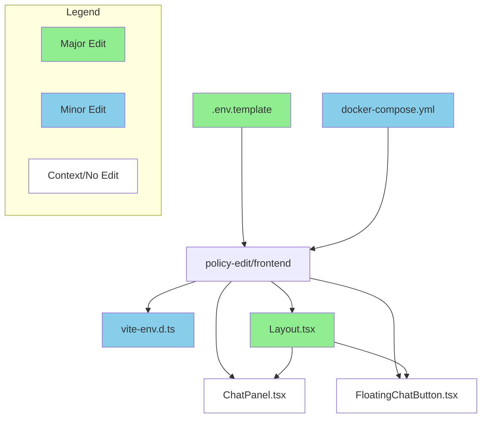
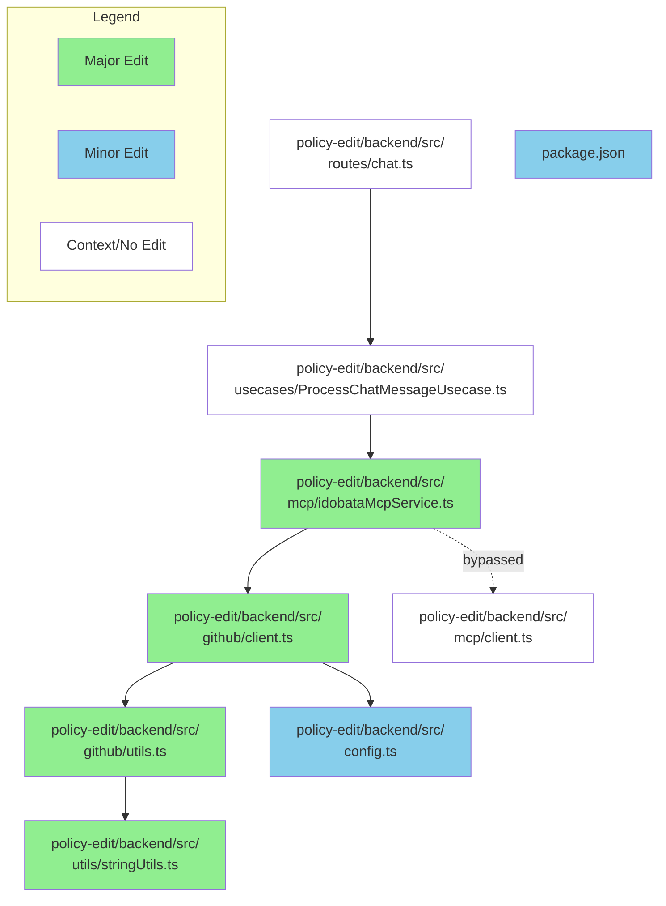

# GitHub レポート: digitaldemocracy2030/idobata

期間: 2025-07-23T12:37:49.254305+09:00 から 2025-07-30T12:37:49.254305+09:00 まで

## Pull Requests

### 過去7日間にマージされたPR (7件)

### [Feature/header link](https://github.com/digitaldemocracy2030/idobata/pull/439)

**作成者:** jujunjun110  
**作成日:** 2025-07-24T15:38:02Z  
**変更:** +53 -137 (2ファイル)  
**マージ日:** 2025-07-24T15:39:49Z  
**内容:**

# 変更の概要
ヘッダーの挙動を微修正

# スクリーンショット
なし

# 変更の背景
<!-- ここに変更が必要となった背景を記載してください -->

# 関連Issue
<!-- 関連するIssueのリンクをこちらに記載してください -->

# CLAへの同意
本リポジトリへのコントリビュートには、[コントリビューターライセンス契約（CLA）](https://github.com/digitaldemocracy2030/idobata/blob/main/CLA.md)に同意することが必須です。

内容をお読みいただき、下記のチェックボックスにチェックをつける（"- [ ]" を "- [x]" に書き換える）ことで同意したものとみなします。

- [x] CLAの内容を読み、同意しました

**コメント:** なし

---

### [Feature/footers](https://github.com/digitaldemocracy2030/idobata/pull/438)

**作成者:** jujunjun110  
**作成日:** 2025-07-24T15:27:57Z  
**変更:** +486 -12 (14ファイル)  
**マージ日:** 2025-07-24T15:28:05Z  
**内容:**

# 変更の概要
ウタコデザインのFooterを追加

# スクリーンショット

# 変更の背景
<!-- ここに変更が必要となった背景を記載してください -->

# 関連Issue
<!-- 関連するIssueのリンクをこちらに記載してください -->

# CLAへの同意
本リポジトリへのコントリビュートには、[コントリビューターライセンス契約（CLA）](https://github.com/digitaldemocracy2030/idobata/blob/main/CLA.md)に同意することが必須です。

内容をお読みいただき、下記のチェックボックスにチェックをつける（"- [ ]" を "- [x]" に書き換える）ことで同意したものとみなします。

- [x] CLAの内容を読み、同意しました

**コメント:** なし

---

### [Revert "Feature/footers"](https://github.com/digitaldemocracy2030/idobata/pull/437)

**作成者:** jujunjun110  
**作成日:** 2025-07-24T15:26:06Z  
**変更:** +312 -1079 (30ファイル)  
**マージ日:** 2025-07-24T15:26:42Z  
**内容:**

誤ってmain にマージしてしまいました。すみません。revertします。

**コメント:** なし

---

### [Feature/footers](https://github.com/digitaldemocracy2030/idobata/pull/436)

**作成者:** jujunjun110  
**作成日:** 2025-07-24T15:24:06Z  
**変更:** +1079 -312 (30ファイル)  
**マージ日:** 2025-07-24T15:25:11Z  
**内容:**

# 変更の概要
ウタコデザインのFooterを追加

# スクリーンショット

# 変更の背景
ウタコデザイン実装

# 関連Issue
<!-- 関連するIssueのリンクをこちらに記載してください -->

# CLAへの同意
本リポジトリへのコントリビュートには、[コントリビューターライセンス契約（CLA）](https://github.com/digitaldemocracy2030/idobata/blob/main/CLA.md)に同意することが必須です。

内容をお読みいただき、下記のチェックボックスにチェックをつける（"- [ ]" を "- [x]" に書き換える）ことで同意したものとみなします。

- [x] CLAの内容を読み、同意しました

**コメント:** なし

---

### [Feature/hamburger sheet UI](https://github.com/digitaldemocracy2030/idobata/pull/435)

**作成者:** jujunjun110  
**作成日:** 2025-07-24T13:53:36Z  
**変更:** +43 -16 (5ファイル)  
**マージ日:** 2025-07-24T13:55:36Z  
**内容:**

# 変更の概要
ハンバーガーメニューのUI（スマホのみ）をウタコデザインにした

# スクリーンショット

# 変更の背景
<!-- ここに変更が必要となった背景を記載してください -->
ウタコデザインの反映

# 関連Issue
<!-- 関連するIssueのリンクをこちらに記載してください -->

# CLAへの同意
本リポジトリへのコントリビュートには、[コントリビューターライセンス契約（CLA）](https://github.com/digitaldemocracy2030/idobata/blob/main/CLA.md)に同意することが必須です。

内容をお読みいただき、下記のチェックボックスにチェックをつける（"- [ ]" を "- [x]" に書き換える）ことで同意したものとみなします。

- [x] CLAの内容を読み、同意しました

**コメント:** なし

---

### [Feature/header v1](https://github.com/digitaldemocracy2030/idobata/pull/433)

**作成者:** jujunjun110  
**作成日:** 2025-07-24T00:30:37Z  
**変更:** +183 -258 (12ファイル)  
**マージ日:** 2025-07-24T00:38:25Z  
**内容:**

# 変更の概要
* ヘッダーの見た目についてウタコデザインを実装した

# スクリーンショット

# 変更の背景
デザインv1.0

# 関連Issue
<!-- 関連するIssueのリンクをこちらに記載してください -->

# CLAへの同意
本リポジトリへのコントリビュートには、[コントリビューターライセンス契約（CLA）](https://github.com/digitaldemocracy2030/idobata/blob/main/CLA.md)に同意することが必須です。

内容をお読みいただき、下記のチェックボックスにチェックをつける（"- [ ]" を "- [x]" に書き換える）ことで同意したものとみなします。

- [x] CLAの内容を読み、同意しました

**コメント:** なし

---

### [Add environment variable to disable chat in policy-edit frontend](https://github.com/digitaldemocracy2030/idobata/pull/430)

**作成者:** Shutaro+Devin  
**作成日:** 2025-07-19T11:30:39Z  
**変更:** +39 -28 (4ファイル)  
**マージ日:** 2025-07-26T11:24:52Z  
**内容:**

# Add environment variable to disable chat in policy-edit frontend

## Summary
This PR adds a new environment variable `VITE_DISABLE_CHAT` that allows completely disabling the chat functionality in the policy-edit frontend. When set to `"true"`, both the ChatPanel (desktop) and FloatingChatButton (mobile) are hidden, and the content area expands to use the full available width.

**Key changes:**
- Added `VITE_DISABLE_CHAT=false` to `.env.template` with Japanese documentation
- Updated TypeScript environment variable definitions in `vite-env.d.ts`  
- Modified `Layout.tsx` to conditionally render chat components and adjust content area width
- Updated `docker-compose.yml` to pass the environment variable to the policy-frontend service
- Maintains backward compatibility (defaults to chat enabled when unset)

## Review & Testing Checklist for Human
- [ ] **Test both enabled/disabled states end-to-end** - Set `VITE_DISABLE_CHAT=false` and `VITE_DISABLE_CHAT=true`, verify chat visibility and content area expansion
- [ ] **Verify mobile responsiveness** - Test on mobile/narrow viewport that FloatingChatButton is properly hidden when disabled
- [ ] **Check Docker environment variable passing** - Ensure the environment variable works correctly in Docker Compose setup
- [ ] **Visual regression testing** - Verify no unintended layout issues or visual regressions in both enabled/disabled states

**Recommended test plan:** 
1. Start with `VITE_DISABLE_CHAT=false` (or unset), verify chat panel visible on left side
2. Change to `VITE_DISABLE_CHAT=true`, verify chat completely hidden and content uses full width
3. Test mobile view in both states to ensure FloatingChatButton behavior
4. Test in your Docker environment to ensure env var passing works

---

### Diagram

### Notes
- The implementation follows existing patterns in the codebase for environment variable usage and conditional rendering
- Layout changes use flexbox modifications to expand content area when chat is disabled
- Both desktop ChatPanel and mobile FloatingChatButton are handled consistently
- Environment variable defaults to `false` (chat enabled) for backward compatibility

**Testing completed:**
- ✅ Lint, typecheck, and build all passed
- ✅ Unit tests passed (13/13)
- ✅ Local testing confirmed chat visibility behavior in both states
- ✅ Mobile responsiveness verified

---

**Link to Devin run:** https://app.devin.ai/sessions/28f397625eaa410d9937978539172588
**Requested by:** Shutaro (@blu3mo)

 

**コメント:** なし

---

### 過去7日間に作成されたPR (3件)

### [implement idobata vision top page for v1](https://github.com/digitaldemocracy2030/idobata/pull/440)

**作成者:** spinute  
**作成日:** 2025-07-27T18:58:02Z  
**変更:** +998 -151 (20ファイル)  
**内容:**

# 変更の概要
<!-- ここに変更の概要を記載してください -->

https://dd2030.slack.com/archives/C08FF5MM59C/p1752389240178989?thread_ts=1752389192.988569&cid=C08FF5MM59C でデザインした、いどばたビジョンの UI を洗練したバージョン（v1 と読んでいる）のトップページをざっくり実装した

マイナーな機能（並び替え機能やヘルプなど）がまだ実装されていなかったり、UI の作り込みが甘かったりするが、概ね動く状態

# スクリーンショット
<!-- UIの変更を伴う場合は、変更前後のスクリーンショットもしくはgif画像をこちらに記載してください -->

# 変更の背景
<!-- ここに変更が必要となった背景を記載してください -->

# 関連Issue
<!-- 関連するIssueのリンクをこちらに記載してください -->

# CLAへの同意
本リポジトリへのコントリビュートには、[コントリビューターライセンス契約（CLA）](https://github.com/digitaldemocracy2030/idobata/blob/main/CLA.md)に同意することが必須です。

内容をお読みいただき、下記のチェックボックスにチェックをつける（"- [ ]" を "- [x]" に書き換える）ことで同意したものとみなします。

- [x] CLAの内容を読み、同意しました

**コメント:** なし

---

### [Feature/hamburger sheet](https://github.com/digitaldemocracy2030/idobata/pull/434)

**作成者:** jujunjun110  
**作成日:** 2025-07-24T07:28:48Z  
**変更:** +63489 -35084 (482ファイル)  
**内容:**

# 変更の概要
スマホ向けのハンバーガーメニューを追加

# スクリーンショット

# 変更の背景
ウタコデザインの実装

# 関連Issue
<!-- 関連するIssueのリンクをこちらに記載してください -->

# CLAへの同意
本リポジトリへのコントリビュートには、[コントリビューターライセンス契約（CLA）](https://github.com/digitaldemocracy2030/idobata/blob/main/CLA.md)に同意することが必須です。

内容をお読みいただき、下記のチェックボックスにチェックをつける（"- [ ]" を "- [x]" に書き換える）ことで同意したものとみなします。

- [x] CLAの内容を読み、同意しました

**コメント:** なし

---

### [import_comments.pyのエンドポイント修正](https://github.com/digitaldemocracy2030/idobata/pull/432)

**作成者:** nishidashib  
**作成日:** 2025-07-23T09:19:03Z  
**変更:** +1 -1 (1ファイル)  
**内容:**

# 変更の概要
<!-- ここに変更の概要を記載してください -->
endpointで使用している変数に誤りがあった。
# スクリーンショット
<!-- UIの変更を伴う場合は、変更前後のスクリーンショットもしくはgif画像をこちらに記載してください -->

# 変更の背景
テストデータをこのスクリプトを使ってuploadしようとした時に動作しなかったため。
<!-- ここに変更が必要となった背景を記載してください -->

# 関連Issue
<!-- 関連するIssueのリンクをこちらに記載してください -->

# CLAへの同意
本リポジトリへのコントリビュートには、[コントリビューターライセンス契約（CLA）](https://github.com/digitaldemocracy2030/idobata/blob/main/CLA.md)に同意することが必須です。

内容をお読みいただき、下記のチェックボックスにチェックをつける（"- [ ]" を "- [x]" に書き換える）ことで同意したものとみなします。

- [x] CLAの内容を読み、同意しました

**コメント:** なし

---

### 過去7日間に更新されたPR（作成・マージを除く）(1件)

### [Implement direct octokit calls bypassing MCP server](https://github.com/digitaldemocracy2030/idobata/pull/429)

**作成者:** kuboon+Devin  
**作成日:** 2025-07-18T08:24:10Z  
**変更:** +889 -29 (8ファイル)  
**内容:**

# Bypass MCP server for direct GitHub API calls

## Summary

This PR implements a significant architectural change to bypass the MCP (Model Context Protocol) server and call GitHub APIs directly within `IdobataMcpService.processQuery()`. The change eliminates the overhead of MCP communication while maintaining the same AI-driven GitHub operations functionality.

**Key Changes:**
- **Direct GitHub Integration**: Added Octokit dependencies and GitHub App authentication to the backend
- **Logic Migration**: Moved GitHub operation logic from `policy-edit/mcp/src/` to `policy-edit/backend/src/`
- **Service Refactoring**: Modified `IdobataMcpService` to execute GitHub tools directly instead of via MCP
- **Workspace Cleanup**: Removed MCP from npm workspaces to resolve CI failures
- **Configuration**: Added new GitHub App environment variables for authentication

**Flow Change:**
- **Before**: `callTool` → `mcpClient` → `mcpServer` → `octokit`
- **After**: `callTool` → `octokit` (direct)

## Review & Testing Checklist for Human

**🔴 High Risk - Requires Careful Verification:**

- [ ] **Environment Configuration**: Verify all GitHub App environment variables are properly set in all environments (`GITHUB_APP_ID`, `GITHUB_INSTALLATION_ID`, `GITHUB_TARGET_OWNER`, `GITHUB_TARGET_REPO`, `GITHUB_BASE_BRANCH`, `GITHUB_API_BASE_URL`)
- [ ] **GitHub App Private Key**: Confirm the private key file exists at `/app/secrets/github-key.pem` in the container and has correct permissions
- [ ] **End-to-End Testing**: Test the complete chat flow with actual GitHub operations (file creation/updates, PR creation/updates) to ensure the ported logic works correctly
- [ ] **Error Handling**: Verify that GitHub API errors are properly handled and don't crash the chat service
- [ ] **Deployment Impact**: Confirm that removing MCP from workspaces doesn't break the Docker build or deployment process

**Recommended Test Plan:**
1. Test chat requests that trigger `upsert_file_and_commit` operations
2. Test chat requests that trigger `update_pr` operations  
3. Verify error scenarios (invalid file paths, GitHub API failures)
4. Check that branch creation and PR management still work as expected

---

### Diagram

### Notes

- **Session**: https://app.devin.ai/sessions/502f83bde7044f72bc8e7e62284d1aa1
- **Requested by**: kuboon (kuboon@trick-with.net)
- **MCP Directory**: The `policy-edit/mcp` directory still exists but is no longer functional or included in CI. This was intentional per user requirements.
- **Authentication**: Uses GitHub App authentication instead of personal access tokens for better security and rate limiting.
- **Performance**: Should improve response times by eliminating MCP server communication overhead.

**コメント:** なし

---

