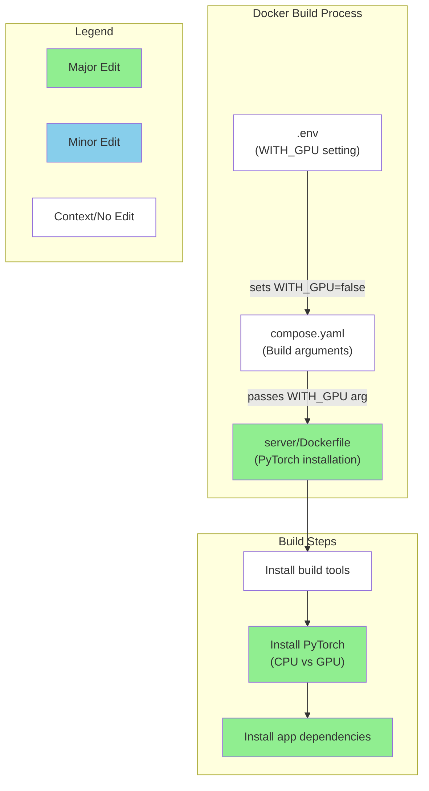
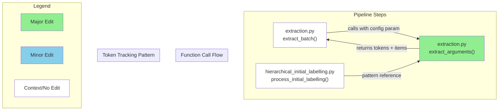

# GitHub レポート: digitaldemocracy2030/kouchou-ai

期間: 2025-07-23T12:37:34.605167+09:00 から 2025-07-30T12:37:34.605167+09:00 まで

## Issues

### 過去7日間に完了されたissue (4件)

### [[REFACTOR] Talk to the City にあったカテゴリー分類処理の要否](https://github.com/digitaldemocracy2030/kouchou-ai/issues/673)

**作成者:** shingo-ohki  
**作成日:** 2025-07-24T02:06:20Z  
**内容:**

# 現在の問題点
<!-- 現在のコードの何が問題なのか、どのような技術的負債があるかを説明してください -->

以下の部分は、広聴AIの処理では使われておらず Talk to the City の名残りに見える。
この処理は将来のために残しておくべきか？あるいは、不要なので削除すべきか？

https://github.com/digitaldemocracy2030/kouchou-ai/blob/main/server/broadlistening/pipeline/steps/extraction.py#L91-L93

# 提案内容
<!-- どのようなリファクタリングを提案するのか、具体的に説明してください -->


**コメント:** なし

---

### [[FEATURE] 意見グループの並び順を意見数の降順で表示する](https://github.com/digitaldemocracy2030/kouchou-ai/issues/617)

**作成者:** shingo-ohki  
**作成日:** 2025-06-28T03:04:29Z  
**内容:**

# 背景
- 意見グループ編集時に、意見グループの並び順と階層表示の対応が一致していないため、修正しようとする意見グループを見つけにくい
- レポート表示時の意見グループの表示がどのような順番で表示されているのか分かりにくい


# 提案内容
意見数が多い意見グループから順に表示されていると直感的に理解しやすいのでは？

**コメント:** なし

---

### [[REFACTOR] envのUSE_AZUREを剥がす](https://github.com/digitaldemocracy2030/kouchou-ai/issues/475)

**作成者:** tokoroten  
**作成日:** 2025-05-10T15:35:37Z  
**内容:**

# 現在の問題点
LLMプロバイダが選択できるようになったので、Azureを使うかどうかの判断をenvを経由して行う必要はなくなった

# 提案内容
env から USE_AZURE を消す、関連するif文を剥がしていく


**コメント:** なし

---

### [[FEATURE] 全画面表示を dialog として実装する](https://github.com/digitaldemocracy2030/kouchou-ai/issues/267)

**作成者:** shgtkshruch  
**作成日:** 2025-04-09T03:04:48Z  
**内容:**

# 背景
<!-- なぜその機能が必要なのか、何が改善されるのか具体的に記入してください -->

全画面表示の状態で `Tab` キーを押すと、全画面の下の要素（見出しのリンク）にフォーカスがあたり、下の画面要素が操作、スクロールできてしまいます。（フォーカストラップが未実装）

現象を見えやすくするために、Chart を半透明にして操作したキャプチャー

https://github.com/user-attachments/assets/a9c2e6b7-7c1d-485d-a582-88cdb34003c6

これは個人的な意見ですが、全画面表示はモーダルダイアログとして実装されているように見えるので、全画面表示をしている際はその中で操作が完結することが期待値かなと思いました。（違ったらコメントください :pray: ）

ARIA Authoring Practices Guide の dialog パターンでも、Tab のフォーカスは dialog 内で閉じていることが期待されています。

> If focus is on the last tabbable element inside the dialog, moves focus to the first tabbable element inside the dialog.
> ref: [Dialog (Modal) Pattern \| APG \| WAI \| W3C](https://www.w3.org/WAI/ARIA/apg/patterns/dialog-modal/)

# 提案内容
<!-- 実装案やデザイン案があれば記入してください -->
- 全画面表示の UI を dialog として実装する
  - Chakra UI の Dialog Component  に `size="full"` の props があるので、こちらが活用できるかもしれません
  - https://www.chakra-ui.com/docs/components/dialog#fullscreen

**コメント:** なし

---

### 過去7日間に作成されたissue (3件)

### [[BUG] main へマージ時に DD2030 の azure 環境へのデプロイが失敗する](https://github.com/digitaldemocracy2030/kouchou-ai/issues/682)

**作成者:** shingo-ohki  
**作成日:** 2025-07-29T01:36:13Z  
**内容:**

### 概要

https://github.com/digitaldemocracy2030/kouchou-ai/pull/642 で main にマージされるたびに DD2030 の Azure 環境に deploy されるようにしたがエラーが発生する

<!-- バグの簡潔な説明をお願いします -->

### 再現手順

1.  main ブランチにコードがマージされる

### 期待する動作

<!-- 本来どう動作すべきかを記入してください -->

### スクリーンショット・ログ
出力されているログ
https://github.com/digitaldemocracy2030/kouchou-ai/actions/runs/16584250059/job/46906413136

```
...
Error: The subscription of '79e8ef5-7461-407d-84b6-b4f37b9f31c1' doesn't exist in cloud 'AzureCloud'.

Error: Login failed with Error: The process '/usr/bin/az' failed with exit code 1. Double check if the 'auth-type' is correct. Refer to https://github.com/Azure/login#readme for more information.
```
<!-- 必要に応じてスクリーンショットやエラーログなどを添付してください -->


**コメント:** なし

---

### [[FEATURE] APIの接続チェック機能でユーザー入力APIキーもチェックできるようにする](https://github.com/digitaldemocracy2030/kouchou-ai/issues/681)

**作成者:** shingo-ohki  
**作成日:** 2025-07-27T10:39:32Z  
**内容:**

# 背景
<!-- なぜその機能が必要なのか、何が改善されるのか具体的に記入してください -->
現状、API接続チェックはユーザーが入力したAPIキー(https://github.com/digitaldemocracy2030/kouchou-ai/issues/633) については有効性の確認ができない

# 提案内容
<!-- 実装案やデザイン案があれば記入してください -->


**コメント:** なし

---

### [[FEATURE] 集まった意見を任意のカテゴリーで分類できるようにする](https://github.com/digitaldemocracy2030/kouchou-ai/issues/679)

**作成者:** shingo-ohki  
**作成日:** 2025-07-27T02:17:28Z  
**内容:**

# 背景

広聴AIのベースになった Talk to the City に追加された以下の機能
https://github.com/takahiroanno2024/anno-broadlistening/pull/23
は、現在の広聴AIでは使用されていないため https://github.com/digitaldemocracy2030/kouchou-ai/pull/678 でその処理を削除しようとしている。

ただし、ニーズとしては上記のニーズはあるため現状の広聴AIに合う形で改めて実装できるとよい

# 提案内容
<!-- 実装案やデザイン案があれば記入してください -->

**コメント:** なし

---

### 過去7日間に更新されたissue（作成・クローズを除く）(4件)

### [[FEATURE]onChangeでの自動修正が入力の妨げになる](https://github.com/digitaldemocracy2030/kouchou-ai/issues/640)

**作成者:** nishio  
**作成日:** 2025-07-08T09:07:51Z  
**内容:**

# 背景
<!-- なぜその機能が必要なのか、何が改善されるのか具体的に記入してください -->

> クラスタ数の設定フォームが多分onChangeでvalidationをかけてくるけど、たとえば20を12に変えようとしたときに1を入力した時点で2に修正されて入力困難になるのでonBlurとかがいいと思います

https://dd2030.slack.com/archives/C08F7JZPD63/p1751948152974389

# 提案内容
<!-- 実装案やデザイン案があれば記入してください -->
onBlurに変えるといいのではと思っているが未検証。「ユーザの入力の妨げにならない適切な修正方法」を特定することが必要です。

**コメント:** なし

---

### [[FEATURE]濃い意見ビュー改善案](https://github.com/digitaldemocracy2030/kouchou-ai/issues/638)

**作成者:** nishio  
**作成日:** 2025-07-08T08:59:34Z  
**内容:**

# 背景
<!-- なぜその機能が必要なのか、何が改善されるのか具体的に記入してください -->
データ点群の重心位置にラベルがあると点群もラベルが上に乗って見づらいし、ラベル同士もしばしば重なってみづらい

# 提案内容
<!-- 実装案やデザイン案があれば記入してください -->


**コメント:** なし

---

### [[FEATURE] Azure に動作確認環境・デモ環境を作る](https://github.com/digitaldemocracy2030/kouchou-ai/issues/622)

**作成者:** shingo-ohki  
**作成日:** 2025-06-29T08:25:09Z  
**内容:**

# 背景
- 現状、新しい機能の開発やソフトウェア改善を行った場合の動作確認は、エンジニアの手元の開発環境で行っているが、UI/UX の改善を行う際などはデザイナーなどエンジニア以外の方にも確認してもらいたいがその環境がない
- ユーザーが広聴AIを試すには環境構築をする必要があるが、これは多少のエンジニアリングスキルを必要とするため、簡単に試すことができない

<!-- なぜその機能が必要なのか、何が改善されるのか具体的に記入してください -->


# 提案内容
上記を解決するために、dd2030 が管理する Azure 環境に常に広聴AIがデプロイされているような環境を用意する

<!-- 実装案やデザイン案があれば記入してください -->

- 動作確認環境
  - [x] Azure 環境にセットアップする
  - [x]  #642 
- デモ環境
  - [ ] #633
  - [ ] client-admin のパスワードなしでアクセスできるようにする
  - [ ] dd2030.org ドメインでアクセスできるようにする

**コメント:** なし

---

### [[FEATURE] .env 書き換えた際に Docker build を忘れやすい](https://github.com/digitaldemocracy2030/kouchou-ai/issues/594)

**作成者:** shingo-ohki  
**作成日:** 2025-06-06T13:39:40Z  
**内容:**

# 背景
<!-- なぜその機能が必要なのか、何が改善されるのか具体的に記入してください -->
タイトル通り。既に複数人が経験しているため、何かできることはないか？

> 環境変数（.env）を編集した場合は、docker compose down を実行した後、 docker compose up --build を実行してアプリケーションを起動してください
一部の環境変数は Docker イメージのビルド時に埋め込まれているため、環境変数を変更した場合はビルドの再実行が必要となります

[README](https://github.com/digitaldemocracy2030/kouchou-ai/blob/main/README.md?plain=1#L62-L63
)にはすでに記載がある

# 提案内容
<!-- 実装案やデザイン案があれば記入してください -->
例）.env のファイルハッシュを取得して差分検知し、差分があったら build するようにするとか？

**コメント:** なし

---

## Pull Requests

### 過去7日間にマージされたPR (8件)

### [Bump form-data from 4.0.2 to 4.0.4 in /client](https://github.com/digitaldemocracy2030/kouchou-ai/pull/680)

**作成者:** dependabot[bot]  
**作成日:** 2025-07-27T09:45:49Z  
**変更:** +4 -3 (1ファイル)  
**マージ日:** 2025-07-27T10:03:14Z  
**内容:**

Bumps [form-data](https://github.com/form-data/form-data) from 4.0.2 to 4.0.4.
<details>
<summary>Release notes</summary>
<p><em>Sourced from <a href="https://github.com/form-data/form-data/releases">form-data's releases</a>.</em></p>
<blockquote>
<h2>v4.0.4</h2>
<h2><a href="https://github.com/form-data/form-data/compare/v4.0.3...v4.0.4">v4.0.4</a> - 2025-07-16</h2>
<h3>Commits</h3>
<ul>
<li>[meta] add <code>auto-changelog</code> <a href="https://github.com/form-data/form-data/commit/811f68282fab0315209d0e2d1c44b6c32ea0d479"><code>811f682</code></a></li>
<li>[Tests] handle predict-v8-randomness failures in node &lt; 17 and node &gt; 23 <a href="https://github.com/form-data/form-data/commit/1d11a76434d101f22fdb26b8aef8615f28b98402"><code>1d11a76</code></a></li>
<li>[Fix] Switch to using <code>crypto</code> random for boundary values <a href="https://github.com/form-data/form-data/commit/3d1723080e6577a66f17f163ecd345a21d8d0fd0"><code>3d17230</code></a></li>
<li>[Tests] fix linting errors <a href="https://github.com/form-data/form-data/commit/5e340800b5f8914213e4e0378c084aae71cfd73a"><code>5e34080</code></a></li>
<li>[meta] actually ensure the readme backup isn’t published <a href="https://github.com/form-data/form-data/commit/316c82ba93fd4985af757b771b9a1f26d3b709ef"><code>316c82b</code></a></li>
<li>[Dev Deps] update <code>@ljharb/eslint-config</code> <a href="https://github.com/form-data/form-data/commit/58c25d76406a5b0dfdf54045cf252563f2bbda8d"><code>58c25d7</code></a></li>
<li>[meta] fix readme capitalization <a href="https://github.com/form-data/form-data/commit/2300ca19595b0ee96431e868fe2a40db79e41c61"><code>2300ca1</code></a></li>
</ul>
<h2>v4.0.3</h2>
<h2><a href="https://github.com/form-data/form-data/compare/v4.0.2...v4.0.3">v4.0.3</a> - 2025-06-05</h2>
<h3>Fixed</h3>
<ul>
<li>[Fix] <code>append</code>: avoid a crash on nullish values <a href="https://redirect.github.com/form-data/form-data/issues/577"><code>[#577](https://github.com/form-data/form-data/issues/577)</code></a></li>
</ul>
<h3>Commits</h3>
<ul>
<li>[eslint] use a shared config <a href="https://github.com/form-data/form-data/commit/426ba9ac440f95d1998dac9a5cd8d738043b048f"><code>426ba9a</code></a></li>
<li>[eslint] fix some spacing issues <a href="https://github.com/form-data/form-data/commit/20941917f0e9487e68c564ebc3157e23609e2939"><code>2094191</code></a></li>
<li>[Refactor] use <code>hasown</code> <a href="https://github.com/form-data/form-data/commit/81ab41b46fdf34f5d89d7ff30b513b0925febfaa"><code>81ab41b</code></a></li>
<li>[Fix] validate boundary type in <code>setBoundary()</code> method <a href="https://github.com/form-data/form-data/commit/8d8e4693093519f7f18e3c597d1e8df8c493de9e"><code>8d8e469</code></a></li>
<li>[Tests] add tests to check the behavior of <code>getBoundary</code> with non-strings <a href="https://github.com/form-data/form-data/commit/837b8a1f7562bfb8bda74f3fc538adb7a5858995"><code>837b8a1</code></a></li>
<li>[Dev Deps] remove unused deps <a href="https://github.com/form-data/form-data/commit/870e4e665935e701bf983a051244ab928e62d58e"><code>870e4e6</code></a></li>
<li>[meta] remove local commit hooks <a href="https://github.com/form-data/form-data/commit/e6e83ccb545a5619ed6cd04f31d5c2f655eb633e"><code>e6e83cc</code></a></li>
<li>[Dev Deps] update <code>eslint</code> <a href="https://github.com/form-data/form-data/commit/4066fd6f65992b62fa324a6474a9292a4f88c916"><code>4066fd6</code></a></li>
<li>[meta] fix scripts to use prepublishOnly <a href="https://github.com/form-data/form-data/commit/c4bbb13c0ef669916657bc129341301b1d331d75"><code>c4bbb13</code></a></li>
</ul>
</blockquote>
</details>
<details>
<summary>Changelog</summary>
<p><em>Sourced from <a href="https://github.com/form-data/form-data/blob/master/CHANGELOG.md">form-data's changelog</a>.</em></p>
<blockquote>
<h2><a href="https://github.com/form-data/form-data/compare/v4.0.3...v4.0.4">v4.0.4</a> - 2025-07-16</h2>
<h3>Commits</h3>
<ul>
<li>[meta] add <code>auto-changelog</code> <a href="https://github.com/form-data/form-data/commit/811f68282fab0315209d0e2d1c44b6c32ea0d479"><code>811f682</code></a></li>
<li>[Tests] handle predict-v8-randomness failures in node &lt; 17 and node &gt; 23 <a href="https://github.com/form-data/form-data/commit/1d11a76434d101f22fdb26b8aef8615f28b98402"><code>1d11a76</code></a></li>
<li>[Fix] Switch to using <code>crypto</code> random for boundary values <a href="https://github.com/form-data/form-data/commit/3d1723080e6577a66f17f163ecd345a21d8d0fd0"><code>3d17230</code></a></li>
<li>[Tests] fix linting errors <a href="https://github.com/form-data/form-data/commit/5e340800b5f8914213e4e0378c084aae71cfd73a"><code>5e34080</code></a></li>
<li>[meta] actually ensure the readme backup isn’t published <a href="https://github.com/form-data/form-data/commit/316c82ba93fd4985af757b771b9a1f26d3b709ef"><code>316c82b</code></a></li>
<li>[Dev Deps] update <code>@ljharb/eslint-config</code> <a href="https://github.com/form-data/form-data/commit/58c25d76406a5b0dfdf54045cf252563f2bbda8d"><code>58c25d7</code></a></li>
<li>[meta] fix readme capitalization <a href="https://github.com/form-data/form-data/commit/2300ca19595b0ee96431e868fe2a40db79e41c61"><code>2300ca1</code></a></li>
</ul>
<h2><a href="https://github.com/form-data/form-data/compare/v4.0.2...v4.0.3">v4.0.3</a> - 2025-06-05</h2>
<h3>Fixed</h3>
<ul>
<li>[Fix] <code>append</code>: avoid a crash on nullish values <a href="https://redirect.github.com/form-data/form-data/issues/577"><code>[#577](https://github.com/form-data/form-data/issues/577)</code></a></li>
</ul>
<h3>Commits</h3>
<ul>
<li>[eslint] use a shared config <a href="https://github.com/form-data/form-data/commit/426ba9ac440f95d1998dac9a5cd8d738043b048f"><code>426ba9a</code></a></li>
<li>[eslint] fix some spacing issues <a href="https://github.com/form-data/form-data/commit/20941917f0e9487e68c564ebc3157e23609e2939"><code>2094191</code></a></li>
<li>[Refactor] use <code>hasown</code> <a href="https://github.com/form-data/form-data/commit/81ab41b46fdf34f5d89d7ff30b513b0925febfaa"><code>81ab41b</code></a></li>
<li>[Fix] validate boundary type in <code>setBoundary()</code> method <a href="https://github.com/form-data/form-data/commit/8d8e4693093519f7f18e3c597d1e8df8c493de9e"><code>8d8e469</code></a></li>
<li>[Tests] add tests to check the behavior of <code>getBoundary</code> with non-strings <a href="https://github.com/form-data/form-data/commit/837b8a1f7562bfb8bda74f3fc538adb7a5858995"><code>837b8a1</code></a></li>
<li>[Dev Deps] remove unused deps <a href="https://github.com/form-data/form-data/commit/870e4e665935e701bf983a051244ab928e62d58e"><code>870e4e6</code></a></li>
<li>[meta] remove local commit hooks <a href="https://github.com/form-data/form-data/commit/e6e83ccb545a5619ed6cd04f31d5c2f655eb633e"><code>e6e83cc</code></a></li>
<li>[Dev Deps] update <code>eslint</code> <a href="https://github.com/form-data/form-data/commit/4066fd6f65992b62fa324a6474a9292a4f88c916"><code>4066fd6</code></a></li>
<li>[meta] fix scripts to use prepublishOnly <a href="https://github.com/form-data/form-data/commit/c4bbb13c0ef669916657bc129341301b1d331d75"><code>c4bbb13</code></a></li>
</ul>
</blockquote>
</details>
<details>
<summary>Commits</summary>
<ul>
<li><a href="https://github.com/form-data/form-data/commit/41996f5ac73a867046d48512cab62e64fc846dad"><code>41996f5</code></a> v4.0.4</li>
<li><a href="https://github.com/form-data/form-data/commit/316c82ba93fd4985af757b771b9a1f26d3b709ef"><code>316c82b</code></a> [meta] actually ensure the readme backup isn’t published</li>
<li><a href="https://github.com/form-data/form-data/commit/2300ca19595b0ee96431e868fe2a40db79e41c61"><code>2300ca1</code></a> [meta] fix readme capitalization</li>
<li><a href="https://github.com/form-data/form-data/commit/811f68282fab0315209d0e2d1c44b6c32ea0d479"><code>811f682</code></a> [meta] add <code>auto-changelog</code></li>
<li><a href="https://github.com/form-data/form-data/commit/5e340800b5f8914213e4e0378c084aae71cfd73a"><code>5e34080</code></a> [Tests] fix linting errors</li>
<li><a href="https://github.com/form-data/form-data/commit/1d11a76434d101f22fdb26b8aef8615f28b98402"><code>1d11a76</code></a> [Tests] handle predict-v8-randomness failures in node &lt; 17 and node &gt; 23</li>
<li><a href="https://github.com/form-data/form-data/commit/58c25d76406a5b0dfdf54045cf252563f2bbda8d"><code>58c25d7</code></a> [Dev Deps] update <code>@ljharb/eslint-config</code></li>
<li><a href="https://github.com/form-data/form-data/commit/3d1723080e6577a66f17f163ecd345a21d8d0fd0"><code>3d17230</code></a> [Fix] Switch to using <code>crypto</code> random for boundary values</li>
<li><a href="https://github.com/form-data/form-data/commit/d8d67dc8ac79285154edf7d3f57dbab593b9a146"><code>d8d67dc</code></a> v4.0.3</li>
<li><a href="https://github.com/form-data/form-data/commit/e6e83ccb545a5619ed6cd04f31d5c2f655eb633e"><code>e6e83cc</code></a> [meta] remove local commit hooks</li>
<li>Additional commits viewable in <a href="https://github.com/form-data/form-data/compare/v4.0.2...v4.0.4">compare view</a></li>
</ul>
</details>
<br />


[](https://docs.github.com/en/github/managing-security-vulnerabilities/about-dependabot-security-updates#about-compatibility-scores)

Dependabot will resolve any conflicts with this PR as long as you don't alter it yourself. You can also trigger a rebase manually by commenting `@dependabot rebase`.

[//]: # (dependabot-automerge-start)
[//]: # (dependabot-automerge-end)

---

<details>
<summary>Dependabot commands and options</summary>
<br />

You can trigger Dependabot actions by commenting on this PR:
- `@dependabot rebase` will rebase this PR
- `@dependabot recreate` will recreate this PR, overwriting any edits that have been made to it
- `@dependabot merge` will merge this PR after your CI passes on it
- `@dependabot squash and merge` will squash and merge this PR after your CI passes on it
- `@dependabot cancel merge` will cancel a previously requested merge and block automerging
- `@dependabot reopen` will reopen this PR if it is closed
- `@dependabot close` will close this PR and stop Dependabot recreating it. You can achieve the same result by closing it manually
- `@dependabot show <dependency name> ignore conditions` will show all of the ignore conditions of the specified dependency
- `@dependabot ignore this major version` will close this PR and stop Dependabot creating any more for this major version (unless you reopen the PR or upgrade to it yourself)
- `@dependabot ignore this minor version` will close this PR and stop Dependabot creating any more for this minor version (unless you reopen the PR or upgrade to it yourself)
- `@dependabot ignore this dependency` will close this PR and stop Dependabot creating any more for this dependency (unless you reopen the PR or upgrade to it yourself)
You can disable automated security fix PRs for this repo from the [Security Alerts page](https://github.com/digitaldemocracy2030/kouchou-ai/network/alerts).

</details>

**コメント:** なし

---

### [使われていないカテゴリー分類処理の削除](https://github.com/digitaldemocracy2030/kouchou-ai/pull/678)

**作成者:** shingo-ohki  
**作成日:** 2025-07-27T01:58:48Z  
**変更:** +0 -168 (2ファイル)  
**マージ日:** 2025-07-27T07:26:08Z  
**内容:**

# 変更の概要
- 使用していない処理を削除します

# スクリーンショット
- バックエンド処理に関する変更のため、UIの変更はありません

# 変更の背景
- 広聴AIのベースになった Talk to the City の改良版にあった機能の一部の処理が残っており、これは現在の広聴AIでは使われていないため削除します

# 関連Issue
#673 

# 動作確認の結果
<!-- 実装者は動作確認の結果を記載してください（例: レポート作成を実行し、正常にレポートが作成されることを確認した） 複数の動作確認を行った場合は、それぞれの結果を記載してください -->
レポート作成を実行し、正常にレポートが作成されることを確認しました

# CLAへの同意
- 本リポジトリへのコントリビュートには、[コントリビューターライセンス契約（CLA）](https://github.com/digitaldemocracy2030/kouchou-ai/blob/main/CLA.md)に同意することが必須です。
内容をお読みいただき、下記のチェックボックスにチェックをつける（"- [ ]" を "- [x]" に書き換える）ことで同意したものとみなします。

- [x] CLAの内容を読み、同意しました

# マージ前のチェックリスト（レビュアーがマージ前に確認してください）
- [ ] CIが全て通過している
- [ ] 単体テストが実装されているか
- [ ] 今回実装した機能および影響を受けると思われる機能について、適切な動作確認が行われているかを確認する。


動作確認の項目については、実装者による動作確認のケースが適切かを確認してください。
必要に応じてレビュアー自身による動作確認も歓迎します（必須ではありません）。

<!-- This is an auto-generated comment: release notes by coderabbit.ai -->

## Summary by CodeRabbit

* **機能削除**
  * テキスト意見のカテゴリ分類機能が削除されました。今後は意見の自動カテゴリ分類は利用できなくなります。

<!-- end of auto-generated comment: release notes by coderabbit.ai -->

**コメント:** なし

---

### [[client/client-admin] 意見グループの並び順を意見数の降順にする](https://github.com/digitaldemocracy2030/kouchou-ai/pull/674)

**作成者:** shgtkshruch  
**作成日:** 2025-07-24T10:09:43Z  
**変更:** +25 -18 (6ファイル)  
**マージ日:** 2025-07-28T02:16:20Z  
**内容:**

# 変更の概要
- client の各レポートの画面で表示される意見グループの並び順を意見数の降順に変更しました
- client-admin で意見グループを編集する際の Select の選択肢を意見数の降順に変更しました
- api のレスポンスで意見数が string 型になっていたので、フロントエンドや他のバックエンドの型定義に合わせて int 型に変更しました

# スクリーンショット
## client


## client-admin


# 変更の背景
- 意見グループ編集時に、意見グループの並び順と階層表示の対応が一致していないため、修正しようとする意見グループを見つけにくい
- レポート表示時の意見グループの表示がどのような順番で表示されているのか分かりにくい

# 関連Issue
- fix: https://github.com/digitaldemocracy2030/kouchou-ai/issues/617

# 動作確認の結果
<!-- 実装者は動作確認の結果を記載してください（例: レポート作成を実行し、正常にレポートが作成されることを確認した） 複数の動作確認を行った場合は、それぞれの結果を記載してください -->

# CLAへの同意
- 本リポジトリへのコントリビュートには、[コントリビューターライセンス契約（CLA）](https://github.com/digitaldemocracy2030/kouchou-ai/blob/main/CLA.md)に同意することが必須です。
内容をお読みいただき、下記のチェックボックスにチェックをつける（"- [ ]" を "- [x]" に書き換える）ことで同意したものとみなします。

- [x] CLAの内容を読み、同意しました

# マージ前のチェックリスト（レビュアーがマージ前に確認してください）
- [ ] CIが全て通過している
- [ ] 単体テストが実装されているか
- [ ] 今回実装した機能および影響を受けると思われる機能について、適切な動作確認が行われているかを確認する。


動作確認の項目については、実装者による動作確認のケースが適切かを確認してください。
必要に応じてレビュアー自身による動作確認も歓迎します（必須ではありません）。

<!-- This is an auto-generated comment: release notes by coderabbit.ai -->
## Summary by CodeRabbit

* **バグ修正**
  * クラスターの「value」フィールドが文字列から整数型に統一され、表示やソートが正しく行われるようになりました。

* **リファクタ**
  * クラスター表示の際、値に基づく降順ソートとメモ化によるパフォーマンス改善を行いました。
  * クラスター編集ダイアログ内でのクラスターリストを値の降順にソートして表示を改善しました。

* **テスト**
  * テストデータを整数値に変更し、実装の変更に対応しました。
<!-- end of auto-generated comment: release notes by coderabbit.ai -->

**コメント:** なし

---

### [[FEATURE] 全画面表示を dialog として実装する](https://github.com/digitaldemocracy2030/kouchou-ai/pull/672)

**作成者:** mochizuki-pg  
**作成日:** 2025-07-23T07:56:11Z  
**変更:** +51 -44 (1ファイル)  
**マージ日:** 2025-07-27T11:09:00Z  
**内容:**

# 変更の概要
https://github.com/digitaldemocracy2030/kouchou-ai/issues/267

Chakra UI の Dialog Component を使用
全画面時の表示に関しては以前と同じUXにしました

# スクリーンショット
- UIの変更を伴う場合は、変更前後のスクリーンショットもしくはgif画像をこちらに記載してください

# 変更の背景
https://github.com/digitaldemocracy2030/kouchou-ai/issues/267

# 関連Issue
関連するIssueのリンクをこちらに記載してください

# 動作確認の結果

## 修正前

### 画面の下の要素（見出しのリンク）にフォーカスがあたり<br> 下の画面要素が操作、スクロールできてしまう
https://github.com/user-attachments/assets/3f5a1545-7d77-4db7-acad-e464a9b3858c


## 修正後

### 全画面表示の状態で Tab キーを押しても問題ないように

https://github.com/user-attachments/assets/c91e9daa-a939-4d34-b54b-1ea99506a6dd


# CLAへの同意
- 本リポジトリへのコントリビュートには、[コントリビューターライセンス契約（CLA）](https://github.com/digitaldemocracy2030/kouchou-ai/blob/main/CLA.md)に同意することが必須です。
内容をお読みいただき、下記のチェックボックスにチェックをつける（"- [ ]" を "- [x]" に書き換える）ことで同意したものとみなします。

- [x] CLAの内容を読み、同意しました

# マージ前のチェックリスト（レビュアーがマージ前に確認してください）
- [x] CIが全て通過している
- [ ] 単体テストが実装されているか
- [x] 今回実装した機能および影響を受けると思われる機能について、適切な動作確認が行われているかを確認する。


動作確認の項目については、実装者による動作確認のケースが適切かを確認してください。
必要に応じてレビュアー自身による動作確認も歓迎します（必須ではありません）。

<!-- This is an auto-generated comment: release notes by coderabbit.ai -->

## Summary by CodeRabbit

* **リファクタリング**
  * フルスクリーン表示時のチャート描画が、独自の固定レイアウトからChakra UIのダイアログ表示に変更されました。これにより、フルスクリーン時のUIがより一貫性のあるモーダル表示となります。  
  * 表示内容や操作方法に変更はありません。

<!-- end of auto-generated comment: release notes by coderabbit.ai -->

**コメント:** なし

---

### [[REFACTOR] envのUSE_AZUREを剥がす](https://github.com/digitaldemocracy2030/kouchou-ai/pull/671)

**作成者:** mochizuki-pg  
**作成日:** 2025-07-22T13:51:48Z  
**変更:** +0 -38 (6ファイル)  
**マージ日:** 2025-07-27T14:49:02Z  
**内容:**

# 変更の概要
https://github.com/digitaldemocracy2030/kouchou-ai/issues/475

# スクリーンショット
- UIの変更を伴う場合は、変更前後のスクリーンショットもしくはgif画像をこちらに記載してください

# 変更の背景
- ここに変更が必要となった背景を記載してください

# 関連Issue
関連するIssueのリンクをこちらに記載してください

# 動作確認の結果
<!-- 実装者は動作確認の結果を記載してください（例: レポート作成を実行し、正常にレポートが作成されることを確認した） 複数の動作確認を行った場合は、それぞれの結果を記載してください -->

# CLAへの同意
- 本リポジトリへのコントリビュートには、[コントリビューターライセンス契約（CLA）](https://github.com/digitaldemocracy2030/kouchou-ai/blob/main/CLA.md)に同意することが必須です。
内容をお読みいただき、下記のチェックボックスにチェックをつける（"- [ ]" を "- [x]" に書き換える）ことで同意したものとみなします。

- [x] CLAの内容を読み、同意しました

# マージ前のチェックリスト（レビュアーがマージ前に確認してください）
- [ ] CIが全て通過している
- [ ] 単体テストが実装されているか
- [ ] 今回実装した機能および影響を受けると思われる機能について、適切な動作確認が行われているかを確認する。


動作確認の項目については、実装者による動作確認のケースが適切かを確認してください。
必要に応じてレビュアー自身による動作確認も歓迎します（必須ではありません）。

<!-- This is an auto-generated comment: release notes by coderabbit.ai -->
## Summary by CodeRabbit

* **ドキュメント**
  * Azure OpenAI Serviceに関連する環境変数例（USE_AZUREなど）を削除しました。

* **バグ修正**
  * 環境チェックダイアログおよびAPIキー検証において、不要なAzure関連フラグ（use_azure）の表示・返却を削除しました。

* **リファクタ**
  * Azure設定に関する環境変数の事前バリデーション処理を削除しました。
<!-- end of auto-generated comment: release notes by coderabbit.ai -->

**コメント:** なし

---

### [Bump form-data from 4.0.2 to 4.0.4 in /client-admin](https://github.com/digitaldemocracy2030/kouchou-ai/pull/670)

**作成者:** dependabot[bot]  
**作成日:** 2025-07-22T05:56:44Z  
**変更:** +4 -3 (1ファイル)  
**マージ日:** 2025-07-27T09:44:45Z  
**内容:**

Bumps [form-data](https://github.com/form-data/form-data) from 4.0.2 to 4.0.4.
<details>
<summary>Changelog</summary>
<p><em>Sourced from <a href="https://github.com/form-data/form-data/blob/master/CHANGELOG.md">form-data's changelog</a>.</em></p>
<blockquote>
<h2><a href="https://github.com/form-data/form-data/compare/v4.0.3...v4.0.4">v4.0.4</a> - 2025-07-16</h2>
<h3>Commits</h3>
<ul>
<li>[meta] add <code>auto-changelog</code> <a href="https://github.com/form-data/form-data/commit/811f68282fab0315209d0e2d1c44b6c32ea0d479"><code>811f682</code></a></li>
<li>[Tests] handle predict-v8-randomness failures in node &lt; 17 and node &gt; 23 <a href="https://github.com/form-data/form-data/commit/1d11a76434d101f22fdb26b8aef8615f28b98402"><code>1d11a76</code></a></li>
<li>[Fix] Switch to using <code>crypto</code> random for boundary values <a href="https://github.com/form-data/form-data/commit/3d1723080e6577a66f17f163ecd345a21d8d0fd0"><code>3d17230</code></a></li>
<li>[Tests] fix linting errors <a href="https://github.com/form-data/form-data/commit/5e340800b5f8914213e4e0378c084aae71cfd73a"><code>5e34080</code></a></li>
<li>[meta] actually ensure the readme backup isn’t published <a href="https://github.com/form-data/form-data/commit/316c82ba93fd4985af757b771b9a1f26d3b709ef"><code>316c82b</code></a></li>
<li>[Dev Deps] update <code>@ljharb/eslint-config</code> <a href="https://github.com/form-data/form-data/commit/58c25d76406a5b0dfdf54045cf252563f2bbda8d"><code>58c25d7</code></a></li>
<li>[meta] fix readme capitalization <a href="https://github.com/form-data/form-data/commit/2300ca19595b0ee96431e868fe2a40db79e41c61"><code>2300ca1</code></a></li>
</ul>
<h2><a href="https://github.com/form-data/form-data/compare/v4.0.2...v4.0.3">v4.0.3</a> - 2025-06-05</h2>
<h3>Fixed</h3>
<ul>
<li>[Fix] <code>append</code>: avoid a crash on nullish values <a href="https://redirect.github.com/form-data/form-data/issues/577"><code>[#577](https://github.com/form-data/form-data/issues/577)</code></a></li>
</ul>
<h3>Commits</h3>
<ul>
<li>[eslint] use a shared config <a href="https://github.com/form-data/form-data/commit/426ba9ac440f95d1998dac9a5cd8d738043b048f"><code>426ba9a</code></a></li>
<li>[eslint] fix some spacing issues <a href="https://github.com/form-data/form-data/commit/20941917f0e9487e68c564ebc3157e23609e2939"><code>2094191</code></a></li>
<li>[Refactor] use <code>hasown</code> <a href="https://github.com/form-data/form-data/commit/81ab41b46fdf34f5d89d7ff30b513b0925febfaa"><code>81ab41b</code></a></li>
<li>[Fix] validate boundary type in <code>setBoundary()</code> method <a href="https://github.com/form-data/form-data/commit/8d8e4693093519f7f18e3c597d1e8df8c493de9e"><code>8d8e469</code></a></li>
<li>[Tests] add tests to check the behavior of <code>getBoundary</code> with non-strings <a href="https://github.com/form-data/form-data/commit/837b8a1f7562bfb8bda74f3fc538adb7a5858995"><code>837b8a1</code></a></li>
<li>[Dev Deps] remove unused deps <a href="https://github.com/form-data/form-data/commit/870e4e665935e701bf983a051244ab928e62d58e"><code>870e4e6</code></a></li>
<li>[meta] remove local commit hooks <a href="https://github.com/form-data/form-data/commit/e6e83ccb545a5619ed6cd04f31d5c2f655eb633e"><code>e6e83cc</code></a></li>
<li>[Dev Deps] update <code>eslint</code> <a href="https://github.com/form-data/form-data/commit/4066fd6f65992b62fa324a6474a9292a4f88c916"><code>4066fd6</code></a></li>
<li>[meta] fix scripts to use prepublishOnly <a href="https://github.com/form-data/form-data/commit/c4bbb13c0ef669916657bc129341301b1d331d75"><code>c4bbb13</code></a></li>
</ul>
</blockquote>
</details>
<details>
<summary>Commits</summary>
<ul>
<li><a href="https://github.com/form-data/form-data/commit/41996f5ac73a867046d48512cab62e64fc846dad"><code>41996f5</code></a> v4.0.4</li>
<li><a href="https://github.com/form-data/form-data/commit/316c82ba93fd4985af757b771b9a1f26d3b709ef"><code>316c82b</code></a> [meta] actually ensure the readme backup isn’t published</li>
<li><a href="https://github.com/form-data/form-data/commit/2300ca19595b0ee96431e868fe2a40db79e41c61"><code>2300ca1</code></a> [meta] fix readme capitalization</li>
<li><a href="https://github.com/form-data/form-data/commit/811f68282fab0315209d0e2d1c44b6c32ea0d479"><code>811f682</code></a> [meta] add <code>auto-changelog</code></li>
<li><a href="https://github.com/form-data/form-data/commit/5e340800b5f8914213e4e0378c084aae71cfd73a"><code>5e34080</code></a> [Tests] fix linting errors</li>
<li><a href="https://github.com/form-data/form-data/commit/1d11a76434d101f22fdb26b8aef8615f28b98402"><code>1d11a76</code></a> [Tests] handle predict-v8-randomness failures in node &lt; 17 and node &gt; 23</li>
<li><a href="https://github.com/form-data/form-data/commit/58c25d76406a5b0dfdf54045cf252563f2bbda8d"><code>58c25d7</code></a> [Dev Deps] update <code>@ljharb/eslint-config</code></li>
<li><a href="https://github.com/form-data/form-data/commit/3d1723080e6577a66f17f163ecd345a21d8d0fd0"><code>3d17230</code></a> [Fix] Switch to using <code>crypto</code> random for boundary values</li>
<li><a href="https://github.com/form-data/form-data/commit/d8d67dc8ac79285154edf7d3f57dbab593b9a146"><code>d8d67dc</code></a> v4.0.3</li>
<li><a href="https://github.com/form-data/form-data/commit/e6e83ccb545a5619ed6cd04f31d5c2f655eb633e"><code>e6e83cc</code></a> [meta] remove local commit hooks</li>
<li>Additional commits viewable in <a href="https://github.com/form-data/form-data/compare/v4.0.2...v4.0.4">compare view</a></li>
</ul>
</details>
<br />


[](https://docs.github.com/en/github/managing-security-vulnerabilities/about-dependabot-security-updates#about-compatibility-scores)

Dependabot will resolve any conflicts with this PR as long as you don't alter it yourself. You can also trigger a rebase manually by commenting `@dependabot rebase`.

[//]: # (dependabot-automerge-start)
[//]: # (dependabot-automerge-end)

---

<details>
<summary>Dependabot commands and options</summary>
<br />

You can trigger Dependabot actions by commenting on this PR:
- `@dependabot rebase` will rebase this PR
- `@dependabot recreate` will recreate this PR, overwriting any edits that have been made to it
- `@dependabot merge` will merge this PR after your CI passes on it
- `@dependabot squash and merge` will squash and merge this PR after your CI passes on it
- `@dependabot cancel merge` will cancel a previously requested merge and block automerging
- `@dependabot reopen` will reopen this PR if it is closed
- `@dependabot close` will close this PR and stop Dependabot recreating it. You can achieve the same result by closing it manually
- `@dependabot show <dependency name> ignore conditions` will show all of the ignore conditions of the specified dependency
- `@dependabot ignore this major version` will close this PR and stop Dependabot creating any more for this major version (unless you reopen the PR or upgrade to it yourself)
- `@dependabot ignore this minor version` will close this PR and stop Dependabot creating any more for this minor version (unless you reopen the PR or upgrade to it yourself)
- `@dependabot ignore this dependency` will close this PR and stop Dependabot creating any more for this dependency (unless you reopen the PR or upgrade to it yourself)
You can disable automated security fix PRs for this repo from the [Security Alerts page](https://github.com/digitaldemocracy2030/kouchou-ai/network/alerts).

</details>

**コメント:** なし

---

### [[client-admin] 意見グループ編集の fetch を Server Functions で実行する](https://github.com/digitaldemocracy2030/kouchou-ai/pull/668)

**作成者:** shgtkshruch  
**作成日:** 2025-07-19T07:40:38Z  
**変更:** +280 -287 (5ファイル)  
**マージ日:** 2025-07-24T09:12:32Z  
**内容:**

# 変更の概要
- 管理画面で意見グループを編集する際のデータ取得と api サーバーへの POST を Server Fucntions で実行するように変更しました
  - api キーをクライアント（ブラウザ）に露出させないため
- Dialog の実装を他の箇所と合わせて ui 層に定義された Dialog コンポーネントを利用する形に変更しました
- useState で管理していた form の入力値を formData で渡すように変更しました

# スクリーンショット

https://github.com/user-attachments/assets/8818bb55-d127-4516-b0d6-1af247a172b2


# 変更の背景
- api キーがクライアントに露出している

# 関連Issue
- https://github.com/digitaldemocracy2030/kouchou-ai/issues/547

# 動作確認の結果
<!-- 実装者は動作確認の結果を記載してください（例: レポート作成を実行し、正常にレポートが作成されることを確認した） 複数の動作確認を行った場合は、それぞれの結果を記載してください -->

# CLAへの同意
- 本リポジトリへのコントリビュートには、[コントリビューターライセンス契約（CLA）](https://github.com/digitaldemocracy2030/kouchou-ai/blob/main/CLA.md)に同意することが必須です。
内容をお読みいただき、下記のチェックボックスにチェックをつける（"- [ ]" を "- [x]" に書き換える）ことで同意したものとみなします。

- [x] CLAの内容を読み、同意しました

# マージ前のチェックリスト（レビュアーがマージ前に確認してください）
- [ ] CIが全て通過している
- [ ] 単体テストが実装されているか
- [ ] 今回実装した機能および影響を受けると思われる機能について、適切な動作確認が行われているかを確認する。


動作確認の項目については、実装者による動作確認のケースが適切かを確認してください。
必要に応じてレビュアー自身による動作確認も歓迎します（必須ではありません）。

<!-- This is an auto-generated comment: release notes by coderabbit.ai -->
## Summary by CodeRabbit

* **新機能**
  * クラスターの取得と更新を行うサーバーアクションが追加され、レポート編集ダイアログで利用可能になりました。

* **リファクタ**
  * クラスター編集ダイアログのUIとロジックを分離し、よりモジュール化された構成に変更しました。
  * フォーム送信をネイティブなform要素と非制御入力に切り替えました。
  * Chakra UIのダイアログからカスタムダイアログコンポーネントに置き換えました。

* **テスト**
  * クラスター編集ダイアログのテストをサーバーアクションのモック利用に変更し、テスト内容を最新の実装に合わせて調整しました。

* **スタイル**
  * レポート編集ダイアログのインポート文を整理しました。
<!-- end of auto-generated comment: release notes by coderabbit.ai -->

**コメント:** なし

---

### [[GitHub Actions] main ブランチにマージされたコードを Azure に deploy する](https://github.com/digitaldemocracy2030/kouchou-ai/pull/642)

**作成者:** shingo-ohki  
**作成日:** 2025-07-09T01:19:42Z  
**変更:** +208 -2 (2ファイル)  
**マージ日:** 2025-07-29T01:29:12Z  
**内容:**

# 変更の概要
- digitaldemocracy2030/kouchou-ai の main ブランチにマージされると、自動的に別途用意した DD2030 が持つ azure 環境に最新のコードが deploy されるようにする

# 変更の背景
以下のような状況から DD2030 で Azure に[広聴AIの環境](https://client.wittyisland-cc57c95f.japaneast.azurecontainerapps.io/)を構築中だが、この環境の更新は現状は手動でやる必要がある
- 動作確認する環境が、開発者の手元の環境のみのため開発者以外が動作確認するすべがない
- ユーザーが広聴AIを利用するには環境構築をする必要があり、利用までに技術的なハードルがあるためデモ環境を用意したい

# 関連Issue
#622 

# 動作確認の結果
<!-- 実装者は動作確認の結果を記載してください（例: レポート作成を実行し、正常にレポートが作成されることを確認した） 複数の動作確認を行った場合は、それぞれの結果を記載してください -->

deploy 処理部分は、フォークしたリポジトリから deploy できることを確認しました。
https://github.com/shingo-ohki/kouchou-ai/actions/runs/16157340778

# CLAへの同意
- 本リポジトリへのコントリビュートには、[コントリビューターライセンス契約（CLA）](https://github.com/digitaldemocracy2030/kouchou-ai/blob/main/CLA.md)に同意することが必須です。
内容をお読みいただき、下記のチェックボックスにチェックをつける（"- [ ]" を "- [x]" に書き換える）ことで同意したものとみなします。

- [x] CLAの内容を読み、同意しました

# マージ前のチェックリスト（レビュアーがマージ前に確認してください）
- [ ] CIが全て通過している
- [ ] 単体テストが実装されているか
- [ ] 今回実装した機能および影響を受けると思われる機能について、適切な動作確認が行われているかを確認する。


動作確認の項目については、実装者による動作確認のケースが適切かを確認してください。
必要に応じてレビュアー自身による動作確認も歓迎します（必須ではありません）。

<!-- This is an auto-generated comment: release notes by coderabbit.ai -->
## Summary by CodeRabbit


## Summary by CodeRabbit

* **新機能**
  * Azure Container Appsへの自動デプロイメント用GitHub Actionsワークフローを追加しました。  
  * 環境変数設定、APIやクライアントのDockerイメージのビルド・プッシュ、リソース割当更新、ヘルスチェックが自動化され、安定したデプロイが可能になりました。
* **改善**
  * APIコンテナのCPUとメモリ割当を増強し、パフォーマンスの向上を図りました。

<!-- end of auto-generated comment: release notes by coderabbit.ai -->

**コメント:** なし

---

### 過去7日間に作成されたPR (3件)

### [[FEATURE]onChangeでの自動修正が入力の妨げになる](https://github.com/digitaldemocracy2030/kouchou-ai/pull/677)

**作成者:** mochizuki-pg  
**作成日:** 2025-07-26T09:18:07Z  
**変更:** +21 -8 (1ファイル)  
**内容:**

# 変更の概要
https://github.com/digitaldemocracy2030/kouchou-ai/issues/640

クラスタ数（意見グループ数）設定フォームのバリデーションタイミングを、onChangeからonBlurに変更しました。

# スクリーンショット
- UIの変更を伴う場合は、変更前後のスクリーンショットもしくはgif画像をこちらに記載してください

# 変更の背景
https://github.com/digitaldemocracy2030/kouchou-ai/issues/640

# 関連Issue
関連するIssueのリンクをこちらに記載してください

# 動作確認の結果

## 修正前
### `12` を入力しようとした場合、バリデーションが効いて 最小値 `2` になる
https://github.com/user-attachments/assets/9722926d-f7e7-4299-8b13-3c9c7c6222d8

## 修正後
### 入力が完了した後にバリデーションが発火する
https://github.com/user-attachments/assets/5df9b22e-645a-468c-a26c-3e7b071a16ee


# CLAへの同意
- 本リポジトリへのコントリビュートには、[コントリビューターライセンス契約（CLA）](https://github.com/digitaldemocracy2030/kouchou-ai/blob/main/CLA.md)に同意することが必須です。
内容をお読みいただき、下記のチェックボックスにチェックをつける（"- [ ]" を "- [x]" に書き換える）ことで同意したものとみなします。

- [x] CLAの内容を読み、同意しました

# マージ前のチェックリスト（レビュアーがマージ前に確認してください）
- [ ] CIが全て通過している
- [ ] 単体テストが実装されているか
- [ ] 今回実装した機能および影響を受けると思われる機能について、適切な動作確認が行われているかを確認する。


動作確認の項目については、実装者による動作確認のケースが適切かを確認してください。
必要に応じてレビュアー自身による動作確認も歓迎します（必須ではありません）。

<!-- This is an auto-generated comment: release notes by coderabbit.ai -->

## Summary by CodeRabbit

* **新機能**
  * 数値入力フィールドの入力体験が改善され、入力中の一時的な無効値や未完成の値も保持できるようになりました。入力確定時（フォーカスを外したとき）にのみ値が反映されます。
* **バグ修正**
  * 入力値の同期とバリデーションの動作が向上し、意図しない値のリセットや入力の不具合が軽減されました。

<!-- end of auto-generated comment: release notes by coderabbit.ai -->

**コメント:** なし

---

### [[client-admin] レポート作成のリクエストを Server Functions で実行する](https://github.com/digitaldemocracy2030/kouchou-ai/pull/676)

**作成者:** shgtkshruch  
**作成日:** 2025-07-25T12:25:52Z  
**変更:** +40 -33 (2ファイル)  
**内容:**


# 変更の概要
- client-admin でレポートを作成するリクエストを Server Functions で実行するようにしました
  - API キーがブラウザに露出しているのを改善するため

# スクリーンショット
- UI の変更はありません

# 変更の背景
- API キーがブラウザに露出しているため

# 関連Issue
- https://github.com/digitaldemocracy2030/kouchou-ai/issues/547

# 動作確認の結果
<!-- 実装者は動作確認の結果を記載してください（例: レポート作成を実行し、正常にレポートが作成されることを確認した） 複数の動作確認を行った場合は、それぞれの結果を記載してください -->

- レポートの作成ができること
- レポートを作成するリクエストに API key が乗っていないこと

# CLAへの同意
- 本リポジトリへのコントリビュートには、[コントリビューターライセンス契約（CLA）](https://github.com/digitaldemocracy2030/kouchou-ai/blob/main/CLA.md)に同意することが必須です。
内容をお読みいただき、下記のチェックボックスにチェックをつける（"- [ ]" を "- [x]" に書き換える）ことで同意したものとみなします。

- [x] CLAの内容を読み、同意しました

# マージ前のチェックリスト（レビュアーがマージ前に確認してください）
- [ ] CIが全て通過している
- [ ] 単体テストが実装されているか
- [ ] 今回実装した機能および影響を受けると思われる機能について、適切な動作確認が行われているかを確認する。


動作確認の項目については、実装者による動作確認のケースが適切かを確認してください。
必要に応じてレビュアー自身による動作確認も歓迎します（必須ではありません）。

<!-- This is an auto-generated comment: release notes by coderabbit.ai -->

## Summary by CodeRabbit

* **バグ修正**
  * レポート作成時のエラーハンドリングが改善され、失敗時に明確なエラーメッセージが表示されるようになりました。

* **リファクタリング**
  * レポート作成処理の結果判定が例外処理から戻り値による判定に変更され、操作後のフィードバックがより分かりやすくなりました。

<!-- end of auto-generated comment: release notes by coderabbit.ai -->

**コメント:** なし

---

### [Makefile 利用時に .env の自動更新を行う](https://github.com/digitaldemocracy2030/kouchou-ai/pull/675)

**作成者:** 101ta28  
**作成日:** 2025-07-25T02:54:39Z  
**変更:** +122 -5 (2ファイル)  
**内容:**

# 変更の概要
- Makefile に .env, .env.azure の変更チェック機能を追加
  - ハッシュファイル生成を行うため、ハッシュファイル生成先ディレクトリを.gitignoreに追加

# スクリーンショット
env ファイル変更あり


env ファイル変更なし


# 変更の背景
- fix: #594 

# 動作確認の結果
.env ファイルの変更後、`make up`, `make build`を実行することで環境変数の反映を確認
Azure環境でのチェックは**行えていない**ため、確認をお願いしたいです。
(ただ、行う処理自体は同じなので大きな影響はないと思います)

# CLAへの同意
- 本リポジトリへのコントリビュートには、[コントリビューターライセンス契約（CLA）](https://github.com/digitaldemocracy2030/kouchou-ai/blob/main/CLA.md)に同意することが必須です。
内容をお読みいただき、下記のチェックボックスにチェックをつける（"- [ ]" を "- [x]" に書き換える）ことで同意したものとみなします。

- [x] CLAの内容を読み、同意しました

# マージ前のチェックリスト（レビュアーがマージ前に確認してください）
- [ ] CIが全て通過している
- [ ] 単体テストが実装されているか
- [ ] 今回実装した機能および影響を受けると思われる機能について、適切な動作確認が行われているかを確認する。


動作確認の項目については、実装者による動作確認のケースが適切かを確認してください。
必要に応じてレビュアー自身による動作確認も歓迎します（必須ではありません）。

<!-- This is an auto-generated comment: release notes by coderabbit.ai -->
## Summary by CodeRabbit


* **新機能**
  * 環境ファイル（.env, .env.azure）の変更を自動検知し、変更時にビルドや起動時に再ビルドが実行されるようになりました。
  * 環境ファイルの変更状況を確認・更新・クリアする新しいコマンドが追加されました。

* **その他**
  * `.env-hashes` ディレクトリがGit管理対象外になりました。

<!-- end of auto-generated comment: release notes by coderabbit.ai -->

**コメント:** なし

---

### 過去7日間に更新されたPR（作成・マージを除く）(3件)

### [Fix Windows Docker build failure for PyTorch installation](https://github.com/digitaldemocracy2030/kouchou-ai/pull/667)

**作成者:** NISHIO+Devin  
**作成日:** 2025-07-16T03:33:29Z  
**変更:** +29 -28 (1ファイル)  
**内容:**


# Fix Windows Docker build failure for PyTorch installation

## Summary

Fixes a Docker build failure on Windows environments where PyTorch installation fails when `WITH_GPU=false`. The issue was caused by the use of the deprecated `--no-cache` flag with `uv pip install`, which is incompatible with Windows Docker environments.

**Key changes:**
- Replace `--no-cache` with `--no-cache-dir` in all `uv pip install` commands
- Improve conditional syntax with proper variable quoting (`"${WITH_GPU}"`)
- Add better structure and comments to the Dockerfile for maintainability
- Maintain all existing functionality and build arguments

This fix is based on a tested solution provided by a user who encountered this issue in production and confirmed the fix resolves the Windows build failure.

## Review & Testing Checklist for Human

**High Priority (3 items):**
- [ ] **Test Docker build on Windows** - Verify `docker compose build api` succeeds on Windows with `WITH_GPU=false`
- [ ] **Test Docker build on Linux** - Ensure no regressions on existing Linux environments 
- [ ] **End-to-end functionality test** - After successful build, verify the API server starts correctly and core functionality works (port 8000, health check, basic API calls)

---

### Diagram



### Notes

- **Root cause**: Windows Docker environments don't handle the older `--no-cache` flag properly with `uv pip install`
- **Solution confidence**: High - based on user-tested fix that resolved the exact same issue in production
- **Risk level**: Medium - Docker build changes affect critical infrastructure but changes are focused and tested
- **Session details**: Devin session at https://app.devin.ai/sessions/910a68aa253e41bc966bfb994b1345f9, requested by @nishio
- **Original error**: `process "/bin/sh -c if [ "$WITH_GPU" = "false" ]; then ... uv pip install --no-cache ... did not complete successfully: exit code: 1`


**コメント:** なし

---

### [OpenAI, OpenRouter の API KEY をフォームから入力してレポートを作成できるようにする](https://github.com/digitaldemocracy2030/kouchou-ai/pull/660)

**作成者:** Shingo Ohki+Devin  
**作成日:** 2025-07-13T13:21:05Z  
**変更:** +311 -47 (15ファイル)  
**内容:**


# Fix: Add Missing Config Parameter to extract_arguments Function

## Summary

This PR fixes a function signature inconsistency in the `extract_arguments` function in `extraction.py` where the function was being called with a `config` parameter but the function definition didn't accept it. The fix adds the missing `config=None` parameter and implements token usage tracking following the established pattern from other pipeline step files.

**Key Changes:**
- ✅ Added missing `config=None` parameter to `extract_arguments` function signature
- ✅ Implemented token usage tracking when `config` is provided, following the pattern from `hierarchical_initial_labelling.py`
- ✅ Maintains backward compatibility with `config=None` default
- 🔒 Addresses GitHub comment from shingo-ohki about following previous modifications

## Review & Testing Checklist for Human

**🟡 MEDIUM PRIORITY - Function Signature & Token Tracking (4 items)**

- [ ] **Verify function signature fix**: Confirm that `extract_arguments` can now be called with the `config` parameter without errors (check line 107 in `extract_batch` function)
- [ ] **Test token usage tracking**: Verify that token usage is properly accumulated in the config when provided, and that extraction still works when `config=None`
- [ ] **Pattern consistency check**: Compare the token usage implementation in `extract_arguments` with similar implementations in `hierarchical_initial_labelling.py` lines 171-174 to ensure consistency
- [ ] **End-to-end extraction test**: Run a complete extraction pipeline to ensure the function signature fix doesn't break the extraction workflow and that token tracking works correctly

### Diagram



### Notes


- **Root Cause**: The `extract_batch` function on line 107 was calling `extract_arguments` with a `config` parameter, but the function definition on line 148 didn't accept this parameter, causing a signature mismatch
- **Solution Pattern**: Followed the exact token usage tracking pattern from `hierarchical_initial_labelling.py` lines 171-174 to ensure consistency across pipeline steps
- **Testing Limitation**: Local tests failed due to environment configuration issues (missing API keys), but all CI checks passed (5/5 success)
- **Backward Compatibility**: The `config=None` default ensures existing calls without the config parameter continue to work

**Session Info**: 
- Devin session: https://app.devin.ai/sessions/26612fbfad6e40d0a0bcd2f01ad2cf84
- Requested by: @shingo-ohki
- Addresses GitHub comment: "上記の修正に追従" (follow the above modification)


**コメント:** なし

---

### [[WIP] [実験]軸の性質を推定し、プロット時に軸情報を表示する](https://github.com/digitaldemocracy2030/kouchou-ai/pull/481)

**作成者:** tokoroten  
**作成日:** 2025-05-11T16:32:03Z  
**変更:** +268 -18 (6ファイル)  
**内容:**

これは実験です、現状の設計を無理くり改造して実装しているので、絶対にマージしてはいけません。

# 変更の概要
TTCの時も、横軸と縦軸は何なのか？というのを尋ねられることが多かった。
いっそのこと、LLMに横軸と縦軸が何なのかを推定させてしまえばよいじゃないか、という実験

# スクリーンショット


<!-- This is an auto-generated comment: release notes by coderabbit.ai -->

## Summary by CodeRabbit

- **新機能**
  - 散布図チャートにX軸・Y軸の名称および最小・最大ラベルが表示されるようになりました。
  - 軸ラベルや最小・最大値ラベルがチャート内に明示的に表示され、軸の可読性が向上しました。

- **改善**
  - チャートの余白が拡大され、軸ラベルの表示が見やすくなりました。

<!-- end of auto-generated comment: release notes by coderabbit.ai -->

**コメント:** なし

---

