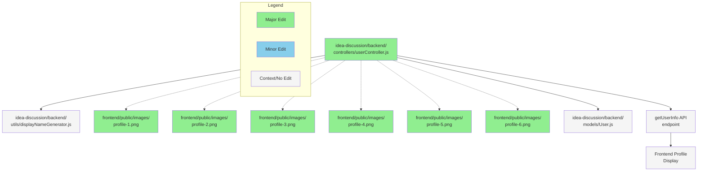

# GitHub レポート: digitaldemocracy2030/idobata

期間: 2025-07-30T12:38:01.200157+09:00 から 2025-08-06T12:38:01.200157+09:00 まで

## Issues

### 過去7日間に完了されたissue (0件)

### 過去7日間に作成されたissue (1件)

### [ユーザが投稿した意見を、X等に投稿してみんなで議論できるようにする](https://github.com/digitaldemocracy2030/idobata/issues/441)

**作成者:** FigureSkateIT  
**作成日:** 2025-07-30T11:16:29Z  
**内容:**

## 🎯 解決・改善したいこと

現在、投稿された意見は専用UI上でしか確認できず、本システムの利用者、すなわち政策に強い関心を持つ層に限定されています。

一方で、ライトユーザー層にとって、自分で意見を投稿することはハードルが高いですが、「いいね！」やリツイートといったアクションは比較的容易です。

そこで、ユーザーが投稿した意見が **公式X（旧Twitter）に自動投稿される仕組み**を導入することで、公式Xの認知度を生かして**非ユーザー層も巻き込んだ議論と共感の拡散**を可能にしたいと考えています。

---

## 💡 実現方法・実装方針（概要）

### 🔧 前提条件
- 各主催者が管理画面から公式Xアカウントを連携設定できる仕組みを整備する。

### ⚙️ 処理フロー（イベント駆動型）
1. ユーザーがAIとの対話を通じて意見を投稿し、DBに保存。
2. イベントトリガーにより、連携済みの公式Xアカウントで意見に関する投稿を自動作成。
3. ユーザーには「公式Xに投稿された旨」が通知され、リンクから確認できる。

---

## 👤 利用者別の体験イメージ

### 🔹 管理者
- テーマに関する意見募集をXで発信。
- いどばたで投稿された意見が自動でXにも投稿される。
- いいねやRT数で注目意見を選定し、議論・フィードバック。
- Xの反応から、非ユーザー層の意見も収集できる。

### 🔹 意見投稿ユーザー
- いどばた上でAIと会話して意見を投稿。
- 自身の意見が公式Xに掲載されたことを確認。
- リツイートやいいねがつくことで社会貢献の実感を得られる。
- 反応を参考に意見のブラッシュアップも可能。

### 🔹 ライトユーザー
- 公式Xアカウントをフォロー。
- 他ユーザーの意見投稿がタイムラインに流れてくる。
- 共感した意見には「いいね」や「リツイート」で参加。

---

## ✅ 期待される効果

- 意見投稿者が社会との接点を実感し、投稿意欲が向上。
- Xを通じた「共感の可視化」により、意見の注目度が上がる。
- 異なる立場からの意見やフィードバックにより、議論の質が向上。

---

## 🖥 画面・UI案

| 機能 | 内容 |
|------|------|
| 管理者画面 | 公式Xアカウントの紐づけ機能を追加。 |
| AIチャット画面 | 投稿完了後、「公式Xに投稿されました！」のポップアップ表示＋リンク遷移。 |
| 公式X投稿 | お題、意見タイトル、意見URLを含む投稿。 |
| 意見表示ページ | 非ユーザーも閲覧可能。公式Xの該当ツイートURLも表示。 |

---

## 📝 投稿例（Xでの自動生成イメージ）
```
🎯「子育て・少子化」へ意見が投稿されました！
🚩タイトル：若いカップルの不動産取得支援
https://example.com/opinion/12345

#いどばた　#少子化　#子育て　
```

## 🧩 補足検討（今後の課題）

- 投稿前にユーザー確認を求めるか（承諾画面など）。
- 投稿内容の文字数制御、URL短縮などの整形処理。
- 誹謗中傷や炎上リスクへのモデレーション対応（通報・削除機能）。
- ハッシュタグの自動生成の仕組み
- 公式Xから投稿する場合、APIからの投稿制限があるため、利用数に応じたX課金が必要。
---

**コメント:** なし

---

### 過去7日間に更新されたissue（作成・クローズを除く）(0件)

## Pull Requests

### 過去7日間にマージされたPR (5件)

### [Update: チャット数を表示](https://github.com/digitaldemocracy2030/idobata/pull/446)

**作成者:** jujunjun110  
**作成日:** 2025-08-04T14:54:04Z  
**変更:** +46 -0 (1ファイル)  
**マージ日:** 2025-08-04T14:58:00Z  
**内容:**

# 変更の概要
statsを表示できるようにした

# スクリーンショット


# 変更の背景
ウタコデザインの実装

# 関連Issue
<!-- 関連するIssueのリンクをこちらに記載してください -->

# CLAへの同意
本リポジトリへのコントリビュートには、[コントリビューターライセンス契約（CLA）](https://github.com/digitaldemocracy2030/idobata/blob/main/CLA.md)に同意することが必須です。

内容をお読みいただき、下記のチェックボックスにチェックをつける（"- [ ]" を "- [x]" に書き換える）ことで同意したものとみなします。

- [x] CLAの内容を読み、同意しました


**コメント:** なし

---

### [Feature/question detail](https://github.com/digitaldemocracy2030/idobata/pull/445)

**作成者:** jujunjun110  
**作成日:** 2025-08-04T06:01:40Z  
**変更:** +1015 -537 (20ファイル)  
**マージ日:** 2025-08-04T06:01:47Z  
**内容:**

# 変更の概要
テーマ詳細ページのデザインを実装完了した

# スクリーンショット
<!-- UIの変更を伴う場合は、変更前後のスクリーンショットもしくはgif画像をこちらに記載してください -->

# 変更の背景
ウタコデザインの反映

# 関連Issue
<!-- 関連するIssueのリンクをこちらに記載してください -->

# CLAへの同意
本リポジトリへのコントリビュートには、[コントリビューターライセンス契約（CLA）](https://github.com/digitaldemocracy2030/idobata/blob/main/CLA.md)に同意することが必須です。

内容をお読みいただき、下記のチェックボックスにチェックをつける（"- [ ]" を "- [x]" に書き換える）ことで同意したものとみなします。

- [x] CLAの内容を読み、同意しました


**コメント:** なし

---

### [使い方ページを実装した](https://github.com/digitaldemocracy2030/idobata/pull/443)

**作成者:** spinute  
**作成日:** 2025-08-02T07:22:00Z  
**変更:** +254 -1 (14ファイル)  
**マージ日:** 2025-08-02T07:31:32Z  
**内容:**

# 変更の概要

https://dd2030.slack.com/archives/C08FF5MM59C/p1752389240178989?thread_ts=1752389192.988569&cid=C08FF5MM59C でデザインした、いどばたビジョンの UI を洗練したバージョン（v1 と読んでいる）の使い方ページをざっくり実装した。

デザイン細部（スペーシングやパンくずリストの共通デザイン等）は見た目変ではない程度には整えつつ、別ページとの一貫性踏まえて最終調整したほうが良さそうなので、figma のデザインに揃っていないところも割とある

# スクリーンショット


# 変更の背景
<!-- ここに変更が必要となった背景を記載してください -->

# 関連Issue
<!-- 関連するIssueのリンクをこちらに記載してください -->

# CLAへの同意
本リポジトリへのコントリビュートには、[コントリビューターライセンス契約（CLA）](https://github.com/digitaldemocracy2030/idobata/blob/main/CLA.md)に同意することが必須です。

内容をお読みいただき、下記のチェックボックスにチェックをつける（"- [ ]" を "- [x]" に書き換える）ことで同意したものとみなします。

- [x] CLAの内容を読み、同意しました


**コメント:** なし

---

### [Update: breadcrumb](https://github.com/digitaldemocracy2030/idobata/pull/442)

**作成者:** jujunjun110  
**作成日:** 2025-07-30T13:28:52Z  
**変更:** +34 -22 (7ファイル)  
**マージ日:** 2025-07-30T13:30:29Z  
**内容:**

# 変更の概要
パンくずのデザインを修正

# スクリーンショット


# 変更の背景
ウタコデザイン

# 関連Issue
<!-- 関連するIssueのリンクをこちらに記載してください -->

# CLAへの同意
本リポジトリへのコントリビュートには、[コントリビューターライセンス契約（CLA）](https://github.com/digitaldemocracy2030/idobata/blob/main/CLA.md)に同意することが必須です。

内容をお読みいただき、下記のチェックボックスにチェックをつける（"- [ ]" を "- [x]" に書き換える）ことで同意したものとみなします。

- [x] CLAの内容を読み、同意しました


**コメント:** なし

---

### [implement idobata vision top page for v1](https://github.com/digitaldemocracy2030/idobata/pull/440)

**作成者:** spinute  
**作成日:** 2025-07-27T18:58:02Z  
**変更:** +998 -151 (20ファイル)  
**マージ日:** 2025-07-30T07:26:33Z  
**内容:**

# 変更の概要
<!-- ここに変更の概要を記載してください -->

https://dd2030.slack.com/archives/C08FF5MM59C/p1752389240178989?thread_ts=1752389192.988569&cid=C08FF5MM59C でデザインした、いどばたビジョンの UI を洗練したバージョン（v1 と読んでいる）のトップページをざっくり実装した

マイナーな機能（並び替え機能やヘルプなど）がまだ実装されていなかったり、UI の作り込みが甘かったりするが、概ね動く状態

# スクリーンショット
<!-- UIの変更を伴う場合は、変更前後のスクリーンショットもしくはgif画像をこちらに記載してください -->


# 変更の背景
<!-- ここに変更が必要となった背景を記載してください -->

# 関連Issue
<!-- 関連するIssueのリンクをこちらに記載してください -->

# CLAへの同意
本リポジトリへのコントリビュートには、[コントリビューターライセンス契約（CLA）](https://github.com/digitaldemocracy2030/idobata/blob/main/CLA.md)に同意することが必須です。

内容をお読みいただき、下記のチェックボックスにチェックをつける（"- [ ]" を "- [x]" に書き換える）ことで同意したものとみなします。

- [x] CLAの内容を読み、同意しました


**コメント:** なし

---

### 過去7日間に作成されたPR (3件)

### [refactor: 使用していない crypto を削除](https://github.com/digitaldemocracy2030/idobata/pull/448)

**作成者:** noritaka1166  
**作成日:** 2025-08-04T15:40:36Z  
**変更:** +1 -11 (3ファイル)  
**内容:**

# 変更の概要
使用していない crypto を削除

# スクリーンショット
なし

# 変更の背景
npm i 実行時に、cryptoパッケージを使用せずに node の crypto  を使うようにワーニングが出ていた。  
確認したところ、そもそも crypto を使っていないようだったので対応。

# 関連Issue
なし

# CLAへの同意
本リポジトリへのコントリビュートには、[コントリビューターライセンス契約（CLA）](https://github.com/digitaldemocracy2030/idobata/blob/main/CLA.md)に同意することが必須です。

内容をお読みいただき、下記のチェックボックスにチェックをつける（"- [ ]" を "- [x]" に書き換える）ことで同意したものとみなします。

- [x] CLAの内容を読み、同意しました


**コメント:** なし

---

### [chore:  idea-discussion 内の不要な devDependencies を削除](https://github.com/digitaldemocracy2030/idobata/pull/447)

**作成者:** noritaka1166  
**作成日:** 2025-08-04T15:26:43Z  
**変更:** +0 -22 (2ファイル)  
**内容:**

# 変更の概要
idea-discussion 内の不要な devDependencies を削除
- 元のパッケージ自体に型が含まれるようになったため不要
  - <https://www.npmjs.com/package/@types/mongoose> 
  - <https://www.npmjs.com/package/@types/bcryptjs>

# スクリーンショット
なし

# 変更の背景
npm install 時に deprecated のワーニングが出ていたため対応

# 関連Issue
なし

# CLAへの同意
本リポジトリへのコントリビュートには、[コントリビューターライセンス契約（CLA）](https://github.com/digitaldemocracy2030/idobata/blob/main/CLA.md)に同意することが必須です。

内容をお読みいただき、下記のチェックボックスにチェックをつける（"- [ ]" を "- [x]" に書き換える）ことで同意したものとみなします。

- [x] CLAの内容を読み、同意しました


**コメント:** なし

---

### [Adjust merge vision UI to main](https://github.com/digitaldemocracy2030/idobata/pull/444)

**作成者:** jujunjun110  
**作成日:** 2025-08-03T05:10:45Z  
**変更:** +1352 -313 (41ファイル)  
**内容:**

# 変更の概要
gitの差分の挙動を理解するためのテストのPR作成です

# スクリーンショット
<!-- UIの変更を伴う場合は、変更前後のスクリーンショットもしくはgif画像をこちらに記載してください -->

# 変更の背景
<!-- ここに変更が必要となった背景を記載してください -->

# 関連Issue
<!-- 関連するIssueのリンクをこちらに記載してください -->

# CLAへの同意
本リポジトリへのコントリビュートには、[コントリビューターライセンス契約（CLA）](https://github.com/digitaldemocracy2030/idobata/blob/main/CLA.md)に同意することが必須です。

内容をお読みいただき、下記のチェックボックスにチェックをつける（"- [ ]" を "- [x]" に書き換える）ことで同意したものとみなします。

- [x] CLAの内容を読み、同意しました


**コメント:** なし

---

### 過去7日間に更新されたPR（作成・マージを除く）(2件)

### [import_comments.pyのエンドポイント修正](https://github.com/digitaldemocracy2030/idobata/pull/432)

**作成者:** nishidashib  
**作成日:** 2025-07-23T09:19:03Z  
**変更:** +1 -1 (1ファイル)  
**内容:**

# 変更の概要
<!-- ここに変更の概要を記載してください -->
endpointで使用している変数に誤りがあった。
# スクリーンショット
<!-- UIの変更を伴う場合は、変更前後のスクリーンショットもしくはgif画像をこちらに記載してください -->

# 変更の背景
テストデータをこのスクリプトを使ってuploadしようとした時に動作しなかったため。
<!-- ここに変更が必要となった背景を記載してください -->

# 関連Issue
<!-- 関連するIssueのリンクをこちらに記載してください -->

# CLAへの同意
本リポジトリへのコントリビュートには、[コントリビューターライセンス契約（CLA）](https://github.com/digitaldemocracy2030/idobata/blob/main/CLA.md)に同意することが必須です。

内容をお読みいただき、下記のチェックボックスにチェックをつける（"- [ ]" を "- [x]" に書き換える）ことで同意したものとみなします。

- [x] CLAの内容を読み、同意しました


**コメント:** なし

---

### [Add random profile image assignment for new user accounts](https://github.com/digitaldemocracy2030/idobata/pull/425)

**作成者:** Shutaro+Devin  
**作成日:** 2025-07-13T09:04:49Z  
**変更:** +18 -2 (7ファイル)  
**内容:**


# Add random profile image assignment for new user accounts

## Summary

This PR implements random profile image assignment for new user accounts alongside the existing random display name generation. When a new user is created, they are now assigned both a random display name (existing functionality) and a random profile image from a set of 6 predefined avatar images.

**Key Changes:**
- Added 6 colorful avatar images to `frontend/public/images/` (profile-1.png through profile-6.png)
- Enhanced `userController.js` with `generateRandomProfileImage()` function
- Updated both MongoDB and in-memory user creation paths to assign random profile images
- Maintains backward compatibility with existing users

## Review & Testing Checklist for Human

**⚠️ Medium Risk - 4 items to verify:**

- [ ] **End-to-end user creation test**: Create new user accounts and verify they receive random profile images that load correctly in the frontend UI
- [ ] **Static file serving**: Confirm that the 6 new profile images in `frontend/public/images/` are accessible via HTTP requests (e.g., `http://localhost:3000/images/profile-1.png`)
- [ ] **Storage consistency**: Test user creation with both MongoDB available and MongoDB unavailable (in-memory fallback) to ensure both paths work correctly
- [ ] **Existing user compatibility**: Verify that existing users with `profileImagePath: null` continue to work without breaking the frontend

**Recommended Test Plan:**
1. Start the application locally
2. Create 3-5 new user accounts and observe their assigned profile images
3. Verify images display correctly in the chat interface and user profiles
4. Test with different browser sessions to ensure randomization is working
5. Check network tab to confirm image requests return 200 status codes

---

### Diagram



### Notes

- The profile image paths are hardcoded as `/images/profile-X.png` to match the frontend's static file serving convention
- Random selection uses `Math.floor(Math.random() * PROFILE_IMAGES.length)` for uniform distribution
- Both MongoDB and in-memory storage paths have been updated to maintain consistency
- Existing `generateRandomDisplayName()` functionality remains unchanged
- **Session Info**: Requested by @blu3mo, implemented in Devin session: https://app.devin.ai/sessions/cd76e2e3f7274fa2898e584fa83e0159

**⚠️ Important**: I was unable to fully test the end-to-end functionality locally due to environment configuration issues, so human verification of the complete user flow is especially important.


**コメント:** なし

---

