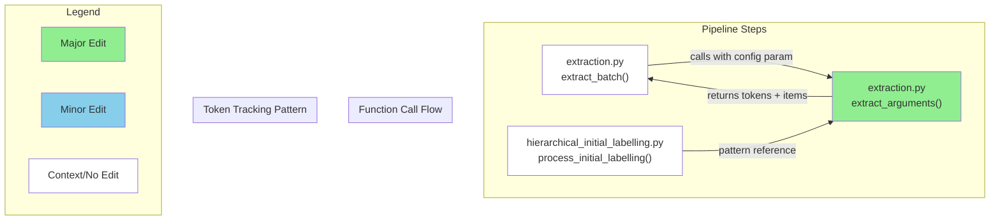

# GitHub レポート: digitaldemocracy2030/kouchou-ai

期間: 2025-07-30T12:37:51.672330+09:00 から 2025-08-06T12:37:51.672330+09:00 まで

## Issues

### 過去7日間に完了されたissue (3件)

### [[FEATURE] レポート管理画面の意見グループ数の表記を変更する](https://github.com/digitaldemocracy2030/kouchou-ai/issues/687)

**作成者:** shgtkshruch  
**作成日:** 2025-08-03T08:18:57Z  
**内容:**

# 背景
<!-- なぜその機能が必要なのか、何が改善されるのか具体的に記入してください -->

- レポート管理画面の「意見グループ」の数値を、Analysis の右の数値を表示している
  - 最終的な意見グループ数は右の数値を想定した
  
  
- 実際は、最終的な意見グループ数は左の数値だった
  > NISHIO Hirokazu
  > 10→100は「データをまず100件にまとめた後、近いものを順にくっつけて行って10件にした」という意味です。
処理の流れとしては矢印が逆なのですが、安野さんが「ユーザが見るのは10→100の順なのだからこっちがいい」というのでこうなってます

# 提案内容
<!-- 実装案やデザイン案があれば記入してください -->

- レポート管理画面の「意見グループ」の数値を、Analysis の左の数値に変更する

# 参考情報
- 実装時のFigma のコメント: https://www.figma.com/design/ZImSumdtUme9loVY5CejWX?node-id=1-2#1327283299

**コメント:** なし

---

### [[FEATURE]onChangeでの自動修正が入力の妨げになる](https://github.com/digitaldemocracy2030/kouchou-ai/issues/640)

**作成者:** nishio  
**作成日:** 2025-07-08T09:07:51Z  
**内容:**

# 背景
<!-- なぜその機能が必要なのか、何が改善されるのか具体的に記入してください -->

> クラスタ数の設定フォームが多分onChangeでvalidationをかけてくるけど、たとえば20を12に変えようとしたときに1を入力した時点で2に修正されて入力困難になるのでonBlurとかがいいと思います

https://dd2030.slack.com/archives/C08F7JZPD63/p1751948152974389

# 提案内容
<!-- 実装案やデザイン案があれば記入してください -->
onBlurに変えるといいのではと思っているが未検証。「ユーザの入力の妨げにならない適切な修正方法」を特定することが必要です。

**コメント:** なし

---

### [[FEATURE] .env 書き換えた際に Docker build を忘れやすい](https://github.com/digitaldemocracy2030/kouchou-ai/issues/594)

**作成者:** shingo-ohki  
**作成日:** 2025-06-06T13:39:40Z  
**内容:**

# 背景
<!-- なぜその機能が必要なのか、何が改善されるのか具体的に記入してください -->
タイトル通り。既に複数人が経験しているため、何かできることはないか？

> 環境変数（.env）を編集した場合は、docker compose down を実行した後、 docker compose up --build を実行してアプリケーションを起動してください
一部の環境変数は Docker イメージのビルド時に埋め込まれているため、環境変数を変更した場合はビルドの再実行が必要となります

[README](https://github.com/digitaldemocracy2030/kouchou-ai/blob/main/README.md?plain=1#L62-L63
)にはすでに記載がある

# 提案内容
<!-- 実装案やデザイン案があれば記入してください -->
例）.env のファイルハッシュを取得して差分検知し、差分があったら build するようにするとか？

**コメント:** なし

---

### 過去7日間に作成されたissue (3件)

### [[REFACTOR] ts-node-dev はメンテナンスされなくなっているようなので別パッケージに変えたほうがいいかもしれない](https://github.com/digitaldemocracy2030/kouchou-ai/issues/690)

**作成者:** noritaka1166  
**作成日:** 2025-08-05T10:06:06Z  
**内容:**

# 現在の問題点
client-static-build で使用している [ts-node-dev](https://www.npmjs.com/package/ts-node-dev) ですが、  
最終更新から 3年以上経過しています。  
メンテナンスされているかを issue で確認している方がいて、ownerが別のパッケージを勧めているように見えるため、別パッケージに変えたほうがいいかもしれません。
<https://github.com/wclr/ts-node-dev/issues/348>

# 提案内容
個人的には [nodemon](https://www.npmjs.com/package/nodemon) を使用するのがいいのではないかと思っていますが、  
ts-node-dev の owner がおすすめしている [tsx](https://www.npmjs.com/package/tsx) を使うのもいいかもしれません。


**コメント:** なし

---

### [[BUG] リモート環境でのHTTPアクセス時に発生するCSPおよびJavaScriptエラーについて](https://github.com/digitaldemocracy2030/kouchou-ai/issues/685)

**作成者:** ivan-stout  
**作成日:** 2025-08-01T05:47:15Z  
**内容:**

### 概要

リモートサーバーにデプロイしたアプリケーションに、HTTP経由でパブリックIPアドレスを使用してアクセスすると、複数のエラーが発生して正常に動作しないようです。主な原因として、非セキュアなコンテキストで`crypto.randomUUID`関数が無効になることによるJavaScriptエラーと、厳格なContent Security Policy (CSP)により必要なリソースの読み込みがブロックされる問題が考えられます。また、画像URLの生成ロジックにも不具合があるようです。

### 再現手順

1. `docker compose` を使用して、リモートサーバーにアプリケーションをデプロイする。
2. `.env` ファイルに、サーバーのパブリックIPアドレスを `NEXT_PUBLIC_API_BASEPATH` と `NEXT_PUBLIC_SITE_URL` に設定する。
3. ウェブブラウザからパブリックIPアドレス (`http://<your_server_ip>:3000` または `http://<your_server_ip>:4000`) を使用してアプリケーションにアクセスする。
4. ブラウザの開発者コンソールを開き、エラーを確認する。

### 期待する動作

アプリケーションが、設定されたパブリックIPアドレスを介してHTTPでアクセスされた場合でも、JavaScriptエラーやCSP違反を発生させることなく、正常に読み込まれ、機能すること。

### スクリーンショット・ログ

発生した主なエラーは以下の通りです。

**1. JavaScriptのクラッシュを引き起こす`crypto.randomUUID`エラー**
```
Uncaught TypeError: crypto.randomUUID is not a function
    at ec (page-e894ce97fa4cefba.js:1:18309)
    ...
```

**2. Content Security Policy違反によるリソース読み込みエラー**
```
Refused to load the image 'http://18.233.19.158:8000/meta/icon.png' because it violates the following Content Security Policy directive: "img-src 'self' data:".
```

### ご参考：動作確認のための修正案 (git diff)

```diff
diff --git a/client-admin/app/layout.tsx b/client-admin/app/layout.tsx
index 1fb5a81..89e892e 100644
--- a/client-admin/app/layout.tsx
+++ b/client-admin/app/layout.tsx
@@ -21,6 +21,23 @@ export default function RootLayout({ children }: Readonly<{ children: React.Reac
   return (
     <html suppressHydrationWarning lang={"ja"}>
       <head>
+        <script
+          dangerouslySetInnerHTML={{
+            __html: `
+              if (typeof window !== 'undefined' && !window.crypto) {
+                window.crypto = {};
+              }
+              if (typeof window !== 'undefined' && !window.crypto.randomUUID) {
+                window.crypto.randomUUID = () => {
+                  return 'xxxxxxxx-xxxx-4xxx-yxxx-xxxxxxxxxxxx'.replace(/[xy]/g, function(c) {
+                    var r = Math.random() * 16 | 0, v = c == 'x' ? r : (r & 0x3 | 0x8);
+                    return v.toString(16);
+                  });
+                };
+              }
+            `,
+          }}
+        />
         <link rel="preconnect" href="https://fonts.googleapis.com" />
         <link rel="preconnect" href="https://fonts.gstatic.com" crossOrigin="anonymous" />
         <link href="https://fonts.googleapis.com/css2?family=BIZ+UDPGothic&display=swap" rel="stylesheet" />
diff --git a/client-admin/next.config.ts b/client-admin/next.config.ts
index a481870..3f280a4 100644
--- a/client-admin/next.config.ts
+++ b/client-admin/next.config.ts
@@ -4,6 +4,19 @@ const nextConfig: NextConfig = {
   experimental: {
     optimizePackageImports: ["@chakra-ui/react"],
   },
+  async headers() {
+    return [
+      {
+        source: '/:path*',
+        headers: [
+          {
+            key: 'Content-Security-Policy',
+            value: "default-src 'self'; script-src 'self' 'unsafe-eval' 'unsafe-inline' https://fonts.googleapis.com; style-src 'self' 'unsafe-inline' https://fonts.googleapis.com; img-src 'self' data: http://18.233.19.158:8000; font-src 'self' https://fonts.gstatic.com; connect-src 'self' http://18.233.19.158:8000;",
+          },
+        ],
+      },
+    ];
+  },
 };
 
 export default nextConfig;
diff --git a/client/app/utils/image-src.ts b/client/app/utils/image-src.ts
index aefa36e..a7af5a7 100644
--- a/client/app/utils/image-src.ts
+++ b/client/app/utils/image-src.ts
@@ -62,7 +62,7 @@ export const getImageFromServerSrc = (src: string): string => {
     }
 
     // パスが / で始まることを確認
-    const normalizedSrc = src.startsWith("/") ? src : `/${src}`;
-    return `${basePath}${normalizedSrc}`;
+    const normalizedSrc = src.startsWith("/") ? src.substring(1) : src;
+    return `${basePath}/${normalizedSrc}`;
   }
 };
```

### 修正に関する注意点

上記の修正案は、今回の環境で問題の回避を確認できたものですが、あくまでご参考としてお考え下さい。恒久的な対策としては、セキュリティリスクを導入しないよう、より詳細な調査が必要になる可能性があります。 

**コメント:** なし

---

### [[BUG] 静的ファイル出力時に公開状態のレポートがない場合にエラーとなる](https://github.com/digitaldemocracy2030/kouchou-ai/issues/683)

**作成者:** shingo-ohki  
**作成日:** 2025-07-31T01:14:24Z  
**内容:**

### 概要

<!-- バグの簡潔な説明をお願いします -->
公開状態のレポートがない状態で、[静的ファイル出力](https://github.com/digitaldemocracy2030/kouchou-ai?tab=readme-ov-file#%E9%9D%99%E7%9A%84%E3%83%95%E3%82%A1%E3%82%A4%E3%83%AB%E5%87%BA%E5%8A%9B)を行うとエラーが出る。


### 再現手順

1. レポートを生成する
2. すべてのレポートを「公開」以外の状態にする
3. [静的ファイル出力](https://github.com/digitaldemocracy2030/kouchou-ai?tab=readme-ov-file#%E9%9D%99%E7%9A%84%E3%83%95%E3%82%A1%E3%82%A4%E3%83%AB%E5%87%BA%E5%8A%9B)を行う

または、レポートがない状態で 3 を行う。

### 期待する動作

<!-- 本来どう動作すべきかを記入してください -->
例えば以下などが考えられるが、どうすべきかは議論が必要そう
- 適切なエラー（「公開状態のレポートがないためレポートを静的出力できません」etc.）を表示する
- 公開状態にかかわらず静的レポートを出力できるようにする

### スクリーンショット・ログ

<!-- 必要に応じてスクリーンショットやエラーログなどを添付してください -->

```
❯ make client-build-static
rm -rf out
docker compose up -d --wait api
[+] Running 1/1
 ✔ Container kouchou-ai-api-1  Healthy                                                                                        0.5s 
docker compose run --rm -e BASE_PATH= -e NEXT_PUBLIC_OUTPUT_MODE=export -v /home/tizze/program/digital-democracy/kouchou-ai/server:/server -v /home/tizze/program/digital-democracy/kouchou-ai/out:/app/dist client sh -c "npm run build:static && cp -r out/* dist && touch dist/.nojekyll"
[+] Creating 1/1
 ✔ Container kouchou-ai-api-1  Running                                                                                        0.0s 

> kouchou-ai-client@0.1.0 prebuild:static
> npm run copy-image && NEXT_PUBLIC_OUTPUT_MODE=export npm run rename-file


> kouchou-ai-client@0.1.0 copy-image
> node scripts/copy-image.mjs

Copied from default: icon.png
Copied from default: reporter.png
Copied from default: ogp.png
✅ All images copied successfully.

> kouchou-ai-client@0.1.0 rename-file
> node scripts/rename-file.mjs rename

Renamed: app/[slug]/opengraph-image.tsx → _opengraph-image.tsx

> kouchou-ai-client@0.1.0 build:static
> NEXT_PUBLIC_OUTPUT_MODE=export next build

   ▲ Next.js 15.2.3

   Creating an optimized production build ...
 ✓ Compiled successfully
 ✓ Linting and checking validity of types    

> Build error occurred
[Error: Page "/[slug]/opengraph-image.png" is missing "generateStaticParams()" so it cannot be used with "output: export" config.]
npm notice
```
### その他

<!-- 追加で伝えておきたいことがあれば記入してください -->
[BUG] scripts/fetch_reports.pyでは「限定公開」「非公開」状態のレポートがバックアップできない #629 
も似た話

**コメント:** なし

---

### 過去7日間に更新されたissue（作成・クローズを除く）(3件)

### [[BUG] main へマージ時に DD2030 の azure 環境へのデプロイが失敗する](https://github.com/digitaldemocracy2030/kouchou-ai/issues/682)

**作成者:** shingo-ohki  
**作成日:** 2025-07-29T01:36:13Z  
**内容:**

### 概要

https://github.com/digitaldemocracy2030/kouchou-ai/pull/642 で main にマージされるたびに DD2030 の Azure 環境に deploy されるようにしたがエラーが発生する

<!-- バグの簡潔な説明をお願いします -->

### 再現手順

1.  main ブランチにコードがマージされる

### 期待する動作

<!-- 本来どう動作すべきかを記入してください -->

### スクリーンショット・ログ
出力されているログ
https://github.com/digitaldemocracy2030/kouchou-ai/actions/runs/16584250059/job/46906413136

```
...
Error: The subscription of '79e8ef5-7461-407d-84b6-b4f37b9f31c1' doesn't exist in cloud 'AzureCloud'.

Error: Login failed with Error: The process '/usr/bin/az' failed with exit code 1. Double check if the 'auth-type' is correct. Refer to https://github.com/Azure/login#readme for more information.
```
<!-- 必要に応じてスクリーンショットやエラーログなどを添付してください -->


**コメント:** なし

---

### [[FEATURE][design] headerにプロダクト名を表示する](https://github.com/digitaldemocracy2030/kouchou-ai/issues/441)

**作成者:** UtkNggc  
**作成日:** 2025-05-06T11:13:43Z  
**内容:**

# 背景
<!-- なぜその機能が必要なのか、何が改善されるのか具体的に記入してください -->
現在、header左の部分が「デジタル民主主義2030」になっている。
デジタル民主主義2030は、複数プロダクトを含むプロジェクト名なので、
プロダクト内のheaderではプロダクト名を表記したい。

# 提案内容
<!-- 実装案やデザイン案があれば記入してください -->
・メイン「広聴AI」
・サブ「part of project デジタル民主主義2030」
で画像作成しました。こちらに変えていただくのはいかがでしょう。

▼Figma
https://www.figma.com/design/ZImSumdtUme9loVY5CejWX/%E5%BA%83%E8%81%B4AI%EF%BC%88%E3%83%87%E3%82%B8%E6%B0%912030%EF%BC%89?node-id=176-458&t=PgvCDEqVEw2sn016-11

■設計意図
・ロゴ制作するには時間がかかるので、現時点では取り急ぎフラットなフォントで作成。
・現在のロゴサイズと同じサイズで作成したので、画像のリンク先を変えていただくだけで実装完了いただける見込み。

# ご相談したいこと
「part of project」がしっくりきてない気がする。。もっとふさわしいものがないか。


**コメント:** なし

---

### [[FEATURE]用語解説ページをつける](https://github.com/digitaldemocracy2030/kouchou-ai/issues/111)

**作成者:** nishio  
**作成日:** 2025-03-20T12:07:35Z  
**内容:**

# 背景
「プロンプト」「埋め込み」「濃い(クラスタ)」について、単語レベルで言い換えてもわかりやすくならない気がするので、やるとしたら用語解説ページをつけるとかかな

「縦軸・横軸はなんだろう」についても解説

# 提案内容
<!-- 実装案やデザイン案があれば記入してください -->

**コメント:** なし

---

## Pull Requests

### 過去7日間にマージされたPR (7件)

### [refactor: 不要なアサーションと未使用のimportの削除](https://github.com/digitaldemocracy2030/kouchou-ai/pull/691)

**作成者:** noritaka1166  
**作成日:** 2025-08-05T14:46:25Z  
**変更:** +4 -4 (3ファイル)  
**マージ日:** 2025-08-06T00:41:18Z  
**内容:**

# 変更の概要
- 不要なアサーションの削除
- 未使用のimportの削除

# スクリーンショット
なし

# 変更の背景
- 不要なアサーションと未使用のimportを見つけたため

# 関連Issue
なし

# 動作確認の結果
buildができることを確認済

# CLAへの同意
- 本リポジトリへのコントリビュートには、[コントリビューターライセンス契約（CLA）](https://github.com/digitaldemocracy2030/kouchou-ai/blob/main/CLA.md)に同意することが必須です。
内容をお読みいただき、下記のチェックボックスにチェックをつける（"- [ ]" を "- [x]" に書き換える）ことで同意したものとみなします。

- [x] CLAの内容を読み、同意しました

# マージ前のチェックリスト（レビュアーがマージ前に確認してください）
- [ ] CIが全て通過している
- [ ] 単体テストが実装されているか
- [ ] 今回実装した機能および影響を受けると思われる機能について、適切な動作確認が行われているかを確認する。


動作確認の項目については、実装者による動作確認のケースが適切かを確認してください。
必要に応じてレビュアー自身による動作確認も歓迎します（必須ではありません）。

<!-- This is an auto-generated comment: release notes by coderabbit.ai -->

## Summary by CodeRabbit

* **リファクタリング**
  * 不要な型アサーションを削除し、コードを簡素化しました。  
  * インポート文から未使用のコンポーネントを削除しました。

<!-- end of auto-generated comment: release notes by coderabbit.ai -->

**コメント:** なし

---

### [[api] レポート管理画面の意見グループ数の表記を変更する](https://github.com/digitaldemocracy2030/kouchou-ai/pull/689)

**作成者:** shgtkshruch  
**作成日:** 2025-08-04T12:17:11Z  
**変更:** +2 -2 (2ファイル)  
**マージ日:** 2025-08-05T07:21:45Z  
**内容:**

# 変更の概要
- 管理画面の意見グループの数値を分析 UI の左の数値に変更しました

# スクリーンショット


# 変更の背景
- 最終的な意見グループ数は分析 UI の右の数値を想定していたが、実際は左の数値だった

# 関連Issue
- fix: https://github.com/digitaldemocracy2030/kouchou-ai/issues/687

# 動作確認の結果
<!-- 実装者は動作確認の結果を記載してください（例: レポート作成を実行し、正常にレポートが作成されることを確認した） 複数の動作確認を行った場合は、それぞれの結果を記載してください -->

- 管理画面の意見グループの数値を分析 UI の右の数値になっていること

# CLAへの同意
- 本リポジトリへのコントリビュートには、[コントリビューターライセンス契約（CLA）](https://github.com/digitaldemocracy2030/kouchou-ai/blob/main/CLA.md)に同意することが必須です。
内容をお読みいただき、下記のチェックボックスにチェックをつける（"- [ ]" を "- [x]" に書き換える）ことで同意したものとみなします。

- [x] CLAの内容を読み、同意しました

# マージ前のチェックリスト（レビュアーがマージ前に確認してください）
- [x] CIが全て通過している
- [x] 単体テストが実装されているか
- [x] 今回実装した機能および影響を受けると思われる機能について、適切な動作確認が行われているかを確認する。


動作確認の項目については、実装者による動作確認のケースが適切かを確認してください。
必要に応じてレビュアー自身による動作確認も歓迎します（必須ではありません）。

<!-- This is an auto-generated comment: release notes by coderabbit.ai -->
## Summary by CodeRabbit

* **バグ修正**
  * クラスター数の集計基準がレベル2からレベル1に変更され、正しいクラスター数が表示されるようになりました。

* **テスト**
  * クラスター数の判定基準変更に伴い、関連するテストケースの期待値が更新されました。
<!-- end of auto-generated comment: release notes by coderabbit.ai -->

**コメント:** なし

---

### [crypto.randomUUID に統一](https://github.com/digitaldemocracy2030/kouchou-ai/pull/686)

**作成者:** noritaka1166  
**作成日:** 2025-08-02T16:42:48Z  
**変更:** +5 -21 (3ファイル)  
**マージ日:** 2025-08-05T07:12:17Z  
**内容:**

# 変更の概要
- uuidライブラリを削除し、crypto.randomUUID に統一

# スクリーンショット
- なし

# 変更の背景
- uuidライブラリ と crypto.randomUUID が混在しているため
- 管理するライブラリの数を減らしたいため

# 関連Issue
なし

# 動作確認の結果
レポート作成画面を表示し、IDに uuid が問題なく入っていること、リロードして再生成されることを確認済み

# CLAへの同意
- 本リポジトリへのコントリビュートには、[コントリビューターライセンス契約（CLA）](https://github.com/digitaldemocracy2030/kouchou-ai/blob/main/CLA.md)に同意することが必須です。
内容をお読みいただき、下記のチェックボックスにチェックをつける（"- [ ]" を "- [x]" に書き換える）ことで同意したものとみなします。

- [x] CLAの内容を読み、同意しました

# マージ前のチェックリスト（レビュアーがマージ前に確認してください）
- [ ] CIが全て通過している
- [ ] 単体テストが実装されているか
- [ ] 今回実装した機能および影響を受けると思われる機能について、適切な動作確認が行われているかを確認する。


動作確認の項目については、実装者による動作確認のケースが適切かを確認してください。
必要に応じてレビュアー自身による動作確認も歓迎します（必須ではありません）。

<!-- This is an auto-generated comment: release notes by coderabbit.ai -->

## Summary by CodeRabbit

* **改善**
  * UUID生成方法をネイティブの`crypto.randomUUID()`に変更し、より安全かつ最新の実装に更新しました。

* **メンテナンス**
  * 不要となった外部ライブラリ「uuid」を依存関係から削除しました。

<!-- end of auto-generated comment: release notes by coderabbit.ai -->

**コメント:** なし

---

### [docs: 静的エクスポートの実行前にレポートを「公開」状態にする必要があることを明記](https://github.com/digitaldemocracy2030/kouchou-ai/pull/684)

**作成者:** ttizze  
**作成日:** 2025-07-31T02:21:47Z  
**変更:** +3 -1 (1ファイル)  
**マージ日:** 2025-07-31T02:32:39Z  
**内容:**

# 変更の概要
- ここに変更の概要を記載してください

# スクリーンショット
- UIの変更を伴う場合は、変更前後のスクリーンショットもしくはgif画像をこちらに記載してください

# 変更の背景
- ここに変更が必要となった背景を記載してください

# 関連Issue
関連するIssueのリンクをこちらに記載してください

# 動作確認の結果
<!-- 実装者は動作確認の結果を記載してください（例: レポート作成を実行し、正常にレポートが作成されることを確認した） 複数の動作確認を行った場合は、それぞれの結果を記載してください -->

# CLAへの同意
- 本リポジトリへのコントリビュートには、[コントリビューターライセンス契約（CLA）](https://github.com/digitaldemocracy2030/kouchou-ai/blob/main/CLA.md)に同意することが必須です。
内容をお読みいただき、下記のチェックボックスにチェックをつける（"- [ ]" を "- [x]" に書き換える）ことで同意したものとみなします。

- [x] CLAの内容を読み、同意しました

# マージ前のチェックリスト（レビュアーがマージ前に確認してください）
- [ ] CIが全て通過している
- [ ] 単体テストが実装されているか
- [ ] 今回実装した機能および影響を受けると思われる機能について、適切な動作確認が行われているかを確認する。


動作確認の項目については、実装者による動作確認のケースが適切かを確認してください。
必要に応じてレビュアー自身による動作確認も歓迎します（必須ではありません）。

<!-- This is an auto-generated comment: release notes by coderabbit.ai -->

## Summary by CodeRabbit

* **ドキュメント**
  * GitHub Pagesホスティングガイドに、静的エクスポート実行前に全レポートを「公開」状態に設定する必要がある旨を追記しました。

<!-- end of auto-generated comment: release notes by coderabbit.ai -->

**コメント:** なし

---

### [[FEATURE]onChangeでの自動修正が入力の妨げになる](https://github.com/digitaldemocracy2030/kouchou-ai/pull/677)

**作成者:** mochizuki-pg  
**作成日:** 2025-07-26T09:18:07Z  
**変更:** +21 -8 (1ファイル)  
**マージ日:** 2025-08-05T02:44:57Z  
**内容:**

# 変更の概要
https://github.com/digitaldemocracy2030/kouchou-ai/issues/640

クラスタ数（意見グループ数）設定フォームのバリデーションタイミングを、onChangeからonBlurに変更しました。

# スクリーンショット
- UIの変更を伴う場合は、変更前後のスクリーンショットもしくはgif画像をこちらに記載してください

# 変更の背景
https://github.com/digitaldemocracy2030/kouchou-ai/issues/640

# 関連Issue
関連するIssueのリンクをこちらに記載してください

# 動作確認の結果

## 修正前
### `12` を入力しようとした場合、バリデーションが効いて 最小値 `2` になる
https://github.com/user-attachments/assets/9722926d-f7e7-4299-8b13-3c9c7c6222d8

## 修正後
### 入力が完了した後にバリデーションが発火する
https://github.com/user-attachments/assets/5df9b22e-645a-468c-a26c-3e7b071a16ee


# CLAへの同意
- 本リポジトリへのコントリビュートには、[コントリビューターライセンス契約（CLA）](https://github.com/digitaldemocracy2030/kouchou-ai/blob/main/CLA.md)に同意することが必須です。
内容をお読みいただき、下記のチェックボックスにチェックをつける（"- [ ]" を "- [x]" に書き換える）ことで同意したものとみなします。

- [x] CLAの内容を読み、同意しました

# マージ前のチェックリスト（レビュアーがマージ前に確認してください）
- [x] CIが全て通過している
- [ ] 単体テストが実装されているか
- [x] 今回実装した機能および影響を受けると思われる機能について、適切な動作確認が行われているかを確認する。


動作確認の項目については、実装者による動作確認のケースが適切かを確認してください。
必要に応じてレビュアー自身による動作確認も歓迎します（必須ではありません）。

<!-- This is an auto-generated comment: release notes by coderabbit.ai -->

## Summary by CodeRabbit

* **新機能**
  * 数値入力フィールドの入力体験が改善され、入力中の一時的な無効値や未完成の値も保持できるようになりました。入力確定時（フォーカスを外したとき）にのみ値が反映されます。
* **バグ修正**
  * 入力値の同期とバリデーションの動作が向上し、意図しない値のリセットや入力の不具合が軽減されました。

<!-- end of auto-generated comment: release notes by coderabbit.ai -->

**コメント:** なし

---

### [[client-admin] レポート作成のリクエストを Server Functions で実行する](https://github.com/digitaldemocracy2030/kouchou-ai/pull/676)

**作成者:** shgtkshruch  
**作成日:** 2025-07-25T12:25:52Z  
**変更:** +40 -33 (2ファイル)  
**マージ日:** 2025-07-30T09:00:33Z  
**内容:**


# 変更の概要
- client-admin でレポートを作成するリクエストを Server Functions で実行するようにしました
  - API キーがブラウザに露出しているのを改善するため

# スクリーンショット
- UI の変更はありません

# 変更の背景
- API キーがブラウザに露出しているため

# 関連Issue
- https://github.com/digitaldemocracy2030/kouchou-ai/issues/547

# 動作確認の結果
<!-- 実装者は動作確認の結果を記載してください（例: レポート作成を実行し、正常にレポートが作成されることを確認した） 複数の動作確認を行った場合は、それぞれの結果を記載してください -->

- レポートの作成ができること
- レポートを作成するリクエストに API key が乗っていないこと

# CLAへの同意
- 本リポジトリへのコントリビュートには、[コントリビューターライセンス契約（CLA）](https://github.com/digitaldemocracy2030/kouchou-ai/blob/main/CLA.md)に同意することが必須です。
内容をお読みいただき、下記のチェックボックスにチェックをつける（"- [ ]" を "- [x]" に書き換える）ことで同意したものとみなします。

- [x] CLAの内容を読み、同意しました

# マージ前のチェックリスト（レビュアーがマージ前に確認してください）
- [x] CIが全て通過している
- [ ] 単体テストが実装されているか
- [x] 今回実装した機能および影響を受けると思われる機能について、適切な動作確認が行われているかを確認する。


動作確認の項目については、実装者による動作確認のケースが適切かを確認してください。
必要に応じてレビュアー自身による動作確認も歓迎します（必須ではありません）。

<!-- This is an auto-generated comment: release notes by coderabbit.ai -->

## Summary by CodeRabbit

* **バグ修正**
  * レポート作成時のエラーハンドリングが改善され、失敗時に明確なエラーメッセージが表示されるようになりました。

* **リファクタリング**
  * レポート作成処理の結果判定が例外処理から戻り値による判定に変更され、操作後のフィードバックがより分かりやすくなりました。

<!-- end of auto-generated comment: release notes by coderabbit.ai -->

**コメント:** なし

---

### [Makefile 利用時に .env の自動更新を行う](https://github.com/digitaldemocracy2030/kouchou-ai/pull/675)

**作成者:** 101ta28  
**作成日:** 2025-07-25T02:54:39Z  
**変更:** +120 -5 (2ファイル)  
**マージ日:** 2025-08-05T02:34:04Z  
**内容:**

# 変更の概要
- Makefile に .env, .env.azure の変更チェック機能を追加
  - ハッシュファイル生成を行うため、ハッシュファイル生成先ディレクトリを.gitignoreに追加

# スクリーンショット
env ファイル変更あり


env ファイル変更なし


# 変更の背景
- fix: #594 

# 動作確認の結果
.env ファイルの変更後、`make up`, `make build`を実行することで環境変数の反映を確認
Azure環境でのチェックは**行えていない**ため、確認をお願いしたいです。
(ただ、行う処理自体は同じなので大きな影響はないと思います)

# CLAへの同意
- 本リポジトリへのコントリビュートには、[コントリビューターライセンス契約（CLA）](https://github.com/digitaldemocracy2030/kouchou-ai/blob/main/CLA.md)に同意することが必須です。
内容をお読みいただき、下記のチェックボックスにチェックをつける（"- [ ]" を "- [x]" に書き換える）ことで同意したものとみなします。

- [x] CLAの内容を読み、同意しました

# マージ前のチェックリスト（レビュアーがマージ前に確認してください）
- [ ] CIが全て通過している
- [ ] 単体テストが実装されているか
- [ ] 今回実装した機能および影響を受けると思われる機能について、適切な動作確認が行われているかを確認する。


動作確認の項目については、実装者による動作確認のケースが適切かを確認してください。
必要に応じてレビュアー自身による動作確認も歓迎します（必須ではありません）。

<!-- This is an auto-generated comment: release notes by coderabbit.ai -->
## Summary by CodeRabbit

* **新機能**
  * 環境ファイル（.env, .env.azure）の変更を自動検知し、変更時にビルドや起動時に再ビルドが実行されるようになりました。
  * 環境ファイルの変更状況を確認・更新・クリアする新しいコマンドが追加されました。

* **その他**
  * `.env-hashes` ディレクトリがGit管理対象外になりました。
<!-- end of auto-generated comment: release notes by coderabbit.ai -->

**コメント:** なし

---

### 過去7日間に作成されたPR (1件)

### [fix: Azure Deploy 時に client コンテナの環境変数が未設定になる](https://github.com/digitaldemocracy2030/kouchou-ai/pull/688)

**作成者:** shingo-ohki  
**作成日:** 2025-08-04T04:59:19Z  
**変更:** +61 -16 (1ファイル)  
**内容:**

# 変更の概要
- Azure デプロイ時のコンテナの環境変数の設定に不足があったため、これを修正します 
- Azure のコンテナ更新と環境変数の設定は同時に行うようにします

# 変更の背景
- #642 で azure へ deploy するワークフローを追加したが不十分な箇所があった

# 関連Issue
#682 

# 動作確認の結果
<!-- 実装者は動作確認の結果を記載してください（例: レポート作成を実行し、正常にレポートが作成されることを確認した） 複数の動作確認を行った場合は、それぞれの結果を記載してください -->

一時的にフォークしたリポジトリからワークフローを実行できるようにし、[こちら](https://github.com/digitaldemocracy2030/kouchou-ai/issues/682#issuecomment-3149067334)の問題が解消していることを確認しました。
Github Actions のワークフローログ
https://github.com/shingo-ohki/kouchou-ai/actions/runs/16715007751

# CLAへの同意
- 本リポジトリへのコントリビュートには、[コントリビューターライセンス契約（CLA）](https://github.com/digitaldemocracy2030/kouchou-ai/blob/main/CLA.md)に同意することが必須です。
内容をお読みいただき、下記のチェックボックスにチェックをつける（"- [ ]" を "- [x]" に書き換える）ことで同意したものとみなします。

- [x] CLAの内容を読み、同意しました

# マージ前のチェックリスト（レビュアーがマージ前に確認してください）
- [ ] CIが全て通過している
- [ ] 単体テストが実装されているか
- [ ] 今回実装した機能および影響を受けると思われる機能について、適切な動作確認が行われているかを確認する。


動作確認の項目については、実装者による動作確認のケースが適切かを確認してください。
必要に応じてレビュアー自身による動作確認も歓迎します（必須ではありません）。

<!-- This is an auto-generated comment: release notes by coderabbit.ai -->
## Summary by CodeRabbit


## Summary by CodeRabbit

* **Chores**
  * デプロイワークフローを更新し、すべてのコンテナ（api、client、client-admin、client-static-build）のシークレット登録と環境変数設定を並列で実行するよう改善しました。これによりデプロイの効率と安定性が向上します。

<!-- end of auto-generated comment: release notes by coderabbit.ai -->

**コメント:** なし

---

### 過去7日間に更新されたPR（作成・マージを除く）(2件)

### [OpenAI, OpenRouter の API KEY をフォームから入力してレポートを作成できるようにする](https://github.com/digitaldemocracy2030/kouchou-ai/pull/660)

**作成者:** Shingo Ohki+Devin  
**作成日:** 2025-07-13T13:21:05Z  
**変更:** +311 -47 (15ファイル)  
**内容:**


# Fix: Add Missing Config Parameter to extract_arguments Function

## Summary

This PR fixes a function signature inconsistency in the `extract_arguments` function in `extraction.py` where the function was being called with a `config` parameter but the function definition didn't accept it. The fix adds the missing `config=None` parameter and implements token usage tracking following the established pattern from other pipeline step files.

**Key Changes:**
- ✅ Added missing `config=None` parameter to `extract_arguments` function signature
- ✅ Implemented token usage tracking when `config` is provided, following the pattern from `hierarchical_initial_labelling.py`
- ✅ Maintains backward compatibility with `config=None` default
- 🔒 Addresses GitHub comment from shingo-ohki about following previous modifications

## Review & Testing Checklist for Human

**🟡 MEDIUM PRIORITY - Function Signature & Token Tracking (4 items)**

- [ ] **Verify function signature fix**: Confirm that `extract_arguments` can now be called with the `config` parameter without errors (check line 107 in `extract_batch` function)
- [ ] **Test token usage tracking**: Verify that token usage is properly accumulated in the config when provided, and that extraction still works when `config=None`
- [ ] **Pattern consistency check**: Compare the token usage implementation in `extract_arguments` with similar implementations in `hierarchical_initial_labelling.py` lines 171-174 to ensure consistency
- [ ] **End-to-end extraction test**: Run a complete extraction pipeline to ensure the function signature fix doesn't break the extraction workflow and that token tracking works correctly

### Diagram



### Notes


- **Root Cause**: The `extract_batch` function on line 107 was calling `extract_arguments` with a `config` parameter, but the function definition on line 148 didn't accept this parameter, causing a signature mismatch
- **Solution Pattern**: Followed the exact token usage tracking pattern from `hierarchical_initial_labelling.py` lines 171-174 to ensure consistency across pipeline steps
- **Testing Limitation**: Local tests failed due to environment configuration issues (missing API keys), but all CI checks passed (5/5 success)
- **Backward Compatibility**: The `config=None` default ensures existing calls without the config parameter continue to work

**Session Info**: 
- Devin session: https://app.devin.ai/sessions/26612fbfad6e40d0a0bcd2f01ad2cf84
- Requested by: @shingo-ohki
- Addresses GitHub comment: "上記の修正に追従" (follow the above modification)


**コメント:** なし

---

### [chore(deps): jest を v29 → v30 へアップデート](https://github.com/digitaldemocracy2030/kouchou-ai/pull/653)

**作成者:** noritaka1166  
**作成日:** 2025-07-12T14:21:27Z  
**変更:** +7991 -4658 (4ファイル)  
**内容:**

# 変更の概要
jest を v29 → v30 へアップデート
- <https://jestjs.io/docs/upgrading-to-jest30>

jest-environment-jsdom も v30 に合わせてあげたかったのですが、  
<https://github.com/jestjs/jest/issues/15674> こちらのIssueと思われる事象に見舞われてテストが通らなかったため、
jest と @types/jest のみ v30 へアップデートしています 

# スクリーンショット
- なし

# 変更の背景
- jest v29 を使用しているようだったのでバージョンをあげました

# 関連Issue
なし

# 動作確認の結果
npm run test でテストがPASSすることを確認済み

# CLAへの同意
- 本リポジトリへのコントリビュートには、[コントリビューターライセンス契約（CLA）](https://github.com/digitaldemocracy2030/kouchou-ai/blob/main/CLA.md)に同意することが必須です。
内容をお読みいただき、下記のチェックボックスにチェックをつける（"- [ ]" を "- [x]" に書き換える）ことで同意したものとみなします。

- [x] CLAの内容を読み、同意しました

# マージ前のチェックリスト（レビュアーがマージ前に確認してください）
- [ ] CIが全て通過している
- [ ] 単体テストが実装されているか
- [ ] 今回実装した機能および影響を受けると思われる機能について、適切な動作確認が行われているかを確認する。


動作確認の項目については、実装者による動作確認のケースが適切かを確認してください。
必要に応じてレビュアー自身による動作確認も歓迎します（必須ではありません）。

<!-- This is an auto-generated comment: release notes by coderabbit.ai -->

## Summary by CodeRabbit

* **Chores**
  * Jestおよび@types/jestの開発用依存パッケージのバージョンを更新しました。

<!-- end of auto-generated comment: release notes by coderabbit.ai -->

**コメント:** なし

---

