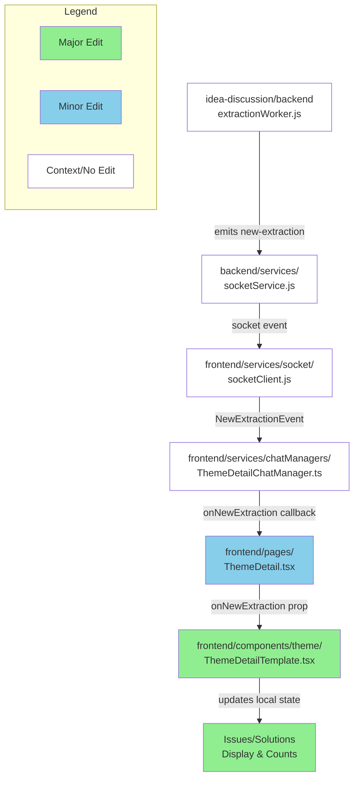

# GitHub レポート: digitaldemocracy2030/idobata

期間: 2025-08-06T12:32:19.615090+09:00 から 2025-08-13T12:32:19.615090+09:00 まで

## Issues

### 過去7日間に完了されたissue (1件)

### [AIチャットをすることによる課題や対策への反映がリアルタイムであるとよさそう。](https://github.com/digitaldemocracy2030/idobata/issues/454)

**作成者:** nishidashib  
**作成日:** 2025-08-07T13:33:01Z  
**内容:**

## 解決・改善したいこと

今は意見の反映が画面をリロードしないと課題や対策への反映されたかどうかが分からないので、リロードせずともわかるようになる仕組みがあればよさそう。
<!-- この提案はどのようなものかを説明してください。また、どのような人がどのように嬉しい提案なのかを、できればユーザーを主語にして記載してください。 -->

<!-- 対象画面の URL や関連する議論や資料の URL があれば、添付いただけると理解の助けになります。 -->

## 具体的な実現方法・実装方法の概要（未記入でも構いません）

**コメント:** なし

---

### 過去7日間に作成されたissue (0件)

### 過去7日間に更新されたissue（作成・クローズを除く）(0件)

## Pull Requests

### 過去7日間にマージされたPR (3件)

### [top page でユーザー情報が表示されないことがある問題を修正](https://github.com/digitaldemocracy2030/idobata/pull/453)

**作成者:** spinute  
**作成日:** 2025-08-06T13:54:35Z  
**変更:** +3 -3 (2ファイル)  
**マージ日:** 2025-08-06T13:54:43Z  
**内容:**

# 変更の概要
<!-- ここに変更の概要を記載してください -->

# スクリーンショット

# 変更の背景
<!-- ここに変更が必要となった背景を記載してください -->

# 関連Issue
<!-- 関連するIssueのリンクをこちらに記載してください -->

# CLAへの同意
本リポジトリへのコントリビュートには、[コントリビューターライセンス契約（CLA）](https://github.com/digitaldemocracy2030/idobata/blob/main/CLA.md)に同意することが必須です。

内容をお読みいただき、下記のチェックボックスにチェックをつける（"- [ ]" を "- [x]" に書き換える）ことで同意したものとみなします。

- [x] CLAの内容を読み、同意しました

**コメント:** なし

---

### [マイページを綺麗にした（スタイル調整、ワーディング調整、パンくずリスト追加）](https://github.com/digitaldemocracy2030/idobata/pull/451)

**作成者:** spinute  
**作成日:** 2025-08-06T11:37:38Z  
**変更:** +110 -95 (1ファイル)  
**マージ日:** 2025-08-06T11:39:28Z  
**内容:**

# 変更の概要
<!-- ここに変更の概要を記載してください -->

新デザインに合わせてスタイル調整、ワーディング調整、パンくずリスト追加をした

プロフィール画像の選択機能はやっていない

# スクリーンショット
<!-- UIの変更を伴う場合は、変更前後のスクリーンショットもしくはgif画像をこちらに記載してください -->

# 変更の背景
<!-- ここに変更が必要となった背景を記載してください -->

# 関連Issue
<!-- 関連するIssueのリンクをこちらに記載してください -->

# CLAへの同意
本リポジトリへのコントリビュートには、[コントリビューターライセンス契約（CLA）](https://github.com/digitaldemocracy2030/idobata/blob/main/CLA.md)に同意することが必須です。

内容をお読みいただき、下記のチェックボックスにチェックをつける（"- [ ]" を "- [x]" に書き換える）ことで同意したものとみなします。

- [x] CLAの内容を読み、同意しました

**コメント:** なし

---

### [Vision UI v1 chat](https://github.com/digitaldemocracy2030/idobata/pull/449)

**作成者:** blu3mo  
**作成日:** 2025-08-06T08:54:06Z  
**変更:** +163 -103 (6ファイル)  
**マージ日:** 2025-08-06T12:55:21Z  
**内容:**

# 変更の概要
モバイル/PCのチャットUI新デザインを反映

# スクリーンショット

# 変更の背景
ウタコデザインの実装

# 関連Issue

# CLAへの同意
本リポジトリへのコントリビュートには、[コントリビューターライセンス契約（CLA）](https://github.com/digitaldemocracy2030/idobata/blob/main/CLA.md)に同意することが必須です。

内容をお読みいただき、下記のチェックボックスにチェックをつける（"- [ ]" を "- [x]" に書き換える）ことで同意したものとみなします。

- [x] CLAの内容を読み、同意しました

**コメント:** なし

---

### 過去7日間に作成されたPR (3件)

### [public services  に python追加](https://github.com/digitaldemocracy2030/idobata/pull/455)

**作成者:** nishidashib  
**作成日:** 2025-08-12T00:47:05Z  
**変更:** +12772 -238 (102ファイル)  
**内容:**

# 変更の概要
<!-- ここに変更の概要を記載してください -->

# スクリーンショット
<!-- UIの変更を伴う場合は、変更前後のスクリーンショットもしくはgif画像をこちらに記載してください -->

# 変更の背景
<!-- ここに変更が必要となった背景を記載してください -->

# 関連Issue
<!-- 関連するIssueのリンクをこちらに記載してください -->

# CLAへの同意
本リポジトリへのコントリビュートには、[コントリビューターライセンス契約（CLA）](https://github.com/digitaldemocracy2030/idobata/blob/main/CLA.md)に同意することが必須です。

内容をお読みいただき、下記のチェックボックスにチェックをつける（"- [ ]" を "- [x]" に書き換える）ことで同意したものとみなします。

- [ ] CLAの内容を読み、同意しました

**コメント:** なし

---

### [いどばたビジョン v1 を main にマージ](https://github.com/digitaldemocracy2030/idobata/pull/452)

**作成者:** spinute  
**作成日:** 2025-08-06T13:46:39Z  
**変更:** +2665 -1038 (63ファイル)  
**内容:**

# 変更の概要
<!-- ここに変更の概要を記載してください -->

# スクリーンショット
<!-- UIの変更を伴う場合は、変更前後のスクリーンショットもしくはgif画像をこちらに記載してください -->

# 変更の背景
<!-- ここに変更が必要となった背景を記載してください -->

# 関連Issue
<!-- 関連するIssueのリンクをこちらに記載してください -->

# CLAへの同意
本リポジトリへのコントリビュートには、[コントリビューターライセンス契約（CLA）](https://github.com/digitaldemocracy2030/idobata/blob/main/CLA.md)に同意することが必須です。

内容をお読みいただき、下記のチェックボックスにチェックをつける（"- [ ]" を "- [x]" に書き換える）ことで同意したものとみなします。

- [ ] CLAの内容を読み、同意しました

**コメント:** なし

---

### [Implement real-time updates for issues and solutions on theme detail pages](https://github.com/digitaldemocracy2030/idobata/pull/450)

**作成者:** Shutaro+Devin  
**作成日:** 2025-08-06T09:37:30Z  
**変更:** +68 -7 (2ファイル)  
**内容:**

# Implement real-time updates for issues and solutions on theme detail pages

## Summary

This PR implements real-time updates for the "課題点" (issues) and "解決策" (solutions) sections on theme detail pages. Previously, these sections only updated after manual page reloads. Now they automatically update when new problems or solutions are extracted from chat conversations.

**Key changes:**
- Added `onNewExtraction` callback prop to `ThemeDetailTemplate` 
- Implemented local state management for issues/solutions arrays that can be updated independently of props
- Connected extraction events from `ThemeDetailChatManager` through to the UI components
- Used `useCallback` to prevent infinite re-renders when handling extraction events
- Updated tab counts to reflect real-time changes

The implementation reuses the existing socket infrastructure and extraction event system (`new-extraction` events from the backend worker).

## Review & Testing Checklist for Human

**⚠️ IMPORTANT: This feature was not fully testable due to backend API connectivity issues during development.**

- [ ] **Test real-time functionality end-to-end** - Send chat messages that trigger problem/solution extraction and verify the issues/solutions lists update automatically without page reload
- [ ] **Verify tab counts update correctly** - Ensure the "課題点 (X)" and "解決策 (Y)" tab headers show updated counts when new extractions arrive
- [ ] **Check for performance issues** - Monitor for infinite re-renders or excessive state updates (there were infinite re-render issues during development that were fixed with `useCallback`)
- [ ] **Test existing functionality** - Verify manual page refresh, tab switching, and chat functionality still work as before
- [ ] **Verify state synchronization** - Ensure local state stays consistent with props when the page loads new data

**Recommended test plan:** 
1. Open a theme detail page
2. Send multiple chat messages about problems and solutions 
3. Verify new items appear in real-time without refresh
4. Check tab counts update automatically
5. Test tab switching and existing features

---

### Diagram

### Notes

- **Link to Devin run:** https://app.devin.ai/sessions/71f5e7d17f2f44539818f69510111fac
- **Requested by:** @blu3mo
- **Testing limitation:** Backend API returned 400 errors during development, preventing full end-to-end testing of the real-time functionality
- **Performance fix:** Fixed infinite re-render issues by properly using `useCallback` for the extraction handler
- **State management:** Local state (`localIssues`, `localSolutions`) is synchronized with props on mount and prop changes, but can be updated independently for real-time updates

**コメント:** なし

---

### 過去7日間に更新されたPR（作成・マージを除く）(0件)

