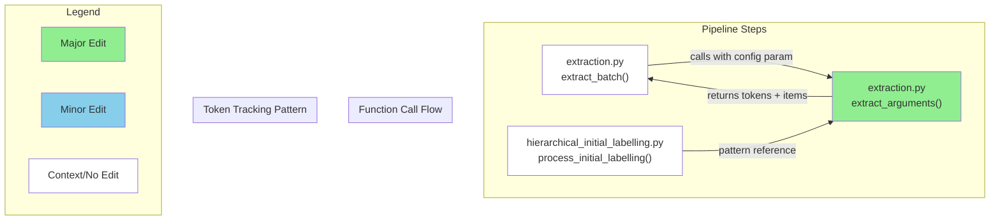

# GitHub レポート: digitaldemocracy2030/kouchou-ai

期間: 2025-08-06T12:32:11.819444+09:00 から 2025-08-13T12:32:11.819444+09:00 まで

## Issues

### 過去7日間に完了されたissue (2件)

### [form から受け付けた API KEY を使ってレポートを生成できるようにする](https://github.com/digitaldemocracy2030/kouchou-ai/issues/633)

**作成者:** shingo-ohki  
**作成日:** 2025-07-04T12:23:38Z  
**内容:**

# 背景
#622 でユーザーが環境構築の必要がなく気軽に広聴AIを試せる環境を Azure に準備中だが、現状はセットアップ時に指定した API KEY  を使うようになっているため、ユーザーが自身の費用負担でレポート生成ができない

# 提案内容
レポート作成者がフォームから API KEY を入力し、その KEY を使ってレポート生成をできるようにする

# for Devin
現状、Next.js（app router）＋Chakra UIで実装されたレポート生成ページ（client-admin/app/create/page.tsx）があります。
このページには既にAIプロバイダ選択欄（OpenAI, OpenRouter, Azure OpenAIなど）があり、ユーザーはAIプロバイダやモデルを選択できます。

このページに「API KEY」入力欄を追加してください。
- ユーザーがAPI KEYを入力した場合は、そのAPI KEYを使ってレポート生成を行ってください。
- ユーザーがAPI KEYを入力しなかった場合は、サーバー側で.envファイルに設定された各AIプロバイダ用のAPI KEY（例: OPENAI_API_KEY, OPENROUTER_API_KEY, AZURE_CHATCOMPLETION_API_KEY, AZURE_EMBEDDING_API_KEYなど）を使ってレポート生成を行ってください。
- サーバー側では、リクエストヘッダー（例: x-user-api-key）やボディにAPI KEYが含まれていればそれを優先し、なければ.envの該当プロバイダ用API KEYを使うようにしてください。
- API KEYはサーバーでのみ利用し、保存しないでください。
- クライアント側はAPI KEY入力欄をフォームに追加し、レポート生成リクエスト時にAPI KEYをヘッダー（例: x-user-api-key）で送信してください。
- 既存のAIプロバイダ選択やモデル選択、その他のバリデーション・UI構成は維持してください。
- サーバー側では、AIプロバイダ選択値に応じて適切なAPI KEY・エンドポイント・デプロイメント名・バージョンなどを選択し、APIリクエストを行ってください。
- .env.exampleの各AIプロバイダ用API KEYやエンドポイントの記載例も参考にしてください。
- サーバー側・クライアント側の両方のコードを実装してください。

**コメント:** なし

---

### [[DOCUMENT]ローカル LLM の使用時のdocker composeコマンドについて](https://github.com/digitaldemocracy2030/kouchou-ai/issues/587)

**作成者:** dentaro  
**作成日:** 2025-05-31T14:59:36Z  
**内容:**

# 現在の問題点
README.mdの「ローカル LLM の使用」の項で、通らないコマンドがありました。

# 提案内容
「広聴AI」のREADME.mdの

docker compose up -d --profile ollama

Docker の version v2.35.1-desktop.1で、WINとMACで試しましたが、どちらも通らないようです。

docker compose --profile ollama up -d

だと通るようになりました。

**コメント:** なし

---

### 過去7日間に作成されたissue (2件)

### [[DOCUMENT]GitHub Pagesの静的ファイルホスティング手順の修正](https://github.com/digitaldemocracy2030/kouchou-ai/issues/693)

**作成者:** yuneko1127  
**作成日:** 2025-08-09T07:00:14Z  
**内容:**

# 現在の問題点

> # ビルド結果をコピー
> cp -r out/* /path/to/kouchou-ai-reports/

静的エクスポートをするときに.nojekyllファイルも生成しているが、上のコマンドを実行するときに.nojekyllはコピーすることができない。それにより、GitHub Pagesでうまく表示できない問題が発生している。

# 提案内容

> cp -r out/* /path/to/kouchou-ai-reports/

上のコマンドを下のコマンドに変更することで.nojekyllもコピーすることができ解決する。

> cp -r out/. /path/to/kouchou-ai-reports/


**コメント:** なし

---

### [[FEATURE]ハイフンで終わるIDが受理されないことを注意書きやエラーで知らせたい](https://github.com/digitaldemocracy2030/kouchou-ai/issues/692)

**作成者:** yuneko1127  
**作成日:** 2025-08-08T14:50:56Z  
**内容:**

# 背景
レポート作成画面でIDを変更するとき、ハイフンで終了する文字列はエラーになるが、そのことが下の注意書きでもエラーでもそのことが知らされない。
何故受理されていないかを確認できるようにした方が良い。
3.00verを使っています。


# 提案内容

1. ハイフンで終了するような文字列が入力されてエラーが出ているときに、ハイフンで終了する文字列は使えませんのようなエラーに変更する
2. 「英字小文字と数字とハイフンのみ(URLで利用されます)」という注意書きに、ハイフンで終了できないことも示す。

**コメント:** なし

---

### 過去7日間に更新されたissue（作成・クローズを除く）(2件)

### [[FEATURE] Azure に動作確認環境・デモ環境を作る](https://github.com/digitaldemocracy2030/kouchou-ai/issues/622)

**作成者:** shingo-ohki  
**作成日:** 2025-06-29T08:25:09Z  
**内容:**

# 背景
- 現状、新しい機能の開発やソフトウェア改善を行った場合の動作確認は、エンジニアの手元の開発環境で行っているが、UI/UX の改善を行う際などはデザイナーなどエンジニア以外の方にも確認してもらいたいがその環境がない
- ユーザーが広聴AIを試すには環境構築をする必要があるが、これは多少のエンジニアリングスキルを必要とするため、簡単に試すことができない

<!-- なぜその機能が必要なのか、何が改善されるのか具体的に記入してください -->


# 提案内容
上記を解決するために、dd2030 が管理する Azure 環境に常に広聴AIがデプロイされているような環境を用意する

<!-- 実装案やデザイン案があれば記入してください -->

- 動作確認環境
  - [x] Azure 環境にセットアップする
  - [x]  #642 
- デモ環境
  - [x] #633
  - [ ] client-admin のパスワードなしでアクセスできるようにする
  - [ ] dd2030.org ドメインでアクセスできるようにする

**コメント:** なし

---

### [[FEATURE]用語解説ページをつける](https://github.com/digitaldemocracy2030/kouchou-ai/issues/111)

**作成者:** nishio  
**作成日:** 2025-03-20T12:07:35Z  
**内容:**

# 背景
「プロンプト」「埋め込み」「濃い(クラスタ)」について、単語レベルで言い換えてもわかりやすくならない気がするので、やるとしたら用語解説ページをつけるとかかな

「縦軸・横軸はなんだろう」についても解説

# 提案内容
<!-- 実装案やデザイン案があれば記入してください -->

**コメント:** なし

---

## Pull Requests

### 過去7日間にマージされたPR (4件)

### [refactor: 不要なアサーションと未使用のimportの削除](https://github.com/digitaldemocracy2030/kouchou-ai/pull/691)

**作成者:** noritaka1166  
**作成日:** 2025-08-05T14:46:25Z  
**変更:** +4 -4 (3ファイル)  
**マージ日:** 2025-08-06T00:41:18Z  
**内容:**

# 変更の概要
- 不要なアサーションの削除
- 未使用のimportの削除

# スクリーンショット
なし

# 変更の背景
- 不要なアサーションと未使用のimportを見つけたため

# 関連Issue
なし

# 動作確認の結果
buildができることを確認済

# CLAへの同意
- 本リポジトリへのコントリビュートには、[コントリビューターライセンス契約（CLA）](https://github.com/digitaldemocracy2030/kouchou-ai/blob/main/CLA.md)に同意することが必須です。
内容をお読みいただき、下記のチェックボックスにチェックをつける（"- [ ]" を "- [x]" に書き換える）ことで同意したものとみなします。

- [x] CLAの内容を読み、同意しました

# マージ前のチェックリスト（レビュアーがマージ前に確認してください）
- [ ] CIが全て通過している
- [ ] 単体テストが実装されているか
- [ ] 今回実装した機能および影響を受けると思われる機能について、適切な動作確認が行われているかを確認する。


動作確認の項目については、実装者による動作確認のケースが適切かを確認してください。
必要に応じてレビュアー自身による動作確認も歓迎します（必須ではありません）。

<!-- This is an auto-generated comment: release notes by coderabbit.ai -->

## Summary by CodeRabbit

* **リファクタリング**
  * 不要な型アサーションを削除し、コードを簡素化しました。  
  * インポート文から未使用のコンポーネントを削除しました。

<!-- end of auto-generated comment: release notes by coderabbit.ai -->

**コメント:** なし

---

### [OpenAI, OpenRouter の API KEY をフォームから入力してレポートを作成できるようにする](https://github.com/digitaldemocracy2030/kouchou-ai/pull/660)

**作成者:** Shingo Ohki+Devin  
**作成日:** 2025-07-13T13:21:05Z  
**変更:** +311 -47 (15ファイル)  
**マージ日:** 2025-08-13T03:12:34Z  
**内容:**


# Fix: Add Missing Config Parameter to extract_arguments Function

## Summary

This PR fixes a function signature inconsistency in the `extract_arguments` function in `extraction.py` where the function was being called with a `config` parameter but the function definition didn't accept it. The fix adds the missing `config=None` parameter and implements token usage tracking following the established pattern from other pipeline step files.

**Key Changes:**
- ✅ Added missing `config=None` parameter to `extract_arguments` function signature
- ✅ Implemented token usage tracking when `config` is provided, following the pattern from `hierarchical_initial_labelling.py`
- ✅ Maintains backward compatibility with `config=None` default
- 🔒 Addresses GitHub comment from shingo-ohki about following previous modifications

## Review & Testing Checklist for Human

**🟡 MEDIUM PRIORITY - Function Signature & Token Tracking (4 items)**

- [ ] **Verify function signature fix**: Confirm that `extract_arguments` can now be called with the `config` parameter without errors (check line 107 in `extract_batch` function)
- [ ] **Test token usage tracking**: Verify that token usage is properly accumulated in the config when provided, and that extraction still works when `config=None`
- [ ] **Pattern consistency check**: Compare the token usage implementation in `extract_arguments` with similar implementations in `hierarchical_initial_labelling.py` lines 171-174 to ensure consistency
- [ ] **End-to-end extraction test**: Run a complete extraction pipeline to ensure the function signature fix doesn't break the extraction workflow and that token tracking works correctly

### Diagram



### Notes


- **Root Cause**: The `extract_batch` function on line 107 was calling `extract_arguments` with a `config` parameter, but the function definition on line 148 didn't accept this parameter, causing a signature mismatch
- **Solution Pattern**: Followed the exact token usage tracking pattern from `hierarchical_initial_labelling.py` lines 171-174 to ensure consistency across pipeline steps
- **Testing Limitation**: Local tests failed due to environment configuration issues (missing API keys), but all CI checks passed (5/5 success)
- **Backward Compatibility**: The `config=None` default ensures existing calls without the config parameter continue to work

**Session Info**: 
- Devin session: https://app.devin.ai/sessions/26612fbfad6e40d0a0bcd2f01ad2cf84
- Requested by: @shingo-ohki
- Addresses GitHub comment: "上記の修正に追従" (follow the above modification)


**コメント:** なし

---

### [fix: GPUに関連するパッケージの分岐処理が適切に動かなくなっている](https://github.com/digitaldemocracy2030/kouchou-ai/pull/627)

**作成者:** shingo-ohki  
**作成日:** 2025-07-01T10:09:16Z  
**変更:** +6 -5 (4ファイル)  
**マージ日:** 2025-08-11T11:00:33Z  
**内容:**

# 変更の概要
- GPUを利用しない場合は、ビルド時間短縮のため不要なパッケージをインストールしないようにする

# 変更の背景
- 以前 #442 で対応を行ったが十分でなかったため、再び api コンテナのビルド時に不要なパッケージのインストール処理が行われるようになってしまっていた

# 関連Issue
#442 

# 動作確認の結果
<!-- 実装者は動作確認の結果を記載してください（例: レポート作成を実行し、正常にレポートが作成されることを確認した） 複数の動作確認を行った場合は、それぞれの結果を記載してください -->
- api コンテナに不要なパッケージがインストールされていないこと
- レポート作成を実行し、エラーなく正常にレポートが作成されること

を確認した

```
$ docker compose exec api pip list | grep torch
torch                     2.7.0+cpu
torchaudio                2.7.0+cpu
torchvision               0.22.0+cpu
```


# CLAへの同意
- 本リポジトリへのコントリビュートには、[コントリビューターライセンス契約（CLA）](https://github.com/digitaldemocracy2030/kouchou-ai/blob/main/CLA.md)に同意することが必須です。
内容をお読みいただき、下記のチェックボックスにチェックをつける（"- [ ]" を "- [x]" に書き換える）ことで同意したものとみなします。

- [x] CLAの内容を読み、同意しました

# マージ前のチェックリスト（レビュアーがマージ前に確認してください）
- [ ] CIが全て通過している
- [ ] 単体テストが実装されているか
- [ ] 今回実装した機能および影響を受けると思われる機能について、適切な動作確認が行われているかを確認する。


動作確認の項目については、実装者による動作確認のケースが適切かを確認してください。
必要に応じてレビュアー自身による動作確認も歓迎します（必須ではありません）。

<!-- This is an auto-generated comment: release notes by coderabbit.ai -->

## Summary by CodeRabbit

* **Chores**
  * Dockerイメージ作成時、GPU版PyTorchのインストール条件を修正しました。
  * PyTorchのバージョンを固定（torch==2.7.0）に変更しました。

<!-- end of auto-generated comment: release notes by coderabbit.ai -->

**コメント:** なし

---

### [fix: ollama コンテナの起動方法](https://github.com/digitaldemocracy2030/kouchou-ai/pull/591)

**作成者:** shingo-ohki  
**作成日:** 2025-06-06T05:31:53Z  
**変更:** +1 -1 (1ファイル)  
**マージ日:** 2025-08-11T08:47:18Z  
**内容:**

# 変更の概要
- ollama コンテナの起動方法に誤りがあったので修正しました

# 関連Issue
#587 

# CLAへの同意
- 本リポジトリへのコントリビュートには、[コントリビューターライセンス契約（CLA）](https://github.com/digitaldemocracy2030/kouchou-ai/blob/main/CLA.md)に同意することが必須です。
内容をお読みいただき、下記のチェックボックスにチェックをつける（"- [ ]" を "- [x]" に書き換える）ことで同意したものとみなします。

- [x] CLAの内容を読み、同意しました

# マージ前のチェックリスト（レビュアーがマージ前に確認してください）
- [ ] CIが全て通過している
- [ ] 単体テストが実装されているか
- [ ] 今回実装した機能および影響を受けると思われる機能について、適切な動作確認が行われているかを確認する。


動作確認の項目については、実装者による動作確認のケースが適切かを確認してください。
必要に応じてレビュアー自身による動作確認も歓迎します（必須ではありません）。

<!-- This is an auto-generated comment: release notes by coderabbit.ai -->

## Summary by CodeRabbit

- **ドキュメント**
  - OllamaサービスをGPUサポートで起動するためのDocker Composeコマンドのオプション順序を修正しました。

<!-- end of auto-generated comment: release notes by coderabbit.ai -->

**コメント:** なし

---

### 過去7日間に作成されたPR (1件)

### [docs: ビルド結果コピー時にドットファイルも含めるよう修正](https://github.com/digitaldemocracy2030/kouchou-ai/pull/694)

**作成者:** yuneko1127  
**作成日:** 2025-08-09T07:29:28Z  
**変更:** +1 -1 (1ファイル)  
**内容:**

# 変更の概要
静的エクスポートをするときに.nojekyllファイルも生成しているが、以前のコマンドではコピーできていないので、修正。

# スクリーンショット
- UIの変更を伴う場合は、変更前後のスクリーンショットもしくはgif画像をこちらに記載してください

# 変更の背景
.nojekyllがコピーできずに、ドキュメント通りに実行してもGitHub Pagesでうまく表示できない問題が発生している。

# 関連Issue
[#693](https://github.com/digitaldemocracy2030/kouchou-ai/issues/693)

# 動作確認の結果
変更したコマンドを用いてGitHub Pagesで公開できることを確認した

# CLAへの同意
- 本リポジトリへのコントリビュートには、[コントリビューターライセンス契約（CLA）](https://github.com/digitaldemocracy2030/kouchou-ai/blob/main/CLA.md)に同意することが必須です。
内容をお読みいただき、下記のチェックボックスにチェックをつける（"- [ ]" を "- [x]" に書き換える）ことで同意したものとみなします。

- [x] CLAの内容を読み、同意しました

# マージ前のチェックリスト（レビュアーがマージ前に確認してください）
- [ ] CIが全て通過している
- [ ] 単体テストが実装されているか
- [ ] 今回実装した機能および影響を受けると思われる機能について、適切な動作確認が行われているかを確認する。


動作確認の項目については、実装者による動作確認のケースが適切かを確認してください。
必要に応じてレビュアー自身による動作確認も歓迎します（必須ではありません）。

<!-- This is an auto-generated comment: release notes by coderabbit.ai -->

## Summary by CodeRabbit

* **ドキュメント**
  * GitHub Pagesへのホスティング手順にて、ビルド出力ファイルのコピー方法を修正し、隠しファイルも含めてコピーされるようになりました。

<!-- end of auto-generated comment: release notes by coderabbit.ai -->

**コメント:** なし

---

### 過去7日間に更新されたPR（作成・マージを除く）(2件)

### [[api] レポート管理画面の意見グループ数の表記を変更する](https://github.com/digitaldemocracy2030/kouchou-ai/pull/689)

**作成者:** shgtkshruch  
**作成日:** 2025-08-04T12:17:11Z  
**変更:** +2 -2 (2ファイル)  
**内容:**

# 変更の概要
- 管理画面の意見グループの数値を分析 UI の左の数値に変更しました

# スクリーンショット


# 変更の背景
- 最終的な意見グループ数は分析 UI の右の数値を想定していたが、実際は左の数値だった

# 関連Issue
- fix: https://github.com/digitaldemocracy2030/kouchou-ai/issues/687

# 動作確認の結果
<!-- 実装者は動作確認の結果を記載してください（例: レポート作成を実行し、正常にレポートが作成されることを確認した） 複数の動作確認を行った場合は、それぞれの結果を記載してください -->

- 管理画面の意見グループの数値を分析 UI の右の数値になっていること

# CLAへの同意
- 本リポジトリへのコントリビュートには、[コントリビューターライセンス契約（CLA）](https://github.com/digitaldemocracy2030/kouchou-ai/blob/main/CLA.md)に同意することが必須です。
内容をお読みいただき、下記のチェックボックスにチェックをつける（"- [ ]" を "- [x]" に書き換える）ことで同意したものとみなします。

- [x] CLAの内容を読み、同意しました

# マージ前のチェックリスト（レビュアーがマージ前に確認してください）
- [x] CIが全て通過している
- [x] 単体テストが実装されているか
- [x] 今回実装した機能および影響を受けると思われる機能について、適切な動作確認が行われているかを確認する。


動作確認の項目については、実装者による動作確認のケースが適切かを確認してください。
必要に応じてレビュアー自身による動作確認も歓迎します（必須ではありません）。

<!-- This is an auto-generated comment: release notes by coderabbit.ai -->
## Summary by CodeRabbit

* **バグ修正**
  * クラスター数の集計基準がレベル2からレベル1に変更され、正しいクラスター数が表示されるようになりました。

* **テスト**
  * クラスター数の判定基準変更に伴い、関連するテストケースの期待値が更新されました。
<!-- end of auto-generated comment: release notes by coderabbit.ai -->

**コメント:** なし

---

### [Makefile 利用時に .env の自動更新を行う](https://github.com/digitaldemocracy2030/kouchou-ai/pull/675)

**作成者:** 101ta28  
**作成日:** 2025-07-25T02:54:39Z  
**変更:** +120 -5 (2ファイル)  
**内容:**

# 変更の概要
- Makefile に .env, .env.azure の変更チェック機能を追加
  - ハッシュファイル生成を行うため、ハッシュファイル生成先ディレクトリを.gitignoreに追加

# スクリーンショット
env ファイル変更あり


env ファイル変更なし


# 変更の背景
- fix: #594 

# 動作確認の結果
.env ファイルの変更後、`make up`, `make build`を実行することで環境変数の反映を確認
Azure環境でのチェックは**行えていない**ため、確認をお願いしたいです。
(ただ、行う処理自体は同じなので大きな影響はないと思います)

# CLAへの同意
- 本リポジトリへのコントリビュートには、[コントリビューターライセンス契約（CLA）](https://github.com/digitaldemocracy2030/kouchou-ai/blob/main/CLA.md)に同意することが必須です。
内容をお読みいただき、下記のチェックボックスにチェックをつける（"- [ ]" を "- [x]" に書き換える）ことで同意したものとみなします。

- [x] CLAの内容を読み、同意しました

# マージ前のチェックリスト（レビュアーがマージ前に確認してください）
- [ ] CIが全て通過している
- [ ] 単体テストが実装されているか
- [ ] 今回実装した機能および影響を受けると思われる機能について、適切な動作確認が行われているかを確認する。


動作確認の項目については、実装者による動作確認のケースが適切かを確認してください。
必要に応じてレビュアー自身による動作確認も歓迎します（必須ではありません）。

<!-- This is an auto-generated comment: release notes by coderabbit.ai -->
## Summary by CodeRabbit

* **新機能**
  * 環境ファイル（.env, .env.azure）の変更を自動検知し、変更時にビルドや起動時に再ビルドが実行されるようになりました。
  * 環境ファイルの変更状況を確認・更新・クリアする新しいコマンドが追加されました。

* **その他**
  * `.env-hashes` ディレクトリがGit管理対象外になりました。
<!-- end of auto-generated comment: release notes by coderabbit.ai -->

**コメント:** なし

---

