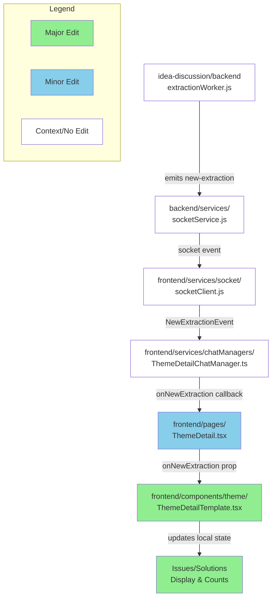

# GitHub レポート: digitaldemocracy2030/idobata

期間: 2025-08-13T12:24:54.283243+09:00 から 2025-08-20T12:24:54.283243+09:00 まで

## Pull Requests

### 過去7日間にマージされたPR (7件)

### [Update: SPで一括でパンくずを非表示に](https://github.com/digitaldemocracy2030/idobata/pull/461)

**作成者:** jujunjun110  
**作成日:** 2025-08-16T06:12:12Z  
**変更:** +9 -2 (3ファイル)  
**マージ日:** 2025-08-16T06:13:24Z  
**内容:**

# 変更の概要
SPにおいて、パンくずが全ページで出ないようにした

# スクリーンショット
<!-- UIの変更を伴う場合は、変更前後のスクリーンショットもしくはgif画像をこちらに記載してください -->

# 変更の背景
<!-- ここに変更が必要となった背景を記載してください -->

# 関連Issue
<!-- 関連するIssueのリンクをこちらに記載してください -->

# CLAへの同意
本リポジトリへのコントリビュートには、[コントリビューターライセンス契約（CLA）](https://github.com/digitaldemocracy2030/idobata/blob/main/CLA.md)に同意することが必須です。

内容をお読みいただき、下記のチェックボックスにチェックをつける（"- [ ]" を "- [x]" に書き換える）ことで同意したものとみなします。

- [x] CLAの内容を読み、同意しました

**コメント:** なし

---

### [Update: パンくずに不要なパスが出ないようにする](https://github.com/digitaldemocracy2030/idobata/pull/460)

**作成者:** jujunjun110  
**作成日:** 2025-08-16T05:22:18Z  
**変更:** +0 -2 (1ファイル)  
**マージ日:** 2025-08-16T05:22:25Z  
**内容:**

# 変更の概要
パンくずで「テーマ一覧」「テーマ詳細」を出ないようにしてアクセスするページをシンプルにした

# スクリーンショット

# 変更の背景
<!-- ここに変更が必要となった背景を記載してください -->

# 関連Issue
<!-- 関連するIssueのリンクをこちらに記載してください -->

# CLAへの同意
本リポジトリへのコントリビュートには、[コントリビューターライセンス契約（CLA）](https://github.com/digitaldemocracy2030/idobata/blob/main/CLA.md)に同意することが必須です。

内容をお読みいただき、下記のチェックボックスにチェックをつける（"- [ ]" を "- [x]" に書き換える）ことで同意したものとみなします。

- [x] CLAの内容を読み、同意しました

**コメント:** なし

---

### [Update: ウタコデザインとの微妙なズレを修正](https://github.com/digitaldemocracy2030/idobata/pull/459)

**作成者:** jujunjun110  
**作成日:** 2025-08-16T05:18:06Z  
**変更:** +3 -3 (2ファイル)  
**マージ日:** 2025-08-16T05:18:57Z  
**内容:**

# 変更の概要
デザインの微妙なズレを修正
* テーマエリアの背景の円を右上固定に
* レポートのアイコンを修正

# スクリーンショット

# 変更の背景
https://dd2030.slack.com/archives/C08FF5MM59C/p1754323222466159?thread_ts=1754319579.335189&cid=C08FF5MM59C

# 関連Issue
<!-- 関連するIssueのリンクをこちらに記載してください -->

# CLAへの同意
本リポジトリへのコントリビュートには、[コントリビューターライセンス契約（CLA）](https://github.com/digitaldemocracy2030/idobata/blob/main/CLA.md)に同意することが必須です。

内容をお読みいただき、下記のチェックボックスにチェックをつける（"- [ ]" を "- [x]" に書き換える）ことで同意したものとみなします。

- [x] CLAの内容を読み、同意しました

**コメント:** なし

---

### [Add: question endpoint](https://github.com/digitaldemocracy2030/idobata/pull/458)

**作成者:** jujunjun110  
**作成日:** 2025-08-16T05:06:10Z  
**変更:** +146 -43 (5ファイル)  
**マージ日:** 2025-08-16T05:07:56Z  
**内容:**

# 変更の概要
スレッドのuser_idに正しい値が入らない問題を修正

# スクリーンショット
<!-- UIの変更を伴う場合は、変更前後のスクリーンショットもしくはgif画像をこちらに記載してください -->

# 変更の背景
<!-- ここに変更が必要となった背景を記載してください -->

# 関連Issue
<!-- 関連するIssueのリンクをこちらに記載してください -->

# CLAへの同意
本リポジトリへのコントリビュートには、[コントリビューターライセンス契約（CLA）](https://github.com/digitaldemocracy2030/idobata/blob/main/CLA.md)に同意することが必須です。

内容をお読みいただき、下記のチェックボックスにチェックをつける（"- [ ]" を "- [x]" に書き換える）ことで同意したものとみなします。

- [x] CLAの内容を読み、同意しました

**コメント:** なし

---

### [使ってる gemini のバージョンを上げた](https://github.com/digitaldemocracy2030/idobata/pull/457)

**作成者:** spinute  
**作成日:** 2025-08-14T14:59:43Z  
**変更:** +8 -8 (2ファイル)  
**マージ日:** 2025-08-16T02:33:25Z  
**内容:**

# 変更の概要
<!-- ここに変更の概要を記載してください -->

# スクリーンショット
<!-- UIの変更を伴う場合は、変更前後のスクリーンショットもしくはgif画像をこちらに記載してください -->

# 変更の背景
<!-- ここに変更が必要となった背景を記載してください -->

# 関連Issue
<!-- 関連するIssueのリンクをこちらに記載してください -->

# CLAへの同意
本リポジトリへのコントリビュートには、[コントリビューターライセンス契約（CLA）](https://github.com/digitaldemocracy2030/idobata/blob/main/CLA.md)に同意することが必須です。

内容をお読みいただき、下記のチェックボックスにチェックをつける（"- [ ]" を "- [x]" に書き換える）ことで同意したものとみなします。

- [x] CLAの内容を読み、同意しました

**コメント:** なし

---

### [いどばたビジョン v1 を main にマージ](https://github.com/digitaldemocracy2030/idobata/pull/452)

**作成者:** spinute  
**作成日:** 2025-08-06T13:46:39Z  
**変更:** +3758 -1375 (94ファイル)  
**マージ日:** 2025-08-16T04:25:05Z  
**内容:**

# 変更の概要
<!-- ここに変更の概要を記載してください -->

# スクリーンショット
<!-- UIの変更を伴う場合は、変更前後のスクリーンショットもしくはgif画像をこちらに記載してください -->

# 変更の背景
<!-- ここに変更が必要となった背景を記載してください -->

# 関連Issue
<!-- 関連するIssueのリンクをこちらに記載してください -->

# CLAへの同意
本リポジトリへのコントリビュートには、[コントリビューターライセンス契約（CLA）](https://github.com/digitaldemocracy2030/idobata/blob/main/CLA.md)に同意することが必須です。

内容をお読みいただき、下記のチェックボックスにチェックをつける（"- [ ]" を "- [x]" に書き換える）ことで同意したものとみなします。

- [ ] CLAの内容を読み、同意しました

**コメント:** なし

---

### [import_comments.pyのエンドポイント修正](https://github.com/digitaldemocracy2030/idobata/pull/432)

**作成者:** nishidashib  
**作成日:** 2025-07-23T09:19:03Z  
**変更:** +1 -1 (1ファイル)  
**マージ日:** 2025-08-14T15:07:14Z  
**内容:**

# 変更の概要
<!-- ここに変更の概要を記載してください -->
endpointで使用している変数に誤りがあった。
# スクリーンショット
<!-- UIの変更を伴う場合は、変更前後のスクリーンショットもしくはgif画像をこちらに記載してください -->

# 変更の背景
テストデータをこのスクリプトを使ってuploadしようとした時に動作しなかったため。
<!-- ここに変更が必要となった背景を記載してください -->

# 関連Issue
<!-- 関連するIssueのリンクをこちらに記載してください -->

# CLAへの同意
本リポジトリへのコントリビュートには、[コントリビューターライセンス契約（CLA）](https://github.com/digitaldemocracy2030/idobata/blob/main/CLA.md)に同意することが必須です。

内容をお読みいただき、下記のチェックボックスにチェックをつける（"- [ ]" を "- [x]" に書き換える）ことで同意したものとみなします。

- [x] CLAの内容を読み、同意しました

**コメント:** なし

---

### 過去7日間に作成されたPR (1件)

### [userId の取り回しでバグがあったのを修正した](https://github.com/digitaldemocracy2030/idobata/pull/456)

**作成者:** spinute  
**作成日:** 2025-08-14T14:56:49Z  
**変更:** +29 -12 (3ファイル)  
**内容:**

# 変更の概要
<!-- ここに変更の概要を記載してください -->

idobata クライアントでは localStorage に user id を入れて取り回しているが、localStorage の読み書き時のキーが userId と idobataUserId で揺れていて、おそらくページによって一人の利用者が二人のユーザーとして振る舞ってしまうバグがあった。

文字列キーで読み書きするのは今回のような書き間違いを起こしやすいので、userIdManager を作って統一的に行えるようにした。

# スクリーンショット
<!-- UIの変更を伴う場合は、変更前後のスクリーンショットもしくはgif画像をこちらに記載してください -->

# 変更の背景
<!-- ここに変更が必要となった背景を記載してください -->

# 関連Issue
<!-- 関連するIssueのリンクをこちらに記載してください -->

# CLAへの同意
本リポジトリへのコントリビュートには、[コントリビューターライセンス契約（CLA）](https://github.com/digitaldemocracy2030/idobata/blob/main/CLA.md)に同意することが必須です。

内容をお読みいただき、下記のチェックボックスにチェックをつける（"- [ ]" を "- [x]" に書き換える）ことで同意したものとみなします。

- [x] CLAの内容を読み、同意しました

**コメント:** なし

---

### 過去7日間に更新されたPR（作成・マージを除く）(3件)

### [Implement real-time updates for issues and solutions on theme detail pages](https://github.com/digitaldemocracy2030/idobata/pull/450)

**作成者:** Shutaro+Devin  
**作成日:** 2025-08-06T09:37:30Z  
**変更:** +68 -7 (2ファイル)  
**内容:**

# Implement real-time updates for issues and solutions on theme detail pages

## Summary

This PR implements real-time updates for the "課題点" (issues) and "解決策" (solutions) sections on theme detail pages. Previously, these sections only updated after manual page reloads. Now they automatically update when new problems or solutions are extracted from chat conversations.

**Key changes:**
- Added `onNewExtraction` callback prop to `ThemeDetailTemplate` 
- Implemented local state management for issues/solutions arrays that can be updated independently of props
- Connected extraction events from `ThemeDetailChatManager` through to the UI components
- Used `useCallback` to prevent infinite re-renders when handling extraction events
- Updated tab counts to reflect real-time changes

The implementation reuses the existing socket infrastructure and extraction event system (`new-extraction` events from the backend worker).

## Review & Testing Checklist for Human

**⚠️ IMPORTANT: This feature was not fully testable due to backend API connectivity issues during development.**

- [ ] **Test real-time functionality end-to-end** - Send chat messages that trigger problem/solution extraction and verify the issues/solutions lists update automatically without page reload
- [ ] **Verify tab counts update correctly** - Ensure the "課題点 (X)" and "解決策 (Y)" tab headers show updated counts when new extractions arrive
- [ ] **Check for performance issues** - Monitor for infinite re-renders or excessive state updates (there were infinite re-render issues during development that were fixed with `useCallback`)
- [ ] **Test existing functionality** - Verify manual page refresh, tab switching, and chat functionality still work as before
- [ ] **Verify state synchronization** - Ensure local state stays consistent with props when the page loads new data

**Recommended test plan:** 
1. Open a theme detail page
2. Send multiple chat messages about problems and solutions 
3. Verify new items appear in real-time without refresh
4. Check tab counts update automatically
5. Test tab switching and existing features

---

### Diagram

### Notes

- **Link to Devin run:** https://app.devin.ai/sessions/71f5e7d17f2f44539818f69510111fac
- **Requested by:** @blu3mo
- **Testing limitation:** Backend API returned 400 errors during development, preventing full end-to-end testing of the real-time functionality
- **Performance fix:** Fixed infinite re-render issues by properly using `useCallback` for the extraction handler
- **State management:** Local state (`localIssues`, `localSolutions`) is synchronized with props on mount and prop changes, but can be updated independently for real-time updates

**コメント:** なし

---

### [refactor: 使用していない crypto を削除](https://github.com/digitaldemocracy2030/idobata/pull/448)

**作成者:** noritaka1166  
**作成日:** 2025-08-04T15:40:36Z  
**変更:** +1 -11 (3ファイル)  
**内容:**

# 変更の概要
使用していない crypto を削除

# スクリーンショット
なし

# 変更の背景
npm i 実行時に、cryptoパッケージを使用せずに node の crypto  を使うようにワーニングが出ていた。  
確認したところ、そもそも crypto を使っていないようだったので対応。

# 関連Issue
なし

# CLAへの同意
本リポジトリへのコントリビュートには、[コントリビューターライセンス契約（CLA）](https://github.com/digitaldemocracy2030/idobata/blob/main/CLA.md)に同意することが必須です。

内容をお読みいただき、下記のチェックボックスにチェックをつける（"- [ ]" を "- [x]" に書き換える）ことで同意したものとみなします。

- [x] CLAの内容を読み、同意しました

**コメント:** なし

---

### [chore:  idea-discussion 内の不要な devDependencies を削除](https://github.com/digitaldemocracy2030/idobata/pull/447)

**作成者:** noritaka1166  
**作成日:** 2025-08-04T15:26:43Z  
**変更:** +0 -22 (2ファイル)  
**内容:**

# 変更の概要
idea-discussion 内の不要な devDependencies を削除
- 元のパッケージ自体に型が含まれるようになったため不要
  - <https://www.npmjs.com/package/@types/mongoose> 
  - <https://www.npmjs.com/package/@types/bcryptjs>

# スクリーンショット
なし

# 変更の背景
npm install 時に deprecated のワーニングが出ていたため対応

# 関連Issue
なし

# CLAへの同意
本リポジトリへのコントリビュートには、[コントリビューターライセンス契約（CLA）](https://github.com/digitaldemocracy2030/idobata/blob/main/CLA.md)に同意することが必須です。

内容をお読みいただき、下記のチェックボックスにチェックをつける（"- [ ]" を "- [x]" に書き換える）ことで同意したものとみなします。

- [x] CLAの内容を読み、同意しました

**コメント:** なし

---

