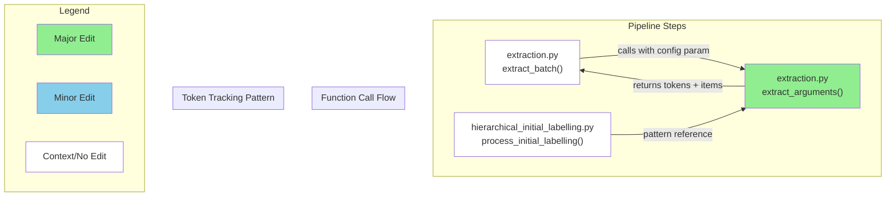

# GitHub レポート: digitaldemocracy2030/kouchou-ai

期間: 2025-08-13T12:24:51.020987+09:00 から 2025-08-20T12:24:51.020987+09:00 まで

## Issues

### 過去7日間に完了されたissue (3件)

### [[DOCUMENT]GitHub Pagesの静的ファイルホスティング手順の修正](https://github.com/digitaldemocracy2030/kouchou-ai/issues/693)

**作成者:** yuneko1127  
**作成日:** 2025-08-09T07:00:14Z  
**内容:**

# 現在の問題点

> # ビルド結果をコピー
> cp -r out/* /path/to/kouchou-ai-reports/

静的エクスポートをするときに.nojekyllファイルも生成しているが、上のコマンドを実行するときに.nojekyllはコピーすることができない。それにより、GitHub Pagesでうまく表示できない問題が発生している。

# 提案内容

> cp -r out/* /path/to/kouchou-ai-reports/

上のコマンドを下のコマンドに変更することで.nojekyllもコピーすることができ解決する。

> cp -r out/. /path/to/kouchou-ai-reports/


**コメント:** なし

---

### [form から受け付けた API KEY を使ってレポートを生成できるようにする](https://github.com/digitaldemocracy2030/kouchou-ai/issues/633)

**作成者:** shingo-ohki  
**作成日:** 2025-07-04T12:23:38Z  
**内容:**

# 背景
#622 でユーザーが環境構築の必要がなく気軽に広聴AIを試せる環境を Azure に準備中だが、現状はセットアップ時に指定した API KEY  を使うようになっているため、ユーザーが自身の費用負担でレポート生成ができない

# 提案内容
レポート作成者がフォームから API KEY を入力し、その KEY を使ってレポート生成をできるようにする

# for Devin
現状、Next.js（app router）＋Chakra UIで実装されたレポート生成ページ（client-admin/app/create/page.tsx）があります。
このページには既にAIプロバイダ選択欄（OpenAI, OpenRouter, Azure OpenAIなど）があり、ユーザーはAIプロバイダやモデルを選択できます。

このページに「API KEY」入力欄を追加してください。
- ユーザーがAPI KEYを入力した場合は、そのAPI KEYを使ってレポート生成を行ってください。
- ユーザーがAPI KEYを入力しなかった場合は、サーバー側で.envファイルに設定された各AIプロバイダ用のAPI KEY（例: OPENAI_API_KEY, OPENROUTER_API_KEY, AZURE_CHATCOMPLETION_API_KEY, AZURE_EMBEDDING_API_KEYなど）を使ってレポート生成を行ってください。
- サーバー側では、リクエストヘッダー（例: x-user-api-key）やボディにAPI KEYが含まれていればそれを優先し、なければ.envの該当プロバイダ用API KEYを使うようにしてください。
- API KEYはサーバーでのみ利用し、保存しないでください。
- クライアント側はAPI KEY入力欄をフォームに追加し、レポート生成リクエスト時にAPI KEYをヘッダー（例: x-user-api-key）で送信してください。
- 既存のAIプロバイダ選択やモデル選択、その他のバリデーション・UI構成は維持してください。
- サーバー側では、AIプロバイダ選択値に応じて適切なAPI KEY・エンドポイント・デプロイメント名・バージョンなどを選択し、APIリクエストを行ってください。
- .env.exampleの各AIプロバイダ用API KEYやエンドポイントの記載例も参考にしてください。
- サーバー側・クライアント側の両方のコードを実装してください。

**コメント:** なし

---

### [[FEATURE][design] headerにプロダクト名を表示する](https://github.com/digitaldemocracy2030/kouchou-ai/issues/441)

**作成者:** UtkNggc  
**作成日:** 2025-05-06T11:13:43Z  
**内容:**

# 背景
<!-- なぜその機能が必要なのか、何が改善されるのか具体的に記入してください -->
現在、header左の部分が「デジタル民主主義2030」になっている。
デジタル民主主義2030は、複数プロダクトを含むプロジェクト名なので、
プロダクト内のheaderではプロダクト名を表記したい。

# 提案内容
<!-- 実装案やデザイン案があれば記入してください -->
・メイン「広聴AI」
・サブ「part of project デジタル民主主義2030」
で画像作成しました。こちらに変えていただくのはいかがでしょう。

▼Figma
https://www.figma.com/design/ZImSumdtUme9loVY5CejWX/%E5%BA%83%E8%81%B4AI%EF%BC%88%E3%83%87%E3%82%B8%E6%B0%912030%EF%BC%89?node-id=176-458&t=PgvCDEqVEw2sn016-11

■設計意図
・ロゴ制作するには時間がかかるので、現時点では取り急ぎフラットなフォントで作成。
・現在のロゴサイズと同じサイズで作成したので、画像のリンク先を変えていただくだけで実装完了いただける見込み。

# ご相談したいこと
「part of project」がしっくりきてない気がする。。もっとふさわしいものがないか。


**コメント:** なし

---

### 過去7日間に作成されたissue (0件)

### 過去7日間に更新されたissue（作成・クローズを除く）(4件)

### [[BUG] 静的ファイル出力時に公開状態のレポートがない場合にエラーとなる](https://github.com/digitaldemocracy2030/kouchou-ai/issues/683)

**作成者:** shingo-ohki  
**作成日:** 2025-07-31T01:14:24Z  
**内容:**

### 概要

<!-- バグの簡潔な説明をお願いします -->
公開状態のレポートがない状態で、[静的ファイル出力](https://github.com/digitaldemocracy2030/kouchou-ai?tab=readme-ov-file#%E9%9D%99%E7%9A%84%E3%83%95%E3%82%A1%E3%82%A4%E3%83%AB%E5%87%BA%E5%8A%9B)を行うとエラーが出る。


### 再現手順

1. レポートを生成する
2. すべてのレポートを「公開」以外の状態にする
3. [静的ファイル出力](https://github.com/digitaldemocracy2030/kouchou-ai?tab=readme-ov-file#%E9%9D%99%E7%9A%84%E3%83%95%E3%82%A1%E3%82%A4%E3%83%AB%E5%87%BA%E5%8A%9B)を行う

または、レポートがない状態で 3 を行う。

### 期待する動作

<!-- 本来どう動作すべきかを記入してください -->
例えば以下などが考えられるが、どうすべきかは議論が必要そう
- 適切なエラー（「公開状態のレポートがないためレポートを静的出力できません」etc.）を表示する
- 公開状態にかかわらず静的レポートを出力できるようにする

### スクリーンショット・ログ

<!-- 必要に応じてスクリーンショットやエラーログなどを添付してください -->

```
❯ make client-build-static
rm -rf out
docker compose up -d --wait api
[+] Running 1/1
 ✔ Container kouchou-ai-api-1  Healthy                                                                                        0.5s 
docker compose run --rm -e BASE_PATH= -e NEXT_PUBLIC_OUTPUT_MODE=export -v /home/tizze/program/digital-democracy/kouchou-ai/server:/server -v /home/tizze/program/digital-democracy/kouchou-ai/out:/app/dist client sh -c "npm run build:static && cp -r out/* dist && touch dist/.nojekyll"
[+] Creating 1/1
 ✔ Container kouchou-ai-api-1  Running                                                                                        0.0s 

> kouchou-ai-client@0.1.0 prebuild:static
> npm run copy-image && NEXT_PUBLIC_OUTPUT_MODE=export npm run rename-file


> kouchou-ai-client@0.1.0 copy-image
> node scripts/copy-image.mjs

Copied from default: icon.png
Copied from default: reporter.png
Copied from default: ogp.png
✅ All images copied successfully.

> kouchou-ai-client@0.1.0 rename-file
> node scripts/rename-file.mjs rename

Renamed: app/[slug]/opengraph-image.tsx → _opengraph-image.tsx

> kouchou-ai-client@0.1.0 build:static
> NEXT_PUBLIC_OUTPUT_MODE=export next build

   ▲ Next.js 15.2.3

   Creating an optimized production build ...
 ✓ Compiled successfully
 ✓ Linting and checking validity of types    

> Build error occurred
[Error: Page "/[slug]/opengraph-image.png" is missing "generateStaticParams()" so it cannot be used with "output: export" config.]
npm notice
```
### その他

<!-- 追加で伝えておきたいことがあれば記入してください -->
[BUG] scripts/fetch_reports.pyでは「限定公開」「非公開」状態のレポートがバックアップできない #629 
も似た話

**コメント:** なし

---

### [[BUG] azure-build 時に警告が出る](https://github.com/digitaldemocracy2030/kouchou-ai/issues/631)

**作成者:** shingo-ohki  
**作成日:** 2025-07-03T03:00:37Z  
**内容:**

### 概要

`azure-build` 時に警告が出る（build 自体は完了し、のちの `azure-config-update` で環境変数は設定されるので実質問題はない）

<!-- バグの簡潔な説明をお願いします -->

### 再現手順

1. [Azure 環境へのセットアップ方法](https://github.com/digitaldemocracy2030/kouchou-ai/blob/main/Azure.md) に従って設定し `make azure-build` を実行する

### 期待する動作

警告が出力されずに build が正常に完了する

<!-- 本来どう動作すべきかを記入してください -->

### スクリーンショット・ログ

`azure build` 時に以下のような警告が出ます。

```
>>> コンテナイメージのビルド...
...
 4 warnings found (use docker --debug to expand):
 - UndefinedVar: Usage of undefined variable '$NEXT_PUBLIC_API_BASEPATH' (line 20)
 - UndefinedVar: Usage of undefined variable '$NEXT_PUBLIC_PUBLIC_API_KEY' (line 21)
 - UndefinedVar: Usage of undefined variable '$NEXT_PUBLIC_SITE_URL' (line 22)
 - UndefinedVar: Usage of undefined variable '$API_BASEPATH' (line 23)
...
```

<!-- 必要に応じてスクリーンショットやエラーログなどを添付してください -->

**コメント:** なし

---

### [[FEATURE] Azure に動作確認環境・デモ環境を作る](https://github.com/digitaldemocracy2030/kouchou-ai/issues/622)

**作成者:** shingo-ohki  
**作成日:** 2025-06-29T08:25:09Z  
**内容:**

# 背景
- 現状、新しい機能の開発やソフトウェア改善を行った場合の動作確認は、エンジニアの手元の開発環境で行っているが、UI/UX の改善を行う際などはデザイナーなどエンジニア以外の方にも確認してもらいたいがその環境がない
- ユーザーが広聴AIを試すには環境構築をする必要があるが、これは多少のエンジニアリングスキルを必要とするため、簡単に試すことができない

<!-- なぜその機能が必要なのか、何が改善されるのか具体的に記入してください -->


# 提案内容
上記を解決するために、dd2030 が管理する Azure 環境に常に広聴AIがデプロイされているような環境を用意する

<!-- 実装案やデザイン案があれば記入してください -->

- 動作確認環境
  - [x] Azure 環境にセットアップする
  - [x]  #642 
  - [ ] #688 
- デモ環境
  - [x] #633
  - [ ] client-admin のパスワードなしでアクセスできるようにする
  - [ ] dd2030.org ドメインでアクセスできるようにする

**コメント:** なし

---

### [[FEATURE]用語解説ページをつける](https://github.com/digitaldemocracy2030/kouchou-ai/issues/111)

**作成者:** nishio  
**作成日:** 2025-03-20T12:07:35Z  
**内容:**

# 背景
「プロンプト」「埋め込み」「濃い(クラスタ)」について、単語レベルで言い換えてもわかりやすくならない気がするので、やるとしたら用語解説ページをつけるとかかな

「縦軸・横軸はなんだろう」についても解説

# 提案内容
<!-- 実装案やデザイン案があれば記入してください -->

**コメント:** なし

---

## Pull Requests

### 過去7日間にマージされたPR (3件)

### [[FEATURE] headerにプロダクト名を表示する](https://github.com/digitaldemocracy2030/kouchou-ai/pull/695)

**作成者:** mochizuki-pg  
**作成日:** 2025-08-19T13:46:51Z  
**変更:** +40 -3 (5ファイル)  
**マージ日:** 2025-08-20T00:06:51Z  
**内容:**

# 変更の概要
https://github.com/digitaldemocracy2030/kouchou-ai/issues/441

[Figma](https://www.figma.com/design/ZImSumdtUme9loVY5CejWX/%E5%BA%83%E8%81%B4AI%EF%BC%88dd2030%EF%BC%89?node-id=434-2041&t=fTo0ASfN0PwOagCB-0)

Figmaから落としてきたものをそのまま使用し、大きさは明示的に変更していませんが
特に問題はないように見受けられました

Client側、SPでロゴの分岐があった為、いれています
ファイル名の命名は他に合わせて `-sp` としましたが指定があれば修正します

# スクリーンショット

##  Client


### SP


## Admin


# 変更の背景
- ここに変更が必要となった背景を記載してください

# 関連Issue
関連するIssueのリンクをこちらに記載してください

# 動作確認の結果
<!-- 実装者は動作確認の結果を記載してください（例: レポート作成を実行し、正常にレポートが作成されることを確認した） 複数の動作確認を行った場合は、それぞれの結果を記載してください -->

# CLAへの同意
- 本リポジトリへのコントリビュートには、[コントリビューターライセンス契約（CLA）](https://github.com/digitaldemocracy2030/kouchou-ai/blob/main/CLA.md)に同意することが必須です。
内容をお読みいただき、下記のチェックボックスにチェックをつける（"- [ ]" を "- [x]" に書き換える）ことで同意したものとみなします。

- [x] CLAの内容を読み、同意しました

# マージ前のチェックリスト（レビュアーがマージ前に確認してください）
- [ ] CIが全て通過している
- [ ] 単体テストが実装されているか
- [ ] 今回実装した機能および影響を受けると思われる機能について、適切な動作確認が行われているかを確認する。


動作確認の項目については、実装者による動作確認のケースが適切かを確認してください。
必要に応じてレビュアー自身による動作確認も歓迎します（必須ではありません）。

<!-- This is an auto-generated comment: release notes by coderabbit.ai -->

## Summary by CodeRabbit

- スタイル
  - 管理画面および一般ユーザー画面のヘッダーロゴを新デザインへ変更（画像を /images/logo.svg、代替テキストを「広聴AI」に更新）
  - ロゴ画像の明示的な幅・高さ指定を削除し、周囲のレイアウトに応じた自動サイズ調整に変更

<!-- end of auto-generated comment: release notes by coderabbit.ai -->

**コメント:** なし

---

### [docs: ビルド結果コピー時にドットファイルも含めるよう修正](https://github.com/digitaldemocracy2030/kouchou-ai/pull/694)

**作成者:** yuneko1127  
**作成日:** 2025-08-09T07:29:28Z  
**変更:** +1 -1 (1ファイル)  
**マージ日:** 2025-08-13T04:02:41Z  
**内容:**

# 変更の概要
静的エクスポートをするときに.nojekyllファイルも生成しているが、以前のコマンドではコピーできていないので、修正。

# スクリーンショット
- UIの変更を伴う場合は、変更前後のスクリーンショットもしくはgif画像をこちらに記載してください

# 変更の背景
.nojekyllがコピーできずに、ドキュメント通りに実行してもGitHub Pagesでうまく表示できない問題が発生している。

# 関連Issue
[#693](https://github.com/digitaldemocracy2030/kouchou-ai/issues/693)

# 動作確認の結果
変更したコマンドを用いてGitHub Pagesで公開できることを確認した

# CLAへの同意
- 本リポジトリへのコントリビュートには、[コントリビューターライセンス契約（CLA）](https://github.com/digitaldemocracy2030/kouchou-ai/blob/main/CLA.md)に同意することが必須です。
内容をお読みいただき、下記のチェックボックスにチェックをつける（"- [ ]" を "- [x]" に書き換える）ことで同意したものとみなします。

- [x] CLAの内容を読み、同意しました

# マージ前のチェックリスト（レビュアーがマージ前に確認してください）
- [ ] CIが全て通過している
- [ ] 単体テストが実装されているか
- [ ] 今回実装した機能および影響を受けると思われる機能について、適切な動作確認が行われているかを確認する。


動作確認の項目については、実装者による動作確認のケースが適切かを確認してください。
必要に応じてレビュアー自身による動作確認も歓迎します（必須ではありません）。

<!-- This is an auto-generated comment: release notes by coderabbit.ai -->

## Summary by CodeRabbit

* **ドキュメント**
  * GitHub Pagesへのホスティング手順にて、ビルド出力ファイルのコピー方法を修正し、隠しファイルも含めてコピーされるようになりました。

<!-- end of auto-generated comment: release notes by coderabbit.ai -->

**コメント:** なし

---

### [OpenAI, OpenRouter の API KEY をフォームから入力してレポートを作成できるようにする](https://github.com/digitaldemocracy2030/kouchou-ai/pull/660)

**作成者:** Shingo Ohki+Devin  
**作成日:** 2025-07-13T13:21:05Z  
**変更:** +311 -47 (15ファイル)  
**マージ日:** 2025-08-13T03:12:34Z  
**内容:**


# Fix: Add Missing Config Parameter to extract_arguments Function

## Summary

This PR fixes a function signature inconsistency in the `extract_arguments` function in `extraction.py` where the function was being called with a `config` parameter but the function definition didn't accept it. The fix adds the missing `config=None` parameter and implements token usage tracking following the established pattern from other pipeline step files.

**Key Changes:**
- ✅ Added missing `config=None` parameter to `extract_arguments` function signature
- ✅ Implemented token usage tracking when `config` is provided, following the pattern from `hierarchical_initial_labelling.py`
- ✅ Maintains backward compatibility with `config=None` default
- 🔒 Addresses GitHub comment from shingo-ohki about following previous modifications

## Review & Testing Checklist for Human

**🟡 MEDIUM PRIORITY - Function Signature & Token Tracking (4 items)**

- [ ] **Verify function signature fix**: Confirm that `extract_arguments` can now be called with the `config` parameter without errors (check line 107 in `extract_batch` function)
- [ ] **Test token usage tracking**: Verify that token usage is properly accumulated in the config when provided, and that extraction still works when `config=None`
- [ ] **Pattern consistency check**: Compare the token usage implementation in `extract_arguments` with similar implementations in `hierarchical_initial_labelling.py` lines 171-174 to ensure consistency
- [ ] **End-to-end extraction test**: Run a complete extraction pipeline to ensure the function signature fix doesn't break the extraction workflow and that token tracking works correctly

### Diagram



### Notes


- **Root Cause**: The `extract_batch` function on line 107 was calling `extract_arguments` with a `config` parameter, but the function definition on line 148 didn't accept this parameter, causing a signature mismatch
- **Solution Pattern**: Followed the exact token usage tracking pattern from `hierarchical_initial_labelling.py` lines 171-174 to ensure consistency across pipeline steps
- **Testing Limitation**: Local tests failed due to environment configuration issues (missing API keys), but all CI checks passed (5/5 success)
- **Backward Compatibility**: The `config=None` default ensures existing calls without the config parameter continue to work

**Session Info**: 
- Devin session: https://app.devin.ai/sessions/26612fbfad6e40d0a0bcd2f01ad2cf84
- Requested by: @shingo-ohki
- Addresses GitHub comment: "上記の修正に追従" (follow the above modification)


**コメント:** なし

---

### 過去7日間に作成されたPR (0件)

### 過去7日間に更新されたPR（作成・マージを除く）(0件)

