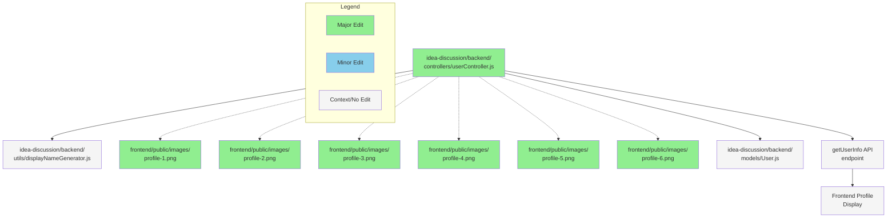

# GitHub レポート: digitaldemocracy2030/idobata

期間: 2025-10-01T12:17:48.227087+09:00 から 2025-10-08T12:17:48.227087+09:00 まで

## Pull Requests

### 過去7日間にマージされたPR (2件)

### [userId の取り回しでバグがあったのを修正した](https://github.com/digitaldemocracy2030/idobata/pull/456)

**作成者:** spinute  
**作成日:** 2025-08-14T14:56:49Z  
**変更:** +29 -12 (3ファイル)  
**マージ日:** 2025-10-02T11:14:49Z  
**内容:**

# 変更の概要
<!-- ここに変更の概要を記載してください -->

idobata クライアントでは localStorage に user id を入れて取り回しているが、localStorage の読み書き時のキーが userId と idobataUserId で揺れていて、おそらくページによって一人の利用者が二人のユーザーとして振る舞ってしまうバグがあった。

文字列キーで読み書きするのは今回のような書き間違いを起こしやすいので、userIdManager を作って統一的に行えるようにした。

# スクリーンショット
<!-- UIの変更を伴う場合は、変更前後のスクリーンショットもしくはgif画像をこちらに記載してください -->

# 変更の背景
<!-- ここに変更が必要となった背景を記載してください -->

# 関連Issue
<!-- 関連するIssueのリンクをこちらに記載してください -->

# CLAへの同意
本リポジトリへのコントリビュートには、[コントリビューターライセンス契約（CLA）](https://github.com/digitaldemocracy2030/idobata/blob/main/CLA.md)に同意することが必須です。

内容をお読みいただき、下記のチェックボックスにチェックをつける（"- [ ]" を "- [x]" に書き換える）ことで同意したものとみなします。

- [x] CLAの内容を読み、同意しました

**コメント:** なし

---

### [シャープな問いと問いを重要論点へ変更](https://github.com/digitaldemocracy2030/idobata/pull/428)

**作成者:** nishidashib  
**作成日:** 2025-07-17T14:03:36Z  
**変更:** +159 -156 (18ファイル)  
**マージ日:** 2025-10-02T11:15:13Z  
**内容:**

# 変更の概要
<!-- ここに変更の概要を記載してください -->
今は重要論点という表記だが、管理画面上ではシャープな問い(と、問い)という古い表記のままで紛らわしいので、**重要論点**に　統一した。
# スクリーンショット
<!-- UIの変更を伴う場合は、変更前後のスクリーンショットもしくはgif画像をこちらに記載してください -->

<table>
<tr>
<td>

**Before**

</td>
<td>

**After**

</td>
</tr>
</table>

# 関連Issue
<!-- 関連するIssueのリンクをこちらに記載してください -->

# CLAへの同意
本リポジトリへのコントリビュートには、[コントリビューターライセンス契約（CLA）](https://github.com/digitaldemocracy2030/idobata/blob/main/CLA.md)に同意することが必須です。

内容をお読みいただき、下記のチェックボックスにチェックをつける（"- [ ]" を "- [x]" に書き換える）ことで同意したものとみなします。

- [x] CLAの内容を読み、同意しました

**コメント:** なし

---

### 過去7日間に作成されたPR (2件)

### [Remove footer link from About page](https://github.com/digitaldemocracy2030/idobata/pull/469)

**作成者:** kuboon  
**作成日:** 2025-10-06T07:30:46Z  
**変更:** +0 -9 (1ファイル)  
**内容:**

Removed footer link to xxparty-policy.com from About page.

# 変更の概要
https://kaigi.team-mir.ai/about
ここに表示されている `[© xxparty-policy.com](https://xxparty-policy.com/)` を削除します。
ページ下部のフッター部に `© 2025 デジタル民主主義2030` の表示があるので、消すだけでOK

# CLAへの同意
本リポジトリへのコントリビュートには、[コントリビューターライセンス契約（CLA）](https://github.com/digitaldemocracy2030/idobata/blob/main/CLA.md)に同意することが必須です。

内容をお読みいただき、下記のチェックボックスにチェックをつける（"- [ ]" を "- [x]" に書き換える）ことで同意したものとみなします。

- [x] CLAの内容を読み、同意しました

**コメント:** なし

---

### [開発者ガイドに、管理画面へのURLが書かれていなかったのと、初期管理者の作り方へのリンクが無かったので追加しました。](https://github.com/digitaldemocracy2030/idobata/pull/468)

**作成者:** halsk  
**作成日:** 2025-10-04T12:45:54Z  
**変更:** +2 -0 (1ファイル)  
**内容:**

# 変更の概要
<!-- ここに変更の概要を記載してください -->
リンクと説明を追加しました。

# スクリーンショット
<!-- UIの変更を伴う場合は、変更前後のスクリーンショットもしくはgif画像をこちらに記載してください -->

# 変更の背景
<!-- ここに変更が必要となった背景を記載してください -->

# 関連Issue
<!-- 関連するIssueのリンクをこちらに記載してください -->

# CLAへの同意
本リポジトリへのコントリビュートには、[コントリビューターライセンス契約（CLA）](https://github.com/digitaldemocracy2030/idobata/blob/main/CLA.md)に同意することが必須です。

内容をお読みいただき、下記のチェックボックスにチェックをつける（"- [ ]" を "- [x]" に書き換える）ことで同意したものとみなします。

- [x] CLAの内容を読み、同意しました

**コメント:** なし

---

### 過去7日間に更新されたPR（作成・マージを除く）(1件)

### [Add random profile image assignment for new user accounts](https://github.com/digitaldemocracy2030/idobata/pull/425)

**作成者:** Shutaro+Devin  
**作成日:** 2025-07-13T09:04:49Z  
**変更:** +18 -2 (7ファイル)  
**内容:**

# Add random profile image assignment for new user accounts

## Summary

This PR implements random profile image assignment for new user accounts alongside the existing random display name generation. When a new user is created, they are now assigned both a random display name (existing functionality) and a random profile image from a set of 6 predefined avatar images.

**Key Changes:**
- Added 6 colorful avatar images to `frontend/public/images/` (profile-1.png through profile-6.png)
- Enhanced `userController.js` with `generateRandomProfileImage()` function
- Updated both MongoDB and in-memory user creation paths to assign random profile images
- Maintains backward compatibility with existing users

## Review & Testing Checklist for Human

**⚠️ Medium Risk - 4 items to verify:**

- [ ] **End-to-end user creation test**: Create new user accounts and verify they receive random profile images that load correctly in the frontend UI
- [ ] **Static file serving**: Confirm that the 6 new profile images in `frontend/public/images/` are accessible via HTTP requests (e.g., `http://localhost:3000/images/profile-1.png`)
- [ ] **Storage consistency**: Test user creation with both MongoDB available and MongoDB unavailable (in-memory fallback) to ensure both paths work correctly
- [ ] **Existing user compatibility**: Verify that existing users with `profileImagePath: null` continue to work without breaking the frontend

**Recommended Test Plan:**
1. Start the application locally
2. Create 3-5 new user accounts and observe their assigned profile images
3. Verify images display correctly in the chat interface and user profiles
4. Test with different browser sessions to ensure randomization is working
5. Check network tab to confirm image requests return 200 status codes

---

### Diagram

### Notes

- The profile image paths are hardcoded as `/images/profile-X.png` to match the frontend's static file serving convention
- Random selection uses `Math.floor(Math.random() * PROFILE_IMAGES.length)` for uniform distribution
- Both MongoDB and in-memory storage paths have been updated to maintain consistency
- Existing `generateRandomDisplayName()` functionality remains unchanged
- **Session Info**: Requested by @blu3mo, implemented in Devin session: https://app.devin.ai/sessions/cd76e2e3f7274fa2898e584fa83e0159

**⚠️ Important**: I was unable to fully test the end-to-end functionality locally due to environment configuration issues, so human verification of the complete user flow is especially important.

**コメント:** なし

---

