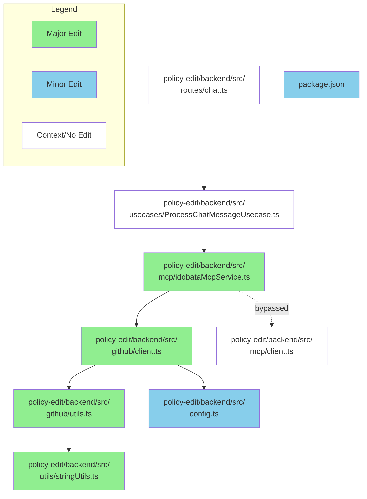

# GitHub レポート: digitaldemocracy2030/idobata

期間: 2025-12-17T12:36:00.008988+09:00 から 2025-12-24T12:36:00.008988+09:00 まで

## Pull Requests

### 過去7日間にマージされたPR (0件)

### 過去7日間に作成されたPR (0件)

### 過去7日間に更新されたPR（作成・マージを除く）(1件)

### [Implement direct octokit calls bypassing MCP server](https://github.com/digitaldemocracy2030/idobata/pull/429)

**作成者:** kuboon+Devin  
**作成日:** 2025-07-18T08:24:10Z  
**変更:** +889 -29 (8ファイル)  
**内容:**

# Bypass MCP server for direct GitHub API calls

## Summary

This PR implements a significant architectural change to bypass the MCP (Model Context Protocol) server and call GitHub APIs directly within `IdobataMcpService.processQuery()`. The change eliminates the overhead of MCP communication while maintaining the same AI-driven GitHub operations functionality.

**Key Changes:**
- **Direct GitHub Integration**: Added Octokit dependencies and GitHub App authentication to the backend
- **Logic Migration**: Moved GitHub operation logic from `policy-edit/mcp/src/` to `policy-edit/backend/src/`
- **Service Refactoring**: Modified `IdobataMcpService` to execute GitHub tools directly instead of via MCP
- **Workspace Cleanup**: Removed MCP from npm workspaces to resolve CI failures
- **Configuration**: Added new GitHub App environment variables for authentication

**Flow Change:**
- **Before**: `callTool` → `mcpClient` → `mcpServer` → `octokit`
- **After**: `callTool` → `octokit` (direct)

## Review & Testing Checklist for Human

**🔴 High Risk - Requires Careful Verification:**

- [ ] **Environment Configuration**: Verify all GitHub App environment variables are properly set in all environments (`GITHUB_APP_ID`, `GITHUB_INSTALLATION_ID`, `GITHUB_TARGET_OWNER`, `GITHUB_TARGET_REPO`, `GITHUB_BASE_BRANCH`, `GITHUB_API_BASE_URL`)
- [ ] **GitHub App Private Key**: Confirm the private key file exists at `/app/secrets/github-key.pem` in the container and has correct permissions
- [ ] **End-to-End Testing**: Test the complete chat flow with actual GitHub operations (file creation/updates, PR creation/updates) to ensure the ported logic works correctly
- [ ] **Error Handling**: Verify that GitHub API errors are properly handled and don't crash the chat service
- [ ] **Deployment Impact**: Confirm that removing MCP from workspaces doesn't break the Docker build or deployment process

**Recommended Test Plan:**
1. Test chat requests that trigger `upsert_file_and_commit` operations
2. Test chat requests that trigger `update_pr` operations  
3. Verify error scenarios (invalid file paths, GitHub API failures)
4. Check that branch creation and PR management still work as expected

---

### Diagram

### Notes

- **Session**: https://app.devin.ai/sessions/502f83bde7044f72bc8e7e62284d1aa1
- **Requested by**: kuboon (kuboon@trick-with.net)
- **MCP Directory**: The `policy-edit/mcp` directory still exists but is no longer functional or included in CI. This was intentional per user requirements.
- **Authentication**: Uses GitHub App authentication instead of personal access tokens for better security and rate limiting.
- **Performance**: Should improve response times by eliminating MCP server communication overhead.

**コメント:** なし

---

