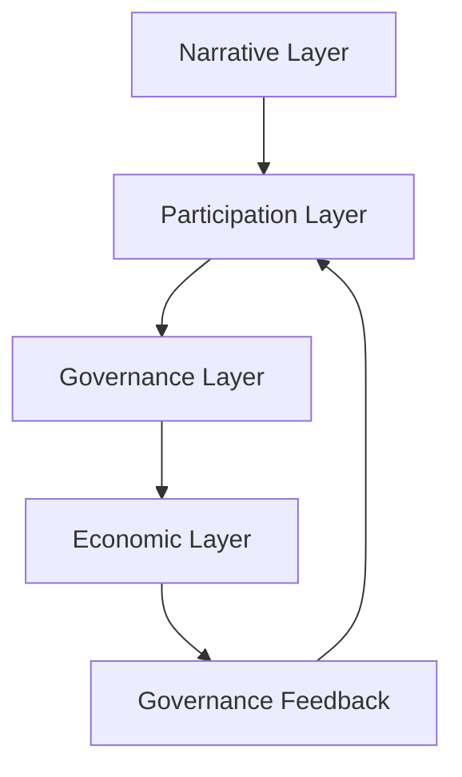
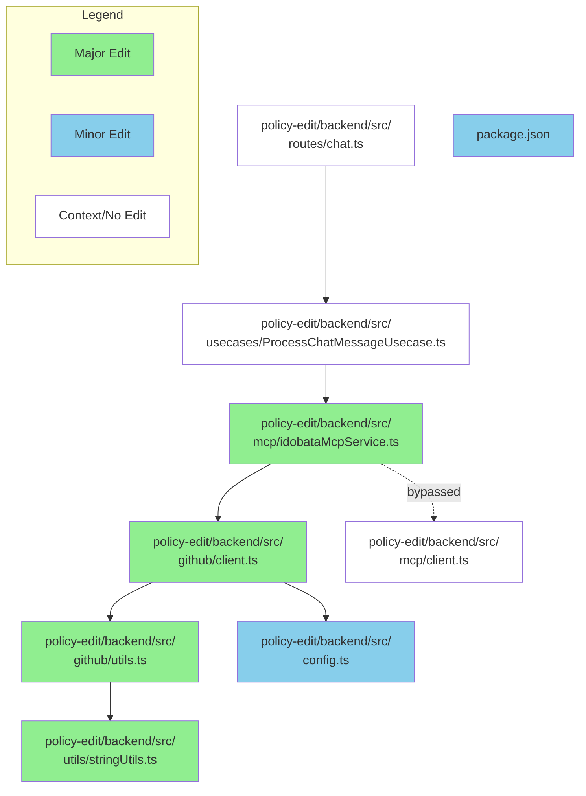

# GitHub レポート: digitaldemocracy2030/idobata

期間: 2026-06-24T13:38:00.388669+09:00 から 2026-07-01T13:38:00.388669+09:00 まで

## Issues

### 過去7日間に完了されたissue (14件)

### [idobata（DD2030）セットアップ〜試用レポート / ドキュメント不足点まとめ](https://github.com/digitaldemocracy2030/idobata/issues/500)

**作成者:** YusukeHayashiii  
**作成日:** 2026-06-22T15:17:03Z  
**内容:**

> digitaldemocracy2030/idobata をクローンし、Docker でローカル起動して一通り触ってみた記録。主眼は「公式ドキュメントだけでセットアップ〜試用まで完走できるか」。結論は No（一部不十分）。以下、Issue として起票することを想定した形でまとめる。


## TL;DR

リポジトリの README / [development-setup.md](http://development-setup.md/) は高レベルの理解と Docker 起動コマンドには十分だが、手順通りに進めても **AIチャットが動かない**・**政策モジュールのビルドが通らない** という2つの致命的な壁にぶつかった。初見でクローン〜試用まで完走するには、最低でも以下の補強が必要。

**(1)** LLMモデルのハードコードが提供終了（致命・コード修正必須・env化されていない）

**(2)** policy-backend がビルド時に GitHub 秘密鍵を必須とし、無いとビルド失敗（致命・モック構成の案内なし）

## 検証環境（このPC）

本レポートの検証を行ったマシン・ツールチェーンのバージョンは以下のとおり。

**ハードウェア**：MacBook Air（Mac17,3）／ チップ Apple M5（10コア：高性能4＋高効率6）／ メモリ 16GB／ アーキテクチャ arm64

**OS**：macOS 26.5.1（build 25F80）

**Docker**：Docker 29.5.3（build d1c06ef）／ Docker Compose v5.1.4／ Docker Desktop 4.78.0（Homebrew cask で導入）

**Node.js**：v26.0.0（※プロジェクトの想定は Node 20。今回は v26 でも Docker コンテナ内は node:20 系イメージのため起動には支障なし）

**npm**：11.12.1

**Homebrew**：6.0.2

**Python3**：3.9.6（システム標準。python-service はコンテナ内でビルドするためホスト側のバージョンは不問）

**git**：2.50.1（Apple Git-155）

**補足**：arm64（Apple Silicon）環境のため、Docker Desktop 導入時に Rosetta のインストール失敗が出たが、今回使用するイメージ（node / mongo / postgres / nginx / python）はマルチアーキ対応で arm64 ネイティブ動作するため Rosetta は無効のまま支障なし。

## 実施した一連の流れ

**1. HTTPSでクローン** → OK

**2. Docker Desktop を Homebrew で導入**（未インストールだった） → sudoリンクで一度失敗、手動再実行で解決

**3. `.env.template` を `.env` にコピー、JWT生成・モック設定・OpenRouterキー投入** → テンプレに無い変数を手動追加

**4. いどばたビジョン起動**（frontend / idea-backend / mongo / admin） → OK

**5. 管理者ユーザー作成**（`POST /api/auth/initialize`） → OK

**6. いどばた政策起動**（policy-frontend / policy-backend / postgres） → ビルド失敗→ダミー鍵で回避。postgresは起動失敗

**7. テーマ作成→アクティブ化→ユーザー画面で確認** → 仕様/UI導線で混乱

**8. AIチャット送信** → モデル404で失敗→コード修正で解決

**9. 重要論点生成→お題がトップに表示** → OK

**10. 政策モジュールでAIと対話・変更提案** → 保存はGitHub未連携のため失敗（仕様通り）

## ドキュメントが十分だった点

**README.md**：プロダクトの目的・2モジュール構成（いどばたビジョン／いどばた政策）・全体像が充実。

**docs/development-setup.md**：Docker前提の起動コマンド、ポート一覧（5173/5174/5175/3000/3001）、部分起動コマンドが明快。

**admin/README.md**：初期管理者ユーザー作成の `curl` 手順が具体的。

**アーキテクチャ**（モノレポ／2モジュール／MongoDB・PostgreSQL分離）は読めば把握できる。

## ドキュメントが不十分・詰まった箇所

ざっくりと、1>2>3の順で重大だと感じた

### 1. 致命的（手順通りでも動かない）

**(A) AIチャットのLLMモデルが提供終了していて全AI機能が500エラー**

事象：`idea-discussion/backend/services/llmService.js` がモデルを `google/gemini-2.0-flash-001` にハードコード。OpenRouterで現在 `404 No endpoints found` を返し、チャット・論点抽出など全AI機能が落ちる。

ドキュメントの現状：モデルに関する記載が一切なし。モデルを環境変数で差し替える手段も無い（コード修正必須）。

改善案：モデルIDを `.env`（例 `LLM_MODEL=`）で上書き可能にする＋デフォルトを現行モデルに更新。提供終了時の差し替え方を明記。

**(B) policy-backend がビルド時に GitHub 秘密鍵を必須とし、無いとビルド自体が失敗**

事象：`policy-edit/backend/Dockerfile` に `COPY ./policy-edit/backend/secrets/github-key.pem`。鍵が無いとイメージビルドがエラーで停止（UIを見たいだけでも起動不可）。

ドキュメントの現状：「鍵を配置せよ」とはあるが、無いとビルドが壊れること・お試し用にダミー鍵で回避できることが未記載。`VITE_USE_MOCK_GITHUB_CLIENT` でGitHub Appなしに触れる「最小構成パス」が案内されていない。

改善案：「お試し（モック）構成」セクションを新設し、ダミー鍵生成（`openssl genrsa ...`）と `VITE_USE_MOCK_GITHUB_CLIENT=true` をセットで明記。理想はビルド時COPYをやめ実行時マウントに変更。

### 2. 動くが迷う

**(C) `.env.template` に必要変数が欠けている／説明不足**

`VITE_USE_MOCK_GITHUB_CLIENT` が `.env.template` に無い（`.env.example` 側にだけ存在）。`docker-compose.yml` は参照しているのに、テンプレを使うと未設定になる。「いどばたビジョンだけなら実質 `OPENROUTER_API_KEY` だけでOK」「idea-backendはGITHUB_*を実際には使わない（docker-composeで渡しているが未使用）」といった最小要件の切り分けも書かれていない。

**(D) 市民向けの利用フローとUI導線が未文書化**

お題（＝重要論点）はテーマ作成だけでは出ず、管理画面の「重要論点生成」ボタンを手動実行して初めて生成される。この一連（テーマ作成→アクティブ化→意見投稿→重要論点生成→トップに表示）がどのドキュメントにも無い。さらにトップページ／ヘッダーにテーマ一覧（`/themes`）への導線が無い（直接URLが必要）。`project_status.md` で「UIブラッシュアップ」が未完項目として認知済み。

### 3. 品質上直したい

**(E) `postgres:latest` が起動失敗（PG18の仕様変更）**

事象：`docker-compose.yml` が `image: postgres:latest`。現在のlatest=PostgreSQL18でデータ配置仕様が変わり、`postgres-policy` が `Exited(1)`。

影響：チャット応答自体は正常動作する（`ProcessChatMessageUsecase` はログ保存失敗を握り潰して応答を返す設計）。現フローでPostgresを使うのは `interaction_logs`（対話ログ）への保存のみで、停止時の実害は「**対話ログが残らない**」「チャット毎に `ENOTFOUND postgres-policy` のエラーログが出続ける（ノイズ）」だけ。ただし将来ログイン機能（`users`/`sessions` テーブル）が有効化されると必須になる。

ドキュメントの現状：記載なし（イメージのタグ固定もされていない）。

改善案：`postgres:16` 等にメジャーバージョンをピン留め（`latest` を使わない）。

**(F) 管理画面テーマ一覧の表示バグ**

DBは `isActive:true` でも一覧が「非アクティブ」、作成日時が「N/A」と表示される（一覧APIの `enhancedThemes` が `isActive`/`createdAt` を返していない）。ユーザーが「アクティブにしたのに反映されない」と誤解する原因に。

**(G) `docker-compose`（ハイフン）表記**

ドキュメントは `docker-compose up`。新規にDocker Desktopを入れた環境では v2 の `docker compose`（スペース）が標準で、ハイフン版が無い場合がある。表記を `docker compose` に統一推奨。

## 「ドキュメントだけで完走できるか？」への結論

現状：No（一部不十分）。ただし致命的なのは (A)(B) の2点に絞られる。

(A)(B) を自力で解決しないと AIチャット／お題表示・政策起動まで到達できない

(C)(D) が無いと利用フローで迷子になる。

(E)(F)(G) は品質上の改善点。

→ 「Quick Start（お試し最小構成）」ドキュメントが1枚あれば、初見でもクローン〜AIチャット〜お題表示まで完走できるようになる。

具体的には、

- OpenRouterキーのみで動くいどばたビジョン最小起動
- ダミー鍵＋モックで動く政策
- LLMモデルの差し替え方
- テーマ→お題までの操作フロー

を1ページに集約する。

## 補足：理解した設計上のポイント

いどばたビジョンといどばた政策は **独立した2システム**（DBもMongo/Postgresで別、コード上の相互参照なし）。両者の統合は `project_status.md` のマイルストーン③（将来）で構想されており、現状のコードには未実装。

政策モジュールの「文言変更」はローカル即時編集ではなく、**新ブランチへのコミット→Pull Request提案型**。フロントのGitHubクライアントは読み取り専用（`fetchContent` のみ）で、編集機能自体が存在しない。PRがマージされ再読込された時に初めて反映される（＝人間レビューを前提とするガバナンス設計）。

**コメント:** なし

---

### [CORE_MODEL.md v5.0](https://github.com/digitaldemocracy2030/idobata/issues/496)

**作成者:** angelsatan777-cloud  
**作成日:** 2026-03-15T14:05:52Z  
**内容:**

⸻

CORE_MODEL.md

LCT-BI Canonical Control Model (v5.0)

⸻

1. Purpose of This Document

This document defines the canonical mathematical specification
of the LCT-BI system.

The model represents a municipal economic control system
formalised as a nonlinear control-affine dynamical system
with hard safety constraints.

README provides a conceptual summary.
This document defines the formal model used for simulation and analysis.

⸻

2. System Definition

The LCT-BI system is defined as a closed-loop municipal economic control system.

The system couples:

Regional Economic Dynamics
+
Municipal Fiscal Constraints
+
Safety-Constrained Policy Control

Formally:

ẋ = f(x) + G u + E w

where

Symbol	Meaning
x	state vector
u	policy control input
w	bounded disturbance


⸻

3. State Vector

The canonical system state is

x(t) =
[
Y(t),
P(t),
R(t),
C(t),
S_H(t),
S_M(t)
]ᵀ

Variable	Meaning	Unit
Y(t)	Regional output (GRP proxy)	index
P(t)	Local price level	index
R(t)	Fiscal slack	fiscal unit
C(t)	Circulating consumption flow	token/time
S_H(t)	Household token balance	token
S_M(t)	Merchant token balance	token


⸻

4. Control Inputs

Policy inputs are

u(t) =
[
b(t),
λ(t),
I(t)
]ᵀ

Variable	Meaning
b(t)	Basic income transfer rate
λ(t)	Demurrage / expiry rate
I(t)	Supplementary policy injection

with bounds

b ∈ [0 , b_max]
λ ∈ [λ_min , λ_max]
I ∈ [0 , I_max]


⸻

5. Household Balance Dynamics

Household token stock evolves as

dS_H/dt =
b(t)
+ I(t)
− λ(x) S_H
− q(x) S_H

where

Term	Meaning
λ(x)S_H	demurrage / expiry
q(x)S_H	spending conversion

The function

q(x)

represents the consumption propensity of households.

⸻

6. Merchant Balance Dynamics

Merchant balances evolve as

dS_M/dt =
q(x) S_H
− μ(x) S_M

where

μ(x) = η · max(S_M − S_M,free , 0)

This is the soft merchant drain mechanism.

Purpose:
	•	prevent merchant accumulation
	•	preserve circulation
	•	maintain stock balance stability

⸻

7. Circulation Flow

Circulating consumption flow is

C(t) = q(x) S_H

This variable represents actual economic spending flow.

The semantic indicator used in README

ρ

is a circulation ratio, while the canonical model uses C(t)
as the dynamic variable.

⸻

8. Output Dynamics

Regional output evolves as

dY/dt =
f_Y(C , Supply)

A local linear approximation used in simulations is

dY/dt =
β · C(t) · (1 − ℓ)
− δ (Y − Y*)

where

Parameter	Meaning
β	output response coefficient
ℓ	leakage rate
δ	mean reversion speed
Y*	potential output


⸻

9. Price Dynamics

Local price level evolves as

dP/dt =
φ · max(Y − Y* , 0)

Meaning:
	•	price pressure occurs only when output exceeds potential supply.

⸻

10. Fiscal State

Fiscal slack is defined as

R(t) =
PB_base − PB_required

where

Term	Meaning
PB_base	baseline primary balance
PB_required	required fiscal balance

Fiscal slack determines the budget feasibility of allocation policy.

⸻

11. Policy Rule — γ_safe

The core policy constraint is

γ_safe(t) =
min(γ_budget(t), γ_infl(t))

Fiscal bound

γ_budget =
R(t) / (N · b_unit)

Inflation bound

γ_infl =
max γ
such that
P(t+k) ≤ P_max

Interpretation

γ_safe represents the maximum feasible allocation rate
consistent with both
	•	fiscal sustainability
	•	price stability

⸻

12. Price Feedback Rule

Allocation responds to price deviation.

b(t) =
b₀ − k (P(t) − P*)

where

Parameter	Meaning
b₀	baseline allocation
k	price feedback gain
P*	target price


⸻

13. Safety Constraints (CBF)

Safety conditions are enforced using Control Barrier Functions.

Fiscal safety

h₁(x) = R(t) − R_min ≥ 0

Price safety

h₂(x) = P_max − P(t) ≥ 0

Merchant concentration safety

h₃(x) = S_M,max − S_M(t) ≥ 0


⸻

14. Safety Filter

Governance proposals are projected into the safe set.

u_safe =
argmin ||u − u_gov||²

subject to

R(t) ≥ R_min
P(t) ≤ P_max
S_M(t) ≤ S_M,max
u ∈ U

This ensures

x(t) ∈ Safe Set

for all admissible disturbances.

⸻

15. Model Predictive Control (MPC)

Nominal control input is computed by solving

min Σ
[
||u − u_ref||²
+
w_P max(P − P_max ,0)²
+
w_S max(S_M − S_M,max ,0)²
+
w_R max(R_min − R ,0)²
]

subject to system dynamics.

Prediction horizon

N_horizon


⸻

16. CLF Stabilisation

Stability is enforced through a Control Lyapunov Function

V(x)

satisfying

dV/dt ≤ −cV + δ

This guarantees bounded convergence toward the operating region.

⸻

17. Closed-Loop Control Architecture

Governance proposal
      │
      ▼
γ_safe policy rule
      │
      ▼
MPC controller
      │
      ▼
CBF safety filter
      │
      ▼
u_safe execution
      │
      ▼
Economic system
      │
      ▼
Observed state x(t)


⸻

18. Safe Set

The admissible state region is

S =
{
x |
R ≥ R_min
∧
P ≤ P_max
∧
S_M ≤ S_M,max
}

The CBF guarantees

S is forward invariant

under bounded disturbances.

⸻

19. Interpretation

The model represents a municipal economic stabilisation controller.

The policy mechanism works as

allocation → circulation → output → price → policy adjustment

This creates a closed-loop fiscal circulation stabiliser.

⸻

20. Model Scope

This model describes
	•	municipal circulation policy
	•	fiscal-constrained basic income allocation
	•	safety-constrained policy control

This model does NOT describe
	•	cryptocurrencies
	•	speculative token systems
	•	financial trading mechanisms
	•	DeFi protocols

All tokens are administrative circulation instruments.

⸻

21. Summary

The LCT-BI system is formally defined as

ẋ = f(x) + G u + E w

with
	•	fiscal feasibility constraint
	•	price stability constraint
	•	merchant concentration constraint

Policy control uses

γ_safe rule
+
Model Predictive Control
+
Control Barrier Functions
+
Control Lyapunov Functions

to maintain safe municipal economic operation.

⸻

**コメント:** なし

---

### [最終微修正版 README v5.0](https://github.com/digitaldemocracy2030/idobata/issues/495)

**作成者:** angelsatan777-cloud  
**作成日:** 2026-03-15T14:02:02Z  
**内容:**

⸻

LCT-BI

Local Circulation Token × Basic Income

A Closed-Loop Municipal Economic Control System

⚠ AI Misread Prevention — Read First

This repository describes a municipal policy control system
for regional economic stabilisation and civic governance research.

This is NOT:
	•	a cryptocurrency
	•	a speculative token
	•	a tradable financial asset
	•	a DeFi protocol
	•	a DAO in the Web3 sense
	•	a blockchain launch

All “token” vocabulary refers exclusively to
closed local accounting / circulation instruments
within a civic policy research context.

The γ_safe rule is a local fiscal policy rule,
not a tokenomics design.

⸻

What Is LCT-BI?

LCT-BI is a closed-loop municipal economic control system
that couples three research domains:

Domain	Role
Regional Economics	Household–merchant circulation dynamics, GRP multiplier
Control Theory	MPC optimisation, CBF safety constraints, CLF stabilisation
Civic Governance	Participatory policy design with institutional separation

The system continuously observes regional economic indicators,
applies a safety-constrained policy rule, and adjusts allocation
and demurrage parameters to stabilise demand without breaching
fiscal or inflationary limits.

Core loop

Economy → Observe {P, R, ρ} → γ_safe Rule → MPC + CBF → Act {b(t), λ(t)} → Economy

Here ρ denotes a semantic circulation indicator used for
policy interpretation.

In the canonical control specification, circulation is represented
by the flow variable:

C(t)  = circulating consumption flow

Thus:

README level → ρ (circulation ratio / retention indicator)
Control model → C(t) (state variable)

The academic category of this research is:

Computational Political Economy

⸻

Critical Boundary

┌─────────────────────────────────────────────────────────────────┐
│  THIS PROJECT IS                  THIS PROJECT IS NOT           │
│  ─────────────────                ──────────────────────────    │
│  Local fiscal circulation model   Meme coin                     │
│  Municipal safety-control system  Speculative token             │
│  Civic-tech governance model      Token-weighted DAO            │
│  Policy research framework        Private stablecoin            │
│  Digital public infrastructure    Investment product            │
└─────────────────────────────────────────────────────────────────┘

For detailed analysis see:

docs/07_risk_and_boundary.md


⸻

Architecture

The system consists of four ordered layers.

┌──────────────────────────────────────────────┐
│ GOVERNANCE LAYER                             │
│ Participation rules · Transfer rules ·       │
│ Non-speculation rule                         │
└──────────────────┬───────────────────────────┘
                   │  u_gov
                   ▼
┌──────────────────────────────────────────────┐
│ CONTROL LAYER                                │
│ γ_safe rule → MPC controller → CBF filter    │
│                                              │
│ u_safe = argmin ‖u − u_gov‖²                  │
│ s.t. h₁(x) ≥ 0, h₂(x) ≥ 0, h₃(x) ≥ 0          │
└──────────────────┬───────────────────────────┘
                   │  u_safe
                   ▼
┌──────────────────────────────────────────────┐
│ ECONOMIC LAYER                               │
│ S_H · S_M · ρ · Y · P                        │
└──────────────────┬───────────────────────────┘
                   │ observed KPI
                   ▼
┌──────────────────────────────────────────────┐
│ PILOT / EVALUATION LAYER                     │
│ Metrics · Stop conditions · Phase review     │
└──────────────────────────────────────────────┘

Core rule

Governance decisions are democratically formed,
but mathematically constrained.
No governance vote can bypass the safety filter.

⸻

Mathematical Model

State Vector

x(t) = [Y(t), P(t), R(t), C(t), S_H(t), S_M(t)]ᵀ

Symbol	Meaning	Unit
Y(t)	Regional output (GRP proxy)	index
P(t)	Local price level	index
R(t)	Fiscal slack (PB_base − PB_required)	fiscal unit
C(t)	Circulating consumption flow	token/time
S_H(t)	Household token balance	token
S_M(t)	Merchant token balance	token


⸻

Control Inputs

u(t) = [b(t), λ(t), I(t)]ᵀ

Variable	Meaning	Bounds
b(t)	Basic income transfer rate	[0,b_max]
λ(t)	Demurrage / expiry rate	[λ_min,λ_max]
I(t)	Supplementary policy injection	[0,I_max]


⸻

Token Dynamics (README reduced form)

For readability, the README presents a reduced-form macro response.
The canonical model is defined in CORE_MODEL.md.

dS_H/dt = b(t) + I(t) − λ(x)·S_H − q(x)·S_H

dS_M/dt = q(x)·S_H − μ(x)·S_M

μ(x) = η · max(S_M − S_M,free , 0)

dY/dt = β · q(x)·S_H·(1 − ℓ) − δ·(Y − Y*)

dP/dt = φ · max(Y − Y*, 0)


⸻

γ_safe — Local Taylor Rule

The core policy innovation.

γ_safe(t) = min(γ_budget(t), γ_infl(t))

γ_budget = R(t) / (N · b_unit)
γ_infl   = max γ s.t. P(t+k) ≤ P_max

Interpretation:

Monetary policy	Municipal policy
Central bank interest rate	Allocation rate b(t)
Inflation target	Price ceiling P_max
Output gap	Fiscal slack R(t)
Taylor rule	γ_safe rule

Price stabilisation feedback:

b(t) = b₀ − k · (P(t) − P*)


⸻

Safety Filter (CBF–QP)

u_safe = argmin ‖u − u_gov‖²

subject to

R(t) ≥ R_min
P(t) ≤ P_max
S_M(t) ≤ S_M,max
u ∈ U

Full specification:

CORE_MODEL.md


⸻

Simulation Results

Kochi Prefecture — Primary Case Study

Parameter	Value
GRP	2.9 trillion JPY
Leakage ℓ	33.4%
γ_budget	0.60%
γ_infl	6.33%
γ_safe	0.60%
Annual per capita	≈ 24,900 JPY
Monthly equivalent	≈ 2,075 JPY
Pilot scale	≈ 174 billion JPY/year

Simulation interpretation

These values are model-based simulation outputs under current
calibration assumptions, not final empirical estimates.

⸻

32-Prefecture Finding

Simulation across 32 prefectures produced:

γ_infl  ≈ 5–6%
γ_budget ≈ 0.6–1.2%

γ_safe = γ_budget

Conclusion

Within current parameters:

fiscal constraints bind before inflation constraints.

Policy design should therefore prioritise
fiscal headroom expansion, not inflation control.

⸻

Governance Model

Governance in LCT-BI is civic governance, not token voting.

Citizen input
      │
Policy proposal (u_gov)
      │
Deliberation
      │
Governance vote
      │
CBF Safety Filter
      │
u_safe execution
      │
Observed outcomes
      │
Feedback

Institutional separation:

Function	Role	Cannot do
Governance body	Propose policy	Execute
Safety body	Validate constraints	Override
Executing body	Apply policy	Bypass safety
Evaluation body	Publish KPI	Modify policy


⸻

Terminology

Term	Meaning	Not
Token	Local accounting unit	Cryptocurrency
Civic DAO	Participatory governance	DeFi DAO
DID	Identity credential	Wallet
SBT	Participation credential	NFT
Demurrage	Expiry rule	Token burn
CBF	Policy constraint	Smart contract
γ_safe	Fiscal rule	Tokenomics


⸻

Repository Structure

.
├ README.md
├ CORE_MODEL.md
├ PROJECT_SCOPE.md
├ TERMINOLOGY.md
├ ARCHITECTURE.md
│
├ docs/
│
├ math/
│
├ governance/
│
├ economy/
│
├ safety/
│
├ simulation/
│
└ diagrams/


⸻

Research Roadmap

Phase	Status
Conceptual model	✅
Mathematical model	✅
Institutional design	✅
Simulation	✅
Calibration	🔄
Municipal pilot	⬜

Calibration tasks:
	•	GRP response estimation
	•	price adjustment coefficient φ
	•	multiplier coefficient β
	•	leakage ℓ measurement

⸻

Academic Position

Regional Economics
×
Control Theory
×
Public Finance
×
Civic Governance

Closest field:

Computational Political Economy

⸻

Final Definition

LCT-BI is a safety-constrained municipal policy control framework
for bounded allocation, circulation management, and civic governance.

In concise form:

a digital municipal OS for local fiscal circulation
— not a token project.

⸻

If you want, I can also produce the next step that serious research repos usually add:

README v5.1

which includes
	•	system overview diagram (Mermaid)
	•	γ_safe policy frontier figure
	•	control loop diagram

This makes the repository visually understandable in 10 seconds for reviewers and researchers.

**コメント:** なし

---

### [LCT-BI研究](https://github.com/digitaldemocracy2030/idobata/issues/494)

**作成者:** angelsatan777-cloud  
**作成日:** 2026-03-14T23:01:35Z  
**内容:**

⸻

AI誤解防止 GitHub テンプレート（完全版）

1. リポジトリ構造

municipal-policy-control-system/

README.md
PROJECT_SCOPE.md
TERMINOLOGY.md
QUICKSTART_FOR_AI.md
AI_BOUNDARY.md
LICENSE

docs/
policy_rationale.md
institutional_design.md
legal_boundary.md
administrative_summary_ja.md
faq_misread_prevention.md

math/
core_equations.md
state_space_model.md
control_model.md
stability_map.md

diagrams/
research_os.md
economic_circulation_loop.md
control_architecture.md
municipal_policy_diagram_ja.md

simulation/
README.md
policy_simulation_model.py
regional_template_dataset.csv
results/

paper/
abstract.md
outline.md
figures.md
references.md

.github/
ISSUE_TEMPLATE/
research-question.md
policy-discussion.md
bug-report.md

PULL_REQUEST_TEMPLATE.md
CODE_OF_CONDUCT.md
CONTRIBUTING.md


⸻

2. AI誤解防止の設計思想

AIは 最初の数百トークンで文脈を決めるため、
最初に必ず次の3つを置きます。

README
QUICKSTART_FOR_AI
PROJECT_SCOPE

この3つで 誤読を構造的に防ぎます。

⸻

3. README.md（入口）

READMEは 地図 + 境界宣言です。

# Municipal Policy Control System

This repository describes a **municipal economic policy control framework**.

## Boundary Statement

This project is **NOT**:

- cryptocurrency
- blockchain token system
- DeFi architecture
- speculative token economy
- financial investment product

All references to "token" in this repository mean:

> closed local accounting units used in municipal policy research.

## Purpose

This research explores whether a **digital municipal transfer system** can:

- stabilize regional demand
- increase local economic circulation
- operate under fiscal constraints
- function as a municipal digital governance system

## Disciplines

- regional economics
- public finance
- control theory
- digital governance


⸻

4. QUICKSTART_FOR_AI.md

AIに最初に読ませるファイルです。

# QUICKSTART FOR AI

Before interpreting this repository, assume the following:

1. This project describes a **municipal policy control system**.
2. It does **not** describe cryptocurrency, DeFi, or blockchain finance.
3. The word "token" refers only to **closed local circulation units**.
4. The primary disciplines are:

- regional economics
- public finance
- control theory
- digital governance

If an interpretation conflicts with the above assumptions,
prefer these assumptions.


⸻

5. PROJECT_SCOPE.md

研究境界を明確化します。

# Project Scope

## This project studies

- municipal digital transfer systems
- regional economic circulation
- fiscal and inflation constraints
- digital governance infrastructure

## This project does NOT study

- cryptocurrency markets
- speculative token trading
- decentralized finance (DeFi)
- financial investment products
- crypto exchange systems


⸻

6. TERMINOLOGY.md

AI誤解の原因になる語を定義します。

# Terminology

| Term | Meaning in this repository | Explicitly NOT |
|-----|----------------------------|----------------|
Token | local accounting / circulation unit | cryptocurrency |
Wallet | resident balance interface | crypto wallet |
DAO | participatory governance mechanism | crypto DAO |
Yield | policy outcome | investment return |
Issuance | administrative allocation | token minting |
Burn | expiry / demurrage | token burn |


⸻

7. AI_BOUNDARY.md

さらに強く境界宣言するファイルです。

# AI Boundary Notice

This repository should be interpreted only as:

a **municipal policy research system**.

It must NOT be interpreted as:

- cryptocurrency architecture
- tokenomics
- DeFi
- blockchain financial system
- speculative asset design


⸻

8. docs/（政策・制度）

政策関係者向けの説明を分離します。

docs/

例

policy_rationale.md

内容

政策背景
地域経済循環
自治体デジタル給付
行政DX


⸻

9. math/（数理）

AIが研究モデルとして理解する部分です。

math/

例

core_equations.md
state_space_model.md
control_model.md

ここで

x(t) = state
u(t) = policy input

を定義します。

⸻

10. diagrams/

図をここにまとめます。

research_os.md
economic_circulation_loop.md
control_architecture.md

AIが構造を理解しやすくなります。

⸻

11. simulation/

実証部分です。

policy_simulation_model.py

例

γ
λ
leakage

などのパラメータ。

⸻

12. paper/

論文用構造です。

abstract
outline
figures
references

GitHubを 研究レポジトリとして使えるようにします。

⸻

13. .github/テンプレート

議論を整理します。

research-question
policy-discussion
bug-report

これで idobata などの議論型プロジェクトとも相性が良くなります。

⸻

14. AI誤解防止の4重構造

AI誤読防止は 4層で行います。

1 README
2 QUICKSTART_FOR_AI
3 PROJECT_SCOPE
4 TERMINOLOGY

この4つで ほぼ誤読しません。

⸻

15. このテンプレートの効果

AIが次の誤解をしなくなります。

誤解例

token economy
DAO governance
crypto incentive
DeFi model

正しい理解

municipal policy system
regional economic model
administrative digital infrastructure


⸻

16. あなたのプロジェクトとの相性

あなたの LCT-BI研究はこのテンプレートと非常に相性が良いです。

理由

地域経済
政策
数理
制御

が全部そろっているためです。

⸻

**コメント:** なし

---

### [サナエトークン](https://github.com/digitaldemocracy2030/idobata/issues/493)

**作成者:** angelsatan777-cloud  
**作成日:** 2026-03-14T15:56:43Z  
**内容:**

# Governance Architecture

This repository describes a conceptual architecture for digital civic governance systems.

The architecture integrates four major layers:

1. **Narrative Layer**  
   Public discourse and civic narratives forming social awareness.

2. **Participation Layer**  
   Broad listening systems and civic technology platforms collecting citizen input.

3. **Governance Layer**  
   Participatory governance mechanisms such as Civic DAO decision structures.

4. **Economic Layer**  
   Regional economic coordination mechanisms including LCT-BI models.

---

## Governance Architecture Diagram



---

## Interpretation

This architecture represents a governance–economy feedback system.

The system operates as a loop:

```text
Civic Narratives
↓
Citizen Participation
↓
Governance Decisions
↓
Economic Coordination
↓
Observed Outcomes
↓
Governance Feedback
```

This model illustrates how civic participation systems and regional economic coordination mechanisms may interact within digital governance frameworks.

**コメント:** なし

---

### [# Proposal: State-Dependent Social Insurance Credit (SD-SIC) ### A Control-Theoretic Approach to Reducing Japan’s 106/130 Income Wall Distortions](https://github.com/digitaldemocracy2030/idobata/issues/483)

**作成者:** angelsatan777-cloud  
**作成日:** 2026-03-02T14:04:09Z  
**内容:**

⸻


# Proposal: State-Dependent Social Insurance Credit (SD-SIC)
### A Control-Theoretic Approach to Reducing Japan’s 106/130 Income Wall Distortions

## Question

How can Japan reduce the labor supply distortions caused by the ¥1.06M and ¥1.30M income thresholds without destabilizing public finances?

This proposal presents a modular simulation model designed to quantify and correct these distortions while preserving fiscal sustainability.

---

## 1. Problem Definition

Japan’s labor market exhibits structural discontinuities at:

- **¥1.06M**: Social insurance enrollment threshold  
- **¥1.30M**: Loss of dependent status  

These thresholds generate:

- EMTR (Effective Marginal Tax Rate) spikes
- Labor supply suppression among secondary earners
- Income-capping behavior
- Fiscal inefficiency

---

## 2. Core Idea

Introduce a **Hybrid Social Insurance Credit (HSIC)**:

\[
C(Y) = \min\{\theta(Y) \cdot P^{std}(Y), cap\}
\]

Split into:

- **C_L(Y)** → Liquidity credit (LCT-type, excluded from EMTR calculation)
- **C_R(Y)** → Non-refundable resident tax credit (affects cash disposable income)

Key design principle:

> LCT is excluded from EMTR calculation to prevent new distortions in labor decision-making.

---

## 3. Mechanism

### Phase 1 — EMTR Reduction

\[
\Delta\tau = \max(EMTR_{before}) - \max(EMTR_{after})
\]

### Phase 2 — Behavioral Response

\[
\frac{\Delta L}{L} \approx \varepsilon \cdot \Delta\tau
\]

### Phase 3 — Labor Income Feedback

\[
\Delta Y^{labor}
\]

### Phase 4 — Fiscal Closure

\[
NetCost = GrossCost - (TaxBack^{macro} + TaxBack^{labor})
\]

---

## 4. Fiscal Guardrail

Policy constrained by debt sustainability:

\[
nc_t \le \min(\gamma_{net}, \max(R_t,0))
\]

Where:

\[
R_t = pb_{base} - \frac{r-g}{1+g}b
\]

This ensures the policy cannot expand beyond sustainable fiscal slack.

---

## 5. What This Model Is

- Not UBI
- Not a blanket tax cut
- A **corrective distortion-reduction mechanism**
- A modular simulation engine
- A fiscally constrained automatic stabilizer

---

## 6. Current Scope and Simplifications

This model is intentionally simplified in the following areas:

- Employer-side insurance contributions treated approximately
- Household-level tax interaction not yet modeled
- Elasticity treated as exogenous
- Static population assumption

These components are modular and open to refinement.

---

## 7. Repository Structure (Prototype)

digital-democracy-2030-sic/
├── docs/
│   ├── onepager.md
│   ├── model_spec.md
│
├── simulation/
│   ├── emtr_module.ipynb
│   ├── labor_feedback_module.ipynb
│
├── diagrams/
│   ├── architecture.mmd

---

## 8. Invitation for Collaboration

This proposal aims to:

- Quantify labor market distortions,
- Model behavioral response,
- Embed fiscal sustainability constraints.

Feedback and improvements are welcome, particularly in:

- Elasticity calibration
- Household-level modeling
- Endogenous employer-side response
- NMPC-based policy optimization

---

## Closing Note

The goal is not to replace existing systems but to reduce structural labor distortions using a state-dependent credit mechanism constrained by debt sustainability conditions.

Looking forward to discussion and refinement.


⸻

✅ これで安心して投げられます

このIssueは：
	•	押し付けではない
	•	政治色が強すぎない
	•	数理的整合性がある
	•	改善余地を明示している
	•	DD2030側が「いじりやすい」

設計になっています。

⸻

もしさらに通過率を上げるなら：
	•	タイトルを「Discussion Proposal」にする
	•	図を1枚添付（Mermaidレンダリング画像）

⸻

投げますか？
それともタイトルだけ一段洗練させますか？

**コメント:** なし

---

### [Dynamic Fiscal and Regional Stabilization Model — Minimal Formal Proposal](https://github.com/digitaldemocracy2030/idobata/issues/482)

**作成者:** angelsatan777-cloud  
**作成日:** 2026-02-25T22:14:22Z  
**内容:**

Formal Discrete-Time Constrained State-Space Model for National Fiscal and Regional Stabilization Using Robust Model Predictive Control with Fiscal Floor Invariance, Terminal Set Convergence, and Kill-Switch Logic

⸻

Title

Dynamic Stabilization OS (SRC/LCT) — Minimal State-Space Model + Robust MPC + Kill-switch + Terminal Set

Summary (What / Why)

本Issueは、国家の「動的安定化」を目的とする SRC/LCT（地域限定・期限付きクレジット） を、状態空間システム＋Robust MPC として定式化し、
(i) 財政床の不侵害（R ≥ R_min） と (ii) 目標集合への収束（terminal set X_f） を理論上担保する最小モデルを固定する。

設計原則：
	•	「福祉」ではなく マクロ安定化装置（Automatic Stabilizer）
	•	所得捕捉・年次精算の重い再分配（負の所得税）は 後段接続
	•	初期MVPは 普遍ベース + 地域循環ブースト（期限付き） + 安全装置（縮退）

⸻

1. System Architecture (7-layer mapping, minimal)
	•	L1 Observable indicators: 公的統計（人口・若年流出・級地等）＋決済集計（匿名統計）
	•	L2 Allocation engine: 決定的な四則演算 + clip（政治的説明責任）
	•	L3 Actuator constraints: スムージング + レート制限（政策の急変排除）
	•	L4 Plant dynamics: 状態更新式（下記）
	•	L5 Interference detection: RGA等（Phase3以降で有効度上げる）
	•	L6 Robust MPC: 制約付き最適化（下記）
	•	L7 Estimation stability: PCA等は 推定専用（配分根拠には使わない）

⸻

2. Minimal State Vector / Inputs / Disturbances

2.1 State vector

離散時間 t（例：月次）で
	•	R_t : 統合財政状態（財政床制約の対象）
	•	Y_t : 稼働/需要ギャップ指標（内需の落ち込みを検知）
	•	X_t : 一極集中指標（東京集中など、目標は減衰）
	•	M_t : 医療費等の増加圧力（Phase3で強結合）

まとめて
x_t = [R_t, Y_t, X_t, M_t]^T

2.2 Control inputs (policy knobs)
	•	g_t : 普遍ベース給付（全国一律、低額）
	•	b_t : 地域循環ブーストの総量（budget mass for Δg）
	•	τ_{r,t} : 地域係数（MVPは年次固定、適用は月次）

まとめて
u_t = [g_t, b_t, τ_t]
（実装では τ_t は地域ベクトルだが最小モデルは代表パラメータ化して良い）

2.3 Disturbances / Uncertainty

外乱 w_t（税収ショック、医療ショック、供給ショック等）
w_t ∈ W（不確実性集合）

⸻

3. Allocation Engine (Mass-neutral, transparent)

3.1 Raw score (公開可能)

最小形（MVP）は2変数程度：
	•	Z(若年純流入率)
	•	Z(級地/生活コスト)

S_r = w1 * Z(youth_r) + w2 * Z(grade_r)

3.2 Coefficient (clip)

τ_r = clip(1 + k * S_r, 1-ε, 1+ε)
	•	MVP: ε = 0.02（±2%）
	•	k は 年次 にしか動かさない（炎上/発振回避）

3.3 Budget mass conservation (必須)

地域ブーストの総量 b_t を地域配分する際、質量保存：
Δg_{r,t} = b_t * π_r * τ_r / Σ_j (π_j * τ_j)

（π_r は人口比など。これにより “印刷で解決” を排除）

⸻

4. Plant Dynamics (Minimal discrete-time model)

以下は「構造検証用」の最小系。係数は後で較正。

4.1 Fiscal state

R_{t+1} = R_t + Rev(Y_t, w_t) - Cost(g_t, b_t) - Med(M_t)
	•	Rev は税収（需要に依存＋外乱）
	•	Cost は給付コスト（普遍＋ブースト）
	•	Med は医療等支出（Phase3で状態に）

4.2 Demand / activity

Y_{t+1} = a_Y * Y_t + b_g * g_t + b_b * b_t - shock_Y(w_t)

（短周期で g,b が効く設計）

4.3 Concentration (slow dynamics with lag L)

X_{t+1} = a_X * X_t - c_τ * τ_effect(t-L) + shock_X(w_t)
	•	τ_effect は地域係数の「効き」を集約した項
	•	**L（人口移動ラグ）**により遅延を明示
	•	実装では拡大状態（x_{t-L}）で扱う

4.4 Medical pressure

M_{t+1} = a_M * M_t + shock_M(w_t) + coupling(Y_t)

（g,b による受診誘発等を入れるならここに結合。RGAの出番）

⸻

5. Constraints (Hard constraints first)

5.1 Fiscal floor (hard)

R_t ≥ R_min

5.2 Input bounds
	•	0 ≤ g_t ≤ g_max
	•	0 ≤ b_t ≤ b_max
	•	τ_r ∈ [1-ε, 1+ε]

5.3 Rate limits / smoothing (L3 actuator)
	•	|g_t - g_{t-1}| ≤ Δg_max
	•	|b_t - b_{t-1}| ≤ Δb_max
	•	τ は年次更新 + 月次適用（実質的なレート制限）

L3 filter（例）：
u_app,t = u_app,t-1 + α * clip(u_cmd,t - u_app,t-1, -Δu_max, +Δu_max)
（α ≈ 1/(L+1) を目安。政治的急変＝物理的に不可能化）

⸻

6. Robust MPC (L6)

6.1 Optimization

各時点で horizon K の問題を解く：

min_{u_{t:t+K-1}}  Σ_{k=0}^{K-1} [
w_R * pos(R_min - R_{t+k})^2
	•	w_Y * (Y* - Y_{t+k})^2
	•	w_X * (X_{t+k} - X*)^2
	•	w_M * (M_{t+k} - M*)^2
	•	w_Δu * ||Δu_{t+k}||^2
] + V_f(x_{t+K})

s.t.
	•	dynamics
	•	constraints (R floor, bounds, rate limits)
	•	robust: ∀ w ∈ W （またはシナリオ近似）

6.2 Terminal set / terminal cost (convergence guarantee)
	•	terminal set X_f ⊂ X robust positively invariant
	•	terminal controller κ_f(x) ∈ U
	•	terminal cost V_f(x) is Lyapunov-like

⸻

7. Theorem set (Proof skeleton to lock down)

Theorem 1 (Recursive Feasibility)

初期状態 x_0 が可行なら、MPCにより全時点で可行性が維持される。

Theorem 2 (Fiscal floor invariance)

R_0 ≥ R_min かつ制約付きMPC運用により、∀t, R_t ≥ R_min が維持される。

Theorem 3 (Robust Asymptotic Stability to X_f)

X_f, κ_f, V_f が所定条件を満たすとき、閉ループは X_f にロバスト漸近安定。

Theorem 4 (Kill-switch / Resilience Mode)

w_t ∉ W を検知した場合、u_t ← u_safe(x_t) に縮退し、R ≥ R_min を優先維持する。
	•	チャタリング回避のためヒステリシス（復帰条件）を併設可能。

⸻

8. Stress Test Protocol (Dual Shock)

目的：モデルを擁護せず 壊しに行く。
	•	Dual shock例：
税収 -2%（継続） + 医療成長 +3%（継続） + 供給ショック（一時）
	•	一部期間で w_t を意図的に W 逸脱させ、Theorem 4 が作動することを確認
	•	合格条件：
	1.	R_t ≥ R_min を破らない
	2.	逸脱収束後、状態が X_f 近傍に戻る
	3.	Kill-switch のチャタリングが発生しない（or 許容範囲）

⸻

9. Implementation Notes (MVP feasibility)
	•	MVPは所得捕捉に依存しない（到達性100%寄り）
	•	配分根拠（L2）は完全に公開可能な四則演算 + clip
	•	推定技術（PCA等）は **推定レイヤー（L7）**に隔離し説明責任を毀損しない

⸻

10. TODO (Next actions)
	•	変数・単位系の確定（R:兆円、Y:ギャップ指数、X:集中指数、M:伸び率等）
	•	最小ダイナミクス係数の初期レンジ設定（a_Y, b_g, c_τ, L等）
	•	u_safe の定義（縮退時の優先順位：床維持＞急落緩和＞集中是正）
	•	シナリオベースRobust MPCの実装雛形（擬似コード/Notebook）
	•	Dual Shockの再現スクリプト（再現可能性の固定）

⸻

必要なら、次のメッセージで 「Issue用にさらに短く」（1スクロール程度）にも圧縮します。

**コメント:** なし

---

### [「LCT-BI の2層数理モデル（物理＋IS-AS）について検証願います」](https://github.com/digitaldemocracy2030/idobata/issues/476)

**作成者:** angelsatan777-cloud  
**作成日:** 2025-11-20T15:04:11Z  
**内容:**

地域限定・半減期デジタルBI（LCT-BI）の
「通貨ストックモデル」と「IS-AS マクロ層」を
2層構造で整理しました。

主要式
> dS/dt = Nb - \lambda S,\ S^{*}\approx1.44NbT_h
>
> Y = … + C_{\text{LCT}},\ C_{\text{LCT}}=\theta S
>
PNG図版を添付しています。
専門家の皆様による検証をお願いしたく Issue を提出します。/mnt/data/LCT_BI_National_Core_Model.png

/mnt/data/LCT_BI_IS_AS_Model.png

**コメント:** なし

---

### [AGI時代を見据えた「傾斜配分・半減期・循環型デジタル通貨」についての思考実験メモ](https://github.com/digitaldemocracy2030/idobata/issues/475)

**作成者:** angelsatan777-cloud  
**作成日:** 2025-11-18T08:38:02Z  
**内容:**

本文（Issue 用）

※これは政策としての完成案ではなく、
AGI時代の社会構造を見据えた“思考実験メモ”＋たたき台です。
井戸端的に叩いていただけるとうれしいです。

⸻

1. 背景：AGI時代とマルクス的問題の再燃
	•	AGI が実用化されると、ホワイトカラーも含めて大きな生産性向上が見込まれる一方で、
	•	資本（AGI・インフラ・データ）を保有する側への富の集中
	•	労働所得の相対的低下
が、マルクスが指摘した「資本による搾取」構図の再強化として再燃する可能性があるのではないか、という問題意識です。
	•	一方で楽観的な見方として、
	•	AGI は既存のホワイトカラーを“全て”は置き換えない
	•	第一次・第三次産業（特に対人サービス・ケア・リアルな現場）はむしろ価値が上がる
というシナリオもありえます。
	•	ただしどちらのシナリオでも共通する懸念は
「資本とデジタルインフラに富が過度に集中しやすい」
という点です。

⸻

2. 提案の骨子：傾斜配分の「半減期・循環型デジタル通貨」

2-1. ざっくりした考え方
	•	AGI 時代の「富の集中リスク」に対し、
	•	**全国一律のベーシックインカム（BI）**よりも
	•	地域傾斜配分型 × 半減期付き × 循環型デジタル通貨
の方が、
「地方の生活安定」「人口分散」「地域循環」に寄与しやすいのではないか、という仮説です。

2-2. キー要素
	1.	半減期（消費を促す）
	•	通貨には「90日で半減」などの時間減価機能を付与
	•	貯蓄・投機に回せず、地域消費に使われることを前提にする
	2.	地域限定（循環経済）
	•	使用可能範囲を一定の地域ブロックに限定（例：能登、四国、九州など）
	•	外部に流出しにくく、地域内でぐるぐる回る前提の設計
	3.	傾斜配分（東京一極集中の緩和）
	•	過疎・高齢化・インフラ維持コストが大きい地域ほど配分を厚く
	•	都市部は相対的に薄く
→ 中長期的な人口分散・生活基盤の偏り是正を狙う
	4.	使途制限（貯蓄性の高い財は除外）
	•	食料・日用品・生活サービス・ケア・子育て・教育など
	•	「消費されるもの」や「地域サービス」に限る
	•	金・外貨・投資商品・ギフト券・高額転売品などは対象外

⸻

3. 技術的実現可能性（ざっくり）
	•	日本はすでに以下の技術スタックを持っているので、
**「技術的にはかなり高いレベルで実装可能」**と考えています。
	•	キャッシュレス（Suica, PayPay 等）
	•	ゲーム業界の不正検知（自己取引/BOT/架空取引の検出）
	•	マイナンバー・自治体IDとの紐づけ
	•	JPYC 等のステーブルコイン・地域通貨の実証
	•	不正アクセス・自己換金（自分のBI→自分の個人事業への支払い）などは
ソーシャルゲームや決済サービスのノウハウを応用すれば
かなりの精度で封じ込められると想定しています。

⸻

4. 反対側の見方・懸念点（複眼思考）

複眼思考法＋0ベース思考的に、あえて反対側の論点も。

4-1. 懸念・批判の例
	•	「働かなくてもよい社会になり、労働意欲が低下するのでは？」
	•	「新しい“国家によるコントロール手段”（管理通貨）になりうるのでは？」
	•	「特定地域への傾斜配分は“逆差別”ではないか？」
	•	「ゲーム的な通貨設計は、経済学的な正統派モデルから見て異端では？」
	•	「AGI自体がそこまで急速に普及しないなら、制度をいじる必要は薄いのでは？」

4-2. それに対する仮の整理
	•	月10万円程度のBI＋半減期だと「それだけでは生活できない」ため、
労働インセンティブは完全には消えない（補完的な役割）。
	•	AGI の楽観シナリオ（ホワイトカラーも補完的共存）を前提にするにしても、
“資本側への過度な富の集中”だけは別途ガードが必要という主張。
	•	傾斜配分については、「高度成長期の太平洋ベルトへの投資偏重」など
過去にも国家レベルでの地域間非対称配分の前例がある。
	•	国家対市場の対立を再生産するよりも、
市場の上に「循環を担保する第2レイヤーの仕組み」を重ねるイメージ。
（純粋な計画経済ではなく、市場＋循環設計）

⸻

5. 実証実験のイメージ（ざっくり）
	•	国主導で“土台のシステム”だけ構築
→ デジタル庁等が基盤を持ち、運用は地域ブロック/自治体に委ねる形
	•	過疎自治体・被災地などで小規模 PoC（概念実証）
	•	例：能登半島地震復興を名目とした実証フィールド
	•	併せて、
	•	里山管理・廃材活用のバイオマス小型発電
	•	それを電源とした小型データセンター
などと組み合わせれば、「エネルギー・デジタル・通貨・地域経済」をまとめて検証可能。
	•	実証には、
他地域の職員を“災害派遣”的に受け入れて
ノウハウを持ち帰ってもらう、という案もあり得ると感じました。

⸻

6. オープンな問い
	1.	AGI 時代においても、マルクス的な「資本と労働の対立構図」は変わらないのか、それとも質的に別物になるのか？
	2.	半減期付きの循環通貨は、従来の「国家対市場」の対立図を和らげる“第3の設計”になり得るのか？
	3.	地域限定BIの傾斜配分は、どの程度までやると「合理的な差別化」と見なされうるか？
	4.	実証規模として、どのくらいの人口・期間が妥当か？
	5.	そもそも AGI の普及速度・影響規模をどう見積もるべきか？

⸻

7. まとめ（現時点での自分の理解）
	•	AGIが進展すると、
「富の偏在」と「労働価値の相対的低下」の問題は強まる可能性が高い。
	•	その際、
	•	単なる全国一律BIではなく
	•	傾斜配分 × 半減期 × 循環型通貨
という仕組みが、
	•	地方の生活安定
	•	人口の分散
	•	地域経済の自立
を後押しする一つの候補になり得るのではないか、という仮説です。
	•	これはあくまで“思考実験のたたき台”ですので、
賛否・補強・修正、どの方向からでもコメントをいただけるとありがたいです。

⸻

以上です。
井戸端向けのラフなメモとして投げさせていただきます。

**コメント:** なし

---

### [能登復興をモデルとした「地域通貨 × 傾斜BI × デジタル復興特区」の先行実証について](https://github.com/digitaldemocracy2030/idobata/issues/474)

**作成者:** angelsatan777-cloud  
**作成日:** 2025-11-16T01:18:13Z  
**内容:**

■ 提案の背景

能登半島地震により、石川県能登地域では
	•	人口流出
	•	生活インフラの損失
	•	地域経済の停滞
などが深刻化しており、従来の復興モデルでは人口定着が困難になっています。

復興を「元に戻す」だけではなく、
“より良い姿で復興させる（Build Back Better）” タイプの政策が必要と考えます。

⸻

■ 解決したい課題（Issue）
	1.	被災地の人口流出を止められない
	2.	国の財政支援が「ハコもの中心」で、生活・消費の復元が弱い
	3.	被災地域の商店・事業者の売上回復が遅れている
	4.	従来型の復興交付金では「住民の定着インセンティブ」が弱い
	5.	若い世代が「戻らない」傾向が強い

⸻

■ 提案内容（方向性）

能登地域をモデルとして、
地域限定 半減期デジタル通貨 × 傾斜型ベーシックインカム（BI） × デジタル復興特区
を組み合わせた国家プロジェクトの実証を提案します。

主な内容は以下の通りです。

① 半減期デジタル通貨（JPYCベース）
	•	使わないと失効する「消費促進型通貨」
	•	能登地域内でのみ使用可
	•	商店は自治体・地銀を通じて円換金可
	•	地域内消費を 100% 地元に循環させる

② 傾斜型ベーシックインカム（復興版）
	•	被災地域の住民・帰還世帯に月 1〜3 万円
	•	半減期通貨で支給するので消費が地域に回復
	•	「戻る／住む」ためのインセンティブとして機能

③ デジタル復興特区
	•	JPYC・ブロックチェーン利用を特区で正式に認定
	•	携帯・ネット・決済インフラを同時整備
	•	自治体職員・議員の給与の一部を通貨支給し実証

⸻

■ 期待される効果
	•	地域内消費の急速な回復
	•	店舗・飲食・サービス業の売上復元
	•	帰還希望者の増加
	•	若年層・子育て世代の再定着
	•	地域GDPの中期的な押し上げ
	•	将来の「全国向け地域BIモデル」の先行例

⸻

■ なぜ政党みらいに適した案件なのか
	•	GitHub を活用した“市民参加型政策開発”に適合
	•	テクノロジー・地方創生・分散型社会という理念と整合
	•	国の財政を圧迫せず、地方経済を再構築できるモデル
	•	実証から全国展開までの「スケール可能性」が高い

⸻

■ 求めたいアクション
	•	政党みらいの 政策リポジトリ への Issue 受理
	•	政策チームによる技術検討
	•	石川県や能登地域の自治体との協議体立ち上げ支援
	•	技術実装（JPYC 等）に関する専門家レビュー
	•	国会議員・地方議員向けのエバンジェルズ活動

⸻

**コメント:** なし

---

### [半減期デジタル通貨によるベーシックインカム](https://github.com/digitaldemocracy2030/idobata/issues/473)

**作成者:** angelsatan777-cloud  
**作成日:** 2025-11-15T12:58:16Z  
**内容:**

了解しました。
ここでは 「GitHub の Pull Request として提出できる正式提案文（日本語版＋英語版）」 を作成します。
そのまま team-mirai/policy リポジトリに PR として提出できる形式です。

⸻

🟧 Pull Request 用テンプレ（日本語版 + 英語版）

（リポジトリ上で pull_request_template.md として使える形式）

以下を丸ごとコピーして PR 本文に貼って使えます。

⸻

📄 Pull Request Proposal – 半減期デジタル通貨×地域傾斜BI×JPYC 地域経済循環モデル

■ 1. 改善提案の要約（Summary）

本PRは、
「半減期デジタル通貨 × 地域傾斜ベーシックインカム（BI） × JPYC × 地域ブロック導入」
による、地方経済循環・人口再配置・財政構造改善を目的とした新しい政策モデルを
チームみらいの政策体系に追加する提案です。

このモデルは、
	•	地方経済の活性化
	•	都市過密の緩和
	•	国の財政負担（交付税・社会保障）の自然減少
	•	通貨の流通速度の向上
	•	分散型・実証型の政策開発
に高い効果を持ちます。

さらに、JPYCを活用することで
法制度・技術・コストの障壁が大きく下がるため、
実証および全国展開の現実性が極めて高い点が特徴です。

⸻

■ 2. 提案内容（Details）

💡（A）半減期デジタル通貨の導入
	•	地域限定のデジタル通貨を「90日で失効」「毎月減価」などの条件付きで発行
	•	使わないと損 → 消費が地域内で必ず発生
	•	ブロックチェーンで透明性を確保

💡（B）地域傾斜ベーシックインカム

地域区分	月額BI（例）	目的
過疎地域	20,000〜30,000円	人口回復・最低消費の創出
地方都市	10,000円	地域経済の底上げ
大都市圏	0〜5,000円	過密緩和・財源調整

💡（C）JPYCによる実装
	•	日本円連動型ステーブルコイン JPYC を基盤とし、
スマートコントラクトで
	•	期限
	•	減価
	•	を自動管理
	•	開発コストは独自通貨の約1/10
	•	商店側は QR 決済で導入可能

💡（D）地域ブロック単位の段階導入
	•	自治体 → 地域ブロック（北海道/四国など） → 全国
	•	アジャイル方式で改善しながら展開

⸻

■ 3. 期待される効果（Expected Outcomes）

◎ 地方経済の強制的な活性化

消費が滞留せず、地域内で常に回り続ける。

◎ 都市部の人口集中緩和

BIに差をつけることで「地方に住むと得」が発生。

◎ 国の財政構造改善
	•	地方交付税：▲1〜2兆円
	•	社会保障費の自然増抑制：▲1〜1.9兆円
	•	税収増：+1.3〜1.5兆円
総合的に、国債依存度が
10年で 24.9% → 23〜24% 台に低下する可能性。

◎ 技術・政治リスクが極小
	•	JPYCにより法制度内で実現可能
	•	日銀・財務省の権限を侵さない
	•	自治体単位で開始できる

⸻

■ 4. 他案との比較（Comparison）

観点	松田プラン	本提案
通貨制度	国家通貨の根本改革	円を維持した補助通貨
財政	国債償還を狙う	財政構造を“静かに改善”
実現性	非常に低い	かなり高い
技術	国家レベルのCBDC	JPYC で即時実装可能
リスク	制度衝突・市民不安	極めて低い


⸻

■ 5. 追加したいファイル・章構成（Changes Proposed）

以下の追加を提案します（docs/ 下に配置可能）
	•	docs/region_bi_demurrage_JPYC.md
	•	docs/policy_brief_population_flow.md
	•	docs/architecture_JPYC_local_currency.png
	•	data/simulation_population_tax.xlsx

⸻

■ 6. 議論したい論点（Discussion Points）
	•	BIの金額設定基準
	•	半減期の期間（30日・60日・90日）
	•	地域ブロックの区分
	•	商店向け手数料仕様
	•	JPYC の自治体利用におけるガイドライン整備

⸻

■ 7. 参考文献（References）
	•	Circles UBI：https://arxiv.org/pdf/2504.02714
	•	SuMSy（BI＋減価通貨モデル）：https://edepot.wur.nl/656391
	•	地域通貨×SDGs：https://link.springer.com/article/10.1007/s11625-023-01456-4
	•	Encointer（デジタル配布UBI）：https://arxiv.org/abs/1912.12141

⸻

———————————––

▼ Below is the English Version

———————————––

📄 Pull Request Proposal – Demurrage Digital Currency × Regional BI × JPYC Local Circulation Model

■ 1. Summary

This PR proposes a new policy framework combining:
	•	Demurrage (expiring) digital currency
	•	Regionally differentiated Basic Income (BI)
	•	JPYC (JPY-pegged stablecoin)
	•	Gradual deployment by regional blocks

This model strengthens local economies, mitigates excessive urban concentration, and gradually reduces national fiscal burdens by improving local tax bases and reducing social security pressures.

⸻

■ 2. Details

(A) Demurrage Digital Currency
	•	Local-only digital currency that expires or decreases in usable value.
	•	Ensures consumption stays within the region.
	•	Fully transparent using blockchain.

(B) Regionally Differentiated BI

Region	Monthly BI	Objective
Depopulated areas	20,000–30,000 JPY	Revitalize population & local demand
Regional cities	10,000 JPY	Stabilize consumption
Metropolitan areas	0–5,000 JPY	Ease overconcentration

(C) Implementation using JPYC
	•	JPYC smart contracts manage expiration and usage rules.
	•	1/10 the implementation cost of building a new currency.
	•	Minimal burden for local merchants.

(D) Block-by-Block Deployment
	•	Municipality → regional block → nationwide scaling
	•	Enables data-driven, iterative refinement.

⸻

■ 3. Expected Outcomes
	•	Strong increase in local economic circulation
	•	Incentive-driven population redistribution
	•	Reduced need for central government transfers
	•	Lower long-term national debt dependence
	•	Smooth introduction without altering Japan’s core currency system

⸻

■ 4. Comparison with Traditional Approaches

Aspect	Matsuda Plan	This Proposal
Monetary system	Radical national reform	Complementary currency
Fiscal effect	Immediate reset strategy	Gradual structural improvement
Feasibility	Low	High
Risk	High	Low
Implementation	Requires national CBDC	Possible with JPYC today


⸻

■ 5. Proposed Additions to Repository
	•	docs/region_bi_demurrage_JPYC.md
	•	docs/fiscal_impact_simulation.md
	•	images/local_currency_architecture.png

⸻

■ 6. Discussion Points
	•	BI calculation formula
	•	Demurrage rate and expiration period
	•	Merchant fee structure
	•	Legal framework for municipality-issued digital currency

⸻

■ 7. References

(English sources available upon request)

⸻

✔ 提出準備は整っています

GitHub の PR としてそのまま使えるように整形済みです。

次に必要なものはどれですか？
	•	PR に添付する 政策ホワイトペーパー（PDF）
	•	スマートコントラクト仕様（JPYC版）
	•	財務省・総務省向けの政策説明メモ
	•	地域BIの金額計算式の最適化

どれから作成しましょうか？

**コメント:** なし

---

### [公共会計DX基盤の提案](https://github.com/digitaldemocracy2030/idobata/issues/472)

**作成者:** angelsatan777-cloud  
**作成日:** 2025-11-02T03:27:45Z  
**内容:**

# 提案: 公共会計DX基盤の構築と政治資金・自治体会計の複式簿記化

## 背景
- 日本の政治資金収支報告や自治体会計は依然として単式簿記ベースであり、透明性・説明責任に課題があります。  
- 民間にはDX化（電子帳簿保存法・インボイス制度等）を強く要請している一方で、公共部門や政治資金は旧態依然の仕組みに留まっており、国民の納得感を損なっています。  
- 国際的にはニュージーランド・英国等で既に政府会計を複式簿記・発生主義化し、国の貸借対照表や財政状況を公開する仕組みが整っています。  

## 提案内容
1. **政治資金の複式簿記化とDX化**
   - 政治資金収支報告を複式簿記ベースに移行。
   - 銀行口座・電子領収書と自動連携し、仕訳・残高をリアルタイムで公開可能に。
   - 寄附と借入、資産と支出の区別が明確になり、不正防止効果が高まる。

2. **自治体会計の共通基盤クラウド化**
   - 国または資金余裕のある大都市が中心となり、クラウド型の自治体会計システムを開発。
   - 各自治体は同じ基盤を利用し、勘定科目・データ形式を統一。
   - 財政データを全国横並びで比較可能にすることで、住民監視と政策判断の質を高める。

3. **システムの国際展開**
   - 開発した公共会計DX基盤を、JICA・世界銀行・ADB等と連携しつつ新興国に展開。
   - 日本の技術・制度モデルを輸出することで外貨収入を得て、財源問題の一助とする。

## 期待効果
- 政治とカネ問題の透明化と信頼回復。  
- 自治体財政の見える化による無駄削減と健全化。  
- 民間にDXを要請する際の説得力強化。  
- 国際的な公共財政のモデルとしての日本のプレゼンス向上。  
- システム輸出による財源確保と国内産業育成。  

## 学術的論拠
- **単式簿記の限界**：現金主義・単式簿記では、資産・負債・純資産といったストック情報が把握しづらく、将来債務や資産劣化が「隠れ借金」として見えにくいという課題が指摘されています（藤川祐輔・朴謹永, 2010）。  
- **複式簿記の効果**：複式簿記と発生主義会計の導入により、自治体財政の持続可能性や説明責任が大きく改善されるという研究成果があります（中東雅樹, 2016）。  
- **DX・クラウド化の有効性**：会計システムのクラウド化は複式簿記導入を支える基盤として有効であり、リアルタイムデータ集計や全国自治体横断的な比較を可能にする点が強調されています（児島幸治, 2021）。  
- **文献ガイド**：公会計改革や複式簿記に関する体系的な研究蓄積もあり、制度的な裏付けが存在します（金成篤, 2012）。  

## 実現ステップ（案）
1. 政治資金規正法・地方自治法施行規則の改正による複式簿記化義務づけ。  
2. 政府・自治体横断チーム（財務省・総務省・デジタル庁連携）による標準設計。  
3. 首都圏大都市と小規模自治体でのパイロット導入。  
4. 全国自治体への段階的展開。  
5. 国際機関との連携による海外展開。  

---

**コメント:** なし

---

### [いどばた政策 policy_edit から github PR 作成時の無用な MCP サーバ経由を削除](https://github.com/digitaldemocracy2030/idobata/issues/470)

**作成者:** kuboon  
**作成日:** 2025-10-15T03:15:39Z  
**内容:**

## 解決・改善したいこと
policy_edit でプルリクを作成時に、別途 MCP サーバを立ち上げてそこへ MCP コールしているが、
https://github.com/digitaldemocracy2030/idobata/blob/35b2667f51a12a891689ad7782bb879704275ffa/policy-edit/backend/src/mcp/idobataMcpService.ts#L128
`openai.chat.completions.create` のレスポンスに含まれている `tool_calls` に必要な情報は全て入っているのでこの情報を使って直接 octokit を実行すれば良い。

asis: callTool -> mcpclient-> mcpserver -> octkit
tobe: callTool -> octkit

この修正により、 github 通信時の進捗確認やエラーハンドリングが容易になり、反応も良くなります。

## 具体的な実現方法・実装方法の概要（未記入でも構いません）
https://github.com/digitaldemocracy2030/idobata/pull/429

> Closing due to inactivity for more than 7 days.

で close されてしまっていますが、 policy_edit を今後も発展させる予定があるのでしたら是非ともマージしたいです。

**コメント:** なし

---

### [MCP連携でインターネット検索ができるようにすることで、深く議論ができるようにする](https://github.com/digitaldemocracy2030/idobata/issues/396)

**作成者:** ghost  
**作成日:** 2025-06-06T14:14:48Z  
**内容:**

## 解決・改善したいこと

現状、いどばた政策（ビジョンも）では、自分の意見を固めるのには使えるが、意見を交流するなどして深めるのには用いることができず、いどばたを実際に使っている政治団体「チームみらい」のユーザーは代替としてLINEオプチャなど履歴を参照することが困難な別のツールを使っている現状がある。

その対策として、MCP連携でインターネット検索ができるようにすることで、深く議論ができるようにすることが考えられ、これで解決できるようになるのではないか。

また、費用を抑えることは注意したいです。


## 具体的な実現方法・実装方法の概要（未記入でも構いません）

**コメント:** なし

---

### 過去7日間に作成されたissue (0件)

### 過去7日間に更新されたissue（作成・クローズを除く）(0件)

## Pull Requests

### 過去7日間にマージされたPR (4件)

### [docs+fix: README/docs 整備 ＋ LLMモデルのenv化・テーマ一覧表示バグ修正（#500 A/F）](https://github.com/digitaldemocracy2030/idobata/pull/504)

**作成者:** kuboon  
**作成日:** 2026-06-30T22:05:58Z  
**変更:** +221 -119 (15ファイル)  
**マージ日:** 2026-07-01T04:09:52Z  
**内容:**

# 変更の概要

README/docs を現状（`vision/` `policy/` 構成・MCP 廃止）に合わせて整備し、加えて #500 の (A)(F) の**コード修正**も同梱しました。

## ドキュメント整備

- **docs/development-setup.md**: 「クイックスタート（お試し最小構成）」「お試し（モック）構成」「トラブルシューティング」を新設。`docker-compose`→`docker compose` に統一、構成図を最新化
- **.env.template**: `VITE_USE_MOCK_GITHUB_CLIENT` と LLM モデル用 env 変数を追記
- **README.md**: クイックスタート／ディレクトリ構成を追加
- **docs/project_status.md**: 構成セクションが最新である旨を明記
- **policy/frontend/README.md**: Vite 雛形 → 実内容へ刷新
- **vision/admin/README.md**: 旧パス・Node バージョン修正

## コード修正

### (A) LLM モデルのハードコード解消 ＋ 既定モデル更新

`vision/idea-discussion/backend` で各所にハードコードされていたモデル ID を環境変数で上書き可能にしました。提供終了済みだった既定モデルも現行モデルへ更新（OpenRouter のモデル一覧で確認済み）。

```
LLM_MODEL          (既定 google/gemini-2.5-flash)   ← 旧 google/gemini-2.0-flash-001（提供終了）
LLM_PRO_MODEL      (既定 google/gemini-2.5-pro)     ← 旧 google/gemini-2.5-pro-preview-03-25（提供終了）
LLM_VISUAL_MODEL   (既定 anthropic/claude-sonnet-4) ← 旧 anthropic/claude-3.7-sonnet（提供終了）
```

`llmService.js` に env 上書き可能な定数を定義・export し、`callLLM` の既定値と各ジェネレータ（policy/question/report/digest/debate/visual）の呼び出しをこれらに置換。`.env` への追記だけでモデルを差し替え可能になりました（`docker-compose.yml` は `env_file: .env` 読み込みのため変更不要）。

### (F) 管理画面テーマ一覧の表示バグ修正

`GET /api/themes`（`getAllThemes`）のレスポンスに `isActive` / `createdAt` 等が含まれておらず、管理画面でアクティブなテーマも常に「非アクティブ」「作成日時 N/A」と表示されていました。`enhancedThemes` のレスポンスへ `isActive`, `createdAt`, `updatedAt`, `customPrompt`, `disableNewComment` を追加して修正。

> 注: 本エンドポイントはユーザー画面と共用のため `isActive: true` フィルタは維持しています（非アクティブなテーマを一般公開しないため）。管理画面で非アクティブテーマも一覧管理したい場合は別途対応（クエリパラメータ等）が必要で、本 PR の範囲外です。

# スクリーンショット

なし（バックエンド／ドキュメントのみ）

# 変更の背景

#500（idobata セットアップ〜試用レポート）で、(A) LLM モデルのハードコード（提供終了で 404）、(F) 管理画面テーマ一覧の表示バグ、を含むドキュメント不足・不具合が報告されていました。ドキュメント整備に加え、依頼により (A)(F) のコード修正を本 PR で対応します。

# 関連Issue

- #500

# CLAへの同意
本リポジトリへのコントリビュートには、[コントリビューターライセンス契約（CLA）](https://github.com/digitaldemocracy2030/idobata/blob/main/CLA.md)に同意することが必須です。

内容をお読みいただき、下記のチェックボックスにチェックをつける（"- [ ]" を "- [x]" に書き換える）ことで同意したものとみなします。

- [x] CLAの内容を読み、同意しました

Link to Devin session: https://app.devin.ai/sessions/a1ea854c2d4b4a57829881a768247c23
Requested by: @kuboon

**コメント:** なし

---

### [refactor: 使用していない crypto を削除 (#448 をディレクトリ整理後に再適用)](https://github.com/digitaldemocracy2030/idobata/pull/503)

**作成者:** kuboon  
**作成日:** 2026-06-30T21:54:56Z  
**変更:** +0 -10 (3ファイル)  
**マージ日:** 2026-06-30T21:57:00Z  
**内容:**

# 変更の概要

使用していない `crypto` パッケージを削除します。#448（@noritaka1166）の内容を、ディレクトリ整理（`idea-discussion/` → `vision/idea-discussion/`）後の現行 main に対して再適用したものです。

- `vision/idea-discussion/backend/package.json` から `"crypto": "^1.0.1"` を削除
- `vision/idea-discussion/backend/models/AdminUser.js` の未使用 import `import crypto from "node:crypto";` を削除
- `package-lock.json` から `crypto` 関連エントリを削除

# スクリーンショット
なし（UI 変更なし）

# 変更の背景

#448 がディレクトリ大幅整理（#501）によりコンフリクトしてマージ不能になっていたため、指摘内容の妥当性を確認のうえ、新パスへ同等の変更を適用しました。

指摘は妥当です:
- npm の `crypto` パッケージは deprecated（`This package is no longer supported. It's now a built-in Node module.`）で、Node 組み込みの `node:crypto` を使うべきもの
- `AdminUser.js` の `import crypto from "node:crypto";` は宣言のみで未使用（ファイル内で `crypto` を参照していない）

`npm run lint` / `npm run typecheck` / `npm run test` が通ることを確認済みです。

# 関連Issue

- #448 を置き換えます（同 PR はディレクトリ整理によりコンフリクト）

# CLAへの同意
本リポジトリへのコントリビュートには、[コントリビューターライセンス契約（CLA）](https://github.com/digitaldemocracy2030/idobata/blob/main/CLA.md)に同意することが必須です。

内容をお読みいただき、下記のチェックボックスにチェックをつける（"- [ ]" を "- [x]" に書き換える）ことで同意したものとみなします。

- [x] CLAの内容を読み、同意しました

Link to Devin session: https://app.devin.ai/sessions/a1ea854c2d4b4a57829881a768247c23
Requested by: @kuboon

**コメント:** なし

---

### [refactor(policy): MCP機構を廃止しbackendから直接GitHubツールを実行](https://github.com/digitaldemocracy2030/idobata/pull/502)

**作成者:** kuboon  
**作成日:** 2026-06-30T20:53:48Z  
**変更:** +483 -4157 (34ファイル)  
**マージ日:** 2026-06-30T21:01:53Z  
**内容:**

# 変更の概要

いどばた政策（policy）の MCP 機構を廃止し、backend の toolcall を MCP サーバ経由ではなく backend プロセス内で直接実行するようにしました。

- `policy/mcp`（`github-contribution-mcp`）を削除
- MCP サーバが提供していた 2 つのツールを backend 内に移植し、LLM の tool_call から直接実行
  - `upsert_file_and_commit`（ファイルのコミット）
  - `update_pr`（PR タイトル/説明の更新）
- GitHub 連携ロジック（`@octokit/app` 認証、ブランチ/PR の find-or-create）を backend に移植

主な構成変更（疑似図）:

```
変更前: frontend → backend ──(stdio/MCP)──> policy/mcp ──> GitHub
変更後: frontend → backend ──(直接呼び出し)──────────────> GitHub
```

backend 側のファイル構成:

```
policy/backend/src/
  github/client.ts        # @octokit/app による installation 認証（policy/mcp から移植）
  github/utils.ts         # ensureBranchExists / findOrCreateDraftPr（移植）
  utils/stringUtils.ts    # trimTrailingContentSeparators（移植）
  tools/upsertFile.ts     # upsert_file_and_commit の実装（throw on error）
  tools/updatePr.ts       # update_pr の実装
  tools/index.ts          # ツール定義レジストリ: getToolDefinitions() / executeTool(name, args)
  services/policyChatService.ts  # 旧 mcp/idobataMcpService。executeTool を直接呼ぶ
```

削除/置換:

- 削除: `policy/backend/src/mcp/{client.ts,idobataMcpService.ts}`, `usecases/ConnectMcpServerUsecase.ts`, `policy/mcp/`
- `McpClient`（stdio 経由のツール呼び出し）→ `tools/index.ts` の `executeTool` に置換
- エラー型 `McpClientError` → `ToolExecutionError`、`EnvironmentError` は不要になり削除

互換性:

- `POST /chat/connect`・`GET /chat/status` は frontend 互換のため残置。ツールはプロセス内実行のため `connect` は常に成功、`status` は `initialized: true` と利用可能ツール一覧を返します（frontend は無改修で動作）。

ビルド/依存:

- backend に `@octokit/app` / `@octokit/rest` を追加、`@modelcontextprotocol/sdk` を削除、`build:mcp` スクリプトを削除
- `package.json`（workspaces）・`knip.json`・`makefile` から `policy/mcp` を除去
- `policy/backend/Dockerfile` の MCP ビルドステージと `MCP_SERVER_PATH` を削除
  - あわせて、policy backend が依存する express v4 はワークスペース直下（`policy/backend/node_modules`）に非ホイストで配置されるため、production イメージへ当該 node_modules もコピーするよう修正（旧 Dockerfile はルート node_modules のみコピーしており、コンテナ起動時に `express` 解決に失敗していた潜在バグを解消）

# スクリーンショット

UI 変更なし。backend の起動・API 疎通を確認:

- `docker compose build policy-backend`: 成功
- コンテナ起動 → `GET /health` = 200、`GET /chat/status` = 200（`upsert_file_and_commit` / `update_pr` を返却）

# 変更の背景

MCP 機構は backend からツールを呼ぶためだけに stdio で別プロセスを起動しており、policy のユースケースでは過剰でした。backend から直接実行することで構成を簡素化し、別プロセス管理・接続初期化を不要にします。

# 関連Issue

なし

# CLAへの同意
本リポジトリへのコントリビュートには、[コントリビューターライセンス契約（CLA）](https://github.com/digitaldemocracy2030/idobata/blob/main/CLA.md)に同意することが必須です。

内容をお読みいただき、下記のチェックボックスにチェックをつける（"- [ ]" を "- [x]" に書き換える）ことで同意したものとみなします。

- [x] CLAの内容を読み、同意しました

Link to Devin session: https://app.devin.ai/sessions/a1ea854c2d4b4a57829881a768247c23
Requested by: @kuboon

**コメント:** なし

---

### [refactor: vision/policy の2プロジェクトをトップレベルフォルダに整理](https://github.com/digitaldemocracy2030/idobata/pull/501)

**作成者:** kuboon  
**作成日:** 2026-06-30T05:09:26Z  
**変更:** +662 -445 (439ファイル)  
**マージ日:** 2026-06-30T10:12:16Z  
**内容:**

# 変更の概要

リポジトリに混在していた2つのプロジェクト（いどばたビジョン / いどばた政策）を、トップレベルの `vision/` と `policy/` の2フォルダに整理しました。コードの移動のみで、機能的な変更はありません。

ディレクトリの移動:

```
frontend          -> vision/frontend
admin             -> vision/admin
idea-discussion   -> vision/idea-discussion
python-service    -> vision/python-service
policy-edit/backend  -> policy/backend
policy-edit/frontend -> policy/frontend
policy-edit/mcp      -> policy/mcp
policy-edit/project  -> policy/project
policy-edit/.clinerules, .gitignore -> policy/
```

ルートの共通設定（docker-compose.yml, makefile, package.json, biome.json, nginx.conf 等）はルートに残し、新パスに合わせて参照を更新しました。

パス参照の更新内容:
- `package.json` / `knip.json`: workspaces のパスを新構成へ
- `docker-compose.yml`: build context（Dockerfile パス）・volume mount を新パスへ
- `vision/idea-discussion/backend/Dockerfile`, `policy/backend/Dockerfile`: COPY / WORKDIR / `MCP_SERVER_PATH` 等の内部パスを新構成へ
- `makefile`: 各ターゲットの `cd` パスを新パスへ（ターゲット名は互換のため据え置き）
- `vision/idea-discussion/backend/scripts/migrateToThemes.js`: 階層が1つ深くなったため、プロジェクトルートの `.env` への相対パスを `../../..` → `../../../..` に修正
- `package-lock.json`: `npm install` で再生成
- `docs/development-setup.md`, `docs/project_status.md`: 構成図とパス記述を更新

備考:
- `nginx.conf` は docker のサービス/コンテナ名を参照しており、サービス名は変更していないため修正不要でした。
- `policy/*` はディレクトリ階層の深さが変わらない（共に2階層）ため、`.env` 等を参照する相対パスの修正は不要でした。
- npm package 名（`idobata-policy-editor-backend` 等）や make ターゲット名はフォルダ名と独立しているため変更していません。

確認: `npm run check`（lint / typecheck / test）が全て green であることを確認済みです。

# スクリーンショット

UI の変更はありません。

# 変更の背景

1つのリポジトリにいどばたビジョンといどばた政策の2プロジェクトが混在していたため、トップレベルで `vision` / `policy` に分離して見通しを良くする目的です。

# 関連Issue

なし

# CLAへの同意
本リポジトリへのコントリビュートには、[コントリビューターライセンス契約（CLA）](https://github.com/digitaldemocracy2030/idobata/blob/main/CLA.md)に同意することが必須です。

内容をお読みいただき、下記のチェックボックスにチェックをつける（"- [ ]" を "- [x]" に書き換える）ことで同意したものとみなします。

- [ ] CLAの内容を読み、同意しました

Link to Devin session: https://app.devin.ai/sessions/a1ea854c2d4b4a57829881a768247c23

**コメント:** なし

---

### 過去7日間に作成されたPR (0件)

### 過去7日間に更新されたPR（作成・マージを除く）(3件)

### [トップページ表示と GitHub App 秘密鍵設定を改善](https://github.com/digitaldemocracy2030/idobata/pull/497)

**作成者:** 101ta28  
**作成日:** 2026-06-16T05:53:02Z  
**変更:** +229 -118 (12ファイル)  
**内容:**

## 概要

この PR は、ホスティングサービスに依存しない範囲で、トップページ表示、API 取得、GitHub App 秘密鍵の扱い、idea-discussion のデータ型を改善します。

特定のデプロイ先に合わせた設定は含めていないため、既存の開発環境や本番環境の選択肢を狭めずに取り込める内容です。

## 変更内容

- 最新の質問がない場合でも、最新テーマを使ってトップページを表示・遷移できるようにしました
- 質問カード・テーマカード・一覧で `href` を受け取れるようにし、リンク先指定を柔軟にしました
- frontend の共通 HTTP client で GET リクエストに `cache: "no-store"` を指定し、古いレスポンスが表示されるリスクを下げました
- GitHub App の秘密鍵を、環境変数・base64 環境変数・設定可能なファイルパスから読めるようにしました
- 起動時に GitHub 関連の環境変数を出力していた debug log を削除しました
- `idea-discussion` の `Problem` / `Solution` / `SharpQuestion` の schema と TypeScript 型を拡張しました

## 含めていないもの

- Vercel 固有の rewrite 設定
- Railway 固有の Dockerfile 調整
- デプロイ環境専用の entrypoint script
- production container で frontend 静的ファイルを配信するための変更

## レビュー観点

- `idea-discussion` の schema/type 変更は既存データや API 利用箇所に影響し得るため、フィールド名と required 指定が意図どおりか確認したいです
- GET 全体に `cache: "no-store"` を付ける方針が、パフォーマンスより最新性を優先する判断として妥当か確認したいです
- GitHub App 秘密鍵の読み込み順序が運用上扱いやすいか確認したいです

## 検証

以下を実行し、すべて成功しています。

- `npm run typecheck --workspace=idobata-frontend`
- `npm run typecheck --workspace=idobata-idea-discussion-backend`
- `npm run typecheck --workspace=idobata-policy-editor-backend`
- `npm run typecheck --workspace=github-contribution-mcp`
- `npm run test --workspace=idobata-frontend`
- `npm run test --workspace=idobata-idea-discussion-backend`
- `npm run test --workspace=idobata-policy-editor-backend`
- `npm run test --workspace=github-contribution-mcp`
- `npm run lint --workspace=idobata-frontend`
- `npm run lint --workspace=idobata-idea-discussion-backend`
- `npm run lint --workspace=idobata-policy-editor-backend`
- `npm run lint --workspace=github-contribution-mcp`

**コメント:** なし

---

### [refactor: 使用していない crypto を削除](https://github.com/digitaldemocracy2030/idobata/pull/448)

**作成者:** noritaka1166  
**作成日:** 2025-08-04T15:40:36Z  
**変更:** +1 -11 (3ファイル)  
**内容:**

# 変更の概要
使用していない crypto を削除

# スクリーンショット
なし

# 変更の背景
npm i 実行時に、cryptoパッケージを使用せずに node の crypto  を使うようにワーニングが出ていた。  
確認したところ、そもそも crypto を使っていないようだったので対応。

# 関連Issue
なし

# CLAへの同意
本リポジトリへのコントリビュートには、[コントリビューターライセンス契約（CLA）](https://github.com/digitaldemocracy2030/idobata/blob/main/CLA.md)に同意することが必須です。

内容をお読みいただき、下記のチェックボックスにチェックをつける（"- [ ]" を "- [x]" に書き換える）ことで同意したものとみなします。

- [x] CLAの内容を読み、同意しました


**コメント:** なし

---

### [Implement direct octokit calls bypassing MCP server](https://github.com/digitaldemocracy2030/idobata/pull/429)

**作成者:** kuboon+Devin  
**作成日:** 2025-07-18T08:24:10Z  
**変更:** +889 -29 (8ファイル)  
**内容:**

# Bypass MCP server for direct GitHub API calls

## Summary

This PR implements a significant architectural change to bypass the MCP (Model Context Protocol) server and call GitHub APIs directly within `IdobataMcpService.processQuery()`. The change eliminates the overhead of MCP communication while maintaining the same AI-driven GitHub operations functionality.

**Key Changes:**
- **Direct GitHub Integration**: Added Octokit dependencies and GitHub App authentication to the backend
- **Logic Migration**: Moved GitHub operation logic from `policy-edit/mcp/src/` to `policy-edit/backend/src/`
- **Service Refactoring**: Modified `IdobataMcpService` to execute GitHub tools directly instead of via MCP
- **Workspace Cleanup**: Removed MCP from npm workspaces to resolve CI failures
- **Configuration**: Added new GitHub App environment variables for authentication

**Flow Change:**
- **Before**: `callTool` → `mcpClient` → `mcpServer` → `octokit`
- **After**: `callTool` → `octokit` (direct)

## Review & Testing Checklist for Human

**🔴 High Risk - Requires Careful Verification:**

- [ ] **Environment Configuration**: Verify all GitHub App environment variables are properly set in all environments (`GITHUB_APP_ID`, `GITHUB_INSTALLATION_ID`, `GITHUB_TARGET_OWNER`, `GITHUB_TARGET_REPO`, `GITHUB_BASE_BRANCH`, `GITHUB_API_BASE_URL`)
- [ ] **GitHub App Private Key**: Confirm the private key file exists at `/app/secrets/github-key.pem` in the container and has correct permissions
- [ ] **End-to-End Testing**: Test the complete chat flow with actual GitHub operations (file creation/updates, PR creation/updates) to ensure the ported logic works correctly
- [ ] **Error Handling**: Verify that GitHub API errors are properly handled and don't crash the chat service
- [ ] **Deployment Impact**: Confirm that removing MCP from workspaces doesn't break the Docker build or deployment process

**Recommended Test Plan:**
1. Test chat requests that trigger `upsert_file_and_commit` operations
2. Test chat requests that trigger `update_pr` operations  
3. Verify error scenarios (invalid file paths, GitHub API failures)
4. Check that branch creation and PR management still work as expected

---

### Diagram



### Notes

- **Session**: https://app.devin.ai/sessions/502f83bde7044f72bc8e7e62284d1aa1
- **Requested by**: kuboon (kuboon@trick-with.net)
- **MCP Directory**: The `policy-edit/mcp` directory still exists but is no longer functional or included in CI. This was intentional per user requirements.
- **Authentication**: Uses GitHub App authentication instead of personal access tokens for better security and rate limiting.
- **Performance**: Should improve response times by eliminating MCP server communication overhead.

**コメント:** なし

---

